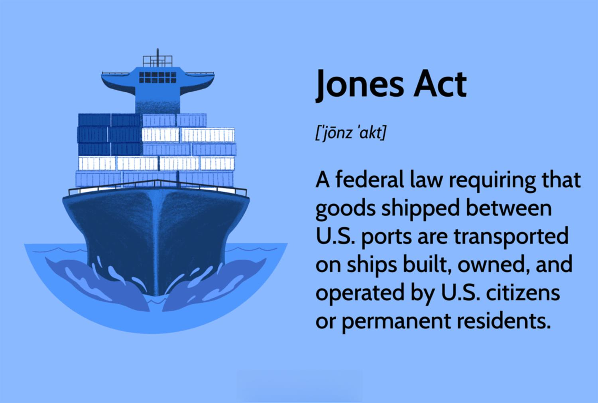

## Table of Contents

## What is the Jones Act?

The Jones Act is a law in the United States that was passed in 1920. It is also called the Merchant Marine Act of 1920. The main purpose of the Jones Act is to protect American shipping jobs and the U.S. shipping industry. It does this by requiring that goods shipped between U.S. ports must be carried on ships that are built, owned, and operated by Americans.

The Jones Act has both supporters and critics. Supporters say it helps keep American shipping jobs and supports the economy. They believe it is important for national security to have a strong U.S. shipping industry. Critics, on the other hand, argue that the Jones Act makes shipping more expensive and less efficient. They say it can hurt businesses and consumers by raising costs and limiting competition.

## When was the Jones Act enacted?

The Jones Act was enacted on June 5, 1920. It is also known as the Merchant Marine Act of 1920. The main goal of the Jones Act is to protect American shipping jobs and the U.S. shipping industry. It does this by requiring that goods shipped between U.S. ports must be carried on ships that are built, owned, and operated by Americans.

The Jones Act has both supporters and critics. Supporters believe it helps keep American shipping jobs and supports the economy. They think it is important for national security to have a strong U.S. shipping industry. Critics, however, argue that the Jones Act makes shipping more expensive and less efficient. They say it can hurt businesses and consumers by raising costs and limiting competition.

## What are the main provisions of the Jones Act?

The Jones Act has several main provisions that focus on protecting the U.S. shipping industry. One key provision is that goods shipped between U.S. ports must be carried on ships that are built in the United States. This means that the ships must be constructed in American shipyards. Another important rule is that these ships must be owned by American citizens or companies. This helps keep the ownership of the shipping industry within the country.

In addition to the building and ownership requirements, the Jones Act also mandates that the ships must be operated by American crews. This means that the sailors and officers on these ships must be U.S. citizens. This provision helps to maintain American jobs in the maritime sector. Overall, these rules are designed to support the U.S. economy and national security by ensuring a strong domestic shipping industry.

## What was the historical context that led to the passage of the Jones Act?

The Jones Act was passed in 1920, a time when the United States was recovering from World War I. During the war, many American ships were used to help the war effort, and the U.S. needed to rebuild its shipping industry. The country wanted to make sure it had strong shipping to support its economy and be ready for any future emergencies. The government saw the Jones Act as a way to protect American jobs and keep the shipping industry strong.

Before the Jones Act, many foreign ships were used to move goods between U.S. ports. This worried some people because they thought it could hurt the American economy and make the country less independent. By passing the Jones Act, the government aimed to make sure that goods moved between U.S. ports on American ships, built and operated by Americans. This would help keep jobs in the U.S. and make the country's shipping industry more self-reliant.

## How does the Jones Act affect the U.S. maritime industry?

The Jones Act has a big impact on the U.S. maritime industry. It helps keep American jobs safe by making sure that ships moving goods between U.S. ports are built, owned, and operated by Americans. This means more work for American shipyards and sailors. The Act also helps keep the U.S. shipping industry strong, which is important for the country's economy and for being ready in case of emergencies.

However, the Jones Act also makes shipping more expensive. Because only American ships can be used, and building ships in the U.S. costs more than in other countries, the price of moving goods goes up. This can make it harder for businesses to keep costs low and can affect what consumers pay for products. Some people think the Jones Act limits competition and makes shipping less efficient, which could hurt the economy in other ways.

## What are the economic benefits of the Jones Act?

The Jones Act brings several economic benefits to the United States. It helps keep jobs for American workers by making sure that ships moving goods between U.S. ports are built, owned, and operated by Americans. This means more work for people in American shipyards and on ships. When these workers earn money, they spend it in their communities, which helps the local economy grow. The Act also supports the U.S. shipping industry, which is important for keeping the country's economy strong and being ready for any emergencies.

Another benefit is that the Jones Act helps the U.S. be more independent. By requiring goods to be moved on American ships, the country relies less on foreign ships. This can make the U.S. economy more secure because it's not as affected by what happens in other countries. Overall, the Jones Act supports American jobs, helps the economy, and makes the country more self-reliant.

## What are the economic drawbacks of the Jones Act?

The Jones Act can make shipping more expensive. It says that goods moving between U.S. ports must use ships that are built, owned, and operated by Americans. Building ships in the U.S. costs more than in other countries, so the price of moving goods goes up. This can make it harder for businesses to keep their costs low. When businesses pay more to ship things, they might have to charge more for their products. This means that consumers might end up paying higher prices for goods.

Another problem is that the Jones Act can limit competition. Because only American ships can be used, there are fewer choices for shipping. This can make shipping less efficient because there are not as many options to choose from. Some people think that without the Jones Act, more foreign ships could be used, which might make shipping cheaper and faster. When shipping is less efficient and more costly, it can hurt the economy by making it harder for businesses to grow and create jobs.

## How does the Jones Act impact trade between U.S. states?

The Jones Act makes trade between U.S. states more expensive. It says that goods moving between U.S. ports have to be on ships that are built, owned, and operated by Americans. Building ships in the U.S. costs more than in other countries, so it costs more to move goods. When it costs more to ship things, businesses might have to charge more for their products. This means that people in different states might have to pay more for things they buy.

The Jones Act also makes trade between states less efficient. Because only American ships can be used, there are fewer choices for shipping. This can make it harder for businesses to find the best and fastest way to move their goods. When shipping is less efficient, it can slow down trade and make it harder for businesses to grow. This can affect the economy because businesses might not be able to sell as much or create as many jobs.

## What are the national security arguments for and against the Jones Act?

Supporters of the Jones Act say it helps keep the country safe. They think it's important to have a strong U.S. shipping industry. If there's an emergency, like a war or a natural disaster, the U.S. needs ships and sailors ready to help. The Jones Act makes sure there are American ships and workers available. This means the country doesn't have to rely on other countries for help, which can be risky. So, having a strong American shipping industry is seen as good for national security.

On the other hand, critics of the Jones Act argue that it might not be the best way to keep the country safe. They say that making shipping more expensive and less efficient can hurt the economy. A strong economy is important for national security because it helps keep the country stable. If the Jones Act makes it harder for businesses to grow and create jobs, it could weaken the economy. Critics also think that the U.S. could work with friendly countries to use their ships in emergencies, so relying only on American ships might not be necessary.

## How has the Jones Act been amended or challenged over time?

Over the years, people have tried to change or challenge the Jones Act. Some lawmakers and businesses have wanted to make the rules less strict because they think it would help the economy. For example, in 2015, there was a big debate about changing the Act to let more foreign ships move goods between U.S. ports. This didn't happen, but it showed that people are still talking about the Jones Act and trying to change it. There have been other smaller changes too, like making it easier for certain ships to move between U.S. ports, but the main rules have stayed the same.

The Jones Act has also been challenged in court. Some businesses and groups have said that the Act is not fair and goes against free trade. They have taken their cases to court to try to change the rules. For example, in the 1990s, some companies argued that the Jones Act was hurting their business and asked the courts to do something about it. The courts have mostly said that the Jones Act is okay, but these challenges show that people keep trying to change or get rid of the Act.

## What are the international perspectives on the Jones Act?

Some countries think the Jones Act is not fair. They say it makes it harder for their ships to do business in the U.S. because only American ships can move goods between U.S. ports. This can make trade more expensive and less efficient. Countries that have a lot of ships, like China and South Korea, think the Jones Act is a problem because it stops them from competing in the U.S. market. They believe that if the Jones Act was changed, it would be better for global trade.

On the other hand, some countries understand why the U.S. has the Jones Act. They know that the U.S. wants to keep jobs for American workers and have a strong shipping industry. These countries might have their own rules to protect their own shipping industries. They think that every country has the right to make laws that help their economy and keep their people safe. So, while they might not like the Jones Act, they can see why the U.S. has it.

## What are the current debates and future prospects regarding the Jones Act?

People are still talking about the Jones Act a lot. Some want to change it or get rid of it because they think it makes shipping too expensive and slow. They say that if the rules were less strict, businesses could save money and grow faster. This could help the economy by making things cheaper for people to buy. Some lawmakers and businesses keep trying to change the Jones Act, but so far, the main rules have stayed the same.

Others think the Jones Act is important and should stay as it is. They say it helps keep American jobs safe and makes sure the U.S. has a strong shipping industry. This is important for the country's economy and for being ready in case of emergencies. They believe that changing the Jones Act could hurt American workers and make the country less independent. So, the debate about the Jones Act will likely keep going, with people on both sides trying to make their case.

## References & Further Reading

[1]: U.S. Department of Transportation, Maritime Administration. ["Comparison of U.S. and Foreign-Flag Operating Costs,"](https://www.maritime.dot.gov/sites/marad.dot.gov/files/docs/resources/3651/comparisonofusandforeignflagoperatingcosts.pdf) 2011.

[2]: PricewaterhouseCoopers. ["Contributions of the Jones Act Shipping Industry to the U.S. Economy,"](https://www.grassrootinstitute.org/wp-content/uploads/2020/07/PwC-Jones-Act-study-executive-summary-1.pdf) Transportation Institute, 2019.

[3]: Federal Reserve Bank of New York. ["Report on the Competitiveness of Puerto Rico's Economy,"](https://resources.newyorkfed.org/medialibrary/media/regional/PuertoRico/report.pdf) 2012.

[4]: ["Advances in Financial Machine Learning"](https://www.amazon.com/Advances-Financial-Machine-Learning-Marcos/dp/1119482089) by Marcos Lopez de Prado.

[5]: Congressional Research Service. ["The Jones Act: An Overview,"](https://sgp.fas.org/crs/misc/RS21566.pdf) 2021.