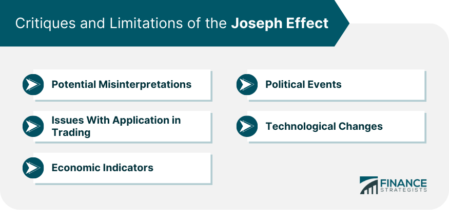

## Table of Contents

## What is the Joseph Effect?

The Joseph Effect is a term used to describe a phenomenon where certain events or conditions have a lasting impact over a long period of time. It is named after the biblical story of Joseph, who predicted and prepared for seven years of plenty followed by seven years of famine. In modern contexts, the Joseph Effect is often used to describe how past events can influence future outcomes in areas like economics, climate, and social trends.

For example, in economics, the Joseph Effect can be seen when a country experiences a long period of economic growth followed by a period of economic downturn. This pattern can be influenced by past policies, investments, and economic conditions. Similarly, in climate studies, the Joseph Effect can refer to long-term weather patterns that persist over many years, affecting agriculture and water supply. Understanding the Joseph Effect helps people and organizations to better plan and prepare for future challenges based on historical data and trends.

## Who coined the term 'Joseph Effect'?

The term 'Joseph Effect' was coined by the mathematician Benoît Mandelbrot. He used it to describe long-term memory in natural and economic systems. Mandelbrot was interested in how certain patterns and events could have effects that last for a long time.

Mandelbrot introduced the term in his studies on fractals and time series analysis. He wanted to show how past events could influence future outcomes over extended periods. This idea helped people understand and predict long-term trends in various fields, like economics and climate science.

## What is the historical context of the Joseph Effect?

The Joseph Effect comes from a story in the Bible about a man named Joseph. In the story, Joseph predicted that there would be seven good years with lots of food, followed by seven bad years with little food. He told the king to save food during the good years so they could eat during the bad years. This idea of planning for the future based on past events is what people call the Joseph Effect.

The term was first used by a mathematician named Benoît Mandelbrot in the 20th century. He was studying how things like weather and money can follow patterns over a long time. Mandelbrot noticed that these patterns could help predict the future if you looked at the past. He named this idea after Joseph because it reminded him of the story where past good years helped people survive the bad years. Today, people use the Joseph Effect to understand and plan for things like economic changes and climate shifts.

## How does the Joseph Effect relate to economic cycles?

The Joseph Effect helps us understand how past good times and bad times in the economy can affect the future. Imagine the economy is like the weather. Sometimes it's sunny and good for a long time, and then it can be rainy and tough for a while. In the economy, when things are good for a long time, like lots of jobs and money, it's like the sunny years. But then, there might be a time when things get hard, like fewer jobs and less money, which is like the rainy years. By looking at these patterns, we can try to guess what might happen next and plan for it.

For example, if a country had many years of growing and making more money, people might start saving more, just like Joseph did with the food. This way, when the economy slows down and there's less money, they can use their savings to help them through the tough times. By understanding the Joseph Effect, governments and businesses can make better plans to help keep the economy stable, even when things get hard. It's all about learning from the past to make the future better.

## What are the basic leading indicators of the Joseph Effect?

The Joseph Effect is about seeing long patterns in things like the economy or the weather. To spot the Joseph Effect, you look for signs that show if good or bad times might last a while. These signs are called leading indicators. For example, in the economy, if people are spending more money and businesses are growing for a long time, it might mean good times will keep going. On the other hand, if people start saving more money and businesses slow down, it might mean tough times are coming.

In the weather, leading indicators of the Joseph Effect could be things like ocean temperatures or wind patterns that stay the same for many years. If the ocean stays warm for a long time, it might mean the weather will stay warm too. If the wind keeps blowing in the same way, it might mean the weather will keep doing what it's been doing. By watching these signs, we can try to guess what might happen next and get ready for it.

## How can one identify the onset of the Joseph Effect in a market?

To identify the start of the Joseph Effect in a market, you need to look for patterns that last a long time. Imagine you're watching the market and you see that prices keep going up for many years. This could mean that the market is in a long period of growth, like the good years Joseph talked about. You might also see more people investing and businesses doing well. These are signs that the good times might keep going for a while.

On the other hand, if you start to see the market slowing down and prices dropping for a long time, this could be the beginning of a tough period, like the bad years in Joseph's story. You might notice people saving more money and fewer new businesses starting up. By keeping an eye on these long-lasting patterns, you can get a sense of whether the market is entering a new phase that could last for years, just like in the story of Joseph.

## What are some advanced statistical methods used to predict the Joseph Effect?

To predict the Joseph Effect, people use some fancy math called time series analysis. This helps them look at how things change over time, like the economy or the weather. One way they do this is by using something called autoregressive integrated moving average (ARIMA) models. These models can find patterns in the data that last a long time, which is what the Joseph Effect is all about. By using ARIMA, people can see if the good times or bad times might keep going for a while.

Another way to predict the Joseph Effect is by using fractal analysis. This method looks at how things repeat in smaller and smaller pieces, kind of like a pattern within a pattern. Benoît Mandelbrot, who came up with the idea of the Joseph Effect, used fractal analysis to study how natural and economic systems behave over long periods. By understanding these repeating patterns, people can make better guesses about what might happen next, whether it's in the economy or the weather.

## How does the Joseph Effect impact investment strategies?

The Joseph Effect can really change how people plan their investments. It's all about seeing long patterns in things like the economy. If someone notices that the economy has been doing well for a long time, they might decide to keep investing in the market. They think the good times will keep going, just like Joseph saved food during the good years. But if they see the economy starting to slow down and stay slow for a while, they might start saving more money or invest in things that are safer. They're getting ready for the tough times, like Joseph did when he knew the bad years were coming.

This idea helps investors think about the long term. Instead of just looking at what's happening right now, they look at what's been happening for years. They might use special math tools to spot these long patterns and make better guesses about the future. By understanding the Joseph Effect, investors can make smarter choices, like when to put more money into the market or when to pull back and save. It's all about using the past to plan for the future, just like Joseph did in his story.

## Can the Joseph Effect be observed in sectors other than economics, such as climatology or sociology?

Yes, the Joseph Effect can be seen in other areas like climatology and sociology. In climatology, it helps explain long-term weather patterns that last for many years. For example, if a region has been experiencing warmer temperatures for a long time, it might mean that the warm weather will continue. Scientists use the Joseph Effect to study things like ocean temperatures and wind patterns that don't change much over the years. By understanding these long patterns, they can better predict future weather and plan for things like farming or water management.

In sociology, the Joseph Effect can show how social trends or behaviors can last for a long time. If a community has been following certain traditions or social norms for many years, it might mean these will keep going. Sociologists look at how past events and conditions can shape what people do today and in the future. For instance, if a society has been peaceful and cooperative for a long time, it might stay that way. By recognizing these long-lasting patterns, sociologists can understand and predict how societies might change or stay the same over time.

## What are the criticisms and limitations of using the Joseph Effect as a predictive tool?

Using the Joseph Effect to predict the future has some problems. One big issue is that it's hard to know for sure if a pattern will keep going just because it's lasted a long time. Sometimes, things can change suddenly, even if they've been the same for years. This makes it tricky to use the Joseph Effect to make plans because the future might not follow the same pattern as the past.

Another problem is that the Joseph Effect needs a lot of data to work well. You need to look at many years of information to see the long patterns, and sometimes that data is not easy to get or might not be very accurate. Also, the math used to study the Joseph Effect can be complicated, and if you don't use it right, you might make wrong guesses about what will happen next. So, while the Joseph Effect can be helpful, it's not perfect and should be used carefully.

## How have leading indicators of the Joseph Effect evolved over time?

Over time, the way people spot the Joseph Effect has changed a lot. In the beginning, people just looked at things like how much money was being spent or how warm the ocean was. They used simple charts and graphs to see if these things stayed the same for a long time. But as time went on, people started using computers and fancy math to look at more data and find patterns that were harder to see. They started using things like ARIMA models and fractal analysis to study the Joseph Effect in more detail.

Today, leading indicators of the Joseph Effect are much more advanced. People use big computers to look at tons of data from all over the world. They can see patterns in things like the economy, the weather, and even how people behave in society. These new tools help them make better guesses about what might happen next. But even with all these new ways to look at data, it's still hard to be sure about the future because things can change suddenly, even if they've been the same for a long time.

## What are the future research directions concerning the Joseph Effect and its indicators?

Future research on the Joseph Effect will focus on using even more advanced math and computer tools to look at data. Scientists want to find better ways to spot long patterns in things like the economy, the weather, and how people act in society. They might use new types of math models that can handle more data and see patterns that are hard to see with older tools. By doing this, they hope to make better guesses about what might happen next and help people plan for the future.

Another big part of future research will be figuring out how to tell if a pattern will really keep going or if it might change suddenly. This is tricky because even if something has stayed the same for a long time, it can still change. Scientists will try to find new ways to understand these changes and make their predictions more accurate. They might also look at how different kinds of data can be used together to get a better picture of what's happening and what might happen next. By working on these things, researchers hope to make the Joseph Effect a more reliable tool for planning and predicting the future.

## What is the Joseph Effect?

The Joseph Effect is a concept derived from the biblical story of Joseph, who predicted seven years of plenty followed by seven years of famine in ancient Egypt. This narrative symbolizes recurring cycles of abundance and scarcity. Benoit Mandelbrot, a mathematician known for his work on fractals and chaos theory, popularized the Joseph Effect to describe trends and cycles in various fields, particularly in finance and economics.

In financial contexts, the Joseph Effect underscores the persistence of cycles in economic and market data. Unlike random processes that assume independent and identically distributed variables, the Joseph Effect implies long-term dependence, indicating that what happens today can influence outcomes in the distant future. This concept challenges the traditional notion of market randomness and suggests that markets exhibit long-range correlations.

Mandelbrot proposed that financial time series data often follow patterns that are [fractal](/wiki/fractal-indicators) in nature, meaning they display similar shapes or patterns regardless of scale. This idea is significant in financial forecasting and risk management, as it helps identify enduring trends contrary to the random walk theory, which suggests that stock prices move randomly and independently over time.

The persistence suggested by the Joseph Effect can be measured through the Hurst exponent (H), a metric used to assess the degree of long-range dependence in time series data. A Hurst exponent value $H > 0.5$ indicates a persistent, trend-reinforcing time series, whereas $H < 0.5$ suggests an anti-persistent, mean-reverting series. An exponent of $H = 0.5$ would imply a random walk. Equation 1 shows the relationship used to compute the Hurst exponent:

$$
R(n) \sim (n^H)
$$

where $R(n)$ is the range of the first $n$ observations.

The Joseph Effect's emphasis on trends and cycles provides valuable insights into financial markets, offering a framework to understand and predict long-term behaviors that might be missed by conventional models. Mandelbrot's contributions have thus been pivotal in changing how economists and traders perceive market data, encouraging consideration of historical patterns and behaviors in predictive analyses.

## What is the Joseph Effect in Financial Markets?

The Joseph Effect suggests that financial markets exhibit long-range dependencies, characterized by persistent, non-random patterns that extend across time. This concept is grounded in the idea that trends observed in financial data are not merely the result of short-term fluctuations but can persist over extended periods. This persistence is crucial for traders and analysts, as it implies that past market behaviors can inform future movements, lending predictive power to trading strategies.

The presence of long-range dependencies contradicts the traditional Efficient Market Hypothesis (EMH), which argues that market movements are random and thus unpredictable. Instead, the Joseph Effect posits that markets are subject to structural cycles and trends that recur with regularity. This notion can significantly impact trading strategies, allowing for the development of models that anticipate changes based on historical data patterns.

One of the primary tools used to measure the persistence of these trends is the Hurst exponent (H). This statistical measure helps determine the extent to which a time series is a random walk (H ≈ 0.5), exhibits persistent long-term trends (H > 0.5), or shows anti-persistent behavior (H < 0.5). In financial markets, a Hurst exponent greater than 0.5 typically indicates a persistent trend, suggesting that historical price movements provide a basis for forecasting future price trajectories.

The calculation of the Hurst exponent can be implemented using the rescaled range (R/S) analysis. The procedure involves dividing a time series into subsequences, computing the range of each subsequence after rescaling it by its standard deviation, and analyzing how the average range varies with the size of the subsequences. The relationship follows a power law:

$$
R/S(n) \sim C \cdot n^H
$$

where $R/S(n)$ is the rescaled range of the time series for a subsequence length $n$, $C$ is a constant, and $H$ is the Hurst exponent.

Here's a simple Python code snippet to calculate the Hurst exponent for a given time series:

```python
import numpy as np
import pandas as pd

def hurst_exponent(time_series):
    ts = np.log(time_series)
    N = len(ts)
    T = np.arange(1, N + 1)
    Y = np.cumsum(ts - np.mean(ts))
    R = np.max(Y) - np.min(Y)
    S = np.std(ts)
    return (np.log(R/S) / np.log(N))

# Example usage with random time series data
data = pd.Series(np.random.randn(1000))
hurst = hurst_exponent(data)
print(f"Estimated Hurst exponent: {hurst}")
```

Understanding and applying the Joseph Effect through tools like the Hurst exponent allows traders to adapt their strategies to embrace the non-random nature of financial markets. By recognizing these persistent patterns, algorithmic traders can optimize their models to anticipate market shifts more accurately, potentially improving their trading outcomes.

## References & Further Reading

[1]: Mandelbrot, B. B. (1997). ["Fractals and Scaling in Finance: Discontinuity, Concentration, Risk."](https://link.springer.com/book/10.1007/978-1-4757-2763-0) Springer.

[2]: Lopez de Prado, M. (2018). [Advances in Financial Machine Learning.](https://www.amazon.com/Advances-Financial-Machine-Learning-Marcos/dp/1119482089) Wiley.

[3]: Aronson, D. R. (2007). [Evidence-Based Technical Analysis: Applying the Scientific Method and Statistical Inference to Trading Signals.](https://www.amazon.com/Evidence-Based-Technical-Analysis-Scientific-Statistical/dp/0470008741) Wiley.

[4]: Jansen, S. (2020). [Machine Learning for Algorithmic Trading: Predictive models to extract signals from market and alternative data for systematic trading strategies. 2nd Edition.](https://github.com/stefan-jansen/machine-learning-for-trading) Packt Publishing.

[5]: Chan, E. P. (2008). [Quantitative Trading: How to Build Your Own Algorithmic Trading Business.](https://github.com/ftvision/quant_trading_echan_book) Wiley.

[6]: Neely, C. J., & Rapach, D. E. (2008). ["Forecasting the Equity Risk Premium: The Role of Technical Indicators."](https://pubsonline.informs.org/doi/abs/10.1287/mnsc.2013.1838) Federal Reserve Bank of St. Louis Working Paper Series.

[7]: Diebold, F. X., & Rudebusch, G. D. (1996). ["Measuring Business Cycles: A Modern Perspective."](https://www.nber.org/papers/w4643) National Bureau of Economic Research Working Paper Series.