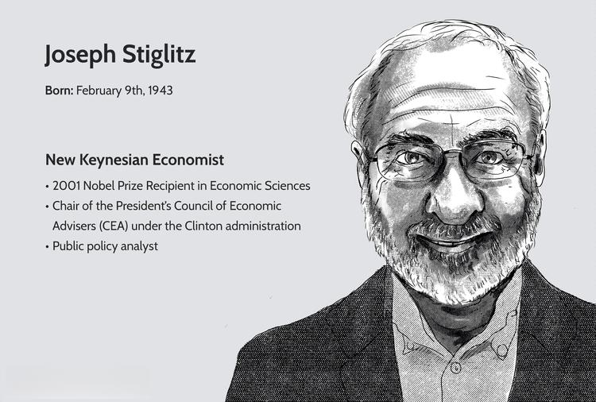

In an ever-evolving economic landscape, the intersection of notable figures in economics and emerging technologies presents a fascinating domain for exploration. One such figure is Joseph Stiglitz, a Nobel Laureate recognized for his substantial contributions to the field of economics, particularly in areas such as information asymmetry and risk management. Stiglitz's work has been instrumental in shaping modern economic theory, and its implications are vast for understanding and navigating the complexities of financial markets.

Parallel to Stiglitz's contributions, the rise of algorithmic trading has marked a significant advancement in the financial sector. Algorithmic trading, defined by the use of sophisticated algorithms to execute trades at speeds and frequencies beyond human capability, has revolutionized how financial markets operate. This merging of financial theory with technological progression exemplifies how insights into economic behavior can be leveraged to optimize trading strategies.



This article explores how Stiglitz's insights into economic behavior relate to modern developments in algorithmic trading and the role of education in bridging these areas. By examining the impact of Stiglitz's theories on information asymmetry and market dynamics, we gain a deeper understanding of how these concepts underpin algorithmic strategies. Furthermore, the role of education, particularly in fostering interdisciplinary knowledge that combines economics with data science and technology, is crucial in equipping future economists and financial professionals with the skills necessary to innovate in this rapidly changing environment.

## Table of Contents

## Joseph Stiglitz: Economic Insights and Contributions

Joseph Stiglitz, a recipient of the Nobel Memorial Prize in Economic Sciences, is renowned for his pivotal contributions to the understanding of information asymmetry, risk aversion, and monopolistic competition. His groundbreaking work has significantly shaped contemporary economic theory and practice, with profound implications for financial markets worldwide.

At the core of Stiglitz's contributions is the concept of information asymmetry, which describes situations where one party in a transaction possesses more or better information than the other. This imbalance can lead to market inefficiencies, such as adverse selection and moral hazard. Stiglitz's research, particularly his collaborative work with economists like George Akerlof and Michael Spence, has addressed how these inefficiencies manifest in markets and how they can be mitigated. For instance, in the seminal "Lemons" paper, the problem of quality uncertainty leading to adverse selection in markets is analyzed, showcasing the impact of information asymmetry.

Stiglitz's insights into risk aversion further illuminate how individuals and firms make decisions under uncertainty. His models consider how risk-averse behavior influences market dynamics, asset pricing, and investment strategies. Understanding these behaviors is crucial for designing financial instruments and policies that can better accommodate the varying risk tolerances of market participants.

In terms of monopolistic competition, Stiglitz's theories have explored how markets with many producers selling differentiated products operate. This work has provided a deeper understanding of pricing strategies and market power, offering a framework to analyze sectors like retail and technology, where such competition is prevalent.

Stiglitz's theoretical contributions have not only transformed academic discourse but have also informed practical applications in market analysis. For instance, his work on information asymmetry has led to the development of more sophisticated market screening techniques and risk assessment models. These advancements are particularly influential in financial sectors, where accurate information and effective risk management are critical.

The dissemination of Stiglitz's theories has resulted in widespread adoption of practices that enhance market efficiency and transparency. Financial institutions and policymakers utilize his insights to design mechanisms that reduce information gaps and align incentives, ultimately fostering more resilient and equitable market outcomes.

In summary, Joseph Stiglitz's pioneering work on information asymmetry, risk aversion, and monopolistic competition continues to impact the economic landscape, offering tools and frameworks that improve market analysis and operations globally. His contributions underscore the importance of informed decision-making and strategic intervention in promoting efficient and fair financial markets.

## Algorithmic Trading: The Intersection of Economics and Technology

Algorithmic trading represents the fusion of technology and economics, allowing automation in trading processes within financial markets through sophisticated computer algorithms. These algorithms make use of pre-defined rules and models to execute trades at speeds and frequencies unimaginable to human traders. A central component of [algorithmic trading](/wiki/algorithmic-trading) is its reliance on economic theories, such as those espoused by Joseph Stiglitz, to navigate complex market dynamics.

The foundation of many algorithmic trading strategies lies in the concept of information asymmetry, a key area in Stiglitz’s economic research. Information asymmetry occurs when one party in a transaction possesses more or better information than the other. In financial markets, algorithms are tasked with identifying and capitalizing on these asymmetries. For instance, an algorithm might be designed to detect patterns in stock prices that indicate insider trading before such information becomes public. By doing so, it seeks to exploit the information disparity to generate profit.

Moreover, risk management is another critical aspect of algorithmic trading. Stiglitz’s work on risk aversion has laid the groundwork for understanding how traders and, by extension, algorithms assess and manage financial risk. Algorithms can be created to evaluate the risk-reward ratio of trades, adjusting their behavior according to market [volatility](/wiki/volatility-trading-strategies) and investor sentiment. This is essential for minimizing potential losses while maximizing gains.

In practice, algorithmic trading strategies can be expressed through mathematical models that simulate market behavior. One common approach is the use of moving averages, which helps in identifying trends. A simple moving average (SMA) can be calculated using the formula:

$$
\text{SMA} = \frac{1}{n} \sum_{i=1}^{n} P_i
$$

where $P_i$ is the price at period $i$ and $n$ is the number of periods.

With advancements in [machine learning](/wiki/machine-learning) and data analytics, algorithmic trading is increasingly incorporating predictive models. These models can process vast datasets to uncover hidden patterns and correlations in market data, thereby increasing the efficiency and precision of trading strategies.

An example in Python for implementing a basic algorithmic trading strategy using moving averages might look like this:

```python
import pandas as pd
import numpy as np

# Load historical market data
data = pd.read_csv('market_data.csv')

# Calculate short-term and long-term moving averages
data['Short_MA'] = data['Close'].rolling(window=40).mean()
data['Long_MA'] = data['Close'].rolling(window=100).mean()

# Generate trading signals
data['Signal'] = 0
data['Signal'][40:] = np.where(data['Short_MA'][40:] > data['Long_MA'][40:], 1, -1)

# Determine the positions
data['Position'] = data['Signal'].shift()

# Calculate returns
data['Strategy_Return'] = data['Position'] * data['Close'].pct_change()

# Output strategy performance
strategy_performance = data['Strategy_Return'].sum()
print(f'Strategy Performance: {strategy_performance:.2%}')
```

In this example, the code calculates 40-day and 100-day simple moving averages and generates buy and sell signals based on their crossovers. This strategy, although simplistic, demonstrates how algorithmic trading can apply economic principles and data analysis techniques to enhance market decision-making.

Algorithmic trading stands as a testament to the evolving intersection of economic theory and technological advancement. By bridging Stiglitz's insights with algorithmic processes, financial markets can harness the power of automated decision-making, offering new opportunities and challenges in equal measure.

## The Role of Education in Economic Theory and Finance

Education serves as a cornerstone in developing and disseminating economic theory and its practical applications in finance. As financial markets become increasingly complex and technology-driven, educational institutions are adapting by integrating economic insights with advancements in technology. This holistic approach equips future economists and traders with the skills necessary to navigate modern financial landscapes effectively.

In recent years, universities and educational platforms have recognized the need for interdisciplinary curricula that combine traditional economic concepts with data science and computer science. This integration reflects the growing importance of algorithmic trading, which leverages sophisticated algorithms to automate decision-making processes in financial markets. Students are learning not just economic theory, but also how to apply computational techniques and data analysis to real-world trading scenarios.

Educational programs now often include courses that cover topics such as machine learning, financial engineering, and quantitative analysis. For instance, students may learn to use Python—a popular programming language in finance—for developing trading algorithms and performing statistical analysis. A simple example of using Python to perform linear regression, a technique frequently used in trading algorithms for trend analysis, is illustrated below:

```python
import numpy as np
from sklearn.linear_model import LinearRegression

# Sample data for training
X = np.array([[1], [2], [3], [4], [5]])
y = np.array([1, 2, 3, 3.5, 5.5])

# Create and train the model
model = LinearRegression().fit(X, y)

# Predict using the model
predictions = model.predict(X)
print(predictions)
```

Interdisciplinary courses often feature collaborations between economics and computer science departments, reflecting a systemic shift towards skills that match the demands of the digital economy. Such courses are designed to foster a deep understanding of financial markets while simultaneously developing proficiency in programming and data analytics. This combination is critical in understanding and creating the automated systems that characterize modern trading.

Moreover, online learning platforms and professional courses are expanding access to these interdisciplinary skills. They provide flexible, self-paced learning paths allowing students from diverse backgrounds to enter the fields of financial analysis and algorithmic trading, further democratizing the knowledge needed to participate in this specialized area.

Overall, the emphasis on an interdisciplinary educational approach ensures that the next generation of economists and financial professionals are well-equipped to innovate and excel in a rapidly evolving economic landscape. The role of education, therefore, is foundational in bridging the gap between economic theory and the technological tools that define contemporary finance.

## Integrating Stiglitz’s Theories in Modern Financial Practices

Joseph Stiglitz's theories, particularly focusing on knowledge disparity and strategic market screening, offer promising enhancements to algorithmic trading models. Knowledge disparity, or information asymmetry, refers to situations where one party in a transaction possesses superior information compared to the other. This concept is crucial in financial markets where information gaps can significantly impact trading outcomes.

Incorporating Stiglitz's insights into algorithmic trading involves developing strategies that specifically address these disparities. For instance, algorithms can be designed to detect and capitalize on information asymmetry by analyzing market signals and trading patterns that may indicate uneven distribution of information. By integrating these signals, trading algorithms can be fine-tuned to anticipate market movements more accurately, thus enhancing their efficiency and predictive accuracy.

Strategic market screening, another concept popularized by Stiglitz, involves the systematic acquisition and analysis of market data to discern valuable information. In algorithmic trading, this can be implemented by deploying machine learning techniques that enable algorithms to learn from past data. Supervised learning models, for instance, can be trained using historical data to predict future stock prices based on known indicators of information asymmetry. Here is a simple implementation of such a model using Python with the `scikit-learn` library:

```python
from sklearn.model_selection import train_test_split
from sklearn.ensemble import RandomForestRegressor
from sklearn.metrics import mean_squared_error
import pandas as pd

# Load a dataset containing market data
data = pd.read_csv('market_data.csv')

# Define features and target
features = data.drop(columns=['StockPrice'])
target = data['StockPrice']

# Split the data
X_train, X_test, y_train, y_test = train_test_split(features, target, test_size=0.2, random_state=42)

# Train a random forest model
model = RandomForestRegressor(n_estimators=100, random_state=42)
model.fit(X_train, y_train)

# Evaluate the model
predictions = model.predict(X_test)
mse = mean_squared_error(y_test, predictions)
print(f'Mean Squared Error: {mse}')
```

Case studies further illustrate these principles in action. For example, in high-frequency trading ([HFT](/wiki/high-frequency-trading-strategies)) firms, algorithms equipped with enhancements based on information asymmetry have demonstrated improved performance during earnings announcements and other market events known for information disparity. By quickly assimilating public and private information, such algorithms execute trades at optimal times, securing a substantial competitive edge.

Overall, integrating Stiglitz's theories into algorithmic trading not only facilitates the creation of more sophisticated trading models but also encourages a deeper understanding of market dynamics. This fusion of economic theory and technology underscores the potential for innovative financial practices that can adapt to rapidly changing market conditions, ultimately leading to more informed and successful trading strategies.

## Challenges and Future Directions

Integrating complex economic theories into practical trading algorithms offers significant potential for enhancing financial market operations. However, several challenges must be addressed to fully realize these benefits. Key obstacles include market volatility, regulatory impacts, and ethical considerations, which can complicate the development and implementation of algorithmic trading models.

**Market Volatility:** One of the primary challenges is the inherent volatility in financial markets. Algorithmic trading systems must be robust enough to operate effectively under varying market conditions, including sudden spikes or crashes. Models need to be designed with adaptive mechanisms that can respond to rapid changes in market dynamics. For instance, incorporating stochastic models or using machine learning techniques such as reinforcement learning can help algorithms adapt to volatile environments.

**Regulatory Impacts:** Regulation poses another significant challenge for algorithmic trading. Financial markets operate under a complex web of regulations designed to ensure fair trading practices and mitigate systemic risk. The introduction of algorithms into trading processes must comply with these regulations, which can vary significantly across jurisdictions. Algorithmic traders must be conscious of rules concerning market manipulation, insider trading, and trade transparency. Ensuring compliance necessitates continuous updates to algorithmic strategies and the underlying code, often requiring collaboration with legal experts.

**Ethical Considerations:** The automation of trading decisions through algorithms raises ethical questions, including concerns about market fairness and the potential for exacerbating financial inequalities. High-frequency trading, for example, can create an uneven playing field by enabling large firms to execute trades faster than traditional market participants. Ethical algorithms should seek to promote market fairness by avoiding strategies that exploit information asymmetries to the detriment of less advantaged traders.

**Emerging Trends and Future Directions:** Emerging trends in algorithmic trading show promise in addressing some of these challenges. The integration of artificial intelligence and machine learning is leading to the development of more sophisticated algorithms capable of learning from historical data to improve decision-making processes. Quantum computing, though in its nascent stages, also holds potential for optimizing complex trading algorithms by processing vast amounts of data at unprecedented speeds.

In terms of future directions, the combination of economic theory and digital trading environments is likely to see increased integration. As educational programs continue to evolve, more interdisciplinary approaches that combine insights from economics, computer science, and data analytics will emerge. This fusion will create a new generation of traders and economists equipped to innovate within this dynamic landscape.

By addressing these challenges and leveraging emerging technologies, the synergy between economic theory and algorithmic trading can be harnessed to contribute to more efficient, fair, and resilient financial markets.

## Conclusion

The convergence of economics and technology, represented by influential figures like Joseph Stiglitz and innovations such as algorithmic trading, holds significant promise for reshaping financial markets. Stiglitz's work on information asymmetry and risk aversion provides a profound theoretical framework that can enhance the development of algorithmic trading systems, thereby improving market efficiency and predictive accuracy. Algorithmic trading, by deploying sophisticated algorithms that are fed with complex economic theories, capitalizes on the disparities in information and the nuances of market behavior that Stiglitz elucidated. This synthesis has the capacity to not only optimize trading strategies but also to contribute to a more robust and transparent financial market infrastructure.

Education plays a crucial role in equipping individuals with the necessary skills to both navigate and innovate within this rapidly evolving field. By combining economic insights with technological proficiency, educational institutions are preparing the next generation of economists and traders to effectively manage and leverage these tools. Courses that integrate data analysis and computer science with economic theory provide a comprehensive foundation, enabling students to address real-world financial challenges with informed perspectives and advanced technological skill sets.

The future of financial markets will rely heavily on continued interdisciplinary collaboration. By fostering partnerships between economists, technologists, and educators, we can ensure that the integration of technology into economic practices continues to advance. This collaboration is essential to harnessing the full potential of these fields, driving innovation that can lead to more stable and efficient markets. As we move forward, the alignment of economic theory with technological development will remain pivotal, underscoring the importance of collaborative efforts to capitalize on these transformative dynamics.

## References & Further Reading

[1]: Stiglitz, J. E. (2001). ["Information and the Change in the Paradigm in Economics"](https://www.jstor.org/stable/3083351). Nobel Prize Lecture.

[2]: Akerlof, G. A. (1970). ["The Market for Lemons: Quality Uncertainty and the Market Mechanism"](https://www.jstor.org/stable/1879431). The Quarterly Journal of Economics, 84(3), 488-500.

[3]: Stiglitz, J. E., & Weiss, A. (1981). ["Credit Rationing in Markets with Imperfect Information"](https://www.jstor.org/stable/1802787). The American Economic Review, 71(3), 393-410.

[4]: Lopez de Prado, M. (2018). ["Advances in Financial Machine Learning"](https://www.amazon.com/Advances-Financial-Machine-Learning-Marcos/dp/1119482089). Wiley.

[5]: Jansen, S. (2020). ["Machine Learning for Algorithmic Trading"](https://github.com/stefan-jansen/machine-learning-for-trading). Packt Publishing.

[6]: Chan, E. P. (2009). ["Quantitative Trading: How to Build Your Own Algorithmic Trading Business"](https://github.com/ftvision/quant_trading_echan_book). Wiley.

[7]: Aronson, D. R. (2011). ["Evidence-Based Technical Analysis: Applying the Scientific Method and Statistical Inference to Trading Signals"](https://www.amazon.com/Evidence-Based-Technical-Analysis-Scientific-Statistical/dp/0470008741). Wiley.