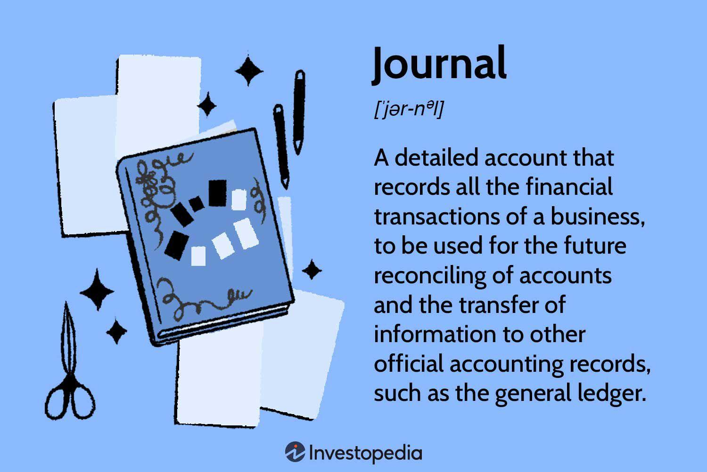

## Table of Contents

## What is a journal in the context of accounting?

In accounting, a journal is like a diary where all the financial transactions of a business are recorded. It's the first place where transactions are written down before they are moved to other accounting records. Each entry in the journal includes the date of the transaction, the accounts affected, and the amounts involved. This helps keep a clear and organized record of what's happening financially in the business.

Journals are important because they provide a detailed history of all transactions. This makes it easier to track money coming in and going out, and to spot any errors or unusual activities. By using a journal, businesses can make sure their financial records are accurate and up-to-date, which is crucial for making good business decisions and for preparing financial statements.

## How does journaling differ between accounting, investing, and trading?

In accounting, journaling means writing down all the money transactions a business does. It's like a daily diary where every bit of money coming in or going out gets recorded. This helps keep track of everything and makes sure the business knows exactly where its money is going. Each entry has the date, what accounts are affected, and how much money is involved. This is important for making sure the business's financial records are correct and for making financial reports.

In investing, journaling is a bit different. Here, people keep a record of their investment decisions and why they made them. It's not just about the money but also about the reasons behind buying or selling stocks or other investments. This helps investors learn from their past choices and improve their strategies over time. They might write about market trends, news, or personal goals that influenced their decisions.

In trading, journaling is similar to investing but focuses more on short-term actions. Traders keep a detailed log of their trades, including when they bought or sold, at what price, and why they made those moves. This helps them analyze their performance and see what works and what doesn't. Traders often look at patterns in their trades to find ways to make more money or reduce losses. Keeping a trading journal can be key to becoming a better trader.

## What are the basic components of a journal entry in accounting?

A journal entry in accounting has a few basic parts. First, there's the date when the transaction happened. This helps keep everything in order and shows when the money moved. Next, there's the account names that the transaction affects. For example, if you buy something, the accounts might be "Cash" and "Inventory." These names tell you which parts of the business are involved.

Then, there are the amounts of money for each account. One amount goes in the debit column, and the other goes in the credit column. Debits and credits need to balance out, so if you put $100 in the debit for one account, you need to put $100 in the credit for another account. Lastly, there's a short explanation or description of the transaction. This tells you why the entry was made, like "Paid for office supplies" or "Received payment from customer." This helps everyone understand what the transaction was about.

## Why is maintaining a journal important for investors?

Keeping a journal is really helpful for investors because it lets them write down why they made certain investment choices. When you note down the reasons for buying or selling stocks, you can look back and see if those reasons were good or not. This helps investors learn from their past decisions and get better at [picking](/wiki/asset-class-picking) investments. They can also see how things like market news or personal goals influenced their choices, which makes their future decisions smarter.

Also, a journal helps investors keep track of how their investments are doing over time. By writing down the performance of their investments, they can spot patterns and figure out what works best for them. This can lead to making changes to their investment strategy to make more money or avoid losses. Overall, a journal is a tool that helps investors grow and improve by reflecting on their past actions and planning for the future.

## How can traders use journals to improve their trading strategies?

Traders can use journals to improve their trading strategies by keeping a detailed record of all their trades. In their journal, they write down when they bought or sold something, at what price, and why they made those decisions. By looking back at this information, traders can see what worked well and what didn't. They might notice patterns in their trades that help them understand which strategies make them money and which ones lead to losses. This helps them make better choices in the future and tweak their strategies to be more successful.

Another way traders use journals is to track their emotions and how they affect their trading. Sometimes, feeling scared or excited can make traders do things they might not do if they were calm. By writing down how they felt at the time of each trade, traders can see if their emotions are messing up their decisions. This can help them learn to control their feelings better and stick to their trading plan. Over time, using a journal like this helps traders become more disciplined and make more rational trading choices.

## What are the common formats for keeping a trading journal?

One common way to keep a trading journal is using a spreadsheet. Traders can use programs like Microsoft Excel or Google Sheets to make a table where they write down all their trades. Each row can be for one trade, and the columns can have details like the date, what was bought or sold, the price, how much money was made or lost, and why the trade was made. This format is easy to use because you can sort and filter the data to find patterns and see how you're doing over time.

Another popular format is a physical notebook. Some traders like to write their trades by hand because it helps them think more about each trade. In a notebook, they can write down the same details as in a spreadsheet, but they can also add drawings or notes that help them understand their strategies better. This method feels more personal and can make traders feel more connected to their trading decisions.

Some traders also use special software or apps made just for trading journals. These tools often have features like automatic data entry, charts, and reports that can help traders analyze their performance. They can be more detailed and easier to use than spreadsheets or notebooks, but they might cost money. Using these apps can help traders keep everything organized and get quick insights into their trading habits.

## Can you explain double-entry bookkeeping and its relevance to journal entries?

Double-entry bookkeeping is a way of keeping track of money in a business where every transaction is recorded in two places. It's like saying, "If I take money from one pocket and put it in another, I need to write it down twice." In this system, every transaction has a debit and a credit. Debit means money is going out of one account, and credit means money is coming into another account. The total amount of debits must always equal the total amount of credits, so everything stays balanced. This makes sure that the business's financial records are accurate and helps prevent mistakes.

This system is really important for journal entries because each entry in the journal has to follow the double-entry rule. When you write down a transaction in the journal, you need to show both the debit and the credit parts of it. For example, if you buy something, you would debit the "Inventory" account because you're getting more stuff, and credit the "Cash" account because you're spending money. By doing this, you keep a clear record of where money is coming from and where it's going. It helps businesses see their financial health clearly and makes it easier to prepare financial statements.

## How do you record adjusting entries in an accounting journal?

Adjusting entries are used to update the accounts at the end of an accounting period to make sure they show the right amounts. These entries are recorded in the journal just like regular entries, but they are made after the normal daily transactions are done. For example, if you need to record interest earned but not yet received, you would debit the "Interest Receivable" account and credit the "Interest Revenue" account. The date of the entry would be the last day of the accounting period, like the end of the month or year.

The format of an adjusting entry is the same as a regular journal entry. You write the date, then the accounts affected, and the amounts in the debit and credit columns. You also need to write a short explanation of why you're making the entry, like "To record accrued interest." These entries help make sure the financial statements are accurate by matching revenues with expenses in the right period, and they show things like unpaid bills or income that hasn't been received yet.

## What advanced techniques can traders use in their journals to analyze market trends?

Traders can use their journals to analyze market trends by keeping track of how different events affect the market. They might write down big news stories, economic reports, or changes in interest rates and see how these events make stock prices go up or down. By doing this over time, they can start to see patterns. For example, they might notice that certain types of news always make a certain stock go up, or that the market reacts differently on different days of the week. This helps traders predict what might happen next and make smarter trading choices.

Another way traders can use their journals is by using charts and graphs to show market trends. They can draw lines on a graph to show how a stock's price has changed over time, or use colors to show when the market was going up or down. By looking at these visual aids, traders can see trends more easily and understand how different factors affect the market. This can help them spot good times to buy or sell and make their trading strategies more successful.

## How can an investment journal help in tax preparation and reporting?

An investment journal can make tax preparation and reporting much easier. By keeping a record of all your investments, you can quickly find out how much money you made or lost in a year. This is important because you need to report this information on your taxes. When you have a journal, you don't have to search through a bunch of papers or websites to figure out your gains and losses. You just look at your journal, and all the details are right there, making it simpler and less stressful to fill out your tax forms.

Also, an investment journal helps you keep track of things like dividends, interest, and any fees you paid. These details can affect how much tax you owe or how much you can deduct. If you ever get audited by the tax office, having a detailed journal can prove that your tax return is correct. It shows that you've been keeping good records and helps you explain your investments clearly. This can save you time and trouble during tax season.

## What software tools are available for maintaining electronic journals in accounting, investing, and trading?

For accounting, one popular software tool is QuickBooks. It helps businesses keep track of all their money transactions easily. You can write down every sale, purchase, and payment in the journal part of the software. QuickBooks also makes it easy to move these entries to other parts of your financial records, like the ledger. Another tool is Xero, which is also good for small businesses. It lets you record journal entries and share them with your accountant, making tax time easier.

In the world of investing, tools like Personal Capital and Quicken are useful. Personal Capital lets you keep a journal of your investments and see how they're doing over time. You can write down why you bought or sold something and track your progress. Quicken is another tool that helps you keep a record of your investments and plan for the future. Both of these tools make it easier to see how your investments are affecting your overall financial health.

For trading, software like TradeBench and TraderSync are popular. TradeBench lets you log all your trades and see how you're doing. You can write down why you made each trade and look for patterns to improve your strategy. TraderSync is another tool that helps you keep a detailed journal of your trades. It also gives you reports and charts to help you understand your performance better. Both of these tools can help traders make smarter decisions and get better at trading.

## How can experts use journals to comply with regulatory requirements in financial markets?

Experts in financial markets can use journals to help them follow the rules set by regulators. By keeping a detailed record of all their trades and investments, they can show that they are doing things the right way. For example, if a regulator wants to check if a trader is following the rules about how much risk they can take, the trader can show their journal. This journal will have all the details about each trade, including when it happened, why it was made, and how much money was involved. This helps prove that the trader is being honest and following the rules.

Also, journals can help experts keep track of important information that regulators might ask for. This includes things like how much money they made or lost, any fees they paid, and any special deals they made. By having all this information in one place, experts can quickly answer any questions from regulators. This makes it easier to show that they are following the rules and can help them avoid getting in trouble. Keeping a good journal is a smart way for experts to stay on the right side of the law in the financial world.

## What is a Comprehensive Guide to an Investing Journal?

An investing journal is a tool that investors utilize to systematically document and analyze their investment activities. Its primary purpose is to aid in the management of investments by providing a structured way to record transactions, reflect on past decisions, and strategize for future opportunities. The practice of maintaining an investing journal can significantly enhance an investor's ability to make informed decisions and improve their overall investment performance.

Investors use investing journals to meticulously record each trade, capturing crucial details such as the date of purchase, the type of asset, purchase price, quantity, and rationale for the investment. This record-keeping allows for a clear historical account of all investment activities, which is invaluable for analyzing the performance of individual trades or the portfolio as a whole over time. By regularly updating the journal, investors can identify patterns or trends in their decision-making that may need adjustment.

Beyond mere record-keeping, an investing journal serves as a platform for reflecting on past investment decisions. Investors can evaluate what strategies worked well and what led to suboptimal results. This retrospection often involves quantitative analysis of performance metrics, such as return on investment (ROI), and comparison against benchmarks. For instance, calculating the ROI for a particular stock with the formula:

$$
\text{ROI} = \left( \frac{\text{Final Value of Investment} - \text{Initial Value of Investment}}{\text{Initial Value of Investment}} \right) \times 100
$$

This formula helps investors to quantify the success of their investments relative to their initial costs.

Moreover, an investing journal can be instrumental in planning future strategies. By understanding past performance and market conditions, investors can develop strategic plans that align with their financial goals and risk tolerance. For example, an investor might decide to diversify their portfolio or adjust their asset allocation based on insights gained from historic trade performance documented in their journal.

Another critical aspect of maintaining an investing journal is documenting the emotions and thoughts associated with investment decisions. Emotional and psychological factors often influence investment choices, sometimes leading to cognitive biases that can skew judgment and decision-making. By expressing emotions and thought processes in writing, investors can recognize patterns such as fear during market [volatility](/wiki/volatility-trading-strategies) or overconfidence following a successful trade. Awareness of these biases enables investors to cultivate a more disciplined and objective approach to investing, ultimately fostering better decision-making.

In conclusion, an investing journal is an invaluable resource for investors seeking to optimize their financial strategies. With its comprehensive approach to recording, analyzing, and reflecting on investment activities, an investing journal not only supports effective management of investments but also enhances the investor's ability to mitigate emotional biases, resulting in more rational and informed financial decisions.

## How can a Trading Journal Enhance Trade Performance?

A trading journal is an essential tool for traders who aim to enhance their performance by systematically documenting and analyzing their trades. Unlike an investing journal, which focuses on long-term investment decisions, a trading journal concentrates on short-term trading activities. This journal serves as a comprehensive record of each trade, capturing entry and [exit](/wiki/exit-strategy) points, the rationale behind the trading decisions, emotions experienced during the trade, and the outcome. The goal is to provide insights that can help refine strategies, manage risks, and learn from past errors.

**Risk Management and Strategy Tracking**

Effective risk management is a cornerstone of successful trading. A trading journal plays a crucial role by allowing traders to track their risk exposure and adjust their strategies accordingly. By logging details such as stop-loss levels, position sizes, and market conditions, traders can identify patterns and assess the effectiveness of their risk management tactics over time. 

For example, a trader might use the following risk management formula to assess the risk per trade:

$$
\text{Risk per Trade} = \text{Account Balance} \times \text{Risk Percentage}
$$

Tracking various trading strategies in the journal allows traders to evaluate which strategies work best under specific market conditions. This continuous evaluation and refinement process leads to improved decision-making and performance.

**Learning from Past Mistakes**

One of the primary benefits of maintaining a trading journal is the ability to review past mistakes. By systematically documenting trades, traders can pinpoint where and why errors occurred, whether due to faulty analysis, poor timing, or emotional interference. Understanding these mistakes is crucial for growth and improvement, as it helps traders develop more disciplined and objective approaches to trading.

**Key Components of a Trading Journal**

An effective trading journal should include several key components to facilitate comprehensive analysis and improvement:

1. **Trade Details**: Document essential information about each trade, such as the date, time, asset, entry and exit prices, and trade size. This data helps in evaluating the technical aspects of trading decisions.

2. **Market Conditions**: Record the market conditions at the time of the trade, including trends, volatility, and any relevant economic news. These factors can significantly impact trade outcomes and should be considered when analyzing performance.

3. **Rationale and Strategy**: Clearly articulate the reasoning behind each trade, including the strategy employed. Was it based on technical analysis, fundamental analysis, or a combination of both? This information is vital for assessing the effectiveness of different strategies.

4. **Emotional Reflections**: Include a personal reflection on the emotions experienced during the trade. Fear, greed, and overconfidence can undermine trading decisions, and recognizing these emotions is essential for developing emotional resilience.

5. **Outcome Analysis**: Evaluate the result of the trade, both in terms of profit or loss and the accuracy of the initial hypothesis. Was the trade successful? If not, what went wrong, and how can it be avoided in the future?

Incorporating these components into a trading journal enables traders to conduct thorough analyses and make informed adjustments to their trading approach. Whether through manual entry or the use of trading software, diligent journaling is instrumental in enhancing trade performance and achieving long-term success.

## References & Further Reading

[1]: Bergstra, J., Bardenet, R., Bengio, Y., & Kégl, B. (2011). ["Algorithms for Hyper-Parameter Optimization."](https://papers.nips.cc/paper/4443-algorithms-for-hyper-parameter-optimization) Advances in Neural Information Processing Systems 24.

[2]: ["Advances in Financial Machine Learning"](https://www.amazon.com/Advances-Financial-Machine-Learning-Marcos/dp/1119482089) by Marcos Lopez de Prado

[3]: ["Evidence-Based Technical Analysis: Applying the Scientific Method and Statistical Inference to Trading Signals"](https://www.semanticscholar.org/paper/Evidence-Based-Technical-Analysis%3A-Applying-the-and-Aronson/3b33df8737f1772e9e14d66a08c9696f140a2ee1) by David Aronson

[4]: ["Machine Learning for Algorithmic Trading"](https://github.com/PacktPublishing/Machine-Learning-for-Algorithmic-Trading-Second-Edition) by Stefan Jansen

[5]: ["Quantitative Trading: How to Build Your Own Algorithmic Trading Business"](https://www.amazon.com/Quantitative-Trading-Build-Algorithmic-Business/dp/1119800064) by Ernest P. Chan