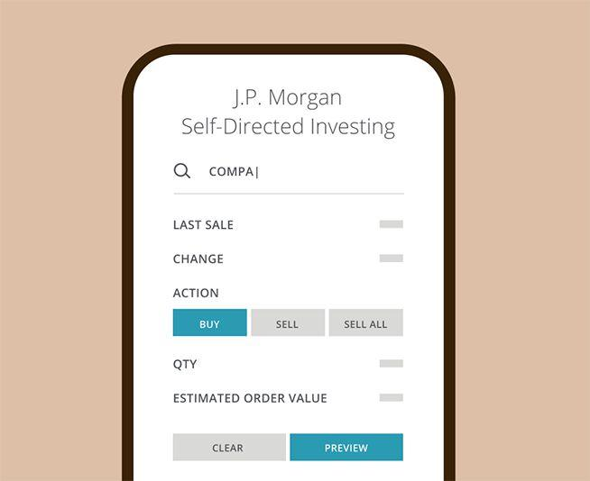

## Table of Contents

## What is J.P. Morgan Self-Directed Investing?

J.P. Morgan Self-Directed Investing is a service that lets you invest in the stock market on your own. You can buy and sell stocks, ETFs, mutual funds, and options. It's designed for people who want to make their own investment choices without advice from a financial advisor. You can use their website or mobile app to manage your investments anytime you want.

The service is easy to use, even if you're new to investing. There are no account minimums, so you can start investing with any amount of money. They charge low fees, which means you keep more of your money. J.P. Morgan also provides tools and research to help you make smart investment decisions. This way, you can learn as you go and feel more confident about your investments.

## How does one open an account with J.P. Morgan Self-Directed Investing?

To open an account with J.P. Morgan Self-Directed Investing, start by visiting their website or downloading their mobile app. Look for the option to open a new account. You'll need to provide some personal information like your name, address, and Social Security number. This is to verify your identity and set up your account securely.

Once you've entered your information, you'll need to choose the type of account you want. You can pick from options like an individual account, a joint account, or a retirement account like an IRA. After selecting your account type, you'll need to fund your account. You can do this by transferring money from your bank account or by mailing a check. Once your account is funded, you're ready to start investing on your own.

## What are the fees associated with J.P. Morgan Self-Directed Investing?

J.P. Morgan Self-Directed Investing keeps fees low so you can keep more of your money. They don't charge any fees to open an account or to keep it open. You won't pay any commissions when you buy or sell stocks, ETFs, or options. This means you can trade as much as you want without worrying about extra costs eating into your returns.

There are a few other fees to know about. If you invest in mutual funds, you might have to pay a fee, but J.P. Morgan offers many funds that don't charge these fees. Also, if you need to transfer your account to another broker, there's a fee for that. It's a good idea to check the fee schedule on their website to see all the details and make sure you understand any costs before you start investing.

## What types of investments can be made through J.P. Morgan Self-Directed Investing?

With J.P. Morgan Self-Directed Investing, you can choose from a variety of investments. You can buy and sell stocks, which are shares in a company. You can also invest in ETFs, which are funds that hold a collection of stocks or other assets. Mutual funds are another option, where your money is pooled with other investors' money to buy a diversified set of investments. If you're interested in more advanced trading, you can also trade options, which are contracts that give you the right to buy or sell an asset at a certain price.

All these investment choices give you flexibility to build your portfolio the way you want. Stocks and ETFs are great if you want to focus on specific companies or sectors. Mutual funds can help you spread your risk across many different investments. Options can be used for more complex strategies, but they come with more risk, so it's important to understand them well before you start trading. No matter what you choose, J.P. Morgan Self-Directed Investing provides the tools and resources you need to make informed decisions.

## How does the platform's user interface cater to beginners?

J.P. Morgan Self-Directed Investing's user interface is designed to be easy for beginners to use. When you log in, you'll see a clean and simple layout. The main page shows your account balance and any recent activity. There are clear buttons for buying and selling investments, so you can start trading without feeling overwhelmed. The platform also has a search tool that helps you find stocks, ETFs, and other investments quickly.

The platform offers helpful tools and resources to guide beginners. There are educational articles and videos that explain investing basics in simple terms. You can also use the research tools to learn about different investments before you buy them. If you need help, there's a chat feature where you can ask questions and get quick answers. This way, even if you're new to investing, you can feel confident using J.P. Morgan Self-Directed Investing.

## What educational resources does J.P. Morgan Self-Directed Investing offer to new investors?

J.P. Morgan Self-Directed Investing has lots of educational resources to help new investors learn. They have articles and videos that explain the basics of investing in simple terms. These resources cover topics like how to pick stocks, what ETFs are, and how to build a balanced portfolio. This helps you understand the different types of investments and how they work.

You can also find guides on how to use the platform's tools and features. These guides show you step-by-step how to buy and sell investments, how to research companies, and how to track your progress. If you have any questions, there's a chat feature where you can ask for help and get quick answers. This makes it easier for beginners to start investing and feel more confident about their choices.

## How does J.P. Morgan Self-Directed Investing compare to other self-directed investing platforms in terms of cost and features?

J.P. Morgan Self-Directed Investing stands out for its low cost and easy-to-use features. It doesn't charge any commissions for trading stocks, ETFs, or options, which is great for people who want to keep their costs low. Compared to other platforms like Robinhood, which also offers commission-free trading, J.P. Morgan provides a more comprehensive set of tools and research resources. While Robinhood is known for its simple interface, J.P. Morgan's platform includes more in-depth educational materials and research tools, which can be very helpful for new investors.

In terms of features, J.P. Morgan Self-Directed Investing offers a wide range of investment options, including stocks, ETFs, mutual funds, and options. This is similar to what you'd find on platforms like Fidelity or Charles Schwab, but J.P. Morgan's user interface is designed to be more beginner-friendly. Fidelity and Charles Schwab offer more advanced trading tools and a broader selection of mutual funds, but they might be more complex for beginners. J.P. Morgan strikes a good balance by providing enough tools and resources to help new investors learn and grow, without overwhelming them with too many options or complicated features.

## What are the advanced trading tools available on J.P. Morgan Self-Directed Investing?

J.P. Morgan Self-Directed Investing offers several advanced trading tools that can help experienced investors make smart decisions. One of the main tools is the ability to trade options. Options let you buy or sell stocks at a certain price in the future, which can be a powerful way to manage risk or make money. The platform also has real-time market data and charts, so you can see how stocks are doing right now and make quick decisions. You can set up custom alerts to notify you when a stock reaches a certain price, which is helpful if you want to buy or sell at the right time.

Another useful tool is the ability to place different types of orders. You can use limit orders to buy or sell a stock at a specific price, or stop orders to automatically sell a stock if it drops to a certain level. This helps you control your investments better. J.P. Morgan also provides advanced research tools, like analyst reports and company financials, so you can dig deeper into a company before you invest. These tools make J.P. Morgan Self-Directed Investing a good choice for people who want to take their investing to the next level.

## How does J.P. Morgan Self-Directed Investing support portfolio analysis and management?

J.P. Morgan Self-Directed Investing helps you keep track of your investments with easy-to-use tools. When you log in, you can see all your investments in one place. The platform shows you how much your portfolio is worth and how it's doing over time. You can also see how each investment is performing, so you know which ones are doing well and which ones might need a closer look. This makes it simple to understand your overall financial picture and make smart decisions about your money.

The platform also lets you analyze your portfolio in more detail. You can see how your investments are spread out across different types of assets, like stocks, ETFs, and mutual funds. This helps you make sure your investments are balanced and not too risky. J.P. Morgan also provides tools to compare your portfolio to market benchmarks, so you can see if you're doing better or worse than the market. With these tools, you can manage your investments better and feel more confident about your financial future.

## What are the security measures in place to protect user accounts and investments?

J.P. Morgan Self-Directed Investing takes security very seriously to keep your account and investments safe. They use strong encryption to protect your personal information and your money when you're using their website or app. This means your data is turned into a secret code that's hard for anyone else to read. They also have two-[factor](/wiki/factor-investing) authentication, which means you need more than just a password to log in. You might get a code sent to your phone that you have to enter, so even if someone else knows your password, they can't get into your account.

Another important security measure is monitoring for any strange activity. J.P. Morgan keeps an eye on your account to make sure no one is trying to do something they shouldn't. If they see anything unusual, like someone trying to log in from a new device, they'll let you know right away. They also have a team that works to stop fraud and protect your money. With these security steps, you can feel confident that your investments are safe with J.P. Morgan Self-Directed Investing.

## How does J.P. Morgan Self-Directed Investing handle customer service and support?

J.P. Morgan Self-Directed Investing offers good customer service to help you with any questions or problems you have. You can use their chat feature to talk to someone right away. This is really helpful if you need quick answers while you're using the platform. They also have a phone number you can call if you want to talk to someone directly. The customer service team knows a lot about investing and can help you understand things better.

If you prefer, you can also find answers on their website. They have a help center with lots of articles and guides that explain how to use the platform and make smart investment choices. This is great if you like to figure things out on your own. No matter how you choose to get help, J.P. Morgan Self-Directed Investing makes sure you have the support you need to feel confident about your investments.

## What are the expert opinions and user reviews on J.P. Morgan Self-Directed Investing's performance and reliability?

Experts generally have good things to say about J.P. Morgan Self-Directed Investing. They like that it's easy to use and has low fees. Experts say it's a good choice for people who want to start investing without spending a lot of money. They also mention that the platform has good tools and resources to help people learn and make smart choices. Some experts think it's not as advanced as some other platforms, but it's still a solid option for beginners and experienced investors alike.

Users also have positive reviews about J.P. Morgan Self-Directed Investing. Many people say the platform is simple and easy to navigate, which is great for new investors. They appreciate the educational resources and the helpful customer service. Some users mention that they wish there were more advanced features, but overall, they're happy with the platform's performance and reliability. People feel confident that their investments are safe and that J.P. Morgan is a trustworthy company.

## References & Further Reading

[1]: Bergstra, J., Bardenet, R., Bengio, Y., & Kégl, B. (2011). ["Algorithms for Hyper-Parameter Optimization."](https://dl.acm.org/doi/10.5555/2986459.2986743) Advances in Neural Information Processing Systems 24.

[2]: ["Advances in Financial Machine Learning"](https://www.amazon.com/Advances-Financial-Machine-Learning-Marcos/dp/1119482089) by Marcos Lopez de Prado

[3]: ["Evidence-Based Technical Analysis: Applying the Scientific Method and Statistical Inference to Trading Signals"](https://www.amazon.com/Evidence-Based-Technical-Analysis-Scientific-Statistical/dp/0470008741) by David Aronson

[4]: ["Machine Learning for Algorithmic Trading"](https://github.com/PacktPublishing/Machine-Learning-for-Algorithmic-Trading-Second-Edition) by Stefan Jansen

[5]: ["Quantitative Trading: How to Build Your Own Algorithmic Trading Business"](https://books.google.com/books/about/Quantitative_Trading.html?id=j70yEAAAQBAJ) by Ernest P. Chan