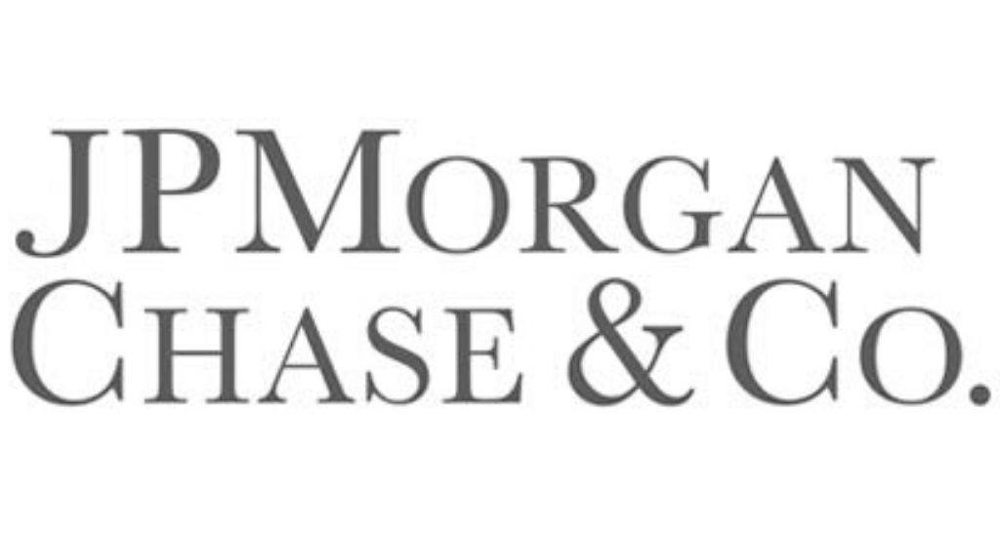

## Table of Contents

## What is JPMorgan Chase and Company?

JPMorgan Chase and Company is a big bank in the United States. It helps people and businesses with their money. They have many services like checking accounts, savings accounts, and loans. People can go to their branches or use their website and app to do banking.

The bank started a long time ago and has grown by joining with other banks. It is one of the biggest banks in the world. They also help companies with big projects and investments. Many people trust JPMorgan Chase to take care of their money and help them reach their financial goals.

## When was JPMorgan Chase founded?

JPMorgan Chase was founded in 1799. It started as a small bank called the Bank of the Manhattan Company. Over many years, this bank grew and joined with other banks to become bigger and stronger.

One important merger happened in 2000 when Chase Manhattan Bank combined with J.P. Morgan & Co. This new bank was called JPMorgan Chase. Since then, it has kept growing and is now one of the biggest banks in the world.

## Who are the key founders of JPMorgan Chase?

The key founder of what would become JPMorgan Chase was Aaron Burr. He started the Bank of the Manhattan Company in 1799. At that time, it was a small bank in New York City. Aaron Burr was a famous lawyer and politician. He wanted to create a bank that would help people and businesses with their money.

Later, another important person in the bank's history was John Pierpont Morgan. He founded J.P. Morgan & Co. in 1871. John Pierpont Morgan was a very successful businessman and banker. His bank grew to be very powerful and helped many big companies. In 2000, J.P. Morgan & Co. merged with Chase Manhattan Bank, which came from the Bank of the Manhattan Company. This merger created JPMorgan Chase, the big bank we know today.

## What are the main services offered by JPMorgan Chase?

JPMorgan Chase offers many services to help people and businesses with their money. They have checking and savings accounts where people can keep their money safe. They also give out loans, like home loans and car loans, to help people buy big things. If someone wants to pay for something without using cash, they can use a credit card or debit card from JPMorgan Chase. The bank also helps people save for the future with retirement accounts and investment options.

For businesses, JPMorgan Chase provides services like business checking and savings accounts. They also offer loans and lines of credit to help businesses grow. The bank helps companies manage their money and make payments easily. They have special services for big companies too, like helping them with big projects and investments. Overall, JPMorgan Chase tries to meet the needs of both individual customers and businesses of all sizes.

## How has JPMorgan Chase evolved over the years?

JPMorgan Chase started a long time ago in 1799 as a small bank called the Bank of the Manhattan Company. Aaron Burr, a famous lawyer and politician, founded it. At first, it was just a local bank in New York City, helping people and businesses with their money. Over the years, the bank grew by joining with other banks. One big merger happened in 1955 when the Bank of the Manhattan Company became Chase Manhattan Bank. This made the bank even bigger and stronger.

Another important moment came in 2000 when Chase Manhattan Bank merged with J.P. Morgan & Co., which was started by John Pierpont Morgan in 1871. This merger created JPMorgan Chase, the big bank we know today. Since then, JPMorgan Chase has kept growing and now offers many services like checking and savings accounts, loans, credit cards, and investment options. They help both regular people and big businesses with their money needs. Today, JPMorgan Chase is one of the biggest and most trusted banks in the world.

## What is the current market position of JPMorgan Chase?

JPMorgan Chase is one of the biggest banks in the world. It is very important in the United States and has a strong position in the global market. The bank helps many people and businesses with their money, offering services like checking and savings accounts, loans, and investment options. Because it is so big and trusted, many customers choose JPMorgan Chase for their banking needs.

The bank also has a lot of influence in the financial world. It works with big companies on big projects and investments. JPMorgan Chase is known for being reliable and strong, even during tough economic times. This makes it a leader in the banking industry. Overall, JPMorgan Chase is a top choice for people and businesses looking for a safe and trusted bank.

## Who are the major competitors of JPMorgan Chase?

JPMorgan Chase has several big competitors in the banking world. One of the main ones is Bank of America. Bank of America is also a very big bank in the United States. It offers similar services like checking and savings accounts, loans, and credit cards. Many people use Bank of America for their everyday banking needs, just like they do with JPMorgan Chase.

Another big competitor is Wells Fargo. Wells Fargo is known for its wide range of services and its many branches across the country. People can use Wells Fargo for things like mortgages, personal loans, and business banking. Like JPMorgan Chase, Wells Fargo is a popular choice for both individual customers and businesses.

Citigroup is also a major competitor. Citigroup, often called Citi, is a global bank that helps people and businesses all over the world. They offer services like banking, credit cards, and investment options. Citi is known for its strong presence in international markets, making it a big rival to JPMorgan Chase on a global scale.

## What are some significant mergers and acquisitions involving JPMorgan Chase?

JPMorgan Chase has grown a lot through mergers and acquisitions. One important merger happened in 2000 when Chase Manhattan Bank joined with J.P. Morgan & Co. to become JPMorgan Chase. This merger made the bank much bigger and stronger. Before this, Chase Manhattan Bank itself was formed in 1955 when the Bank of the Manhattan Company merged with the Chase National Bank. These mergers helped the bank to serve more people and offer more services.

Another big acquisition was in 2008 when JPMorgan Chase bought Washington Mutual, also known as WaMu. This happened during a time when many banks were having trouble because of the financial crisis. By buying WaMu, JPMorgan Chase was able to get more customers and branches, especially on the west coast of the United States. This acquisition helped JPMorgan Chase to grow even more and become one of the biggest banks in the country.

## How does JPMorgan Chase contribute to the global economy?

JPMorgan Chase plays a big role in the global economy by helping businesses and governments with their money. The bank works with companies all over the world to help them grow and invest in new projects. It provides loans and other financial services that help businesses start or expand their operations. This helps create jobs and makes the economy stronger. JPMorgan Chase also helps countries manage their money and invest in big projects like building roads or schools, which can improve people's lives and make the economy better.

The bank also helps move money around the world. When people or businesses need to send money to other countries, JPMorgan Chase can help them do it quickly and safely. This is important for trade and making sure that businesses can work together even if they are in different countries. By doing all these things, JPMorgan Chase helps keep the global economy running smoothly and helps it grow.

## What are the recent financial performance highlights of JPMorgan Chase?

In recent years, JPMorgan Chase has been doing very well financially. For the year 2022, the bank made a lot of money, with a net income of about $37.7 billion. This was higher than the year before, showing that the bank was growing and making more profit. One reason for this success was that more people were using their services, like loans and credit cards. Also, the bank did well in managing the money it had invested, which helped increase its earnings.

JPMorgan Chase also saw strong performance in the first quarter of 2023. The bank reported a net income of around $12.6 billion, which was a big increase from the same time in the previous year. This good performance was helped by higher interest rates, which meant the bank could earn more from loans. The bank also kept a lot of customers and attracted new ones, showing that people trust JPMorgan Chase to take care of their money. Overall, these recent financial results show that JPMorgan Chase is doing well and is a strong player in the banking world.

## What are the key challenges facing JPMorgan Chase in the current market?

One big challenge for JPMorgan Chase right now is dealing with changes in interest rates. When interest rates go up, it can be good for the bank because they can earn more money from loans. But it can also make it harder for people to pay back those loans, which can lead to more people not being able to pay their debts. This can be risky for the bank. Also, if interest rates go down, the bank might make less money from loans, which can affect their profits.

Another challenge is keeping up with new technology and competition from other banks and financial companies, like fintech startups. These new companies use technology to offer quick and easy banking services. They can sometimes do things faster and cheaper than big banks like JPMorgan Chase. To stay competitive, JPMorgan Chase needs to keep improving its own technology and services. This means spending a lot of money on new systems and making sure they work well for customers.

Lastly, JPMorgan Chase also has to deal with rules and regulations from the government. Banks have to follow many rules to make sure they are safe and fair. Sometimes these rules can change, and the bank has to spend time and money to make sure they are following them. If they don't, they could get in trouble and have to pay big fines. Keeping up with these rules is a big challenge for a big bank like JPMorgan Chase.

## What are the future strategies and innovations planned by JPMorgan Chase?

JPMorgan Chase is always looking for new ways to make banking easier and better for people. One of their big plans is to use more technology to help customers. They are working on new apps and online tools that let people do their banking from anywhere, anytime. They want to make sure these tools are easy to use and safe. They are also looking into using [artificial intelligence](/wiki/ai-artificial-intelligence) (AI) to help with things like spotting fraud and giving customers advice on how to manage their money better. By using new technology, JPMorgan Chase hopes to stay ahead of other banks and keep their customers happy.

Another important strategy for JPMorgan Chase is to help more people and businesses around the world. They want to grow their services in other countries and work with more businesses on big projects. This can help create jobs and make the global economy stronger. They also want to make sure they are doing things in a way that is good for the environment and helps the community. For example, they are investing in projects that use less energy and are trying to help people in underserved areas get better access to banking services. By focusing on these areas, JPMorgan Chase aims to be a leader in the banking world and make a positive impact on the world.

## References & Further Reading

[1]: ["Advances in Financial Machine Learning"](https://www.amazon.com/Advances-Financial-Machine-Learning-Marcos/dp/1119482089) by Marcos Lopez de Prado.

[2]: ["Machine Learning for Algorithmic Trading"](https://github.com/stefan-jansen/machine-learning-for-trading) by Stefan Jansen.

[3]: ["Quantitative Trading: How to Build Your Own Algorithmic Trading Business"](https://github.com/LucindaYa/quant-resources/blob/master/Quantitative%20Trading%20How%20to%20Build%20Your%20Own%20Algorithmic%20Trading%20Business.pdf) by Ernest P. Chan.

[4]: Castura, L., Litzenberger, R., Mackintosh, I., & Gorelick, R. (2010). ["High-Frequency Trading: Implications for Market Efficiency and Fairness."](https://www.researchgate.net/publication/259141434_Does_high_frequency_trading_affect_technical_analysis_and_market_efficiency_And_if_so_how) Financial Analysts Journal, 66(4), pp. 38-54.

[5]: Aldridge, I. (2013). ["High-Frequency Trading: A Practical Guide to Algorithmic Strategies and Trading Systems,"](https://onlinelibrary.wiley.com/doi/pdf/10.1002/9781119203803.fmatter) 2nd Edition. Wiley Trading.