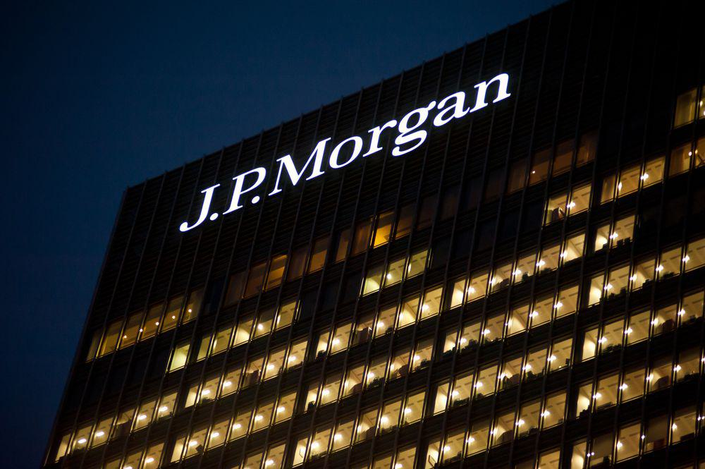

In the rapidly evolving world of finance, technology has become a critical component in transforming traditional banking and investment strategies. Financial institutions are increasingly embracing technological advancements to remain competitive and meet the ever-growing demands of the market. Among the many technological innovations reshaping the financial landscape, algorithmic trading has emerged as a significant force in the financial markets. Algorithmic trading involves the use of pre-programmed instructions to execute trading orders swiftly and efficiently, based on various market conditions such as time, price, and volume.

This form of trading capitalizes on the speed and computational power of computers to process trades at a pace and volume that would be impossible for human traders to achieve. Algorithmic trading not only enhances the speed of trade executions but also minimizes the potential for human error, helps in risk management, and reduces transaction costs. By employing complex mathematical models and statistical analyses, algorithmic trading enables financial institutions to optimize their trading strategies and maintain a competitive advantage.



Established firms like JPMorgan Chase & Co. have played a pivotal role in integrating these technological innovations with their financial services, thereby enhancing both the efficiency and the scope of their banking and investment operations. By leveraging algorithmic trading, JPMorgan Chase & Co. and similar institutions can process large volumes of transactions across global markets, manage wealth portfolios more effectively, and offer tailored investment solutions to their clients.

As technology continues to advance, the intersection of banking, investment, finance, and algorithmic trading will likely lead to further innovations and improvements in financial services. Understanding how leading firms like JPMorgan Chase & Co. incorporate these elements into their operations provides valuable insights into the future of the financial industry.

## Table of Contents

## The Role of Technology in Modern Banking

Technology has fundamentally transformed banking operations, leading to unprecedented levels of efficiency and the emergence of innovative financial products. Financial institutions around the world harness technology to process transactions rapidly, manage risks comprehensively, and improve customer service by providing tailored solutions that meet diverse client needs.

Modern banking operations leverage sophisticated software to automate routine tasks, significantly reducing the time required to process transactions. This automation is crucial for enabling high-frequency transactions and real-time data analysis, ensuring that institutions can respond promptly to market changes. Examples include the use of blockchain technology to streamline and secure payment processes, and artificial intelligence to provide predictive analytics for risk management.

Risk management has also seen substantial advancements through technology. Financial institutions now employ complex algorithms and [machine learning](/wiki/machine-learning) models to predict potential risks, assess creditworthiness, and detect fraudulent activities. These technologies analyze vast amounts of data at high speed, uncovering patterns and anomalies that might not be apparent through traditional analysis methods.

JPMorgan Chase & Co. exemplifies the successful integration of technology across its various service divisions, including investment banking, asset management, and retail services. By investing in state-of-the-art technological infrastructure, JPMorgan Chase has been able to optimize its trading platforms, enhance the personalization of client offerings, and streamline operations, resulting in significant cost savings and improved efficiency.

Investment in technology also allows banks to enhance product offerings and customer experiences. Mobile banking apps and digital wallets provide clients with convenient access to financial services anywhere and anytime. These tools also enable customers to perform a range of financial activities, from simple transaction alerts to complex investment portfolio management.

In summary, technology is at the forefront of modern banking, facilitating efficiency, enhancing risk management, and driving product innovation. As exemplified by institutions like JPMorgan Chase, the strategic integration of technological solutions is a crucial element for maintaining competitiveness and delivering superior service in the evolving financial landscape.

## Investment Strategies and Financial Services

Investment strategies have significantly advanced with the integration of [algorithmic trading](/wiki/algorithmic-trading), revolutionizing how financial institutions manage transactions. Algorithmic trading employs sophisticated algorithms that allow for the efficient handling of large quantities of trades, by executing transactions at optimal times and prices. This integration results in minimized transaction costs and maximized returns, which are essential for large financial entities managing vast portfolios.

JPMorgan Chase & Co. stands at the forefront of leveraging these technological innovations. The firm offers various comprehensive financial services, including asset management, private equity, and wealth management, and utilizes cutting-edge technology to enhance these services. By incorporating algorithmic trading strategies, JPMorgan is well-positioned to efficiently process immense volumes of trades with speed and precision, providing a competitive advantage in global markets.

In asset management, algorithmic trading enables JPMorgan to offer tailored investment solutions that are responsive to real-time market conditions. This dynamic approach is facilitated by high-frequency trading systems that analyze market data and execute trades at fractions of a second. These systems evaluate multiple variables—such as price trends, historical data, and risk factors—to make informed trading decisions, thereby optimizing portfolio performance for clients.

Private equity services at JPMorgan also benefit from algorithmic approaches, particularly in valuation and risk assessment. By deploying algorithms capable of analyzing financial statements, market conditions, and economic trends, the firm enhances its capabilities in identifying and managing lucrative investment opportunities in private markets. Thus, technology empowers JPMorgan to navigate complex investment landscapes more effectively than traditional methods permit.

Algorithmic trading aids in maintaining JPMorgan's competitive edge by facilitating strategic market positioning and ensuring robust risk management practices. The firm's investment in developing proprietary algorithms underscores its commitment to innovation and exemplifies how technology is integral to its growth strategy. As financial markets evolve, the continuous refinement of algorithmic strategies is crucial for sustaining competitive advantages and delivering exceptional financial services.

## Algorithmic Trading Defined

Algorithmic trading leverages automated and pre-programmed trading instructions to execute trades, capitalizing on various factors such as time, price, and [volume](/wiki/volume-trading-strategy). This form of trading has become increasingly prevalent in financial markets due to its capacity to efficiently manage high-frequency trading ([HFT](/wiki/high-frequency-trading-strategies)) operations. By automating the decision-making process and eliminating human intervention, algorithmic trading can execute complex strategies at speeds and frequencies that are impossible for a human trader. 

A common mathematical approach used in algorithmic trading involves statistical [arbitrage](/wiki/arbitrage), where algorithms identify and exploit price differentials between correlated securities. For instance, by using mean-reversion strategies, an algorithm might predict that the price of a security will revert to its mean over time, allowing it to capitalize on temporary mispricings with minimal risk.

Python, being a preferred programming language in finance due to its powerful libraries and flexibility, is often utilized to develop and test these algorithms. Here's a simplified example of a mean-reversion strategy using the pandas and numpy libraries in Python:

```python
import pandas as pd
import numpy as np

# Sample price data
price_data = pd.Series([100, 102, 101, 105, 107, 106, 103, 104, 102, 100])

# Calculate the rolling mean and standard deviation
rolling_mean = price_data.rolling(window=5).mean()
rolling_std = price_data.rolling(window=5).std()

# Define a simple mean-reversion strategy
z_score = (price_data - rolling_mean) / rolling_std

# Buy signal where z-score is less than -1
buy_signal = z_score < -1

# Sell signal where z-score is greater than 1
sell_signal = z_score > 1
```

Algorithmic trading plays a crucial role in modern finance, enabling institutions to maximize returns while proficiently managing risks. By executing trades based on data-driven insights, institutions can enhance the efficiency of their trading operations and strategic execution. Furthermore, the reduction of human errors and the ability to backtest strategies using historical data make algorithmic trading an indispensable tool for financial practitioners seeking to maintain a competitive edge in today's fast-paced market environment.

## Impact of Algorithmic Trading on Financial Markets

Algorithmic trading has had a profound impact on financial markets by transforming how trades are executed and markets function. One of the notable advantages of algorithmic trading is its ability to enhance market [liquidity](/wiki/liquidity-risk-premium). By using algorithms that can rapidly execute large volumes of orders, liquidity in the market is increased. This allows for smoother transactions and reduces the cost of trading by narrowing the bid-ask spread. Consequently, transaction costs are reduced, benefiting both traders and market participants as a whole.

However, algorithmic trading is not without its downsides, particularly in terms of market stability. The speed and automation of algorithmic trades can contribute to increased market [volatility](/wiki/volatility-trading-strategies). Rapid, high-frequency trading can lead to sudden and significant price fluctuations, which might not accurately reflect the underlying value of the traded assets. Moreover, algorithms can react to market conditions in unexpected ways, potentially resulting in flash crashes. These are events characterized by steep and rapid declines in asset prices, followed by an equally swift recovery. The flash crash of May 6, 2010, is an example where algorithmic trading was implicated as a contributing [factor](/wiki/factor-investing).

The implications of such events have led to regulatory concerns. Regulators are tasked with ensuring market stability and protecting investors, which has prompted increased scrutiny of algorithmic trading practices. Regulations aim to mitigate risks by enforcing transparency and accountability among traders utilizing these sophisticated systems. Measures such as circuit breakers and minimum resting times for orders are examples of regulatory interventions designed to curb excessive volatility induced by algorithmic trading.

Despite these challenges, the inherent benefits of speed and efficiency that algorithmic trading brings to financial markets make it an indispensable part of modern trading strategies. It enables institutions to optimize execution, achieve economies of scale, and manage portfolios with precision. Consequently, the use of algorithmic trading continues to grow, with financial firms continuously investing in technological advancements to refine their trading algorithms. The integration of machine learning and [artificial intelligence](/wiki/ai-artificial-intelligence) in algorithmic strategies holds promise for further enhancing performance, albeit with the accompanying necessity for robust risk management frameworks.

## Case Study: JPMorgan and Algorithmic Trading

JPMorgan Chase & Co. has become a leader in the financial industry by integrating algorithmic trading into its traditional banking practices. This forward-thinking approach enables the firm to enhance trading efficiency and optimize strategy deployment across multiple financial products, which include equities, derivatives, and fixed-income securities. Sophisticated algorithms are at the core of these operations, utilizing advanced data analytics and machine learning techniques to make informed decisions rapidly and accurately. 

The utilization of algorithmic trading allows for the management of portfolios and the execution of trades with minimal human intervention, reducing the likelihood of errors and improving speed. These algorithms process vast amounts of market data in real time, identifying trends and patterns that human traders might miss. As a result, JPMorgan's trading desk can respond to market changes with agility, executing large volumes of transactions at optimal prices and times. This capability is critical in the highly competitive and fast-paced financial markets.

JPMorgan demonstrates its strategic commitment to algorithmic trading through substantial investments in technology infrastructure and talent acquisition. The firm dedicates resources to developing proprietary trading algorithms, often leveraging artificial intelligence and machine learning to enhance their effectiveness. For instance, machine learning models can be trained to predict market movements based on historical data, thereby improving the accuracy of trade execution strategies.

Furthermore, these innovations extend beyond trading to include risk management and regulatory compliance. Algorithms play an important role in identifying and mitigating risks by analyzing market conditions and exposure in real time. This proactive risk management approach not only protects the firm’s financial interests but also ensures adherence to regulatory standards, which is crucial in maintaining the trust of investors and clients.

JPMorgan's success with algorithmic trading reinforces its position as a market leader. By continually evolving its technological capabilities, the company not only enhances its own operational efficiency but also sets a benchmark for industry best practices. In a sector where milliseconds can translate to millions of dollars, JPMorgan's strategic focus on algorithmic trading offers significant competitive advantages that drive profitability and market leadership.

## The Future of Finance: Opportunities and Challenges

The ongoing advancements in algorithmic trading are shaping the future of finance by offering numerous opportunities for innovation and presenting significant challenges in risk management. Algorithmic trading, characterized by its ability to execute trades at high speeds and frequencies, has created avenues for improving market efficiency and liquidity. The introduction of more sophisticated algorithms allows financial institutions to implement complex trading strategies that were previously unattainable, enhancing their capability to respond swiftly to market conditions and optimize returns. These strategies often involve nuanced calculations and predictive analytics, increasing the potential for profitability while reducing human error.

However, the rapid proliferation of algorithmic trading presents challenges, particularly in terms of market stability and risk management. The possibility of algorithm-driven volatility, evidenced by incidents like flash crashes, necessitates robust risk management frameworks. Regulatory bodies such as the U.S. Securities and Exchange Commission (SEC) and the European Securities and Markets Authority (ESMA) are intensifying their scrutiny of algorithmic trading practices to mitigate systemic risks and protect market integrity. These efforts involve enforcing stricter regulations and compliance measures that require financial institutions to implement fail-safes and monitoring systems to prevent unintended consequences.

Financial institutions face the dual task of adhering to these regulations while leveraging the technological advancements that algorithmic trading offers. To navigate this complex landscape, they must invest in cutting-edge technologies, including artificial intelligence and machine learning, to develop algorithms that are both efficient and compliant with regulatory standards. This necessitates a focus on transparency and auditability in algorithmic systems, ensuring that their operations can be easily understood and evaluated by both internal stakeholders and regulatory agencies.

Moreover, institutions must cultivate expertise in algorithmic strategy development and risk assessment, integrating cross-disciplinary knowledge from fields such as data science, finance, and regulatory compliance. This integration can be facilitated through specialized training programs and collaboration with tech firms specializing in financial algorithms.

In conclusion, while the future of finance, driven by algorithmic trading, holds immense promise, it is accompanied by challenges that require adept management. The balance between exploiting technological advancements and managing associated risks will define the trajectory of financial institutions as they navigate this rapidly evolving sector.

## Conclusion

Banking, investment, and finance have been witnessing significant transformations, primarily driven by advancements in technology. Among these advancements, algorithmic trading stands out as a pivotal innovation. By employing automated systems to execute trades, algorithmic trading increases efficiency and accuracy in financial transactions. This has enabled financial institutions to process large volumes of trades at remarkable speeds, often measured in milliseconds, thereby optimizing their operations.

Firms like JPMorgan Chase & Co. are at the forefront of integrating algorithmic trading technologies within their traditional banking frameworks. This integration not only enhances the firm's trading capabilities but also positions it as a leader in the evolving financial ecosystem. JPMorgan's strategic adoption of sophisticated algorithms allows it to refine trading strategies, maximize returns, and manage risks more effectively. The firm's commitment to technology-driven innovation underscores its dedication to maintaining competitive superiority in an ever-changing market.

The interplay between banking, investment, finance, and technology is crucial for both investors and financial institutions. As these industries continue to evolve, understanding and navigating the complexities of algorithmic trading becomes essential. For investors, this means recognizing the potential benefits and risks associated with algorithm-driven strategies. For financial institutions, it involves balancing innovation with regulatory compliance and risk management.

In conclusion, the integration of algorithmic trading into financial operations exemplifies the broader trend of technological convergence in the financial sector. As these technologies continue to mature, they will undoubtedly shape the financial landscape of the future, offering new opportunities and challenges. Stakeholders must remain agile and informed to thrive in this dynamic environment.

## References & Further Reading

[1]: ["Advances in Financial Machine Learning"](https://www.amazon.com/Advances-Financial-Machine-Learning-Marcos/dp/1119482089) by Marcos Lopez de Prado.

[2]: ["Machine Learning for Algorithmic Trading"](https://github.com/stefan-jansen/machine-learning-for-trading) by Stefan Jansen.

[3]: ["Quantitative Trading: How to Build Your Own Algorithmic Trading Business"](https://github.com/LucindaYa/quant-resources/blob/master/Quantitative%20Trading%20How%20to%20Build%20Your%20Own%20Algorithmic%20Trading%20Business.pdf) by Ernest P. Chan.

[4]: Castura, L., Litzenberger, R., Mackintosh, I., & Gorelick, R. (2010). ["High-Frequency Trading: Implications for Market Efficiency and Fairness."](https://www.researchgate.net/publication/259141434_Does_high_frequency_trading_affect_technical_analysis_and_market_efficiency_And_if_so_how) Financial Analysts Journal, 66(4), pp. 38-54.

[5]: Aldridge, I. (2013). ["High-Frequency Trading: A Practical Guide to Algorithmic Strategies and Trading Systems,"](https://onlinelibrary.wiley.com/doi/pdf/10.1002/9781119203803.fmatter) 2nd Edition. Wiley Trading.