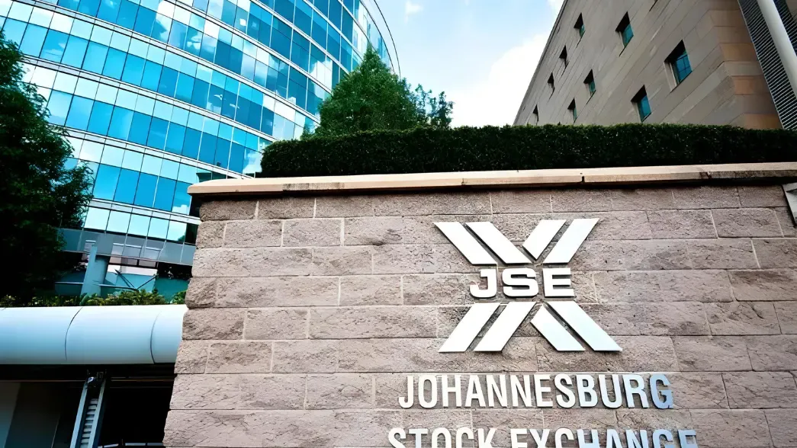

## Table of Contents

## What is JSE Limited?

JSE Limited is a company that runs the Johannesburg Stock Exchange, which is the biggest stock exchange in South Africa. It's where people and companies can buy and sell shares of other companies. The JSE helps businesses get money they need to grow by letting them sell shares to investors. It also helps investors make money by buying and selling these shares.

The JSE was started a long time ago, in 1887, during the time when people were finding a lot of gold in South Africa. It has grown a lot since then and now it's not just about gold companies. The JSE lists many different kinds of companies from all sorts of industries. It's important for South Africa's economy because it helps money move around and helps businesses grow.

## Where is JSE Limited located?

JSE Limited is located in Johannesburg, South Africa. Johannesburg is a big city and is known for being the economic heart of the country.

The main office of JSE Limited is in a building called One Exchange Square. This building is in the Sandton area of Johannesburg, which is a busy part of the city with lots of businesses and offices.

## What types of securities are traded on the JSE?

The JSE trades different types of securities. You can find shares of companies there, which means you can buy a part of a company. These shares can be from big companies or smaller ones, and they come from many different kinds of businesses, like mining, banks, or stores. The JSE also trades exchange-traded funds (ETFs), which are like baskets of different investments that you can buy and sell easily.

Besides shares and ETFs, the JSE also deals with bonds. Bonds are like loans that you can buy, and they are usually from the government or big companies. When you buy a bond, you get your money back with some extra over time. The JSE also has a market for derivatives, which are more complex financial products. Derivatives can be things like futures and options, which let investors bet on what might happen to prices in the future.

## How can someone start trading on the JSE?

To start trading on the JSE, you first need to find a stockbroker. A stockbroker is someone who helps you buy and sell shares, bonds, and other securities on the JSE. You can choose from different kinds of brokers, like online brokers who let you trade using the internet, or traditional brokers who you can talk to in person or over the phone. Once you pick a broker, you'll need to open a trading account with them. This usually means filling out some forms and giving them information about yourself, like your ID and where you live.

After your trading account is set up, you can start buying and selling securities. You'll need to put money into your account to make trades. When you want to buy or sell something, you tell your broker what you want to do, and they do it for you on the JSE. It's a good idea to learn about the companies or securities you're interested in before you start trading. You can do this by reading news, looking at company reports, and maybe even talking to a financial advisor who can give you advice.

## What are the trading hours of the JSE?

The Johannesburg Stock Exchange, or JSE, has set times when you can trade. It's open from Monday to Friday. The trading day starts at 9:00 AM and goes until 5:00 PM, South African time. This is when most of the buying and selling happens.

There are also some special times for certain kinds of trading. For example, there's a pre-market session that starts at 8:30 AM, and an after-market session that goes until 5:30 PM. These times are for things like big trades that don't affect the normal trading prices. So, if you want to trade on the JSE, you need to know these times.

## What is the history of the JSE?

The JSE, or Johannesburg Stock Exchange, started in 1887. It was a time when people were finding a lot of gold in South Africa. The JSE began as a place where people could trade shares in mining companies. It was important because it helped these companies get the money they needed to dig for more gold. Over time, the JSE grew bigger and started to include shares from other types of businesses, not just mining.

By the 20th century, the JSE became more organized and started using new technology to make trading easier and faster. In 1995, the JSE changed a lot. It became an electronic exchange, which means people could trade using computers instead of meeting in person. This made it easier for more people to trade. In 2005, the JSE became a company called JSE Limited, and it started listing shares of itself on its own exchange. Today, the JSE is a big part of South Africa's economy, helping businesses grow and giving people a place to invest their money.

## What are the main indices of the JSE?

The JSE has several main indices that help people understand how the market is doing. The most well-known one is the FTSE/JSE All Share Index (ALSI), which includes almost all the big and medium-sized companies listed on the JSE. It gives a good overall picture of the market's performance. Another important index is the FTSE/JSE Top 40 Index, which tracks the 40 biggest companies on the JSE. This index is watched closely because these big companies have a big impact on the market.

There are also other indices that focus on specific parts of the market. The FTSE/JSE Mid Cap Index looks at medium-sized companies, while the FTSE/JSE Small Cap Index tracks smaller companies. These indices help investors see how different sizes of companies are doing. Additionally, the FTSE/JSE SWIX (Shareholder Weighted Index) is important because it gives more weight to companies where more shares are available to the public, which can be a different way to measure performance.

## How does the JSE contribute to the South African economy?

The JSE helps the South African economy by giving businesses a way to get money. When companies want to grow or start new projects, they can sell shares on the JSE. People buy these shares and give the companies the money they need. This helps businesses expand, create jobs, and make more things or services. When businesses do well, it helps the whole economy grow because more people have jobs and more money is moving around.

The JSE also helps investors make money. People can buy and sell shares on the JSE, and if the companies do well, the value of the shares goes up. This means investors can make a profit. When investors make money, they can spend it or invest it in other parts of the economy. This keeps the money flowing and helps the economy stay strong. The JSE is important because it connects businesses that need money with investors who want to make money, and this helps the whole country.

## What are the listing requirements for companies on the JSE?

To list on the JSE, a company needs to meet certain rules. First, the company must have been in business for at least three years, unless it's a mining company, which can list without this requirement. The company also needs to have a certain amount of money, called "share capital," and it must have enough shares available for the public to buy. The JSE wants to make sure that the company is big enough and stable enough to be on the exchange.

The company also has to follow rules about how it shares information with the public. It needs to give regular reports about how it's doing, like financial statements, so that people who might want to buy its shares can make good decisions. The company must also follow rules about how it treats its shareholders fairly. This means everyone who owns shares gets treated the same way. The JSE checks these things to make sure the market is fair and that people can trust the companies listed on it.

## What regulatory bodies oversee the JSE?

The JSE is mainly overseen by the Financial Sector Conduct Authority (FSCA) and the Prudential Authority (PA). The FSCA makes sure that the JSE follows the rules and treats investors fairly. They check that the JSE and the companies listed on it give out correct information and follow the law. The PA looks after the financial health of the JSE, making sure it has enough money and is run safely. Both these bodies work together to keep the JSE running smoothly and honestly.

Besides these, the JSE also has its own rules that it follows. The JSE's own team, called the Listings Committee, makes sure that companies that want to list on the exchange meet all the requirements. They check things like how much money a company has and how it shares information. This helps keep the JSE trustworthy and fair for everyone who uses it.

## How does the JSE handle market surveillance and enforcement?

The JSE keeps a close watch on the market to make sure everything is fair and honest. They use special computer systems to look at all the trading that happens every day. These systems can spot if someone is doing something they shouldn't, like trying to trick the market or not following the rules. If the JSE sees something strange, they look into it more to find out what's going on. This helps keep the market safe for everyone who trades there.

If the JSE finds out that someone broke the rules, they can take action to stop it. They might warn the person, fine them, or even stop them from trading on the JSE. The JSE works with other groups, like the Financial Sector Conduct Authority, to make sure the rules are followed. By doing this, the JSE helps keep the market fair and trustworthy, which is important for everyone who uses it.

## What technological advancements has the JSE implemented to improve trading?

The JSE has made big changes to use new technology to make trading easier and faster. They moved to an electronic trading system in 1995, which meant people could trade using computers instead of meeting in person. This change made it possible for more people to trade from anywhere, not just in Johannesburg. The JSE also started using a system called JSE Integrated Trading and Clearing (ITaC), which helps make trading smoother and safer. This system can handle a lot of trades very quickly and helps keep everything running smoothly.

Another important change was the introduction of the Colocation Services. This lets traders put their computers right next to the JSE's computers, so trades can happen even faster. The JSE also uses smart computer programs to watch the market all the time, looking for anything that might not be fair or right. These programs help the JSE make sure the market stays honest and safe for everyone. By using these new technologies, the JSE helps make trading better and more reliable for everyone who uses it.

## References & Further Reading

[1]: Mili, N., Halili, T., & Barkley, B. (2019). ["Algorithmic trading: A comprehensive overview and future prospects."](https://www.researchgate.net/publication/378548435_Algorithmic_Trading_and_AI_A_Review_of_Strategies_and_Market_Impact) Journal of Economic Surveys, 33(5), 1421-1447.

[2]: JSE Limited. ["History of the JSE."](https://en.wikipedia.org/wiki/JSE_Limited) Johannesburg Stock Exchange.

[3]: Narang, R.K. (2009). ["Inside the Black Box: A Simple Guide to Quantitative and High-Frequency Trading."](https://onlinelibrary.wiley.com/doi/book/10.1002/9781118267738) Wiley.

[4]: South African Reserve Bank. (2018). ["Financial Stability Review."](https://www.reservebank.co.za/content/dam/sarb/publications/reviews/finstab-review/2018/8904/Second-edition-2018-FSR.pdf) South African Reserve Bank Publications.

[5]: Securities Industry and Financial Markets Association (SIFMA). ["Algorithms and Trading: Financial and Regulatory Impact."](https://www.sifma.org/) SIFMA Insights.

[6]: Pwc. ["Financial Services Technology 2020 and Beyond: Embracing Disruption."](https://www.pwc.com/gx/en/financial-services/assets/pdf/technology2020-and-beyond.pdf) PwC Publications.

[7]: Hull, J.C. (2018). ["Options, Futures, and Other Derivatives."](https://www.semanticscholar.org/paper/Options%2C-Futures%2C-and-Other-Derivatives-Hull/89bdee500c8623864fc9eb7a471546aa713acc44) Pearson Education.