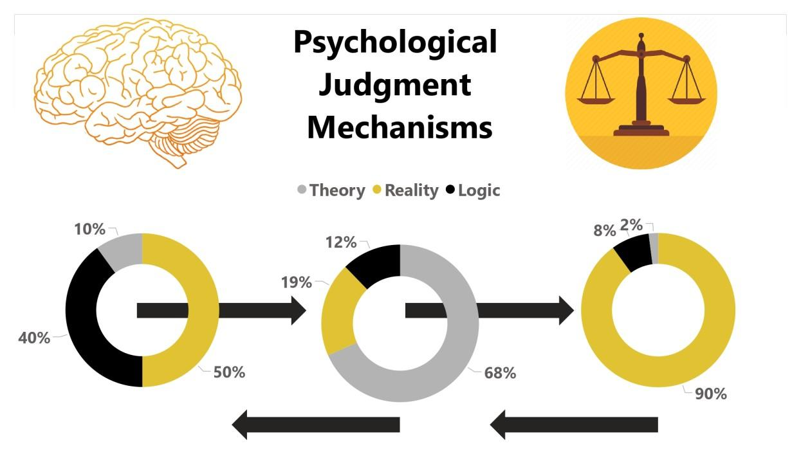

## Table of Contents

## What is judgment in psychological terms?

In psychology, judgment refers to the mental process of forming an opinion or making a decision based on the information we have. It's like when you see a new person and decide if you like them or not. Our brains use what we already know and what we see or hear to make these judgments. Sometimes, these judgments can be quick and happen without us really thinking about them, like when we feel scared of a big dog because we've heard stories about dogs biting people.

Judgments can be influenced by many things, like our past experiences, emotions, and even the way we were raised. For example, if you grew up in a family that always saved money, you might judge spending money on expensive things as bad. Our judgments can also be affected by biases, which are like shortcuts our brains take that can sometimes lead us to wrong conclusions. Understanding how we make judgments can help us make better decisions and understand others better.

## How does the process of judgment differ from decision-making?

Judgment and decision-making are closely related but different. Judgment is what happens in our minds when we form an opinion or evaluate something. It's like when you meet someone new and decide if they seem nice or not. Judgment is more about what we think and feel about something based on the information we have. It can be quick and sometimes we don't even realize we're doing it.

Decision-making, on the other hand, is when we choose what to do based on our judgments. It's like [picking](/wiki/asset-class-picking) what to eat for dinner after thinking about what you like and what's available. Decision-making often involves thinking about different choices and their possible outcomes. While judgment is about forming an opinion, decision-making is about taking action based on that opinion. Both are important, but they happen at different steps in our thinking process.

## What are the basic mechanisms involved in forming judgments?

When we form judgments, our brains use a few basic mechanisms. One is called perception, where we take in information through our senses like seeing, hearing, or touching. This information helps us understand what's happening around us. Another mechanism is memory, which lets us remember past experiences and use them to judge new situations. For example, if you've had a bad experience with a dog before, you might feel scared when you see another dog. Our emotions also play a big role in forming judgments. If something makes us feel happy or sad, it can change how we see it.

Another important mechanism is reasoning, where we think logically about the information we have. This helps us make sense of things and come to conclusions. Sometimes, we use heuristics, which are like mental shortcuts that help us make quick judgments without thinking too hard. For example, if you see someone wearing a doctor's coat, you might quickly judge that they are a doctor. But these shortcuts can sometimes lead to mistakes. All these mechanisms work together to help us form judgments about the world around us.

## Can you explain the role of heuristics in judgment?

Heuristics are like quick shortcuts our brains use to make judgments without having to think too hard. Imagine you're at a store and you need to decide if a fruit is ripe. Instead of doing a detailed check, you might just look at the color and feel how soft it is. That's using a heuristic. These shortcuts help us make decisions fast, which can be really helpful when we don't have a lot of time or information. But, they can also lead us to make mistakes because they're not always accurate.

For example, if you see someone wearing a uniform, you might quickly think they work at that place. That's a heuristic at work. But what if they're just visiting and wearing a similar-looking shirt? Your quick judgment might be wrong. So, while heuristics are useful for making quick judgments, they can sometimes trick us into making errors. It's good to be aware of them and maybe take a little more time to think when the situation is important.

## How do cognitive biases affect our judgments?

Cognitive biases are like tricks our brains play on us that can make our judgments not as accurate as we think. These biases happen because our brains are trying to make quick decisions without using too much energy. For example, there's a bias called the "confirmation bias," where we tend to pay more attention to information that agrees with what we already believe and ignore information that doesn't. So, if you think dogs are scary, you might remember all the stories about dogs biting people and forget the ones about friendly dogs.

Another common bias is the "availability heuristic," where we judge how common something is based on how easily we can think of examples. If you've recently seen a lot of news stories about car accidents, you might think car accidents happen all the time, even if they're not actually more common than usual. These biases can lead us to make judgments that aren't based on all the facts, and they can affect our decisions in big ways, like how we see other people or what choices we make in our lives. Being aware of these biases can help us try to think more clearly and make better judgments.

## What is the difference between intuitive and analytical judgment?

Intuitive judgment is when we make decisions quickly without thinking too much. It's like a gut feeling. For example, if you meet someone new and you feel like you can trust them right away, that's an intuitive judgment. Our brains use past experiences and emotions to make these quick decisions. Intuitive judgments can be helpful because they're fast, but sometimes they can lead us to make mistakes if we don't have all the facts.

Analytical judgment, on the other hand, is when we take our time to think things through. We look at all the information we have, weigh the pros and cons, and then make a decision. For example, if you're trying to decide which car to buy, you might compare different models, read reviews, and think about your budget. Analytical judgments take more time and effort, but they can lead to better decisions because we consider more information. Both types of judgment are important, and we use them in different situations depending on how much time we have and how important the decision is.

## How does social context influence judgment?

Social context is all about the people and the environment around us when we make judgments. It can really change how we see things. For example, if you're at a fancy dinner with important people, you might judge a small mistake as a big deal because you want to fit in and look good. But if you're at home with your family, the same mistake might not seem so bad. The people around us, their opinions, and the rules of the situation all affect our judgments.

Sometimes, the social context can make us go along with what others are thinking, even if it's not what we really believe. This is called social conformity. If everyone around you thinks a certain movie is great, you might judge it as great too, just to fit in. Also, if we're in a group, we might judge things differently because we want to be part of the group or because the group's opinion is strong. So, social context can shape our judgments in big ways, sometimes without us even noticing.

## What are some common examples of judgment in everyday life?

Every day, we make judgments about lots of things. Like when you meet someone new, you might quickly decide if they seem friendly or not. This is a judgment based on how they look, what they say, and how they act. Another common example is when you're shopping. You might judge if a product is good or not by looking at the price, the brand, and maybe what other people have said about it. These quick judgments help us make decisions fast, but sometimes they can be wrong because we don't have all the information.

Another way we use judgments every day is when we decide what to eat. You might look at a menu and judge which dish sounds the best based on the description and the price. Or maybe you're at a friend's house and you judge if the food they made is tasty or not. These judgments are influenced by our past experiences, like what foods we've enjoyed before, and our current feelings, like if we're really hungry. So, judgments are a big part of our everyday life, helping us navigate the world around us.

## How can judgment be measured or assessed in psychological research?

In psychological research, judgment can be measured or assessed by using different methods. One way is through surveys and questionnaires where people answer questions about their opinions or decisions. Researchers might ask people to rate how much they like something or how likely they are to do something. These answers help researchers understand how people judge things. Another way is by using experiments where people are put in situations where they have to make judgments. For example, they might be shown pictures or given scenarios and asked to make decisions based on them. By watching what people choose, researchers can learn about the judgments they make.

Another method is through observation, where researchers watch people in real-life situations to see how they make judgments. This could be in a classroom, a store, or any place where people naturally make decisions. By carefully noting what people do and say, researchers can get a good idea of their judgments. Sometimes, researchers also use brain imaging techniques like fMRI to see which parts of the brain are active when people are making judgments. This helps them understand the brain processes behind judgment. All these methods help psychologists learn more about how and why people make the judgments they do.

## What are the implications of poor judgment in professional settings?

Poor judgment in professional settings can lead to big problems. If someone makes a bad decision at work, it can hurt the company. For example, if a manager chooses the wrong person for a job, it might make the team less effective. Or if someone in charge of money spends it in the wrong way, it could make the company lose a lot of money. These mistakes can make people lose trust in the person who made the bad judgment and can even lead to the company losing business or having to let people go.

Poor judgment can also affect how people see the company. If a company is known for making bad decisions, customers and other businesses might not want to work with them anymore. This can hurt the company's reputation and make it hard for them to grow. It's important for everyone in a professional setting to think carefully and try to make good judgments to keep the workplace running smoothly and to keep the company's good name.

## How can one improve their judgment skills?

Improving judgment skills starts with being aware of how you make decisions. Try to think about why you believe something or why you made a certain choice. This can help you see if your judgments are based on good reasons or if they might be influenced by biases or emotions. You can also practice by looking back at past decisions and thinking about what you could have done differently. This reflection can help you learn from your mistakes and make better judgments in the future.

Another way to improve judgment is by getting more information. The more you know about a situation, the better your judgment can be. Reading, talking to others, and asking for advice can all give you new perspectives and help you see things more clearly. Also, try to challenge your own thoughts by considering different viewpoints. This can help you avoid quick judgments and make more thoughtful decisions. Over time, these practices can help you become better at judging situations and making good choices.

## What advanced theories exist about the nature of judgment in cognitive science?

In cognitive science, one advanced theory about judgment is the dual-process theory. This theory says that we have two ways of thinking: one is fast and automatic, and the other is slow and careful. The fast way, called System 1, is what we use for quick judgments, like deciding if a fruit is ripe just by looking at it. The slow way, called System 2, is what we use when we need to think things through, like figuring out a math problem. Both systems work together, but sometimes the fast system can lead us to make mistakes because it uses shortcuts and can be influenced by biases.

Another important theory is the heuristic and biases approach. This theory explains that we often use mental shortcuts, called heuristics, to make judgments quickly. These shortcuts can be helpful, but they can also lead to errors. For example, if you see someone wearing a doctor's coat, you might quickly think they are a doctor, but they could be someone else. This theory helps us understand why we sometimes make mistakes in our judgments and how we can try to avoid them by being aware of these shortcuts and taking time to think more carefully when it's important.

## What are some examples of algorithmic trading strategies?

Algorithmic trading strategies are diverse and strategic, harnessing complex algorithms to capitalize on market inefficiencies and trends. Here are some of the key strategies used in [algorithmic trading](/wiki/algorithmic-trading):

### Momentum Strategy
The [momentum](/wiki/momentum) strategy hinges on the principle that securities which have performed well in the past will continue to perform well in the short term, and vice versa for those that have performed poorly. It involves the use of algorithms to buy assets that are trending upwards and to sell those that are trending downward. The momentum of a security can often be calculated using indicators like the Rate of Change (ROC) or the Relative Strength Index (RSI).

For example, an algorithm might look for stocks where the ROC has been positive for a sustained period, indicating an upward trend. The formula for ROC is:

$$

\text{ROC} = \frac{\text{Current Price} - \text{Price  N periods ago}}{\text{Price N periods ago}} \times 100 
$$

### Arbitrage Strategy
Arbitrage involves taking advantage of price discrepancies of the same asset across different markets or platforms. Algorithmic trading is particularly well-suited for [arbitrage](/wiki/arbitrage) strategies since speed is crucial for success. An arbitrage algorithm will monitor prices in multiple markets and execute trades when it detects price differences that exceed transaction costs.

For example, if a stock is trading at $100 on one exchange and $102 on another, an algorithm can buy the stock at the lower price and simultaneously sell at the higher price, pocketing the difference.

### Trend-Following Strategy
Trend-following strategies capitalize on the persistence of market trends. They involve trading in the direction of the trend and are often executed using indicators like moving averages. A common approach is the moving average crossover strategy, where a short-term moving average crosses above a long-term moving average, signaling a potential buy, or below, signaling a potential sell.

In Python, a simple moving average crossover can be programmed using libraries such as `pandas`:

```python
import pandas as pd

# Calculate short and long-term moving averages
data['short_mavg'] = data['close'].rolling(window=40, min_periods=1).mean()
data['long_mavg'] = data['close'].rolling(window=100, min_periods=1).mean()

# Determine buy and sell signals
data['signal'] = 0
data['signal'][40:] = np.where(data['short_mavg'][40:] > data['long_mavg'][40:], 1, 0)
data['positions'] = data['signal'].diff()
```

### Market-Making Algorithms
Market-making algorithms enhance [liquidity](/wiki/liquidity-risk-premium) in the market by consistently offering buy and sell prices. This dual quoting ensures that there is always a market for certain securities. Market makers earn profits through the bid-ask spread—the difference between the price buyers are willing to pay and the price sellers are willing to accept.

These algorithms must be finely tuned to respond to market conditions to minimize inventory risk and ensure robust bid-ask spreads. They adjust their quotes in real-time to maintain balanced order [books](/wiki/algo-trading-books) while capturing favorable prices.

In summary, algorithmic trading strategies integrate sophisticated methodologies to systematically exploit market patterns. Each strategy suits different market conditions and risk appetites, showcasing the adaptability and computational power intrinsic to algorithmic trading.

## References & Further Reading

[1]: Bergstra, J., Bardenet, R., Bengio, Y., & Kégl, B. (2011). ["Algorithms for Hyper-Parameter Optimization."](https://papers.nips.cc/paper/4443-algorithms-for-hyper-parameter-optimization) Advances in Neural Information Processing Systems 24.

[2]: ["Advances in Financial Machine Learning"](https://www.amazon.com/Advances-Financial-Machine-Learning-Marcos/dp/1119482089) by Marcos Lopez de Prado

[3]: ["Evidence-Based Technical Analysis: Applying the Scientific Method and Statistical Inference to Trading Signals"](https://www.amazon.com/Evidence-Based-Technical-Analysis-Scientific-Statistical/dp/0470008741) by David Aronson

[4]: ["Machine Learning for Algorithmic Trading"](https://github.com/stefan-jansen/machine-learning-for-trading) by Stefan Jansen

[5]: ["Quantitative Trading: How to Build Your Own Algorithmic Trading Business"](https://www.amazon.com/Quantitative-Trading-Build-Algorithmic-Business/dp/1119800064) by Ernest P. Chan