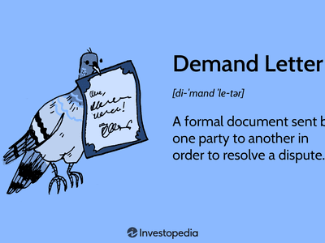

The world of trading has significantly transformed with the advent of modern technology, which has led to the widespread adoption of algorithmic trading. This approach has reshaped how trading is conducted, particularly by integrating computer programs that execute trades based on predefined criteria, thereby enhancing speed and efficiency in financial markets.

Decision-making in trading traditionally required a keen blend of judgment and strategy, involving analysis of market trends, risk tolerance, and investor sentiment. With algorithmic trading, this decision-making paradigm has been further enriched by technology, allowing for execution in the fast-paced and dynamic environment of the markets. Algorithms are designed to aid traders in making data-driven decisions, reducing human error, and enhancing trading effectiveness by executing thousands of orders at the speed of light.



Algorithmic trading, often referred to as algo trading, goes beyond mere execution. It involves a systematic and strategic process wherein complex algorithms analyze vast amounts of market data to identify profitable trading opportunities. These algorithms operate based on a set of predetermined criteria such as timing, price, quantity, and rule-based models. As the financial markets are increasingly driven by high-frequency trading, algo trading has become an essential tool for traders seeking competitive advantages.

This article seeks to explore various decision-making examples and the role of judgment in algorithmic trading. By examining different aspects of algo trading, including its methodologies and implications, it provides insights into how this technology-driven approach is shaping the landscape of the financial markets. Understanding the intricacies of algorithmic trading is crucial for traders to harness its full potential while effectively navigating the challenges it presents.

## Table of Contents

## Understanding Decision-Making in Trading

Decision-making in trading involves the meticulous analysis of market data to formulate well-informed investment choices. Traders must navigate a landscape where analytical judgment and emotional control are paramount. In traditional trading, decisions were heavily reliant on a trader's intuition and experience, which could sometimes lead to errors driven by emotional biases.

Algorithmic trading addresses this challenge by utilizing data-driven strategies to enhance decision-making processes. By analyzing large sets of market data, algorithms can identify potentially profitable trading opportunities without the influence of human emotions like fear or greed. This objectivity allows for more consistent and rational decision-making.

Human judgment remains crucial, especially in the design phase of trading algorithms. The initial development of an algorithm requires traders to apply their expertise, selecting relevant data inputs and defining rules and parameters that align with market conditions. For instance, choosing appropriate technical indicators or setting thresholds for buy and sell signals demands human discretion and insight. The effectiveness of these algorithms relies on a carefully judged balance between automated processes and strategic human oversight.

To illustrate, consider a simple moving average (SMA) crossover strategy, often used in [algorithmic trading](/wiki/algorithmic-trading). This strategy involves buying a security when a short-term moving average crosses above a long-term moving average and selling when the opposite occurs. The decision to select specific time frames for these averages is rooted in human judgment and can significantly influence the strategy's success. Here's a basic Python example to demonstrate the decision-making process in developing a trading strategy:

```python
import pandas as pd

def moving_average(data, window_size):
    return data.rolling(window=window_size).mean()

def trading_decision(prices, short_window, long_window):
    short_ma = moving_average(prices, short_window)
    long_ma = moving_average(prices, long_window)

    buy_signals = (short_ma > long_ma) & (short_ma.shift() <= long_ma.shift())
    sell_signals = (short_ma < long_ma) & (short_ma.shift() >= long_ma.shift())

    return buy_signals, sell_signals

# Example usage:
prices = pd.Series([/* prices data goes here */])
short_window = 10
long_window = 30
buy_signals, sell_signals = trading_decision(prices, short_window, long_window)
```

This code snippet demonstrates the integration of human judgment in selecting the short and long windows for an SMA crossover strategy, which can critically influence trading decisions based on observed market trends.

In summary, the decision-making process in trading is a delicate balance. While algorithmic trading offers a powerful tool to limit emotional biases and enhance efficiency, human judgment remains essential in crafting algorithms that are adaptable and responsive to dynamic market conditions.

## How Algorithmic Trading Works

Algorithmic trading automates the buying and selling of securities through predefined rules and algorithms. This system leverages sophisticated computer programs to execute trades swiftly, based on specific criteria such as timing, price, or quantity. By processing vast amounts of market data, these algorithms identify patterns and make rapid trading decisions that would be nearly impossible for human traders to achieve manually.

At the core of algorithmic trading is the ability to analyze large datasets efficiently. Algorithms scan various indicators and historical data to detect market trends and patterns. Once a pattern is spotted, the system automatically places buy or sell orders, capitalizing on the identified opportunity. The speed at which these trades occur is crucial, often measured in milliseconds, enabling traders to exploit short-lived market inefficiencies.

Backtesting is a critical component of algorithmic trading, providing assurance of an algorithm's effectiveness before its implementation in live markets. By simulating trading based on historical data, traders can evaluate the potential performance and risks of their strategies. For instance, using Python, a simple [backtesting](/wiki/backtesting) script might look like this:

```python
import pandas as pd

def backtest_strategy(data, strategy):
    results = []
    for i in range(1, len(data)):
        trade_signal = strategy(data.iloc[:i])
        if trade_signal == 'buy':
            entry_price = data['Close'][i]
        elif trade_signal == 'sell':
            exit_price = data['Close'][i]
            results.append(exit_price - entry_price)
    return sum(results)

def simple_moving_average_strategy(data):
    short_window = data['Close'].rolling(window=40).mean()
    long_window = data['Close'].rolling(window=100).mean()
    if short_window.iloc[-1] > long_window.iloc[-1]:
        return 'buy'
    elif short_window.iloc[-1] < long_window.iloc[-1]:
        return 'sell'

historical_data = pd.read_csv('historical_stock_data.csv')
profit = backtest_strategy(historical_data, simple_moving_average_strategy)
print(f"Total Profit: {profit}")
```

In addition to strategy validation through backtesting, effective algorithmic trading systems also encompass robust risk management measures. These measures are designed to protect against potential losses from market [volatility](/wiki/volatility-trading-strategies) or unforeseen events. Strategies include setting stop-loss orders, which automatically sell a security when its price falls below a predetermined level, and diversifying portfolios to spread risk across multiple assets.

In summary, algorithmic trading enhances trading efficiency by leveraging the power of data analysis and automation, ensuring that trades are executed at optimal times and prices while incorporating essential risk management strategies. This technological advancement allows traders to maintain a competitive edge in the fast-paced financial markets.

## Examples of Algorithmic Trading Strategies

Algorithmic trading strategies are diverse and strategic, harnessing complex algorithms to capitalize on market inefficiencies and trends. Here are some of the key strategies used in algorithmic trading:

### Momentum Strategy
The [momentum](/wiki/momentum) strategy hinges on the principle that securities which have performed well in the past will continue to perform well in the short term, and vice versa for those that have performed poorly. It involves the use of algorithms to buy assets that are trending upwards and to sell those that are trending downward. The momentum of a security can often be calculated using indicators like the Rate of Change (ROC) or the Relative Strength Index (RSI).

For example, an algorithm might look for stocks where the ROC has been positive for a sustained period, indicating an upward trend. The formula for ROC is:

$$

\text{ROC} = \frac{\text{Current Price} - \text{Price  N periods ago}}{\text{Price N periods ago}} \times 100 
$$

### Arbitrage Strategy
Arbitrage involves taking advantage of price discrepancies of the same asset across different markets or platforms. Algorithmic trading is particularly well-suited for [arbitrage](/wiki/arbitrage) strategies since speed is crucial for success. An arbitrage algorithm will monitor prices in multiple markets and execute trades when it detects price differences that exceed transaction costs.

For example, if a stock is trading at $100 on one exchange and $102 on another, an algorithm can buy the stock at the lower price and simultaneously sell at the higher price, pocketing the difference.

### Trend-Following Strategy
Trend-following strategies capitalize on the persistence of market trends. They involve trading in the direction of the trend and are often executed using indicators like moving averages. A common approach is the moving average crossover strategy, where a short-term moving average crosses above a long-term moving average, signaling a potential buy, or below, signaling a potential sell.

In Python, a simple moving average crossover can be programmed using libraries such as `pandas`:

```python
import pandas as pd

# Calculate short and long-term moving averages
data['short_mavg'] = data['close'].rolling(window=40, min_periods=1).mean()
data['long_mavg'] = data['close'].rolling(window=100, min_periods=1).mean()

# Determine buy and sell signals
data['signal'] = 0
data['signal'][40:] = np.where(data['short_mavg'][40:] > data['long_mavg'][40:], 1, 0)
data['positions'] = data['signal'].diff()
```

### Market-Making Algorithms
Market-making algorithms enhance [liquidity](/wiki/liquidity-risk-premium) in the market by consistently offering buy and sell prices. This dual quoting ensures that there is always a market for certain securities. Market makers earn profits through the bid-ask spread—the difference between the price buyers are willing to pay and the price sellers are willing to accept.

These algorithms must be finely tuned to respond to market conditions to minimize inventory risk and ensure robust bid-ask spreads. They adjust their quotes in real-time to maintain balanced order [books](/wiki/algo-trading-books) while capturing favorable prices.

In summary, algorithmic trading strategies integrate sophisticated methodologies to systematically exploit market patterns. Each strategy suits different market conditions and risk appetites, showcasing the adaptability and computational power intrinsic to algorithmic trading.

## The Judgment Aspect in Algorithmic Trading

Algorithmic trading relies heavily on predefined rules and computer algorithms to execute trades efficiently, but the role of human judgment remains pivotal in crafting and refining these systems. Traders leverage their expertise in selecting appropriate data and setting parameters that align with their strategic goals. This involves making informed decisions about which datasets and indicators offer the most predictive value and how they will be utilized to devise a robust algorithm.

Moreover, market conditions are in constant flux, necessitating the dynamic adjustment of strategies. Traders employ judgment to fine-tune algorithms based on current market volatility, economic news, or unexpected geopolitical events. This may involve altering stop-loss levels, adjusting the weight given to certain indicators, or even pausing automated trading during extraordinary market conditions.

The blend of systematic, data-driven decisions with judgment-based inputs is crucial. While algorithms provide the speed and precision necessary for high-frequency trading, human judgment ensures these systems remain aligned with broader market insights and strategic objectives. For instance, an algorithm may identify a [statistical arbitrage](/wiki/statistical-arbitrage) opportunity; however, it's the trader's judgment that assesses additional factors like regulatory considerations or liquidity constraints before executing the trade.

Despite the autonomy of algorithmic systems, their foundation relies on human decision-making. This relationship underscores the necessity for ongoing evaluation and adaptation of algorithms to maintain their effectiveness in various market scenarios. Ultimately, the success of algorithmic trading is determined by how skillfully traders can integrate empirical data with their insights and experience to craft strategies that are both resilient and adaptive.

## Advantages and Challenges of Algorithmic Trading

Algorithmic trading presents several advantages that make it an attractive tool for modern traders. The primary advantage is speed, as algorithms can execute trades in milliseconds, far surpassing human capabilities. This rapid execution allows traders to capitalize on fleeting market opportunities. Efficiency is another key benefit; algorithms can process vast amounts of market data and perform complex calculations quickly, enabling traders to evaluate multiple variables simultaneously.

Reduced emotional bias is a significant advantage of algorithmic trading. Emotions such as fear and greed often influence human traders, leading to irrational decisions. Algorithms operate based on pre-set criteria, ensuring a consistent, emotion-free approach to trading. This leads to enhanced accuracy in executing trades as decisions are driven by data and logic rather than emotional impulses.

Despite these advantages, algorithmic trading also faces challenges. Technical failures pose a risk; system glitches or connectivity issues can lead to unintended trades or missed opportunities. Additionally, algorithmic trading is subject to regulatory risks. Financial authorities continue to evolve regulations to prevent market manipulation and ensure fair trading practices, which can impact how algorithms operate.

The reliance on historical data is another challenge. While backtesting using historical data is crucial for validating algorithms, markets can change rapidly, making past data less predictive of future conditions. Over-reliance on such data may result in suboptimal trading decisions when market dynamics shift unexpectedly. Thus, while algorithmic trading offers numerous benefits, traders must be vigilant in addressing its inherent challenges to optimize their strategies effectively.

## Conclusion

Algorithmic trading revolutionizes decision-making in financial markets by combining sophisticated technology with strategic judgment. As algorithms take on the intricate task of analyzing vast datasets and executing trades with precision, they introduce a paradigm shift that enhances efficiency and speed. This technology-driven approach minimizes the human emotional bias often associated with trading, enabling more objective and consistent decision-making.

Understanding the nuances of algorithmic trading is crucial for traders aiming for success. It is not enough to rely solely on algorithms' capabilities; recognizing both strengths and limitations is essential. While algorithms can process data faster and manage complex trading strategies effectively, they also depend on the quality of data and the robustness of the underlying models. It's imperative to acknowledge the risk of overfitting to historical data, a common pitfall where models perform well on past data but fail under new market conditions. Hence, continuous monitoring and model adjustment are necessary to ensure sustained performance.

Moreover, traders must remain vigilant and adaptive to leverage the full potential of algorithmic trading efficiently. The dynamic nature of financial markets demands a blend of technological proficiency and strategic foresight. Traders should be prepared to revise their strategies based on market developments and technological advancements. Python, for instance, is a powerful tool in the algorithmic trading arsenal, offering rich libraries for data analysis, backtesting, and real-time execution. Here is a simple Python snippet illustrating how one could calculate a moving average, a common component in many trading algorithms:

```python
import pandas as pd

# Assuming 'data' is a pandas DataFrame with a 'close' column
data['moving_average'] = data['close'].rolling(window=20).mean()
```

In conclusion, the integration of technology and strategic judgment through algorithmic trading is a redefining force in financial markets. However, success in this field requires a comprehensive understanding of algorithmic systems and a proactive approach to adapting strategies. By doing so, traders can harness the transformative power of algorithmic trading to achieve optimal results.

## References & Further Reading

[1]: Bergstra, J., Bardenet, R., Bengio, Y., & Kégl, B. (2011). ["Algorithms for Hyper-Parameter Optimization."](https://papers.nips.cc/paper/4443-algorithms-for-hyper-parameter-optimization) Advances in Neural Information Processing Systems 24.

[2]: ["Advances in Financial Machine Learning"](https://www.amazon.com/Advances-Financial-Machine-Learning-Marcos/dp/1119482089) by Marcos Lopez de Prado

[3]: ["Evidence-Based Technical Analysis: Applying the Scientific Method and Statistical Inference to Trading Signals"](https://www.amazon.com/Evidence-Based-Technical-Analysis-Scientific-Statistical/dp/0470008741) by David Aronson

[4]: ["Machine Learning for Algorithmic Trading"](https://github.com/stefan-jansen/machine-learning-for-trading) by Stefan Jansen

[5]: ["Quantitative Trading: How to Build Your Own Algorithmic Trading Business"](https://www.amazon.com/Quantitative-Trading-Build-Algorithmic-Business/dp/1119800064) by Ernest P. Chan