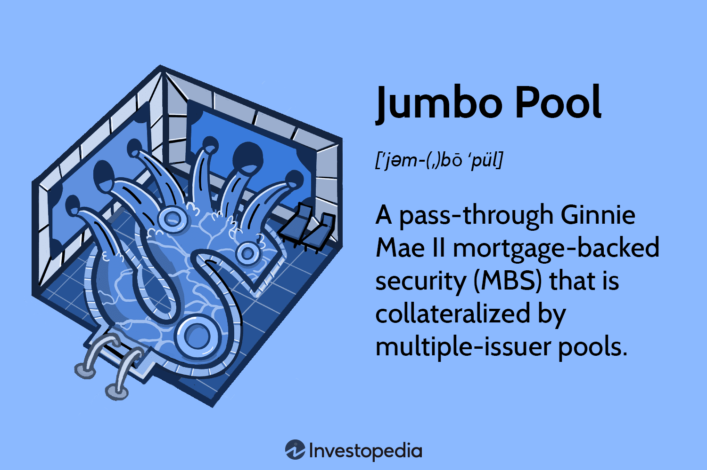

## Table of Contents

## What is a Jumbo Pool?

A Jumbo Pool is a type of swimming pool that is much larger than a regular pool. It is often found in places like hotels, water parks, or big homes. People like Jumbo Pools because they have more space to swim and play games in the water.

These pools can have special features like diving boards, slides, and even small islands in the middle. Because they are so big, they can be used for big events like pool parties or swimming competitions. Keeping a Jumbo Pool clean and safe takes more work than with a smaller pool, but the fun and space they offer make them popular.

## How does a Jumbo Pool differ from a regular investment pool?

A Jumbo Pool is a big swimming pool used for fun and swimming, while a regular investment pool is a way to put money together with other people to invest. A Jumbo Pool is filled with water and might have slides or diving boards. It's great for parties or swimming races. On the other hand, an investment pool collects money from many people to buy things like stocks or bonds. The goal is to make more money for everyone who put money in.

The main difference is what they are used for. A Jumbo Pool is for swimming and having a good time, so it's found in places like hotels or big homes. An investment pool is about making money grow, so it's managed by financial experts who decide where to invest the money. While a Jumbo Pool needs care to keep the water clean and safe, an investment pool needs careful watching to make sure the investments are doing well.

## What are the minimum investment requirements for a Jumbo Pool?

A Jumbo Pool is a big swimming pool, not something you invest money in like stocks or bonds. So, there are no minimum investment requirements for a Jumbo Pool because it's not an investment. If you want to build or use a Jumbo Pool, you need to think about the cost of building it, keeping it clean, and making sure it's safe.

For example, if you want to build a Jumbo Pool at your home or a hotel, you need to pay for things like digging a hole, buying materials, and hiring workers. After it's built, you'll need money for chemicals to keep the water clean, electricity to run the pumps, and maybe lifeguards to keep people safe. But again, this is not an investment like putting money into a fund; it's more like buying a big, fun thing for swimming.

## What are the potential benefits of investing in a Jumbo Pool?

Investing in a Jumbo Pool can bring a lot of fun and enjoyment. If you own a hotel or a big house, a Jumbo Pool can make your place more attractive to people. They might choose to stay at your hotel or visit your home because they can swim and play in the big pool. It's like having a small water park right where you are. People can have pool parties, swim races, or just relax in the water, making everyone happy and wanting to come back.

Also, a Jumbo Pool can make you money. If you charge people to use the pool, like at a water park or a hotel, you can earn money from the people who come to swim. Plus, if you have a big event like a swimming competition, you can make money from people who pay to watch or join in. Even though it costs a lot to build and take care of a Jumbo Pool, the fun and money it can bring might make it a good choice for some people.

## Can you explain the diversification benefits of a Jumbo Pool?

A Jumbo Pool can help you spread out your fun and activities. Instead of just having a small pool where you can only swim laps, a Jumbo Pool lets you do more things. You can have pool parties, play water games, or even set up swimming races. This means you're not just limited to one kind of fun; you can mix it up and keep things exciting for everyone who uses the pool.

Also, if you own a business like a hotel or a resort, a Jumbo Pool can attract different kinds of people. Some might come just to relax by the pool, while others might enjoy the thrill of water slides or diving boards. By offering all these different activities, you can appeal to a wider range of guests, which can help your business grow. So, a Jumbo Pool can be a way to diversify not just the fun, but also the people who come to enjoy it.

## What are the risks associated with investing in a Jumbo Pool?

Investing in a Jumbo Pool can be risky because it costs a lot of money to build and take care of. You need to pay for things like digging the hole, buying materials, and hiring workers to build it. After it's built, you have to keep spending money on chemicals to keep the water clean, electricity to run the pumps, and maybe lifeguards to keep people safe. If you don't have enough money to cover these costs, the Jumbo Pool might become a big problem instead of a fun place to swim.

Another risk is that not enough people might want to use the Jumbo Pool. If you build it hoping to attract lots of people to your hotel or water park, but they don't come, you won't make enough money to cover your costs. Plus, big pools can be dangerous if they're not looked after properly. If someone gets hurt or sick because the pool isn't safe, you could face legal problems and have to pay a lot of money. So, it's important to think carefully about these risks before deciding to invest in a Jumbo Pool.

## How does liquidity in a Jumbo Pool compare to other investment options?

A Jumbo Pool is not like other investments where you can easily turn your money into cash. If you put money into a Jumbo Pool, it's like buying a big, fun thing that you can't sell quickly. You can't just take your money out whenever you want because the pool is a physical thing that takes time and effort to sell. So, a Jumbo Pool has very low [liquidity](/wiki/liquidity-risk-premium) compared to other investments like stocks or bonds, where you can usually sell your investment and get your money back much faster.

On the other hand, investments like stocks or savings accounts are much more liquid. With stocks, you can sell them on the stock market and get your money back in a few days. Savings accounts are even easier because you can take out your money anytime you need it. These options give you the flexibility to use your money when you need it, which is something you don't get with a Jumbo Pool. So, if you need your money to be available quickly, a Jumbo Pool is not a good choice.

## What are the management fees and costs associated with a Jumbo Pool?

When you have a Jumbo Pool, you need to pay for things to keep it running smoothly. There are no special management fees like you might find with investment funds, but you will have to spend money on maintenance. This includes buying chemicals to keep the water clean, paying for electricity to run the pool's pumps and lights, and maybe hiring lifeguards to make sure everyone is safe. If you have a big event or party at the pool, you might also need to pay for extra staff to help out.

Besides the regular costs, you might need to pay for repairs if something breaks, like a pump or a slide. These unexpected costs can add up and be expensive. It's important to think about all these costs before deciding to get a Jumbo Pool because they can be a lot of money, and you need to make sure you can afford to keep the pool in good shape.

## How do regulatory requirements impact Jumbo Pools?

Regulatory requirements can have a big impact on Jumbo Pools. These rules are made by the government to make sure pools are safe and clean for everyone. For example, there might be rules about how often you need to check the water's chemicals, how many lifeguards you need, and what kind of safety equipment you must have. If you don't follow these rules, you could get in trouble and have to pay fines or even close the pool.

These regulations can also make it more expensive to run a Jumbo Pool. You might need to spend money on special training for your staff, buy certain safety gear, or do regular inspections. All these things add to the cost of keeping the pool open. But, following the rules helps keep people safe and can make your pool more popular because people know it's a safe place to swim.

## What historical performance data is available for Jumbo Pools?

There isn't a lot of historical performance data for Jumbo Pools in the same way we track data for stocks or other investments. This is because Jumbo Pools are big swimming pools, not financial investments. They are used for fun and swimming, so we don't usually keep track of how well they do over time in a financial sense. Instead, people might look at how popular the pool is, how much it costs to keep it running, and if it brings in more visitors to a place like a hotel or water park.

However, if you own a business with a Jumbo Pool, you might keep track of things like how many people use the pool each year, how much money it costs to maintain, and how much extra money it brings in from visitors. This kind of information can help you see if the pool is worth the money you spend on it. But this data is more about running a business than about investing money to make more money.

## How can an investor assess the suitability of a Jumbo Pool for their portfolio?

An investor needs to think about what they want from their investments before deciding if a Jumbo Pool fits in their portfolio. A Jumbo Pool is not like stocks or bonds; it's more like buying a big, fun thing for swimming. It won't give you money back quickly like other investments, and it needs a lot of money to build and take care of. So, if you're looking for something that can make you money fast or be turned into cash easily, a Jumbo Pool is not a good choice. But if you own a hotel or a big house and want to attract more people, a Jumbo Pool might be a good way to do that.

Also, think about how much money you can spend and if you can handle the costs of keeping the pool safe and clean. A Jumbo Pool can bring in more visitors and make your place more fun, but it also needs a lot of work and money to keep it running well. If you're okay with spending money on something that might not give you a direct financial return but can make your business or home more enjoyable, then a Jumbo Pool could be a good fit. Just make sure you understand all the costs and risks before you decide to invest in one.

## What advanced strategies can be employed to mitigate risks in a Jumbo Pool?

To lower the risks of having a Jumbo Pool, you can use some smart strategies. One way is to make sure you have enough money saved up for unexpected costs. Things like broken pumps or slides can be expensive to fix, so having a special fund just for the pool can help you handle these surprises without too much stress. Another good idea is to buy insurance that covers pool-related problems. This can protect you from big bills if someone gets hurt or if the pool needs a big repair. Also, think about how you can use the pool to make money, like charging people to use it or hosting events. This can help cover the costs of keeping the pool running.

Another strategy is to keep a close eye on the pool's safety and cleanliness. Make sure you follow all the rules set by the government to keep the water clean and safe for swimmers. Regular checks and maintenance can stop small problems from turning into big ones. It's also a good idea to train your staff well, so they know how to keep the pool safe and handle any emergencies. By being careful and prepared, you can enjoy the fun of a Jumbo Pool while keeping the risks under control.

## What are the financial benefits of Jumbo Pools?

Jumbo pools are an attractive investment vehicle due to their inherent diversification advantages. By aggregating loans from multiple issuers across various geographic regions, jumbo pools mitigate risks typically associated with investments concentrated in a single location or issuer. This geographical and issuer-based diversification provides a buffer against localized economic downturns, thereby enhancing the predictability of returns for investors. For instance, if a particular region experiences an economic slowdown, the impact on the overall pool is minimized because the loans are diversified across other regions with potentially healthier economic conditions.

Another significant financial benefit of jumbo pools is the government backing provided, particularly in the case of Ginnie Mae mortgage-backed securities. This government guarantee ensures that investors receive timely payments of principal and interest, even if the mortgage holders default. Such backing considerably reduces credit risk, making these securities particularly appealing to conservative investors seeking safety in their investment portfolios. The reduced risk level, due to government support, often makes jumbo pools a preferred choice for risk-averse investors aiming for a steady income stream.

Furthermore, jumbo pools contribute to portfolio stability by spreading risks across a wide array of underlying loans. This risk distribution reduces the overall risk profile of an investor's portfolio. In quantitative terms, the calculation of a portfolio's risk can often be expressed using the standard deviation of returns. The diversification effect can be captured by the formula for the variance of a diversified portfolio:

$$
\sigma^2_p = \sum_{i=1}^{N} w_i^2 \sigma_i^2 + \sum_{i=1}^{N} \sum_{j=1, j \neq i}^{N} w_i w_j \sigma_i \sigma_j \rho_{i,j}
$$

where:
- $\sigma^2_p$ is the variance of the portfolio,
- $w_i$ and $w_j$ are the weights of the different assets in the portfolio,
- $\sigma_i$ and $\sigma_j$ are the standard deviations of the individual assets,
- $\rho_{i,j}$ is the correlation coefficient between assets.

In the context of jumbo pools, the diversification effects help in reducing the effective correlation ($\rho_{i,j}$) among assets, thus stabilizing the portfolio's risk. This stability is especially valuable in volatile market conditions, providing investors with confidence in the steadiness of their investment returns.

Overall, the diversification benefits and government backing make jumbo pools an effective tool for risk reduction and stability in investment portfolios, particularly appealing to those wishing to mitigate exposure to specific local or issuer-based financial fluctuations.

## References & Further Reading

[1]: ["Mortgage-Backed Securities: Products, Analytics, and Risk"](https://www.bankrate.com/mortgages/what-are-mortgage-backed-securities/) by Frank J. Fabozzi

[2]: ["Handbook of Mortgage-Backed Securities"](https://www.amazon.com/Handbook-Mortgage-Backed-Securities-7th/dp/0198785771) by Frank J. Fabozzi

[3]: ["Algorithmic Trading: Winning Strategies and Their Rationale"](https://www.wiley.com/en-us/Algorithmic+Trading%3A+Winning+Strategies+and+Their+Rationale-p-9781118460146) by Ernest P. Chan

[4]: ["High-Frequency Trading: A Practical Guide to Algorithmic Strategies and Trading Systems"](https://www.ahmetbeyefendi.com/wp-content/uploads/2020/07/High-Frequency-Trading-Irene-Aldridge.pdf) by Irene Aldridge

[5]: ["The Basics of Algorithmic Trading: Concepts and Examples"](https://www.investopedia.com/articles/active-trading/101014/basics-algorithmic-trading-concepts-and-examples.asp) by John F. Ehlers