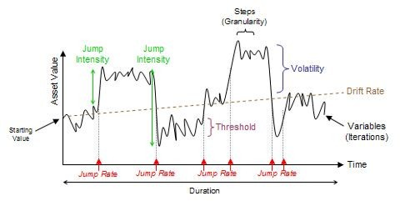

## Table of Contents

## What is a jump-diffusion model?

A jump-diffusion model is a way to describe how the price of something, like a stock, can change over time. It combines two ideas: regular, small changes (diffusion) and sudden, big changes (jumps). Imagine a stock price moving smoothly up and down most of the time, but every now and then, it suddenly jumps to a new level because of big news or events.

This model is useful because it can capture the reality of financial markets better than models that only look at smooth changes. In real life, stock prices can have quiet periods with small ups and downs, but they can also suddenly jump due to unexpected news, like a company announcing big profits or a new law affecting the industry. By including both types of changes, the jump-diffusion model helps people make better predictions and manage risks in the stock market.

## How does a jump-diffusion model differ from a standard diffusion model?

A jump-diffusion model and a standard diffusion model both try to explain how prices change over time, but they do it in different ways. A standard diffusion model, like the one used in the famous Black-Scholes model, assumes that prices change smoothly and continuously. It's like watching a boat gently rocking on calm water. The changes are small and predictable, based on a normal distribution, and the model works well when the market is stable.

On the other hand, a jump-diffusion model adds an extra layer to this by including the possibility of sudden, big changes in price. Imagine you're still watching that boat, but now a big wave can come out of nowhere and make the boat jump. These jumps can happen because of unexpected news or events, like a company suddenly announcing a big merger or a natural disaster affecting a whole industry. By including these jumps, the model can better capture the ups and downs that we see in real markets, making it more useful for understanding and predicting price movements in situations where sudden changes are common.

## What are the key components of a jump-diffusion model?

A jump-diffusion model has two main parts: diffusion and jumps. The diffusion part is like the regular, small ups and downs you see in prices every day. It's based on a normal distribution, which means the changes are predictable and smooth, like a boat gently rocking on calm water. This part helps explain the everyday movements in the market.

The second part, jumps, is what makes this model different. Jumps are sudden, big changes in price that can happen because of unexpected news or events. Imagine a big wave hitting the boat and making it jump. These jumps can be positive or negative and are often modeled using a Poisson process, which helps predict how often these jumps might happen. By adding jumps to the regular diffusion, the model can better capture the real ups and downs we see in markets, especially when big changes happen out of the blue.

## Can you explain the mathematical formulation of a jump-diffusion model?

A jump-diffusion model can be described using a mathematical formula that combines two parts: diffusion and jumps. The diffusion part is modeled with a stochastic differential equation (SDE) that looks a lot like the one used in the Black-Scholes model. This equation describes how the price of something, like a stock, changes smoothly over time. It uses a term called "Brownian motion" to represent the small, random ups and downs that happen every day. The equation for this part might look like: dS = μSdt + σSdW, where S is the price, μ is the average rate of return, σ is the [volatility](/wiki/volatility-trading-strategies), and dW is the change in Brownian motion.

The jump part is added to this equation to account for sudden, big changes in the price. These jumps are often modeled using a Poisson process, which helps predict how often these jumps might happen. Each jump can be thought of as a random variable with its own distribution, often a log-normal distribution, which describes how big the jump might be. When a jump happens, it changes the price by a [factor](/wiki/factor-investing) that comes from this distribution. The full jump-diffusion model equation then becomes: dS = μSdt + σSdW + SdJ, where dJ represents the jump part. This equation shows how the price changes over time with both the smooth diffusion part and the sudden jumps.

## What types of jumps can be included in a jump-diffusion model?

In a jump-diffusion model, jumps can be of different types, depending on what the model is trying to capture. One common type of jump is called a "log-normal jump." This means that when a jump happens, the size of the jump follows a log-normal distribution. Think of it like this: if a stock price suddenly jumps, the jump could be big or small, but it's more likely to be a certain size. This type of jump is useful because it can show how big events, like a company announcing big news, can cause the price to suddenly go up or down.

Another type of jump is a "Poisson jump," which focuses on how often jumps happen. Imagine you're watching a stock price and you want to know how many times it might suddenly jump in a day or a week. A Poisson jump helps predict this. It's like counting the number of big waves that might hit a boat in a certain amount of time. By using Poisson jumps, the model can better predict when these sudden changes might happen, which is important for understanding and managing risks in the market.

## How are jump-diffusion models used in financial markets?

Jump-diffusion models are used in financial markets to help people understand and predict how prices might change. Imagine you're trying to guess how a stock's price will move. A regular model might only look at the small, everyday ups and downs, but a jump-diffusion model also includes the possibility of big, sudden changes. This is important because in real life, things like unexpected news or big events can make prices jump a lot. By using a jump-diffusion model, traders and investors can get a better picture of what might happen and make smarter decisions.

These models are especially useful for pricing options, which are financial contracts that give the buyer the right to buy or sell an asset at a set price. Because options can be affected a lot by sudden price changes, a jump-diffusion model can give a more accurate price for them. For example, if a company is about to announce earnings, the stock price might jump a lot, and this model can help predict how that might affect the option's price. By understanding these sudden changes, people in the financial markets can better manage their risks and plan their investments more effectively.

## What are the advantages of using jump-diffusion models over other models?

Jump-diffusion models have some big advantages over other models because they can show both the regular small changes and the big, sudden jumps in prices. In real life, stock prices don't just move smoothly up and down. Sometimes, they can jump a lot because of big news or events. Other models, like the Black-Scholes model, only look at the smooth changes and can miss these big jumps. By including jumps, jump-diffusion models give a more complete picture of what might happen in the market, which helps people make better guesses about future prices.

This makes jump-diffusion models especially useful for things like pricing options. Options can be affected a lot by sudden price changes, so a model that can show these jumps can give a more accurate price for them. For example, if a company is about to announce earnings, the stock price might jump a lot, and this model can help predict how that might affect the option's price. By understanding these sudden changes, people in the financial markets can better manage their risks and plan their investments more effectively.

## What are the limitations or challenges of implementing jump-diffusion models?

One big challenge of using jump-diffusion models is that they are more complicated than simpler models like the Black-Scholes model. Because they include both regular small changes and sudden big jumps, they need more math and computer power to work right. This can make them harder to use and understand, especially for people who are new to these kinds of models. Also, figuring out the right numbers to use in the model, like how often jumps might happen or how big they might be, can be tricky. If these numbers are wrong, the model won't give good predictions.

Another challenge is that jump-diffusion models can be hard to test and check. In the real world, it's not always clear when a jump happens or how big it is. This makes it tough to see if the model is working well or if it needs to be changed. Plus, because these models are trying to predict things that are hard to predict, like sudden big changes in the market, they might not always get it right. Even with all their advantages, jump-diffusion models can still miss some things, and people using them need to be careful and keep an eye on how well they're working.

## How can one estimate the parameters of a jump-diffusion model?

Estimating the parameters of a jump-diffusion model means figuring out numbers like how often jumps might happen and how big they might be. One way to do this is by looking at past data on prices. You can use methods like maximum likelihood estimation, where you try different numbers until you find the ones that make the model fit the past data the best. Another way is to use a method called the method of moments, where you match the model's predictions to things you see in the data, like how often prices jump or how big those jumps are.

Another approach is to use simulation methods, like the Monte Carlo method. This involves running the model many times with different numbers to see which ones give results that look most like what happened in the past. This can be helpful because it lets you test lots of different possibilities. No matter which method you use, it's important to keep checking and updating the numbers as new data comes in, because the market can change over time.

## What are some real-world applications of jump-diffusion models?

Jump-diffusion models are used a lot in the world of finance, especially when people need to figure out the price of options. Options are like bets on whether a stock's price will go up or down. These models help because they can show both the small, everyday changes in the stock's price and the big, sudden jumps that can happen because of news or big events. For example, if a company is about to announce its earnings, a jump-diffusion model can help predict how the stock's price might jump and how that would affect the option's price. This makes it easier for traders and investors to make smart choices and manage their risks better.

Another real-world use of jump-diffusion models is in risk management for financial institutions. Banks and other big money companies need to know how much risk they are taking on when they invest in stocks or other things. Jump-diffusion models help them understand that risk better because they can show what might happen if there's a sudden big change in the market. By using these models, these companies can plan for the worst and make sure they're ready for any big surprises. This helps them keep their money safe and make better decisions about where to invest.

## How do jump-diffusion models handle extreme events or market crashes?

Jump-diffusion models are good at handling extreme events or market crashes because they can show both the small, everyday changes in prices and the big, sudden jumps that can happen. Imagine you're watching the stock market, and it's usually calm with small ups and downs. But then, out of nowhere, there's big news like a company going bankrupt or a global crisis, and the prices suddenly drop a lot. A jump-diffusion model can include these big jumps, so it's better at predicting what might happen during a market crash.

By including these jumps, the model helps people in finance understand and prepare for extreme events. For example, if there's a chance of a big market drop, the model can show how that might affect the prices of stocks or options. This helps traders and investors make plans to protect their money and be ready for big changes. While no model can predict everything perfectly, jump-diffusion models give a more complete picture of what might happen, which is really helpful during times when the market can be unpredictable and risky.

## What advanced techniques can be used to improve the accuracy of jump-diffusion models?

One way to make jump-diffusion models more accurate is by using something called "calibration." This means adjusting the numbers in the model to match what we see in the real world. For example, if we see that big jumps in stock prices happen more often than the model says, we can change the model to make it fit better. Another technique is to use "[machine learning](/wiki/machine-learning)." This is like teaching the model to learn from past data and get better at predicting future jumps. By using lots of data and smart math, machine learning can help the model be more accurate and adapt to changes in the market.

Another advanced technique is called "stochastic volatility." This means that the model can change how much the prices move around over time. In real life, the market can be calm one day and wild the next, and this technique helps the model show that. By including stochastic volatility, the model can better capture the ups and downs we see in the market, especially during big events or crashes. These advanced techniques can make jump-diffusion models more useful and reliable for people trying to understand and predict what might happen in the financial markets.

## What are Jump-Diffusion Models and how can they be understood?

Jump-diffusion models effectively combine the continuous nature of standard diffusion processes with the discrete nature of jump processes to model asset price movements. The standard diffusion process is typically represented by Brownian motion, which captures the normal, continuous fluctuations of asset prices over time. These fluctuations are characterized by the stochastic differential equation (SDE) for the diffusion process:

$$

dS_t = \mu S_t dt + \sigma S_t dW_t 
$$

where $S_t$ denotes the asset price at time $t$, $\mu$ is the drift rate, $\sigma$ represents the volatility, and $dW_t$ is the Wiener process representing Brownian motion increments.

However, real financial markets often exhibit abrupt price changes, such as those caused by sudden news events or macroeconomic shocks, which cannot be adequately captured by Brownian motion alone. To address this, jump-diffusion models incorporate a jump process, frequently modeled by a Poisson process. The jump component adds stochastic jumps at random times to the model:

$$

dS_t = \mu S_t dt + \sigma S_t dW_t + J_t dN_t 
$$

where $J_t$ represents the percentage change in the asset price during a jump, and $dN_t$ is the increment of a Poisson process with intensity $\lambda$, representing the average rate of jumps per unit time.

The advantage of combining these processes lies in the model's ability to capture the 'heavy tails' and 'skewness' observed in the distribution of financial returns. In traditional models assuming normal distribution of returns, such skewness and kurtosis are not accurately reflected. However, the jump-diffusion approach accommodates these features, providing a more accurate risk representation. This is crucial in risk management and pricing of financial derivatives, where the tails of the distribution significantly influence pricing and hedging strategies.

By effectively addressing both continuous market fluctuations and discrete, abrupt changes, jump-diffusion models offer a more nuanced understanding of asset price dynamics. This enhanced modeling capability is invaluable for traders and risk managers who need to account for both typical market behavior and extraordinary events that can drastically affect asset prices.

## What is the Mathematical Formulation?

The mathematical formulation of jump-diffusion models is an integration of a diffusion process and a jump process, providing a comprehensive approach to modeling financial asset dynamics. The diffusion component is typically represented by a stochastic differential equation (SDE) driven by Brownian motion. This component is responsible for capturing the continuous and gradual fluctuations in asset prices. The general form of the SDE for a diffusion process is expressed as:

$$

dS_t = \mu S_t dt + \sigma S_t dW_t 
$$

where $S_t$ is the asset price at time $t$, $\mu$ is the drift coefficient, $\sigma$ is the volatility, and $dW_t$ is the increment of a Wiener process or Brownian motion.

To account for sudden and unpredictable jumps in asset prices, a Poisson process is incorporated into the model. This process introduces discontinuities that align with dramatic market movements, which are not captured by simple diffusion. The jump component can be mathematically described by introducing a Poisson jump process $J_t$, which represents the size and frequency of the jumps:

$$

dS_t = \mu S_t dt + \sigma S_t dW_t + \kappa S_t dN_t 
$$

In this expression, $dN_t$ is a Poisson process with intensity $\lambda$, indicating the average rate of jumps per unit time, and $\kappa$ represents the average relative jump size. The Poisson process is characterized by:

$$

P(\Delta N_t = 1) = \lambda \Delta t + o(\Delta t) 
$$

$$

P(\Delta N_t = 0) = 1 - \lambda \Delta t + o(\Delta t) 
$$

where $\Delta t$ is a small time increment. When a jump event occurs in $\Delta t$, $\Delta N_t$ equals 1; otherwise, it equals 0, indicating the absence of a jump.

The complete jump-diffusion model effectively integrates the continuous SDE and the Poisson jump process as follows:

$$

dS_t = \mu S_t dt + \sigma S_t dW_t + S_t (e^Y - 1) dN_t
$$

where $Y$ is the random variable describing the logarithmic jump size, typically modeled with a normal distribution. The inclusion of the exponential term $e^Y - 1$ ensures that the jump process accurately reflects the multiplicative nature of asset price changes.

In practice, numerical methods such as the Euler-Maruyama scheme or more sophisticated methods like the Milstein scheme are employed to simulate paths from the jump-diffusion model, enabling practitioners to analyze and predict asset dynamics under this framework.

## What are the applications in algorithmic trading?

Jump-diffusion models are instrumental in formulating robust [algorithmic trading](/wiki/algorithmic-trading) strategies, particularly where rapid adaptation to sudden and extreme market movements is required. These models are adept at capturing the discontinuities in asset prices, which are often overlooked by traditional continuous models. As a result, they address the limitations associated with purely diffusion-based processes, recognizing the importance of integrating jumps to accurately model financial asset behaviors.

In the context of high-frequency trading ([HFT](/wiki/high-frequency-trading-strategies)), jump-diffusion models play a critical role. HFT strategies often rely on exploiting small [arbitrage](/wiki/arbitrage) opportunities that can occur within milliseconds. Such strategies demand a nuanced understanding of both regular price movements and irregular, sudden jumps. Incorporating jump risks into HFT strategies allows traders to better anticipate and hedge against unexpected market shifts, enhancing both the profitability and risk management of trading portfolios.

Current applications of jump-diffusion models in algorithmic trading are heavily driven by empirical research and make extensive use of advanced computational techniques. These techniques enable the real-time modeling and prediction of asset price behaviors. The integration of jump components into predictive models provides a more comprehensive framework for understanding market dynamics.

For example, given an asset price $S_t$, a basic jump-diffusion model can be described by the following stochastic differential equation:

$$
dS_t = (\mu - \lambda k) S_t dt + \sigma S_t dW_t + J_t S_t dN_t
$$

where $\mu$ is the drift rate, $\sigma$ is the volatility, $dW_t$ is the standard Brownian motion, $J_t$ represents the jump size, $dN_t$ is a Poisson jump process with intensity $\lambda$, and $k$ is the expected jump size. The term $\lambda k$ adjusts the drift to account for the presence of jumps. Computational methods must efficiently estimate these parameters to effectively simulate and predict price behavior.

Python and other programming languages are commonly used to implement these models within algorithmic trading systems. For instance, leveraging libraries like NumPy and SciPy, traders can simulate the impact of different parameter configurations on asset price paths and optimize their strategies accordingly. The following Python snippet demonstrates a basic structure for simulating a jump-diffusion process:

```python
import numpy as np

def simulate_jump_diffusion(S0, mu, sigma, lambda_, k, T, dt):
    num_steps = int(T / dt)
    S = np.zeros(num_steps)
    S[0] = S0

    for t in range(1, num_steps):
        # Simulate diffusion component
        dW = np.random.normal(0, np.sqrt(dt))
        diffusion = (mu - lambda_ * k) * S[t-1] * dt + sigma * S[t-1] * dW

        # Simulate jump component
        jump = 0
        if np.random.poisson(lambda_ * dt) > 0:
            jump = S[t-1] * np.random.normal(k, sigma)

        # Update price
        S[t] = S[t-1] + diffusion + jump

    return S

# Example usage
simulate_jump_diffusion(S0=100, mu=0.05, sigma=0.2, lambda_=0.1, k=0.01, T=1, dt=0.01)
```

Overall, the effective use of jump-diffusion models in algorithmic trading strategies requires careful calibration of parameters and the implementation of efficient computational algorithms. These efforts enhance the capacity of trading systems to capture complex market phenomena and improve decision-making processes in volatile trading environments.

## References & Further Reading

[1]: Merton, R. C. (1976). ["Option pricing when underlying stock returns are discontinuous."](https://www.sciencedirect.com/science/article/pii/0304405X76900222)90029-4) Journal of Financial Economics, 3(1-2), 125-144.

[2]: Kou, S. G. (2002). ["A Jump-Diffusion Model for Option Pricing."](https://www.jstor.org/stable/822677) Management Science, 48(8), 1086-1101.

[3]: Bates, D. S. (1996). ["Jumps and Stochastic Volatility: Exchange Rate Processes Implicit in Deutsche Mark Options."](https://academic.oup.com/rfs/article-abstract/9/1/69/1583938) The Review of Financial Studies, 9(1), 69-107.

[4]: Cont, R., & Tankov, P. (2004). ["Financial Modelling with Jump Processes."](https://academic.oup.com/jrsssa/article/168/1/250/7084125) CRC Press.

[5]: Andersen, L., & Andreasen, J. (2000). ["Jump-Diffusion Processes: Volatility Smile Fitting and Numerical Methods for Option Pricing."](https://link.springer.com/article/10.1023/A:1011354913068) The Journal of Finance, 55(3), 1299-1339.

[6]: Pan, J. (2002). ["The Jump-Risk Premia Implicit in Options: Evidence from an Integrated Time-Series Study."](https://www.sciencedirect.com/science/article/pii/S0304405X01000885) The Review of Financial Studies, 15(5), 1219-1257.