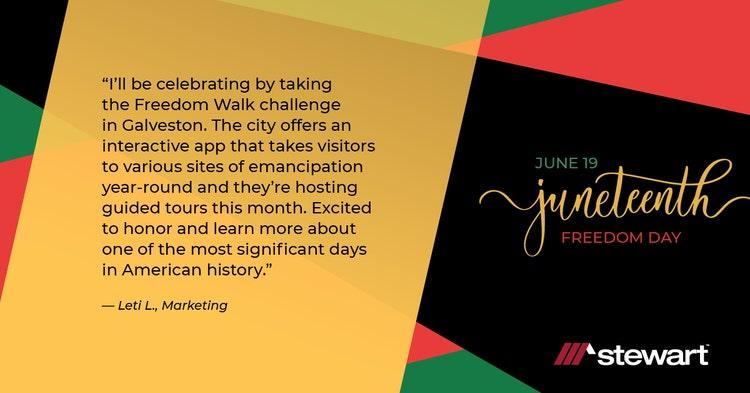

## Table of Contents

## What is Juneteenth?

Juneteenth is a special day in the United States that celebrates the end of slavery. It started on June 19, 1865, when slaves in Texas found out they were free, even though the Emancipation Proclamation had been signed years earlier. This day is important because it marks the moment when freedom finally reached the last group of enslaved people in the country.

People celebrate Juneteenth with many different activities. There are parades, music, and food festivals where communities come together to remember and honor the past. It's a time for learning about history, celebrating African American culture, and thinking about how to make the future better for everyone. Juneteenth became a federal holiday in the United States in 2021, showing how important it is to the country.

## When and where did Juneteenth originate?

Juneteenth started on June 19, 1865, in Galveston, Texas. This was when Union soldiers arrived and told the last group of enslaved African Americans that they were free. Even though President Abraham Lincoln had signed the Emancipation Proclamation on January 1, 1863, it took a while for the news to reach everyone, especially in the remote areas of the South.

The day became known as Juneteenth because it combines the words June and nineteenth. It marks the end of slavery in the United States and is a big moment in American history. People in Texas began celebrating this day right away, and over time, the celebration spread to other parts of the country.

## Why is Juneteenth significant in American history?

Juneteenth is really important in American history because it marks the day when the last enslaved people in the United States found out they were free. This happened on June 19, 1865, in Texas, even though the Emancipation Proclamation had been signed more than two years earlier. This moment showed that freedom finally reached everyone, and it's a big part of understanding how slavery ended in America.

The day is also important because it helps us remember and learn about the past. Juneteenth celebrations bring people together to honor African American history and culture. It's a time for communities to think about what has happened and how to keep working towards a better future for everyone. In 2021, Juneteenth became a federal holiday, which shows how much it means to the whole country.

## How is Juneteenth celebrated across the United States?

Juneteenth is celebrated all over the United States with lots of different activities. People often have big parties and festivals where they can enjoy music, dancing, and special foods. There are also parades where people march through the streets to celebrate freedom and remember the past. Many communities have picnics and barbecues, where families and friends come together to share stories and have fun.

In addition to the fun activities, Juneteenth is also a time for learning and reflection. Schools and community groups often hold events where people can learn about the history of slavery and the importance of Juneteenth. There are also readings of the Emancipation Proclamation and speeches by community leaders. Some people visit museums or historical sites to learn more about African American history and culture.

Overall, Juneteenth is a day to celebrate freedom, remember the past, and think about how to make the future better. It's a time for communities to come together, share their stories, and honor the journey towards equality and justice.

## What are some traditional foods associated with Juneteenth celebrations?

Juneteenth celebrations often include special foods that have a lot of meaning. One popular dish is red foods, like red velvet cake and strawberry soda. The color red is important because it stands for the blood that was shed by enslaved people and also because it reminds people of West African traditions where red is a special color. Barbecue is another big part of Juneteenth meals. It's a way for families and friends to come together and enjoy good food while celebrating freedom.

Other traditional foods you might see at Juneteenth are soul food dishes like fried chicken, collard greens, and cornbread. These foods have deep roots in African American culture and are a way to honor the past. People also enjoy dishes like black-eyed peas, which are thought to bring good luck. No matter what's on the menu, the food at Juneteenth celebrations is all about bringing people together to remember and celebrate.

## How has the recognition of Juneteenth evolved over time?

Juneteenth started in Texas in 1865, right after the last enslaved people found out they were free. At first, it was just celebrated in Texas, but over time, more and more people in other states started to join in. People would have big parties, cookouts, and tell stories about the past. It was a way for African American communities to remember their history and celebrate their freedom. As more people learned about Juneteenth, it started to spread across the country.

In the last few decades, Juneteenth has become more well-known and celebrated everywhere in the United States. Schools and cities started to hold events and teach about its importance. In 2021, something big happened: Juneteenth became a federal holiday. This meant that the whole country recognized how important this day is. Now, more people know about Juneteenth and what it stands for, and it's a time for everyone to come together to remember the past and think about the future.

## What role did Juneteenth play in the civil rights movement?

Juneteenth played an important part in the civil rights movement. It was a day that reminded people of the long fight for freedom and equality. During the civil rights movement, people used Juneteenth celebrations to gather and talk about how to keep working towards equal rights. They would hold speeches, marches, and other events to bring attention to their cause. It was a way to connect the past struggle against slavery with the current fight for civil rights.

The celebrations also helped to build a sense of community and strength among African Americans. They could come together, share their stories, and feel supported in their efforts to end discrimination. By remembering the end of slavery, Juneteenth gave people hope and inspiration to keep fighting for justice. It showed that change was possible and that their efforts could make a difference, just like the efforts of those who came before them.

## Can you explain the connection between Juneteenth and the Emancipation Proclamation?

Juneteenth is connected to the Emancipation Proclamation because it celebrates when the last enslaved people in the United States found out they were free. President Abraham Lincoln signed the Emancipation Proclamation on January 1, 1863, which said that all enslaved people in Confederate territory were to be set free. However, it took a while for this news to reach everyone, especially in places far away from where the Union Army was. It wasn't until June 19, 1865, that Union soldiers arrived in Galveston, Texas, and told the enslaved people there that they were free. This moment is what Juneteenth celebrates.

The Emancipation Proclamation was an important step towards ending slavery, but Juneteenth marks the actual moment when freedom reached the last group of enslaved people. It shows how long it took for the news to spread and how important it was for everyone to finally know they were free. Juneteenth is a reminder of the Emancipation Proclamation and the long journey to freedom for all.

## How do different states officially recognize Juneteenth?

Different states in the United States recognize Juneteenth in their own ways. Some states have made Juneteenth an official state holiday, which means government offices and schools might close for the day. For example, Texas was the first state to make Juneteenth a state holiday back in 1980. Other states, like New York and Virginia, have also made it an official holiday more recently. These states want to show how important Juneteenth is and to help people remember the history of slavery and freedom.

Other states might not have made Juneteenth an official holiday, but they still celebrate it in different ways. They might have special events, like festivals or educational programs, to teach people about Juneteenth. Some cities and towns have parades or community gatherings where people can come together to celebrate. Even if it's not an official holiday, many states and communities still find ways to honor and recognize Juneteenth, showing that it's an important part of American history.

## What are some notable Juneteenth events or festivals held annually?

One of the biggest Juneteenth events is the Juneteenth Music Festival in Denver, Colorado. It's a big celebration with lots of music, food, and activities for everyone. People come from all over to enjoy the festival and learn about the history of Juneteenth. There are also speeches and educational programs to help people understand why this day is so important.

Another notable event is the Juneteenth Festival in Milwaukee, Wisconsin. This festival is known for its big parade and lots of fun things to do. There are food vendors, live music, and even a kids' area where families can enjoy the day together. The festival helps bring the community together to celebrate freedom and remember the past.

In Washington D.C., the Juneteenth National Holiday Observance is a big event that happens every year. It includes a parade, a concert, and a special ceremony at the African American Civil War Memorial. People come to honor the history of Juneteenth and to think about how to keep working towards equality and justice. These events show how important Juneteenth is and how it brings people together to celebrate and learn.

## How does Juneteenth relate to other commemorative days celebrating African American history?

Juneteenth is one of many days that celebrate African American history, but it's special because it marks the end of slavery in the United States. It's different from other days like Martin Luther King Jr. Day, which honors Dr. King's work for civil rights, or Black History Month, which is a whole month to learn about and celebrate African American achievements. Juneteenth focuses on the moment when the last enslaved people found out they were free, making it a powerful reminder of the journey to freedom.

Other commemorative days, like Kwanzaa, celebrate African heritage and culture. Kwanzaa is a week-long celebration that happens in December and focuses on principles like unity and self-determination. While Kwanzaa looks at African traditions and values, Juneteenth is more about a specific moment in American history. Both days are important for understanding and celebrating African American history, but they each have their own special focus and meaning.

## What are the current debates or discussions around Juneteenth in terms of national recognition and education?

People are talking a lot about Juneteenth these days, especially about how it should be recognized across the country. Some folks think it should be a bigger deal in schools, with more lessons about what Juneteenth means and why it's important. They want kids to learn about the history of slavery and how it ended. Others are discussing whether Juneteenth should be a day off for everyone, like other federal holidays. They believe that making it a national holiday would show how important this day is to the whole country.

There's also a lot of talk about how to celebrate Juneteenth in a way that respects its history. Some people worry that if it becomes too commercial, like with big sales and parties, it might lose its meaning. They want to make sure that the focus stays on remembering the past and thinking about how to make things better for the future. These discussions show that people care a lot about Juneteenth and want to make sure it's recognized and celebrated in the right way.

## References & Further Reading

[1]: DuBois, W. E. B. (1903). ["The Souls of Black Folk"](https://www.jpanafrican.org/ebooks/3.4eBookSoulsofBlackFolk.pdf) Project Gutenberg.

[2]: Gates Jr., H. L. (2013). ["The African Americans: Many Rivers to Cross"](https://www.amazon.com/African-Americans-Many-Rivers-Cross/dp/1401935141) SmileyBooks.

[3]: White, D. G. (1999). ["Too Heavy a Load: Black Women in Defense of Themselves, 1894-1994"](https://archive.org/details/tooheavyloadblac0001whit) W. W. Norton & Company.

[4]: Levitt, S. D., & Dubner, S. J. (2009). ["Freakonomics: A Rogue Economist Explores the Hidden Side of Everything"](https://psycnet.apa.org/record/2005-05399-000) William Morrow Paperbacks.

[5]: Lopez de Prado, M. (2018). ["Advances in Financial Machine Learning"](https://www.amazon.com/Advances-Financial-Machine-Learning-Marcos/dp/1119482089) Wiley.