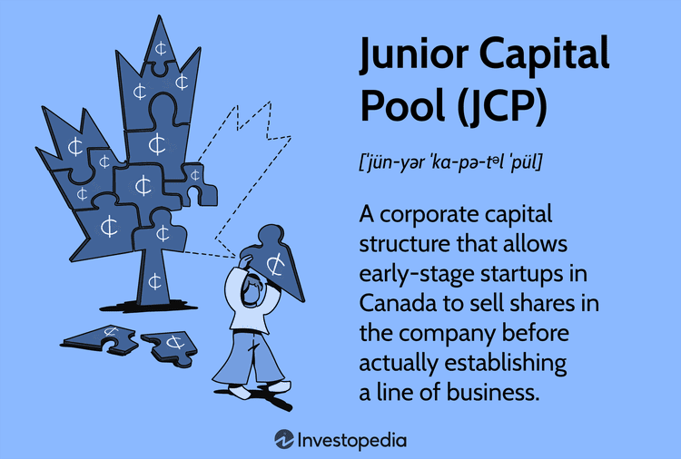

## Table of Contents

## What is a Junior Capital Pool (JCP)?

A Junior Capital Pool (JCP) is a type of company listed on the stock exchange that helps new businesses get started. These companies are formed to find and buy other small businesses or start new ones. People can buy shares in a JCP, which is a way for the JCP to raise money to make these deals happen.

When a JCP finds a business it wants to buy or start, it is called a "qualifying transaction." After this transaction happens, the JCP becomes a regular company with its own business. This process helps new businesses get the money they need to grow, and it gives investors a chance to be part of a new company from the beginning.

## How does a Junior Capital Pool differ from other investment vehicles?

A Junior Capital Pool (JCP) is different from other investment vehicles because it focuses on finding and buying small businesses or starting new ones. Unlike mutual funds or exchange-traded funds (ETFs) that invest in a broad range of companies or assets, a JCP starts with no business of its own. Instead, it uses the money raised from selling shares to search for a business to acquire or start. This makes JCPs more like venture capital or private equity, but they are unique because they are publicly traded on stock exchanges from the start.

Another way JCPs differ is in their structure and purpose. While traditional investment vehicles like stocks or bonds are meant to provide returns through dividends, interest, or capital appreciation, JCPs aim to complete a "qualifying transaction." This transaction transforms the JCP into a regular company with an operating business. Investors in JCPs are betting on the success of this transformation, which can be riskier but also potentially more rewarding than investing in established companies or diversified funds.

## What are the primary objectives of a Junior Capital Pool?

The main goal of a Junior Capital Pool (JCP) is to find and buy a small business or start a new one. A JCP raises money by selling shares to people who want to invest in new businesses. This money helps the JCP look for a good business to buy or a new business to start. The JCP does not have its own business at first, so it uses the money from investors to search for the right opportunity.

Once a JCP finds a business to buy or start, it makes a deal called a "qualifying transaction." After this deal, the JCP becomes a regular company with its own business. The people who bought shares in the JCP now own part of this new business. This process helps new businesses get the money they need to grow, and it gives investors a chance to be part of a new company from the beginning.

## Who can invest in a Junior Capital Pool?

Anyone who wants to invest in new businesses can buy shares in a Junior Capital Pool (JCP). You don't need to be a big investor or have a lot of money. As long as you can buy shares on the stock market, you can invest in a JCP. This makes it easier for regular people to be part of starting new businesses.

But, investing in a JCP can be risky. Since a JCP doesn't have its own business at first, it's like betting on a team before they even start playing. You're hoping they find a good business to buy or start. So, it's important to think carefully and maybe talk to a financial advisor before you decide to invest in a JCP.

## What are the risks associated with investing in a Junior Capital Pool?

Investing in a Junior Capital Pool (JCP) can be risky because it doesn't have a business at first. When you buy shares in a JCP, you're betting on the team finding a good business to buy or start. If they can't find a good one, or if the business they choose doesn't do well, your investment might lose value. This is different from investing in a company that already has a business and makes money.

Another risk is that JCPs are new and small, so they might not have a lot of information available. It can be hard to know if the people running the JCP are good at finding businesses or if they will make smart choices. Also, because JCPs are smaller, they might not have as much money to keep going if things don't work out right away. So, it's important to think carefully and maybe talk to a financial advisor before you decide to invest in a JCP.

## How is a Junior Capital Pool structured?

A Junior Capital Pool (JCP) is a special kind of company that helps new businesses get started. It doesn't have its own business at first. Instead, it raises money by selling shares to people who want to invest in new businesses. This money helps the JCP look for a good business to buy or start. The people who buy shares in a JCP are hoping that the JCP will find a successful business to buy or start.

When a JCP finds a business it wants to buy or start, it makes a deal called a "qualifying transaction." After this deal, the JCP becomes a regular company with its own business. The people who bought shares in the JCP now own part of this new business. This structure helps new businesses get the money they need to grow, and it gives investors a chance to be part of a new company from the beginning.

## What are the regulatory requirements for establishing a Junior Capital Pool?

To set up a Junior Capital Pool (JCP), you need to follow certain rules set by the stock exchange where you want to list the JCP. First, you need to make sure the JCP doesn't have any business activities at the start. It's just a shell company that will use the money from selling shares to find and buy a small business or start a new one. The stock exchange also requires that the people running the JCP, called the management team, have the right skills and experience to find a good business.

Once you have the right management team, you need to raise a certain amount of money by selling shares to the public. This amount can be different depending on the stock exchange's rules. After you raise the money, you need to use it to look for a business to buy or start. When you find a business, you need to make a deal called a "qualifying transaction." After this deal, the JCP becomes a regular company with its own business, and it needs to follow all the regular rules for companies listed on the stock exchange.

## How does a Junior Capital Pool raise capital?

A Junior Capital Pool (JCP) raises money by selling shares to people who want to invest in new businesses. It's like asking people to give them money to help find and buy a small business or start a new one. When people buy these shares, they're betting that the JCP will find a good business to buy or start, which could make their investment grow.

The JCP uses the money from selling shares to search for a business to buy or start. They look for a good opportunity and when they find one, they make a deal called a "qualifying transaction." After this deal, the JCP becomes a regular company with its own business, and the people who bought shares now own part of this new business.

## What types of businesses typically qualify for investment from a Junior Capital Pool?

A Junior Capital Pool (JCP) usually looks for small businesses that are just starting out or are still growing. These businesses might be in different industries like technology, health care, or manufacturing. The JCP wants to find a business that has a good idea or product but needs more money to grow bigger. They look for businesses that have a chance to become successful and make money for the people who invested in the JCP.

The JCP team checks if the business has a strong plan and good people running it. They want to make sure the business can use the money from the JCP to grow and become more valuable. Once the JCP finds a business that fits these criteria, they make a deal to buy it or help start it. This deal is called a "qualifying transaction," and after it happens, the JCP becomes a regular company with its own business.

## How does a Junior Capital Pool exit its investments?

A Junior Capital Pool (JCP) exits its investments by completing a "qualifying transaction." This happens when the JCP finds a small business to buy or start. Once the deal is done, the JCP becomes a regular company with its own business. The people who bought shares in the JCP now own part of this new business. This is how the JCP turns the money it raised into a real business.

After the qualifying transaction, the new company might grow and become more valuable. If this happens, the people who invested in the JCP could make money if they sell their shares for more than they paid. Sometimes, the new company might be bought by a bigger company, or it might go public on a bigger stock exchange. These are other ways the JCP can exit its investment and give returns to its investors.

## What are the tax implications for investors in a Junior Capital Pool?

When you invest in a Junior Capital Pool (JCP), the tax rules can be a bit different from other investments. If you make money from selling your shares in a JCP, you might have to pay capital gains tax. This is a tax on the profit you make when you sell something for more than you paid for it. The amount of tax you pay can depend on how long you held the shares. If you held them for a short time, you might pay a higher rate than if you held them for a longer time.

Also, if the JCP pays you any dividends, you might have to pay tax on that money too. Dividends are payments a company makes to its shareholders from its profits. The tax rate on dividends can be different from the tax rate on capital gains. It's a good idea to talk to a tax advisor to understand all the tax rules and how they might affect your investment in a JCP.

## How can the performance of a Junior Capital Pool be evaluated and compared to other investment options?

To evaluate the performance of a Junior Capital Pool (JCP), you need to look at how well it does in finding and buying a business. A good JCP will find a promising small business or start a new one that can grow and make money. You can check this by looking at the JCP's stock price after it makes a "qualifying transaction." If the stock price goes up, it means investors think the new business is doing well. You can also look at reports and news about the JCP to see how the business is growing and if it's making profits.

Comparing a JCP to other investment options like stocks, bonds, or mutual funds can be tricky because JCPs are riskier and more focused on new businesses. Stocks and mutual funds often invest in established companies that already make money, so they might be less risky but also might not grow as fast as a successful JCP. Bonds are usually even safer but offer lower returns. To compare, you need to think about how much risk you're willing to take and how much return you want. A JCP might give you a bigger return if it finds a great business, but it could also lose value if it doesn't. Talking to a financial advisor can help you understand which investment is best for you.

## What is the Rise of Algorithmic Trading?

Algorithmic trading has revolutionized financial markets by automating trading decisions using complex algorithms and high-speed data processing. This approach, which utilizes mathematical models and strategies based on historical data, enables the execution of orders at speeds and frequencies impossible for a human trader. The rise of high-frequency trading ([HFT](/wiki/high-frequency-trading-strategies)), one subset of [algorithmic trading](/wiki/algorithmic-trading), has become particularly significant due to advances in technology and increased availability of market data.

### Types of Algorithmic Strategies

1. **Statistical Arbitrage**: This strategy involves using quantitative models to identify price inefficiencies between related financial instruments. Traders employ mean reversion models, which assume that prices will revert to their historical mean over time. For example, traders can use the formula for the z-score to find potential arbitrage opportunities:
$$
   Z = \frac{X - \mu}{\sigma}

$$
   Here, $X$ is the current price, $\mu$ is the mean price, and $\sigma$ is the standard deviation.

2. **Trend Following**: This strategy capitalizes on trends in market prices. Algorithms identify new price trends and generate buy or sell signals accordingly, often using moving averages or other technical indicators.

3. **Market Making**: Algorithms provide liquidity to markets by simultaneously posting bid and ask prices for a given stock. The goal is to earn the spread between these two prices. This requires sophisticated risk management to hedge against adverse price movements.

4. **Volume-Weighted Average Price (VWAP)**: VWAP strategies aim to execute trades close to the average price of a security throughout the day, weighted by volume. This is particularly useful for institutional investors looking to minimize market impact.

### Advantages of Algorithmic Trading

Algorithmic trading provides multiple advantages. First, it increases market [liquidity](/wiki/liquidity-risk-premium) and maintains tighter bid-ask spreads. Second, the precision and speed at which trades are executed minimize transaction costs and reduce slippage. Third, algorithms can process vast amounts of data rapidly, identifying profitable trading opportunities far quicker than humans. Finally, automation allows trading at scale, managing multiple transactions across different markets and assets simultaneously without human intervention.

### Challenges Facing Investors and Regulators

The rapid rise of algorithmic trading poses challenges. Market [volatility](/wiki/volatility-trading-strategies) can be exacerbated by algorithmic trading, particularly during flash crashes—sudden market declines followed by quick recoveries. Regulatory bodies face the challenge of keeping up with the technological innovations and ensuring fair and transparent markets. Regulators must monitor algorithms to prevent market manipulation and systemic risks posed by HFT strategies.

### Successful Examples

Algorithmic trading's competitive edge is evident in its successful implementation by hedge funds and trading firms. Renaissance Technologies, a notable [hedge fund](/wiki/hedge-fund-trading-strategies), employs sophisticated algorithms to drive its trading decisions, achieving returns significantly above market averages. Similarly, Virtu Financial, a high-frequency trading company, leverages algorithms to facilitate [market making](/wiki/market-making), contributing to its low-risk, high-reward trading model.

In summary, algorithmic trading has fundamentally changed the trading landscape, providing significant benefits in terms of speed, cost-efficiency, and data processing capabilities, while also presenting regulatory and operational challenges that must be navigated carefully.

## References & Further Reading

[1]: Bergstra, J., Bardenet, R., Bengio, Y., & Kégl, B. (2011). ["Algorithms for Hyper-Parameter Optimization."](https://dl.acm.org/doi/10.5555/2986459.2986743) Advances in Neural Information Processing Systems 24.

[2]: ["Advances in Financial Machine Learning"](https://www.amazon.com/Advances-Financial-Machine-Learning-Marcos/dp/1119482089) by Marcos Lopez de Prado

[3]: ["Evidence-Based Technical Analysis: Applying the Scientific Method and Statistical Inference to Trading Signals"](https://www.amazon.com/Evidence-Based-Technical-Analysis-Scientific-Statistical/dp/0470008741) by David Aronson

[4]: ["Machine Learning for Algorithmic Trading"](https://github.com/stefan-jansen/machine-learning-for-trading) by Stefan Jansen

[5]: ["Quantitative Trading: How to Build Your Own Algorithmic Trading Business"](https://www.amazon.com/Quantitative-Trading-Build-Algorithmic-Business/dp/1119800064) by Ernest P. Chan