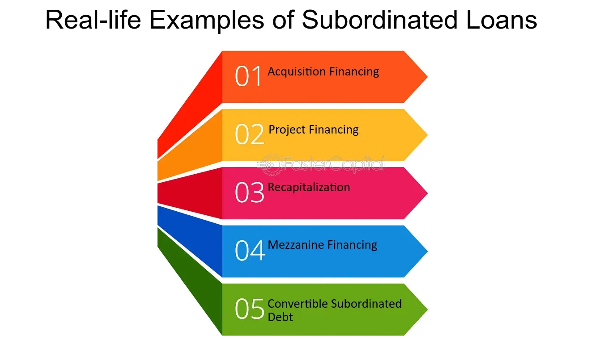

## Table of Contents

## What is junior debt in real estate investing?

Junior debt in real estate investing is a type of loan that is less important than other loans on the same property. It is called "junior" because if the property owner cannot pay back the loans, the people who gave the junior debt get paid after the people who gave the main loan, called the senior debt. This makes junior debt riskier for the lender, but it can also offer higher rewards because of the higher interest rates they can charge.

People use junior debt when they want to buy a property but don't have enough money for a big down payment. They can use junior debt to borrow more money on top of their main loan. This can help them buy the property, but it also means they have more debt to pay back. If the property value goes up, it can be a good deal, but if it goes down, they might have trouble paying back all their loans.

## How does junior debt differ from senior debt?

Junior debt and senior debt are both types of loans used in real estate, but they are different in important ways. Senior debt is the main loan on a property. If the property owner can't pay back the loans, the people who gave the senior debt get their money first. This makes senior debt safer for the lender because they are more likely to get their money back. Because it's safer, senior debt usually has lower interest rates.

Junior debt, on the other hand, is a loan that comes after the senior debt. If the property owner can't pay back the loans, the people who gave the junior debt get paid only after the senior debt is fully paid. This makes junior debt riskier for the lender because they might not get their money back if the property value drops a lot. Because it's riskier, junior debt usually has higher interest rates to make up for the extra risk.

## What are the typical sources of junior debt in real estate?

Junior debt in real estate often comes from private lenders or specialized finance companies. These are people or businesses that are willing to take on more risk for a chance to earn higher interest rates. They might be individuals with extra money to invest, or they might be companies that focus on making loans that banks won't. These lenders understand that they might not get their money back if things go wrong, but they're okay with that risk because of the potential for bigger rewards.

Another common source of junior debt is mezzanine financing. This is a type of loan that is secured by the ownership of the property rather than the property itself. If the borrower can't pay back the loan, the lender can take over part or all of the ownership of the property. Mezzanine financing is often used by real estate developers who need extra money to finish a project but can't get more from traditional banks. It's a way for them to borrow money without adding more debt directly to the property.

## What are the risks associated with investing in junior debt?

Investing in junior debt can be risky because it is less important than senior debt. If the property owner can't pay back the loans, the people who gave the junior debt get paid after the senior debt is fully paid. This means there's a bigger chance that the junior debt investors might not get their money back if the property value drops a lot. Because of this risk, junior debt usually offers higher interest rates to make up for the extra danger.

Another risk is that junior debt is often used by property owners who are already borrowing a lot of money. If they can't make their payments, they might lose the property, and the junior debt investors could lose everything. This can happen if the property value goes down or if the owner has trouble paying back all their loans. So, even though junior debt can offer good rewards, it's important for investors to understand these risks before they decide to invest.

## What are the potential returns from junior debt investments?

Junior debt investments can offer higher returns than other types of real estate investments. Because junior debt is riskier, lenders charge higher interest rates. This means that if the property owner pays back the loan on time, the investor can earn more money than they would from a safer investment like senior debt. For example, while senior debt might have an [interest rate](/wiki/interest-rate-trading-strategies) of 4-6%, junior debt could have an interest rate of 8-12% or even higher.

However, the potential for higher returns comes with the risk of losing money. If the property owner can't pay back the loan, junior debt investors are the last to get their money back. If the property value drops a lot, there might not be enough money left after paying the senior debt to cover the junior debt. So, while the rewards can be good, investors need to be ready for the chance that they might not get any of their money back if things go wrong.

## How does junior debt fit into a real estate investment strategy?

Junior debt can be a useful part of a real estate investment strategy for people who want to earn more money but are okay with taking more risk. When someone buys a property, they might not have enough money for a big down payment. They can use junior debt to borrow more money on top of their main loan. This can help them buy the property, but it also means they have more debt to pay back. If the property value goes up, it can be a good deal because the junior debt usually has a higher interest rate, so the investor can earn more money.

However, junior debt is riskier because if the property owner can't pay back the loans, the people who gave the junior debt get paid after the senior debt. This means there's a bigger chance that junior debt investors might not get their money back if the property value drops a lot. So, when planning a real estate investment strategy, it's important to think about how much risk you're willing to take. Junior debt can offer good rewards, but it's important to understand these risks before deciding to invest.

## What are the key terms and conditions to look for in a junior debt agreement?

When you're looking at a junior debt agreement, it's important to understand the interest rate. This is how much the borrower has to pay you for the loan. Junior debt usually has a higher interest rate than senior debt because it's riskier. You should also check how often the interest is paid. It could be monthly, quarterly, or even at the end of the loan. Another thing to look for is the term of the loan, which is how long the borrower has to pay it back. A longer term might mean more interest, but it also means more time for things to go wrong.

Another key part of the agreement is what happens if the borrower can't pay back the loan. This is called the default clause. It's important to know what rights you have if the borrower misses payments. You should also look at the security for the loan. Junior debt might be secured by the property itself, or it might be unsecured, which means there's no property backing it up. Finally, check if there are any covenants or conditions you have to follow. These could be things like keeping the property in good shape or not taking on more debt without permission. Understanding these terms can help you decide if the junior debt investment is right for you.

## How can junior debt be used to finance real estate development projects?

Junior debt can be a helpful way to finance real estate development projects when the developer needs more money than they can get from a regular bank loan. Developers might use junior debt to cover extra costs like buying the land, building the property, or finishing the project. Since junior debt is riskier for the lender, it usually comes with a higher interest rate. This means the developer has to pay more money back over time, but it can be worth it if the project turns out well and the property value goes up.

However, using junior debt also comes with risks. If the project doesn't go as planned and the developer can't pay back the loans, the people who gave the junior debt get paid after the people who gave the main loan, called senior debt. This means that if the property value drops a lot, the junior debt lenders might not get their money back. So, while junior debt can help a developer finish a project, it's important to carefully think about the risks and rewards before deciding to use it.

## What are the legal and regulatory considerations for junior debt in real estate?

When dealing with junior debt in real estate, it's important to understand the legal and regulatory rules. These rules can be different depending on where you are. For example, some places have laws about how much interest you can charge on a loan. There might also be rules about what happens if the borrower can't pay back the loan. It's a good idea to talk to a lawyer who knows about real estate to make sure you're following all the rules.

Another thing to think about is how junior debt fits into the bigger picture of real estate finance. For example, if the property is part of a bigger development, there might be rules about how the money from the project is used. There could also be rules about who gets paid first if something goes wrong. Understanding these rules can help you avoid problems and make sure your investment is safe.

## How does the performance of junior debt compare to other real estate investment options during economic downturns?

During economic downturns, junior debt can be riskier than other real estate investment options. When the economy is not doing well, property values can drop, and people might have a harder time paying back their loans. If a property owner can't pay back their loans, the people who gave the junior debt get paid after the people who gave the main loan, called senior debt. This means there's a bigger chance that junior debt investors might not get their money back if the property value goes down a lot. Because of this, junior debt can be more affected by economic downturns than safer investments like senior debt or direct property ownership.

On the other hand, if the property owner can keep paying back the junior debt during an economic downturn, the investor can still earn a good return because junior debt usually has a higher interest rate. This can be a big help if the economy starts to get better and property values go up again. But it's important for investors to be ready for the chance that they might lose money if things go wrong. So, while junior debt can offer good rewards, it's important to understand these risks before deciding to invest during tough economic times.

## What are advanced strategies for managing and mitigating risks in junior debt investments?

One advanced strategy for managing risks in junior debt investments is to carefully choose the properties and borrowers you invest in. Look for properties in strong markets where the value is likely to stay stable or go up, even during tough times. Also, check the borrower's history to see if they have a good record of paying back loans on time. By [picking](/wiki/asset-class-picking) the right properties and borrowers, you can lower the chance that you'll lose money if the economy gets bad.

Another strategy is to spread out your investments, which is called diversification. Instead of putting all your money into one junior debt loan, you can invest in several different loans or even different types of real estate investments. This way, if one investment doesn't work out, you won't lose everything. Diversification can help balance out the risks and rewards of junior debt, making it safer overall. It's also a good idea to keep some money in safer investments like senior debt or direct property ownership, so you have a cushion if things go wrong with your junior debt investments.

## How can investors structure junior debt to optimize tax benefits and financial outcomes?

Investors can structure junior debt to get the best tax benefits and financial outcomes by thinking about how the interest payments work. When a property owner pays interest on a junior debt loan, that interest can often be taken off their taxes as a business expense. This can lower the amount of taxes they have to pay. For the investor, the interest they earn from the junior debt is usually taxed as regular income, but they might be able to use certain tax strategies to lower this tax. For example, if the junior debt is part of a bigger real estate investment, the investor might be able to use losses from other parts of the investment to offset the income from the junior debt.

Another way to optimize junior debt is to think about the terms of the loan. By setting the right interest rate and loan term, investors can make sure they earn a good return while also helping the property owner manage their cash flow. For example, a longer loan term with a higher interest rate might give the property owner more time to pay back the loan, which can be helpful if the project takes longer than expected. At the same time, the investor can earn more interest over time. By working with a tax advisor and a real estate expert, investors can find the best way to structure junior debt to meet their financial goals and take advantage of tax benefits.

## References & Further Reading

[1]: Bergstra, J., Bardenet, R., Bengio, Y., & Kégl, B. (2011). ["Algorithms for Hyper-Parameter Optimization."](https://dl.acm.org/doi/10.5555/2986459.2986743) Advances in Neural Information Processing Systems 24.

[2]: ["Advances in Financial Machine Learning"](https://www.amazon.com/Advances-Financial-Machine-Learning-Marcos/dp/1119482089) by Marcos Lopez de Prado

[3]: ["Evidence-Based Technical Analysis: Applying the Scientific Method and Statistical Inference to Trading Signals"](https://www.amazon.com/Evidence-Based-Technical-Analysis-Scientific-Statistical/dp/0470008741) by David Aronson

[4]: ["Machine Learning for Algorithmic Trading"](https://github.com/stefan-jansen/machine-learning-for-trading) by Stefan Jansen

[5]: ["Quantitative Trading: How to Build Your Own Algorithmic Trading Business"](https://www.amazon.com/Quantitative-Trading-Build-Algorithmic-Business/dp/1119800064) by Ernest P. Chan