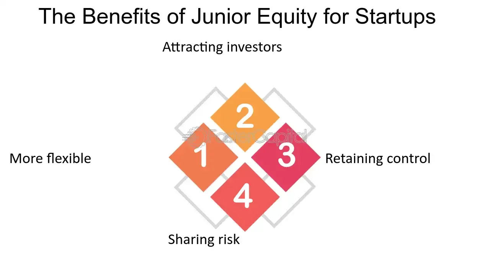

## Table of Contents

## What is junior equity?

Junior equity, also known as junior stock, is a type of stock that ranks lower in priority compared to other stocks when it comes to paying out dividends or in the event of a company's liquidation. This means that if a company goes bankrupt and its assets are sold off, holders of junior equity will only get paid after all the senior equity holders and other creditors have been paid.

Junior equity often comes with higher risks but also the potential for higher rewards. Because it is lower in the pecking order, it might offer investors a chance to buy into a company at a lower price. If the company does well, the value of junior equity can increase significantly, providing good returns. However, if the company struggles, junior equity holders are more likely to lose their investment.

## How does junior equity differ from senior equity?

Junior equity and senior equity are different in how they rank when a company pays out money or goes bankrupt. Senior equity is like being at the front of the line. If a company makes money, senior equity holders get paid first. If the company goes bankrupt and has to sell everything, senior equity holders get money before junior equity holders. Junior equity is like being at the back of the line. They get paid only after everyone in front of them, including senior equity holders and other creditors, have been paid.

Because of this, junior equity is riskier than senior equity. If a company does well, junior equity can grow a lot in value, which can be good for investors. But if the company does badly, junior equity holders might lose all their money because they are last in line to get paid. Senior equity is safer but usually doesn't grow as much in value. So, junior equity might be a good choice for people who like to take bigger risks for the chance of bigger rewards, while senior equity might be better for those who want more safety.

## What are the basic types of junior equity?

Junior equity can come in different forms, but the main types are common stock and preferred stock that has lower priority. Common stock is the most basic form of junior equity. When you own common stock, you own a piece of the company. If the company does well, the value of your stock can go up, and you might get dividends, which are like a share of the company's profits. But if the company goes bankrupt, common stockholders are the last to get any money back after everyone else is paid.

Another type of junior equity is a kind of preferred stock that is lower in the pecking order. Preferred stock usually pays a fixed dividend and has a higher claim on assets than common stock if the company goes bankrupt. But some preferred stocks can be junior to other preferred stocks or to bonds. These junior preferred stocks still get paid before common stock but after other preferred stocks and bonds. This makes them riskier than senior preferred stocks but less risky than common stock.

## Who typically invests in junior equity?

People who invest in junior equity are usually looking for bigger rewards and are okay with taking more risks. They might be young investors who have time to wait for their investments to grow, or they might be experienced investors who know how to pick good companies that could do well. These investors understand that junior equity, like common stock, can go up a lot in value if the company does well, but they also know it can lose value if the company does badly.

Sometimes, investors who want to support new or smaller companies also buy junior equity. These companies might not have a lot of money or a long history, so they offer junior equity to attract investors. People who believe in the company's idea or product might invest, hoping that the company will grow and their investment will become more valuable. But they know it's a risk because if the company fails, they might not get their money back.

## What are the potential risks associated with junior equity investments?

Investing in junior equity can be risky because it's at the back of the line when a company pays out money or goes bankrupt. If the company does well, junior equity can grow a lot in value, which is good for investors. But if the company does badly, junior equity holders might lose all their money because they get paid last. This means that if the company goes bankrupt and has to sell everything, junior equity holders only get money after everyone else, like senior equity holders and other creditors, have been paid.

Another risk is that junior equity, like common stock, can go up and down a lot in value. This is called [volatility](/wiki/volatility-trading-strategies). If the stock market or the company's industry has problems, the value of junior equity can drop quickly. This can be stressful for investors, especially if they need to sell their stocks when the value is low. Also, junior equity might not pay dividends regularly, so investors can't count on getting money from the company every year. They have to hope that the stock's value will go up over time to make money.

## How can junior equity benefit a company?

Junior equity can help a company raise money without having to pay it back right away. When a company sells junior equity, like common stock, it gets cash from investors who buy the stock. This money can be used to grow the business, pay for new projects, or help the company through tough times. Unlike loans, the company doesn't have to pay back the money to the investors, which can be a big help if the company is still small or trying new things.

Also, selling junior equity can make more people interested in the company. When people buy junior equity, they become part-owners of the company. This can make them feel more connected to the company and more likely to support it. If the company does well, the value of the junior equity can go up, which makes the investors happy. This can also make the company look good to other people who might want to invest or do business with them.

## What are the tax implications of investing in junior equity?

When you invest in junior equity like common stock, you might have to pay taxes on the money you make. If you sell your stock for more than you paid for it, you have a capital gain. You'll need to pay taxes on this gain. The tax rate depends on how long you held the stock. If you held it for less than a year, it's a short-term capital gain and you'll pay your regular income tax rate. If you held it for more than a year, it's a long-term capital gain, and the tax rate is usually lower.

You might also get dividends from your junior equity. Dividends are like a share of the company's profits. If you get dividends, you'll have to pay taxes on them too. The tax rate on dividends can be different depending on whether they are qualified or non-qualified dividends. Qualified dividends are taxed at the same lower rate as long-term capital gains, while non-qualified dividends are taxed at your regular income tax rate. It's a good idea to talk to a tax advisor to understand exactly how your junior equity investments will affect your taxes.

## How does junior equity fit into a diversified investment portfolio?

Junior equity can be a good part of a diversified investment portfolio because it can help grow your money a lot if the companies you invest in do well. When you buy junior equity, like common stock, you're betting on the company's future. If the company grows and does better, the value of your junior equity can go up a lot. This can be really good for your portfolio, especially if you also have safer investments like bonds or senior equity. By mixing in some junior equity, you can balance the risk and reward in your investments.

But, junior equity can also be risky. Because it's last in line to get paid if a company goes bankrupt, you might lose all your money if the company does badly. So, it's important not to put all your money into junior equity. Instead, you should spread your money across different types of investments. This way, if one part of your portfolio, like junior equity, goes down, other parts like bonds or senior equity might still be doing okay. This can help protect your money and keep your investments growing over time.

## What are the key considerations when evaluating junior equity opportunities?

When you're thinking about investing in junior equity, like common stock, it's important to look at the company's future. You want to know if the company can grow and make more money. Check if the company has good ideas, a strong plan, and if people want what they're selling. Also, think about the company's leaders. Are they smart and good at running the business? It's also a good idea to look at the company's money situation. Do they have enough cash to keep going, or are they in debt? All these things can help you decide if the junior equity is a good investment.

Another thing to consider is the risk. Junior equity is riskier because it's last in line to get paid if the company goes bankrupt. So, you might lose all your money if the company does badly. But if the company does well, junior equity can grow a lot in value, which can be good for your investment. Think about how much risk you're okay with. If you like to take bigger risks for the chance of bigger rewards, junior equity might be right for you. But if you want to be safer, you might want to mix junior equity with other types of investments, like bonds or senior equity, to balance out the risk.

## How do regulatory environments affect junior equity investments?

The rules and laws made by governments can change how junior equity investments work. These rules are called regulations, and they can make it easier or harder for companies to sell junior equity like common stock. If the rules are strict, it might be harder for a company to get money from investors because there are more steps they have to follow. But if the rules are easy, more people might want to invest in junior equity because it's simpler to buy and sell. Also, regulations can protect investors by making sure companies tell the truth about their business and money situation, which can help investors make better choices.

Regulations can also affect how much money investors make from junior equity. For example, if the government changes tax laws, it might change how much tax you have to pay on the money you make from selling your stock or getting dividends. Sometimes, governments make rules about how much money companies have to keep in their business before they can pay out dividends to junior equity holders. This can make it harder for investors to get money from their investments. So, when you're thinking about investing in junior equity, it's good to know about the rules in the country where the company is based, because they can change how much risk and reward there is in your investment.

## What advanced strategies can be used to maximize returns from junior equity?

One advanced strategy to maximize returns from junior equity is to focus on growth investing. This means you look for companies that are growing fast and have a lot of potential to make more money in the future. These companies might not be making big profits right now, but if they keep growing, the value of their junior equity, like common stock, can go up a lot. To do this, you need to do a lot of research to find these growing companies before other investors do. You also need to be okay with taking more risk because these companies can be more up and down in value.

Another strategy is to use dollar-cost averaging. This means you put money into junior equity regularly, like every month, instead of putting all your money in at once. This can help you buy more stock when prices are low and less when prices are high, which can make your average cost lower over time. It's a good way to spread out the risk of the stock market going up and down. By doing this, you can slowly build up your investment in junior equity and maybe make more money in the long run.

## How does the performance of junior equity compare to other investment classes over the long term?

Over the long term, junior equity, like common stock, can grow a lot more than other types of investments like bonds or savings accounts. This is because junior equity gives you a piece of a company, and if the company does well and grows, the value of your stock can go up a lot. For example, if you had invested in a company like Apple or Amazon when they were small, your junior equity would be worth a lot more now. But, junior equity can also go down a lot if the company does badly, so it's riskier than other investments. Over many years, though, junior equity has usually made more money for investors than safer investments like bonds.

Bonds are another type of investment that people often compare to junior equity. Bonds are like loans you give to a company or the government, and they pay you back with interest over time. Bonds are usually safer than junior equity because if the company goes bankrupt, bondholders get paid before junior equity holders. But, the returns from bonds are usually lower than from junior equity. Over the long term, if you want your money to grow a lot, junior equity might be a better choice, but you have to be okay with the risk of losing money if the company doesn't do well.

## References & Further Reading

[1]: Bergstra, J., Bardenet, R., Bengio, Y., & Kégl, B. (2011). ["Algorithms for Hyper-Parameter Optimization."](https://dl.acm.org/doi/10.5555/2986459.2986743) Advances in Neural Information Processing Systems 24.

[2]: ["Advances in Financial Machine Learning"](https://www.amazon.com/Advances-Financial-Machine-Learning-Marcos/dp/1119482089) by Marcos Lopez de Prado

[3]: ["Evidence-Based Technical Analysis: Applying the Scientific Method and Statistical Inference to Trading Signals"](https://www.amazon.com/Evidence-Based-Technical-Analysis-Scientific-Statistical/dp/0470008741) by David Aronson

[4]: ["Machine Learning for Algorithmic Trading"](https://github.com/stefan-jansen/machine-learning-for-trading) by Stefan Jansen

[5]: ["Quantitative Trading: How to Build Your Own Algorithmic Trading Business"](https://www.amazon.com/Quantitative-Trading-Build-Algorithmic-Business/dp/1119800064) by Ernest P. Chan