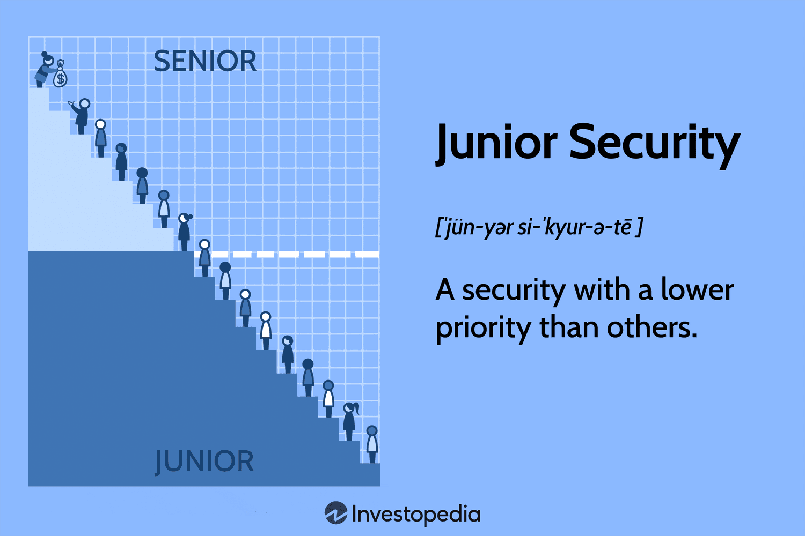

In the digital age, cybersecurity is integral to the protection of sensitive data and systems from unauthorized access and malicious attacks. As technology advances, understanding fundamental security concepts becomes increasingly important, especially for individuals aspiring to enter the cybersecurity field. Junior security concepts, though often considered basic, form the foundational knowledge necessary for building effective security measures. Recognizing the role of these concepts is crucial for identifying potential vulnerabilities and implementing defensive strategies.

This article will explore key cybersecurity principles, providing examples to illustrate these foundational ideas. The role of junior securities, which in finance refers to instruments with lower priority claims during liquidation, parallels certain cybersecurity measures that, while lower in hierarchy, play an essential role in defending information infrastructure.



Furthermore, the intersection of algorithmic trading and cybersecurity represents a significant area of concern. Algorithmic trading utilizes complex computer programs to conduct trades at high velocities and volumes, which raises important data management and protection challenges. Ensuring the cybersecurity of these platforms is vital, as they are often targeted by cybercriminals aiming to exploit vulnerabilities for financial gain.

In summary, understanding cybersecurity concepts, from junior security measures to the complexities of algorithmic trading security, is vital for those engaged or interested in this dynamic field. This article aims to provide insights into these areas, stressing the importance of staying informed and proactive in addressing cybersecurity challenges.

## Table of Contents

## Understanding Junior Security

Junior securities refer to financial instruments that hold a subordinate position in a company's capital structure. This means that in the event of a company's liquidation, junior securities have lower priority claims on the company's assets compared to senior securities, which include debt with higher seniority such as secured bonds or loans. The holders of junior securities typically face a higher risk of not being fully compensated in scenarios where the company’s assets are insufficient to cover all liabilities. Yet, these instruments often offer higher potential returns to compensate for the increased risk. Common shares and some forms of unsecured debt, such as certain subordinated bonds, are typical examples of junior securities.

While the concept originates from finance, parallels can be drawn in cybersecurity. Junior security concepts in cybersecurity refer to security measures that, although might not be prioritized compared to core defenses, still play a pivotal role in the comprehensive security strategy of an organization. For instance, while core systems may be safeguarded with high-priority measures such as encryption and rigorous authentication protocols, junior security measures might include practices like patch management, employee security training, and network segmentation. These measures, although seemingly less critical, are essential in creating a layered and resilient defense system capable of mitigating a wide array of threats.

The integration of junior security measures complements higher-priority defenses by addressing vulnerabilities that may not be covered by primary security mechanisms. For instance, patch management ensures that software vulnerabilities are routinely addressed, thereby reducing the opportunity for cyber attackers to exploit known weaknesses. Similarly, employee security training raises awareness of social engineering threats such as phishing attacks, empowering staff to recognize and respond to potential cyber threats effectively.

In conclusion, junior securities and junior security measures, whether within the context of financial instruments or cybersecurity practices, highlight the significance of multi-tiered strategies to manage risk. While they may possess lower priority, their role is indispensable in ensuring a robust, comprehensive approach to protecting assets, whether these assets are financial or informational.

## Key Security Concepts in Cybersecurity

Cybersecurity is fundamentally about protecting systems, networks, and data against unauthorized access and damage. Among its core concepts, the CIA triad—confidentiality, integrity, and availability—plays a central role in designing effective cybersecurity measures.

Confidentiality ensures that sensitive information is accessed only by authorized individuals. This is achieved through mechanisms such as encryption, which protects data by transforming it into a secure format that can only be read by someone who has the decryption key. For example, symmetric key encryption can be mathematically represented as:

$$
C = E_k(P)
$$

where $C$ is the ciphertext, $P$ is the plaintext, and $E_k$ is the encryption function using key $k$.

Integrity involves safeguarding data from unauthorized modifications. Ensuring integrity frequently involves the use of hash functions, which generate a fixed-size string of characters (a hash) based on the input data. If the data changes, the hash will also change, signaling tampering. A common hash algorithm is SHA-256, which can be implemented in Python as follows:

```python
import hashlib

def generate_hash(data):
    return hashlib.sha256(data.encode()).hexdigest()

data = "Sensitive Data"
hash_value = generate_hash(data)
```

Availability guarantees that information and resources are accessible to authorized users when needed. This aspect is often supported by implementing redundancy, failover strategies, and robust network security measures to oppose denial-of-service attacks.

Understanding vulnerabilities, threats, and risks is vital for developing effective cybersecurity protocols. Vulnerabilities are weaknesses in a system that could be exploited, threats are potential attacks that could exploit those vulnerabilities, and risks are the potential impacts of those threats exploiting vulnerabilities. Assessing these factors allows organizations to prioritize their security efforts effectively.

The cybersecurity landscape is dynamic, with new threats continually emerging. AI-powered attacks, where [artificial intelligence](/wiki/ai-artificial-intelligence) is used to enhance the effectiveness of cyber threats, are becoming more common. These attacks can tailor their approaches based on system defenses, making them more challenging to fend off. Ransomware, another prevalent threat, encrypts a victim's data and demands payment for the decryption key. It often spreads through phishing emails or exploiting software vulnerabilities.

To mitigate these evolving threats, organizations need to implement comprehensive cybersecurity strategies that include regular updates and patches, continuous monitoring, and user education to recognize and avoid potential attacks. Cybersecurity protocols must evolve in tandem with the emergence of new technologies and attack vectors to maintain robust defenses.

## Common Cybersecurity Threats

Cybersecurity threats are a significant concern in today's interconnected world, posing risks to individuals, organizations, and governments alike. Among the most prevalent threats are viruses, trojans, ransomware, and phishing attacks. Each of these threats operates differently but shares the common goal of exploiting vulnerabilities for malicious intent.

Viruses are malicious software programs that can replicate themselves and spread from one computer to another. A virus typically attaches itself to a legitimate program or file, enabling it to execute when the host program is run. Once activated, it can modify or delete files, steal sensitive information, or disrupt operations.

Trojans, unlike viruses, do not replicate themselves. Instead, they disguise themselves as legitimate software to trick users into executing them. Once installed, trojans can open backdoors for other malware, steal confidential data, or give attackers control over the infected system.

Ransomware is a type of malware that encrypts a victim's files, rendering them inaccessible. Attackers then demand a ransom from the victim, usually in [cryptocurrency](/wiki/cryptocurrency), in exchange for the decryption key. Ransomware attacks have surged in recent years, targeting both individuals and large organizations, often resulting in significant financial losses.

Phishing attacks aim to extract sensitive information such as usernames, passwords, and credit card details by masquerading as trustworthy communication. These attacks commonly occur through email, where attackers use deceptive messages to lure recipients into revealing their personal information.

Beyond these traditional threats, cybersecurity experts face emerging challenges such as Internet of Things (IoT) vulnerabilities and supply chain attacks. IoT devices, often lacking adequate security measures, can be easily compromised, leading to network breaches and data theft. Supply chain attacks involve targeting less secure elements of a supply chain to infiltrate a system, potentially causing widespread disruption.

To combat these threats, standard protection measures include firewalls, antivirus software, and secure coding practices. Firewalls act as a barrier, controlling incoming and outgoing network traffic based on predetermined security rules, thus preventing unauthorized access. Antivirus software is essential for detecting and removing malware, providing a foundational layer of defense. Secure coding practices ensure that software is developed in a way that minimizes vulnerabilities, reducing the risk of exploitation.

As cyber threats continue to evolve, staying informed and implementing robust security measures are essential for maintaining digital safety. Regular updates and training enable individuals and organizations to adapt to the changing threat landscape and protect their digital assets effectively.

## Cybersecurity Examples and Case Studies

In the contemporary digital landscape, successful cybersecurity practices serve as the cornerstone for safeguarding organizational data integrity and system functionality. Real-world examples exhibit how proactive approaches, such as penetration testing and security awareness training, fortify defenses against potential breaches.

A notable case is that of a major financial institution that implemented an extensive cybersecurity strategy involving regular penetration tests. These tests simulated potential attacks to uncover vulnerabilities within their systems. By identifying weaknesses before cyber adversaries could, the institution enhanced its security measures, significantly reducing the risk of unauthorized data access. This proactive approach not only shielded sensitive customer information but also bolstered stakeholder confidence in the organization's commitment to security. Penetration testing is a critical strategy, as it provides insights into system resilience and the effectiveness of implemented security protocols.

Security awareness training is another essential element highlighted in successful cybersecurity examples. For instance, a global technology company launched a comprehensive training program targeting its entire workforce, emphasizing the importance of recognizing phishing attempts and following safe information handling practices. This initiative resulted in a marked decrease in successful phishing attacks, illustrating how human vigilance complements technical defenses. The case underscores the necessity of fostering a security-aware culture to mitigate the risks posed by social engineering tactics.

Conversely, instances of cyber failures offer profound lessons in the importance of robust security protocols and effective risk management. The 2017 Equifax data breach, which exposed the personal information of millions of individuals, exemplifies the catastrophic consequences of overlooked vulnerabilities. Investigations revealed that failure to update a known software vulnerability allowed attackers to infiltrate the system, emphasizing the critical need for continuous security monitoring and timely patch management.

Investments in cybersecurity are not solely preventative but also strategically advantageous. Organizations that have preemptively strengthened their cyber defenses frequently recover faster and incur less reputational damage compared to those that react post-breach. This disparity highlights the strategic value of integrating comprehensive cybersecurity protocols into organizational risk management frameworks.

In conclusion, the examination of cybersecurity examples and case studies provides valuable insights into effective defense mechanisms and the potential repercussions of neglect. Proactive measures such as penetration testing and security awareness training prove indispensable in preempting threats and safeguarding digital assets. Moreover, these examples illustrate the broader importance of maintaining robust cybersecurity infrastructures to endure and thrive in an ever-evolving threat landscape.

## Algorithmic Trading and Cybersecurity

Algorithmic trading refers to the use of computer programs to execute trading strategies at high speed and [volume](/wiki/volume-trading-strategy). This form of trading relies on complex algorithms, which analyze market data and make trading decisions faster than any human trader could. While [algorithmic trading](/wiki/algorithmic-trading) offers significant advantages in terms of efficiency and profitability, it also poses considerable cybersecurity risks.

Trading platforms are high-value targets for cybercriminals due to the massive financial transactions involved. These platforms can become vulnerable to attacks aimed at gaining unauthorized access to sensitive data or manipulating trading activities. Common cybersecurity threats to algorithmic trading platforms include Distributed Denial of Service (DDoS) attacks, which can disrupt trading activities, and malware attacks, which may attempt to tamper with trading algorithms or steal confidential data.

Best practices for securing trading algorithms focus primarily on preventive, defensive, and responsive strategies. Regular security audits are critical to identifying and addressing vulnerabilities within trading systems. Such audits may involve penetration testing, which simulates cyber attacks to evaluate the resilience of the systems. Encryption plays a vital role in safeguarding data by encoding information in a way that only authorized parties can decipher. This ensures that even if data is intercepted, it cannot be read by unauthorized individuals. 

Another essential security measure is the implementation of multi-[factor](/wiki/factor-investing) authentication (MFA). By requiring users to provide two or more verification factors to gain access to trading systems, MFA significantly reduces the risk of unauthorized access. For example, an MFA system might require a combination of a password and a verification code sent to a registered mobile device.

The integration of advanced technologies such as AI and [machine learning](/wiki/machine-learning) into algorithmic trading adds another layer of complexity to cybersecurity efforts. While these technologies can enhance trading efficiency, they can also be exploited by cybercriminals to identify and exploit vulnerabilities within trading systems. Therefore, keeping trading algorithms updated and continually monitoring for unusual patterns indicative of potential breaches is necessary.

In conclusion, as algorithmic trading continues to evolve, so too must the measures taken to protect these systems from cyber threats. By implementing robust security protocols, including regular audits, encryption, and authentication, organizations can better safeguard their trading platforms from potential attacks.

## Emerging Trends in Cybersecurity

The integration of artificial intelligence (AI) and machine learning (ML) into cybersecurity frameworks is an emerging trend transforming how defenses are conceptualized and how attacks are executed. These technologies enhance threat detection capabilities by allowing for more sophisticated anomaly detection and predictive analytics. AI-driven systems can process vast amounts of data to identify patterns indicative of potential cyber threats, often in real-time, which facilitates quicker and more accurate responses to threats. Additionally, machine learning models can continually adapt to new threats, improving the resilience of cybersecurity measures.

On the other hand, cybercriminals are equally leveraging AI and ML to enhance the sophistication of their attacks. Malicious actors employ AI to automate phishing attacks, optimize the distribution of malware, and even develop AI-powered malware that can autonomously evolve to evade detection. This has led to an arms race in cybersecurity, compelling security professionals to iterate on existing defenses rapidly.

Beyond AI and ML, quantum computing presents both a formidable challenge and a potential boon for cybersecurity. Quantum computers, with their ability to perform complex calculations at unprecedented speeds, could potentially break widely-used cryptographic algorithms, such as RSA and ECC, which underpin much of the world's secure communications. Researchers are exploring quantum-resistant cryptographic methods to preemptively counteract this risk. Post-quantum cryptography aims to develop new cryptographic schemes that can withstand attacks from quantum computers, ensuring the integrity and confidentiality of data in a post-quantum world.

The protection of critical infrastructure, such as power grids, water treatment facilities, and transportation systems, is garnering increasing attention within cybersecurity. These systems are integral to national security and public safety, making them high-profile targets for cyberattacks. As these infrastructures become more interconnected through the Internet of Things (IoT) and industrial control systems, they become more susceptible to cyber threats. Ensuring robust cybersecurity measures are in place to protect these systems involves securing both the OT (Operational Technology) and IT (Information Technology) networks. This protection is essential to prevent potential disruptions that could have significant societal and economic impacts.

In summary, the field of cybersecurity is adapting to incorporate advanced technologies like AI, ML, and quantum computing while emphasizing the safeguarding of critical infrastructure. As technological advancements continue, the landscape will require constant innovation and vigilance to address the evolving threats that accompany these technological shifts.

## Conclusion

In today's rapidly evolving technological landscape, possessing a fundamental understanding of cybersecurity concepts and junior security is vital for anyone aspiring to enter or advance within this field. As innovations continue to reshape how data is stored, accessed, and protected, the complexities surrounding cyber threats evolve in parallel. This growing sophistication requires cybersecurity professionals to remain vigilant and constantly adapt their strategies to counteract potential breaches effectively.

Advancements in technology have not only expanded the capabilities of legitimate enterprises but have also provided malicious actors with more sophisticated tools to exploit vulnerabilities. Therefore, understanding core concepts like the CIA triad—confidentiality, integrity, and availability—along with junior security measures, becomes paramount in maintaining robust defenses against emerging threats. These foundational principles serve as the bedrock upon which effective cybersecurity strategies are built, ensuring that sensitive information remains protected from unauthorized access and damage.

The future of cybersecurity will undoubtedly present new challenges and opportunities. The rise of technologies such as artificial intelligence, machine learning, and quantum computing will influence both the attack vectors utilized by cybercriminals and the defenses employed by security professionals. Furthermore, the increasing interconnectivity of critical infrastructure highlights the growing need for comprehensive cybersecurity measures across all sectors.

To successfully combat future cybersecurity challenges, staying informed about the latest trends and developments in the industry is crucial. Engaging in continuous education, participating in cybersecurity communities, and leveraging existing resources and tools can enhance one's ability to anticipate and mitigate risks effectively. Adaptability in the face of uncertainty ensures that cybersecurity professionals can respond to threats with agility and precision, safeguarding digital assets and maintaining public trust in an increasingly digital world.

## References & Further Reading

[1]: Kshetri, N. (2013). ["Cybercrime and Cybersecurity in the Global South."](https://link.springer.com/book/10.1057/9781137021946) Palgrave Macmillan.

[2]: Schneier, B. (2015). ["Data and Goliath: The Hidden Battles to Collect Your Data and Control Your World."](https://www.schneier.com/books/data-and-goliath/) W.W. Norton & Company.

[3]: Davis, H. (2015). ["Hacking Exposed™ 7: Network Security Secrets & Solutions."](https://archive.org/details/hackingexposed7n0000mccl) McGraw-Hill Education.

[4]: Conti, M., & Poovendran, R. (2007). ["Cyber Physical Systems: Opportunities and Challenges."](https://www.semanticscholar.org/paper/Electric-Vehicles-Security-and-Privacy%3A-Challenges%2C-Brighente-Conti/35690c538e3303f6e6b5f6855e7da214db11a491) Proceedings of the IEEE.

[5]: Osterman Research. (2018). ["Notifiable Data Breaches Scheme: White Paper."](https://ostermanresearch.com/2018/12/10/whitepapers2018/) Mimecast.