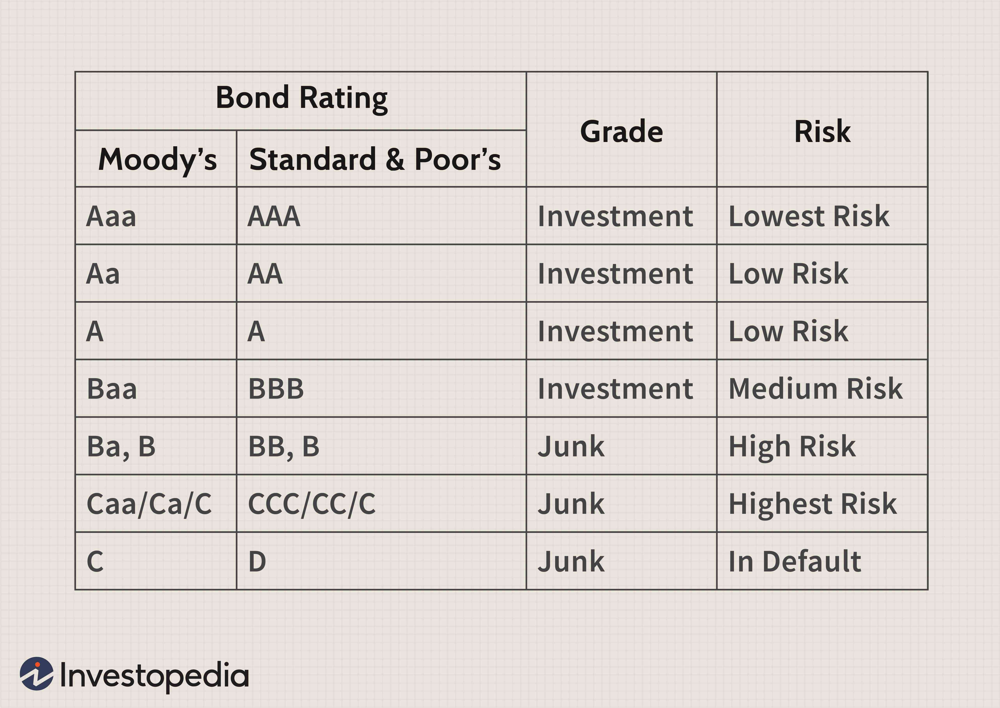

Junk bonds, sometimes referred to as high-yield bonds, are a category of bonds that carry a higher risk of default but offer potentially higher returns to compensate for that risk. These bonds are issued by entities with lower credit ratings, typically below investment grade. Consequently, they attract investors willing to accept greater risk in exchange for the possibility of substantial returns. The defining characteristics of junk bonds include higher yield spreads over risk-free investments like U.S. Treasury securities, increased volatility, and a predominant issuance by leveraged companies or those facing financial stress.

Credit ratings play a pivotal role in financial markets, serving as tools for gauging the creditworthiness of issuers. These ratings, assigned by credit rating agencies such as Moody’s, Standard & Poor’s, and Fitch, provide investors with insights into the likelihood of default on a debt obligation. Ratings range from high-grade (e.g., AAA) to lower-grade (e.g., BB or below), influencing investment decisions, bond pricing, and interest rates. For junk bonds, these ratings are crucial as they directly affect investor demand and the cost of debt for issuers.



Algorithmic trading, a form of automated trading using advanced mathematical models and software, has transformed the way bonds, including junk bonds, are traded. By employing pre-programmed instructions, algorithmic trading can efficiently assess market conditions, execute trades at speeds and volumes impossible for human traders, and optimize strategies based on real-time data. In the context of the bond market, it enhances liquidity, reduces transaction costs, and provides more precise pricing through rapid trades.

The interconnectedness of junk bonds, credit ratings, and algorithmic trading form a complex web influencing market dynamics. A change in a bond’s credit rating can prompt immediate responses in trading algorithms, leading to rapid shifts in bond prices and market volatility. This interaction underscores the importance of credit ratings as catalysts in financial markets and highlights the critical role of algorithmic trading in managing and exploiting these rapid changes.

The purpose of this article is to examine these three components — junk bonds, credit ratings, and algorithmic trading — and how their interactions shape modern financial markets. Understanding the synergy among these elements is essential for investors and market participants aiming to navigate the complexities of the bond market effectively. This exploration provides insights into the risk-reward mechanisms, the importance of credit assessments, and the impact of technological advancements on trading strategies.

## Table of Contents

## Understanding Junk Bonds: An Overview

Junk bonds, also known as high-yield bonds, are fixed-income securities with a lower credit rating than investment-grade bonds. They typically fall below the ‘BBB’ rating by Standard & Poor’s or ‘Baa’ by Moody’s. These bonds carry a higher risk of default, meaning there is a significant chance that the issuing company might fail to make interest payments or repay the principal. In compensation for this elevated risk, junk bonds offer higher yields, presenting both a risk and reward opportunity for investors.

The risk-reward profile of junk bonds involves a delicate balance; their higher interest rates provide attractive income potential, especially in low-interest environments. Investors might gain considerably if the issuing company's creditworthiness improves or if the overall market conditions enhance the bond’s value. However, these potential gains come with the risk of capital loss if the issuer defaults or fails to meet its obligations. As such, investing in junk bonds requires thorough credit risk analysis and a diversified portfolio to mitigate potential losses.

Issuers choose junk bonds for several reasons, despite their higher risk and cost of capital. Companies with limited credit history or financial distress often lack access to traditional financing channels, such as bank loans or investment-grade bonds. Junk bonds become a viable alternative for these issuers to raise necessary capital for operations, acquisitions, or refinancing existing debts. Additionally, companies undergoing restructuring or expansion may opt for junk bonds to quickly secure capital without diluting equity ownership.

Recent [statistics](/wiki/bayesian-statistics) indicate fluctuations in the junk bond market, reflecting economic cycles and investor sentiment. In periods of economic expansion, demand for high-yield bonds often increases as investors search for better returns. Conversely, during economic downturns, the risk of default rises, causing spreads to widen and prices to fall. Notably, as of recent years, the U.S. junk bond market has experienced robust performance, with issuance volumes reaching historically high levels, driven by low interest rates and a recovering economy.

There are some common misconceptions about junk bonds that often need clarification. A prevalent misunderstanding is that all junk bonds are on the verge of default. While lower ratings indicate higher risk, many junk bond issuers remain solvent and continue meeting their obligations. Another misconception is that all junk bonds provide the same level of risk and return; in reality, they vary significantly in terms of issuer credit quality, sector, and economic conditions. Understanding these nuances is crucial for making informed investment decisions in high-yield bonds. 

In summary, junk bonds offer both high risk and potential high reward. While they serve as a critical financing tool for certain issuers, careful consideration and analysis are essential for investors looking to benefit from their unique risk-return profile.

## Role of Credit Ratings in the Bond Market

Credit ratings are assessments provided by specialized agencies to evaluate the creditworthiness of a borrower, particularly in the financial securities market. They denote the likelihood of the borrower repaying its debt obligations. These ratings play a vital role in the financial markets as they influence an entity's ability to raise capital, the interest rates on debt securities, and investor confidence.

Credit rating agencies, such as Moody's Investors Service, Standard & Poor's (S&P), and Fitch Ratings, are the principal authorities conducting these evaluations. They analyze a myriad of factors, including the issuer's financial health, historical performance, market position, and the economic environment. The evaluation process involves complex quantitative models that assess financial ratios, cash flow projections, and market conditions, often complemented by qualitative analyses of the issuer's management and governance.

The rating scales of these agencies typically range from high-grade, investment-worthy ratings such as AAA to speculative, or junk status, often denoted as BB+ or lower. Specifically, for junk bonds or high-yield bonds, credit ratings provide a valuable risk indicator to investors by signaling the heightened risk of default compared to investment-grade bonds.

A shift in a bond's credit rating, upward or downward, can significantly impact its market perception and price. An upgrade in the credit rating of a junk bond generally leads to an increase in demand, driving up its price and reducing the yield, as it is perceived as a safer investment. Conversely, a downgrade can have the opposite effect, where increased perceived risk leads to lowered demand, decreased price, and consequently higher yield.

Credit ratings strongly influence investor behavior and market [volatility](/wiki/volatility-trading-strategies). Investors, particularly institutional investors like pension funds and insurance companies, often have portfolio constraints based on credit ratings. A change in a bond's rating can compel these investors to rebalance their portfolios, thereby affecting bond prices and market dynamics. Additionally, ratings affect the costs of borrowing for issuers and can drive market sentiment, influencing new bond issuance strategies and pricing.

In summation, credit ratings serve as critical risk assessments in the bond market, directing investor decision-making, influencing bond pricing, and shaping market volatility. Their immediate impact on the perceived value and risk of junk bonds underscores their importance, while the authoritative assessments provided by major agencies ensure the stability and efficiency of bond markets.

## Algorithmic Trading in Bond Markets

Algorithmic trading refers to the use of computer algorithms to execute trading strategies that automatically place orders based on pre-defined criteria and conditions. In modern financial markets, [algorithmic trading](/wiki/algorithmic-trading) has transformed the way trading is conducted by increasing speed, efficiency, and the ability to manage vast amounts of data simultaneously. Algorithms can analyze market conditions and identify trading opportunities more quickly than human traders, often executing trades in a matter of milliseconds.

In the bond market, algorithmic trading operates by using advanced computational techniques to evaluate factors such as interest rates, economic indicators, and credit ratings. Traders develop sophisticated models to predict price movements and optimize the timing of trades. These models rely on historical data and real-time market information to adjust their strategies dynamically. Algorithmic trading in this sector often involves large institutional investors and hedge funds that have the resources to invest in such technologies.

When used for trading junk bonds, algorithms offer specific benefits and challenges. On the one hand, algorithms can exploit inefficiencies in the bond market and execute trades with precision, even with the higher volatility typically seen in junk bonds. They can be programmed to monitor credit rating changes and adjust positions accordingly, capitalizing on market sentiments more swiftly than manual trading processes could.

However, trading junk bonds algorithmically also has challenges. The high volatility and lower [liquidity](/wiki/liquidity-risk-premium) associated with junk bonds can lead to difficulties in executing trades, potentially exposing traders to significant risk. Moreover, the algorithm's decision factors must be meticulously programmed to account for the complex risk-reward dynamics of junk bonds. Incorrect model assumptions or faulty data can lead to suboptimal trading outcomes.

Real-world examples of algorithmic trading strategies within the bond market include statistical [arbitrage](/wiki/arbitrage), where algorithms exploit price differentials between similar bonds, and pairs trading, where algorithms identify pairs of correlated bonds and make trades based on deviations in their relative prices. Regulatory frameworks also influence algorithmic trading in bond markets. Authorities impose regulations to ensure fair trading practices and minimize systemic risk, requiring transparency in algorithmic trading activities and implementing measures such as circuit breakers to prevent market anomalies.

Technological advancements continue to impact algorithmic trading. The rise of [machine learning](/wiki/machine-learning) and [artificial intelligence](/wiki/ai-artificial-intelligence) enables the development of more sophisticated trading algorithms that can learn and adapt over time. These technologies have the potential to enhance risk management practices and further improve the accuracy of trading strategies. Nevertheless, as algorithmic trading evolves, so too must regulatory frameworks to ensure that these advances do not compromise market stability or integrity.

## Example: Understanding the Interplay

Consider a hypothetical scenario where Company X, known for issuing junk bonds, is undergoing a credit rating evaluation. Previously rated B by a major credit rating agency, a downgrade to CCC is likely due to deteriorating financial conditions. This potential downgrade is critical, as it may activate algorithmic trading strategies focused on credit rating changes.

**Algorithmic Trading Triggers**

In this scenario, algorithmic trading systems have been pre-programmed to respond to credit rating changes. When Company X's bonds are downgraded, the algorithms may automatically execute trades such as selling the downgraded bonds and reallocating investments into higher-rated securities. The decision-making process relies on predefined logical criteria, such as:

```python
def should_trade_on_downgrade(original_rating, new_rating):
    downgrade_threshold = 2  # example threshold
    return (rating_scale.index(original_rating) - rating_scale.index(new_rating)) >= downgrade_threshold

rating_scale = ['AAA', 'AA', 'A', 'BBB', 'BB', 'B', 'CCC', 'CC', 'C', 'D']
should_trade = should_trade_on_downgrade('B', 'CCC')
```

In this example, the function examines the downgrade magnitude against a threshold to decide on executing trades.

**Potential Market Outcomes**

The algorithmic trading actions following the downgrade might result in increased market volatility. Large, simultaneous sell orders may depress Company X's bond prices further, causing a ripple effect that affects other bonds or related financial instruments. Liquidity may decrease for junk bonds while increasing for higher-rated bonds as trading algorithms shift investments.

**Investor Benefits and Risks**

For investors, the interplay of credit ratings and algorithmic trading offers both opportunities and risks. The main benefit lies in capitalizing on automated systems that quickly react to market changes, striving to mitigate losses or seize gains. However, there are inherent risks, including heightened volatility and potential for price manipulation if trading algorithms execute en masse.

**Managing Dynamics Effectively**

Investors can effectively manage these dynamics by diversifying their bond portfolios to include a mix of ratings and maturities, reducing reliance on the junk bond segment. Staying informed about the credit rating processes and subscribing to alerts from major credit rating agencies can improve readiness for potential downgrades.

Additionally, understanding the functionality of their algorithmic trading systems allows investors to optimize or adjust criteria in response to changes in market conditions or investment goals. Regularly reviewing and possibly recalibrating these algorithms is advisable to safeguard against market anomalies or biases triggered by downgrades.

## Conclusion

Junk bonds, distinguished by their higher risk and reward profile, occupy a unique position in the financial markets. They offer sizable returns for investors willing to accept the increased probability of default, a trade-off that underscores the pivotal role of credit ratings in guiding investment decisions. Credit ratings serve as vital indicators of the creditworthiness of bond issuers, influencing investor perception and dictating market dynamics through every rating adjustment. The intricacies of these ratings become even more pronounced when coupled with algorithmic trading, which leverages technology to optimize trading strategies and react instantaneously to market shifts.

The interplay of junk bonds, credit ratings, and algorithmic trading highlights a complex landscape where informed decision-making must navigate the swift currents of market reaction. Understanding how changes in credit ratings can trigger algorithmic trading decisions illuminates the profound effect these elements have on market volatility and pricing. As financial technology evolves, the junk bond market is poised to experience nuanced transformations. Algorithmic trading continues to gain traction, promising enhanced liquidity, efficiency, and the potential for algorithm-driven insights that were previously unimaginable.

Looking ahead, the advancement of technology suggests a future where the junk bond market might become increasingly sophisticated, with algorithms becoming more adept at analyzing vast datasets to anticipate market movements. This anticipated development emphasizes the need for market participants to remain vigilant and informed, drawing on technological insights while recognizing the inherent risks.

For investors and analysts aiming to manage these evolving dynamics, continuous education on current trends and innovations is imperative. Sources such as financial publications, scholarly articles, and platforms offering real-time market analysis can serve as valuable resources for those seeking to deepen their understanding. Engaging with these materials ensures that stakeholders are well-equipped to navigate the rapidly changing landscape of the bond market, bolstered by insights into the intricate dance of credit ratings and advanced trading techniques.

## References & Further Reading

[1]: ["Junk Bonds: A Guide to High-Yield Debt Instruments"](https://www.nerdwallet.com/article/investing/high-yield-bonds) by Glenn Yago

[2]: ["High Yield Debt: An Insider's Guide to the Marketplace"](https://www.amazon.com/High-Yield-Debt-Insiders-Marketplace/dp/1119134412) by Rajay Bagaria

[3]: Kothari, S.P., & Shanken, J. (2003). ["Expected Return and Volatility in the Junk Bond Market: The Role of Market Participants."](https://www.jstor.org/stable/2329243) Journal of Financial and Quantitative Analysis.

[4]: Fabozzi, F. J. (Ed.). (1997). ["The Handbook of Fixed Income Securities"](https://www.mhebooklibrary.com/doi/book/10.1036/9781260473902?contentTab=true) (6th ed.). McGraw-Hill.

[5]: ["The Credit Rating Agencies and Their Credit Ratings: What They Are, How They Work, and Why They are Relevant"](https://www.amazon.com/Rating-Agencies-Their-Credit-Ratings/dp/0470018003) by Herwig Langohr and Patricia Langohr

[6]: Aldridge, I. (2013). ["High-Frequency Trading: A Practical Guide to Algorithmic Strategies and Trading Systems"](https://www.ahmetbeyefendi.com/wp-content/uploads/2020/07/High-Frequency-Trading-Irene-Aldridge.pdf) (2nd ed.). Wiley.