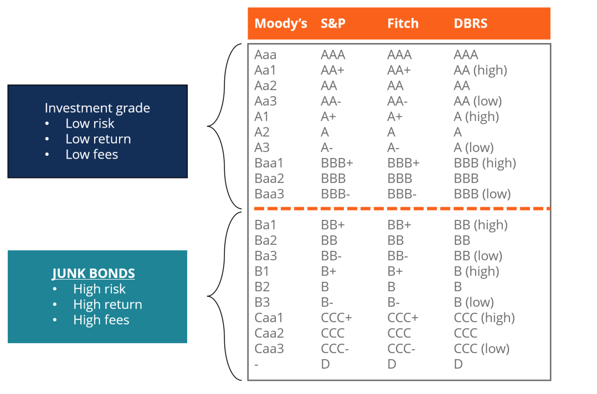

## Table of Contents

## What is a junk bond?

A junk bond is a type of bond that has a higher risk of defaulting, meaning the company might not be able to pay back the money it borrowed. Because of this higher risk, junk bonds usually offer higher interest rates to attract investors. These bonds are often issued by companies that are struggling financially or have a lower credit rating.

Investors might choose to buy junk bonds because the higher interest rates can lead to bigger returns. However, they need to be careful because there's a bigger chance they might lose their money if the company can't pay back the bond. Junk bonds are different from safer bonds, like those issued by the government or strong companies, which have lower interest rates but are more likely to be paid back.

## How are junk bonds different from investment-grade bonds?

Junk bonds and investment-grade bonds are different mainly because of their risk and reward. Junk bonds are riskier because they are issued by companies that might have money problems or a lower credit rating. This means there's a bigger chance the company won't be able to pay back the money it borrowed. Because of this higher risk, junk bonds offer higher interest rates to try to attract investors. People who buy junk bonds are looking for bigger returns, but they have to be okay with the chance of losing their money.

On the other hand, investment-grade bonds are safer. They are issued by companies or governments that are financially strong and have a good credit rating. This means there's a lower chance that they won't be able to pay back the money. Because they are safer, investment-grade bonds offer lower interest rates. Investors who choose these bonds are looking for a more secure place to put their money, even if it means they won't earn as much interest.

In summary, the main difference between junk bonds and investment-grade bonds comes down to risk and reward. Junk bonds have higher risk and higher potential returns, while investment-grade bonds have lower risk but also lower returns. Investors need to decide which type of bond fits their goals and how much risk they are willing to take.

## What are the typical credit ratings for junk bonds?

Junk bonds are usually given credit ratings that are below investment grade. The two main credit rating agencies, Standard & Poor's (S&P) and Moody's, use different scales to rate bonds. For S&P, junk bonds have ratings of BB+ or lower. For Moody's, junk bonds are rated Ba1 or lower. These ratings show that the bond is riskier because the company might have trouble paying back the money it borrowed.

Even though junk bonds are riskier, they can still be split into different levels of risk. For example, bonds rated BB or Ba are considered the least risky among junk bonds. Bonds with ratings like B or Caa are seen as much riskier. The lower the rating, the higher the chance that the company won't be able to pay back the bond. Investors need to understand these ratings to decide if they want to take the risk for the higher interest rates that junk bonds offer.

## Who issues junk bonds and why?

Junk bonds are usually issued by companies that are not in the best financial shape. These companies might be struggling to make money or have a lot of debt. They turn to junk bonds because they need to borrow money, but banks or other traditional lenders might not want to lend to them because they're seen as too risky. By issuing junk bonds, these companies can still get the money they need to keep running or to grow their business.

The reason companies issue junk bonds even though they're risky is that they offer a way to borrow money when other options are limited. The higher interest rates on junk bonds mean the company has to pay more to borrow, but it's often their only choice. Investors who buy these bonds are taking a chance, hoping to earn more money from the high interest rates, but they know there's a bigger risk that the company might not pay them back.

## What are the risks associated with investing in junk bonds?

Investing in junk bonds comes with a big risk that the company might not be able to pay back the money it borrowed. This is called default risk. If the company can't pay back the bond, investors could lose all or part of their money. Junk bonds are usually issued by companies that are not doing well financially, so there's a higher chance they might run into more trouble and not be able to make their payments.

Another risk is that junk bonds can be hard to sell quickly. This is called [liquidity](/wiki/liquidity-risk-premium) risk. If an investor needs to get their money back fast, they might find it tough to find someone else to buy their junk bond, especially if the market is not doing well. This can mean they have to sell the bond for less than they paid for it, losing money in the process.

Lastly, junk bonds can be affected a lot by changes in the economy. If the economy gets worse, companies that issue junk bonds might struggle even more, increasing the chance they won't be able to pay back their bonds. This means that junk bond prices can go up and down a lot, making them a risky choice for investors who don't like a lot of ups and downs in their investments.

## How do junk bonds perform during different economic cycles?

Junk bonds can be very sensitive to changes in the economy. When the economy is doing well, companies that issue junk bonds might make more money and be better able to pay back their debts. This makes junk bonds seem less risky, and their prices can go up. Investors might feel more confident and be more willing to buy junk bonds during good economic times, hoping to earn the higher interest rates.

On the other hand, when the economy is not doing well, junk bonds can struggle. Companies might find it harder to make money and could have trouble paying back their bonds. This makes junk bonds riskier, and their prices can drop. Investors might get scared and sell their junk bonds, or they might avoid buying them in the first place. This can make it harder for companies to issue new junk bonds when the economy is bad.

Overall, junk bonds tend to do better when the economy is strong and worse when the economy is weak. Investors need to think about the current economic situation and how it might change in the future when deciding whether to invest in junk bonds.

## What role do credit rating agencies play in assessing junk bonds?

Credit rating agencies are important because they help investors understand how risky a junk bond is. They give each bond a rating based on how likely the company is to pay back the money it borrowed. If a bond gets a low rating, like BB+ or Ba1 or even lower, it means it's a junk bond and it's riskier. This helps investors know that they might get higher interest rates, but there's also a bigger chance they could lose their money.

These agencies look at a lot of things about the company, like how much money it makes, how much debt it has, and what the economy is doing. They use this information to decide if the company can keep paying back its bonds. When the economy is doing well, the ratings might stay the same or even get better. But if the economy gets worse, the ratings might go down, making the junk bonds even riskier. So, credit rating agencies play a big role in helping investors make smart choices about buying junk bonds.

## How can investors mitigate the risks of junk bond investments?

Investors can lower the risks of junk bond investments by spreading their money around. This means they should not put all their money into one junk bond or even just junk bonds. By investing in different types of bonds, like some junk bonds and some safer bonds, they can balance out the risk. If one junk bond doesn't pay back, the other investments might still be okay. Also, looking at different companies and industries can help, because if one industry is doing badly, another might be doing well.

Another way to reduce risk is by keeping an eye on the economy and the company's credit ratings. If the economy starts to get worse, it might be a good time to sell some junk bonds before their prices drop too much. Also, if a credit rating agency changes a junk bond's rating to an even lower one, it could be a sign that the bond is getting riskier. By staying informed and ready to make changes, investors can make smarter choices and protect their money better.

## What are some historical examples of junk bond market trends?

In the 1980s, junk bonds became very popular because of a man named Michael Milken. He worked at a company called Drexel Burnham Lambert and helped a lot of companies borrow money by selling junk bonds. This helped these companies grow, but it also led to big problems. When the economy got worse, many companies couldn't pay back their junk bonds, and Drexel Burnham Lambert went out of business. This time is remembered as the junk bond crisis of the late 1980s.

After the 2008 financial crisis, junk bonds had another big moment. At first, many investors were scared to buy them because they were worried about the economy. But as the economy started to get better, junk bonds became popular again. Investors were looking for ways to earn more money, and the high interest rates on junk bonds seemed like a good choice. However, when the economy started to slow down again in the mid-2010s, junk bonds started to struggle, and their prices went down. This showed how junk bonds can be risky and how they go up and down with the economy.

## How do changes in interest rates affect junk bond prices and yields?

When interest rates go up, the prices of junk bonds usually go down. This happens because new junk bonds that are issued will have higher interest rates to match the market. Investors might want to buy these new bonds instead of the old ones because they can get more money from the higher interest rates. So, to sell their old junk bonds, people have to lower the price. But the good thing is that the yield, or the amount of money you earn from the bond, goes up when the price goes down. This means if you keep your junk bond, you might earn more money from it, but it's harder to sell it for a good price.

On the other hand, when interest rates go down, junk bond prices usually go up. This is because the old junk bonds now have higher interest rates than the new ones being issued. Investors might want to buy these old bonds because they can earn more money from them. So, people can sell their old junk bonds for a higher price. But the yield on these bonds goes down when the price goes up. This means if you buy a junk bond when interest rates are low, you might not earn as much money from it, but it could be easier to sell it later for a good price.

## What are the regulatory considerations for junk bond issuers and investors?

Junk bond issuers and investors have to follow rules set by the government to make sure everything is fair and safe. For issuers, they need to tell the truth about their company's money situation when they sell junk bonds. They have to share important information with investors so they can make smart choices. If they don't follow these rules, they could get in big trouble. Also, there are rules about how much money companies can borrow and what they can use it for, to stop them from getting into too much debt.

For investors, there are rules to protect them too. They need to know about the risks of junk bonds and how much money they could lose. Sometimes, investors have to be careful about how much they invest in junk bonds because there are limits on how much risk they can take. Also, when they buy and sell junk bonds, they need to follow rules about being honest and fair to other investors. These rules help make sure the junk bond market works well and that everyone is treated fairly.

## How do advanced financial models assess the default probability of junk bonds?

Advanced financial models use a lot of information to figure out how likely it is that a junk bond will not be paid back. These models look at things like how much money the company makes, how much debt it has, and what's happening in the economy. They also use past data to see how often similar companies have had trouble paying back their bonds. By putting all this information together, the models can give a number that shows the chance of the company defaulting on its junk bond. This helps investors know how risky the bond is.

These models can get really complicated. They might use something called a "credit risk model" which looks at many different things at once to predict default. Some models even use computer programs called [machine learning](/wiki/machine-learning) to find patterns in the data that might be hard for people to see. This can make the predictions more accurate. But even with all these fancy tools, it's still hard to be completely sure about the future, so investors need to be careful and not rely only on these models when deciding to buy junk bonds.

## References & Further Reading

[1]: ["Junk Bonds: A Guide to High-Yield Debt Instruments"](https://www.nerdwallet.com/article/investing/high-yield-bonds) by Glenn Yago

[2]: ["High Yield Debt: An Insider's Guide to the Marketplace"](https://www.amazon.com/High-Yield-Debt-Insiders-Marketplace/dp/1119134412) by Rajay Bagaria

[3]: Kothari, S.P., & Shanken, J. (2003). ["Expected Return and Volatility in the Junk Bond Market: The Role of Market Participants."](https://www.jstor.org/stable/2329243) Journal of Financial and Quantitative Analysis.

[4]: Fabozzi, F. J. (Ed.). (1997). ["The Handbook of Fixed Income Securities"](https://www.mhebooklibrary.com/doi/book/10.1036/9781260473902?contentTab=true) (6th ed.). McGraw-Hill.

[5]: ["The Credit Rating Agencies and Their Credit Ratings: What They Are, How They Work, and Why They are Relevant"](https://www.amazon.com/Rating-Agencies-Their-Credit-Ratings/dp/0470018003) by Herwig Langohr and Patricia Langohr

[6]: Aldridge, I. (2013). ["High-Frequency Trading: A Practical Guide to Algorithmic Strategies and Trading Systems"](https://www.ahmetbeyefendi.com/wp-content/uploads/2020/07/High-Frequency-Trading-Irene-Aldridge.pdf) (2nd ed.). Wiley.