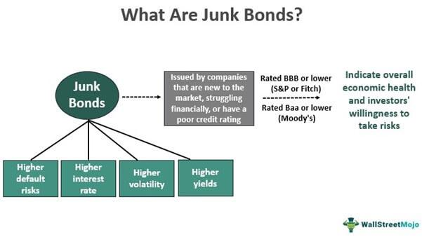

Junk bonds, also known as high-yield bonds, are a category of fixed-income securities that carry a higher risk of default than investment-grade bonds. These bonds are termed "junk" because they are issued by companies with lower credit ratings, usually below "BBB" as per Standard & Poor's or "Baa" according to Moody's Investors Service. The lower credit rating is indicative of a higher likelihood of credit events such as default, making these bonds riskier investments. However, to compensate for the increased risk, junk bonds offer higher yields, making them attractive to investors seeking enhanced returns.

High-yield bonds, although synonymous with junk bonds, emphasize the potential for elevated returns rather than solely focusing on the inherent risks. These bonds play a crucial role in a diversified investment portfolio by providing opportunities for significant income generation. The characteristics that distinguish high-yield bonds include their issuer's credit profile, higher interest payouts, and the typical market perception of these securities being more susceptible to economic fluctuations.

Investing in junk bonds involves substantial risks primarily associated with credit and interest rate volatility. Credit risk refers to the possibility that the bond issuer may fail to make the required interest payments or return the face value at maturity. Interest rate risk occurs because bond prices generally move inversely with interest rates; when rates rise, the value of existing bonds tends to fall. Additionally, the high-yield bond market is sensitive to overall economic health; during downturns, default risks can increase, further impacting bond value.

Additionally, algorithmic trading (algo trading) has become increasingly prevalent in the bond market, including the segment involving junk bonds. Algo trading uses complex algorithms to make trading decisions at speeds and frequencies beyond human capability. While it offers benefits such as increased trading speed and reduced transaction costs, it can also contribute to volatility through phenomena like flash crashes, where rapid price drops occur and recover within minutes or seconds.

For investors, understanding the dynamics of junk bonds and the influence of algorithmic trading is paramount. These elements together shape the risk-return profile of investments in high-yield securities. A nuanced grasp of the intricacies of junk bonds and the potential impact of algorithmic trading enables investors to make informed decisions, balance risks with returns, and strategically include these assets in their portfolios.

This article aims to explore the complexities surrounding junk and high-yield bonds, the inherent risks they pose, and the role algorithmic trading plays in the bond market. Further discussion will include strategies for managing these risks and the potential future implications of these financial components.

## Table of Contents

## Understanding Junk Bonds and High-Yield Bonds

Junk bonds, commonly referred to as high-yield bonds, are securities that [carry](/wiki/carry-trading) a higher risk of default compared to investment-grade bonds. They are issued by companies with lower credit ratings, typically below 'BBB-' from Standard & Poor's (S&P) and Fitch, or below 'Baa3' from Moody's. These lower ratings reflect the issuer's reduced ability to meet financial commitments, thus categorizing them as high-risk investments. Due to this elevated risk, junk bonds offer higher yields to compensate investors for the increased probability of default.

The classification of bonds into junk status is inherently tied to credit rating systems. Credit ratings are created by agencies like S&P, Moody’s, and Fitch to assess the creditworthiness of a bond issuer. These ratings range from 'AAA', indicating the highest credit quality, to 'D', indicating a bond is in default. Junk bonds typically fall below 'BBB-' or 'Baa3', reflecting the issuers' precarious financial state.

High-yield bonds, on the other hand, are attractive to investors due to their potential for substantial returns. The lure is the ability to earn higher interest compared to investment-grade bonds. This makes them appealing for portfolio diversification, especially for investors willing to assume greater risks. The characteristics of high-yield bonds include their [volatility](/wiki/volatility-trading-strategies), sensitivity to economic conditions, and [interest rate](/wiki/interest-rate-trading-strategies) movements. They often exhibit higher coupon rates, sensitivity to market sentiments, and a more substantial possibility of capital gains if the issuing company's credit situation improves.

Historically, the performance of junk bonds has varied significantly. They gained prominence in the 1980s when investor Michael Milken at Drexel Burnham Lambert popularized them as a financing vehicle for leveraged buyouts and corporate takeovers. This period demonstrated the influence junk bonds wielded in fueling economic activity despite their risks. Over subsequent decades, junk bonds have often outperformed in bull markets due to high yields but typically suffer during economic downturns when default rates tend to surge. The market impact of junk bonds is profound as they often indicate broader economic and credit conditions. High default rates can hint at economic distress while successful performance may suggest growth and innovation. Understanding their historical context helps to evaluate their role and implications for today's financial markets.

## Investment Risks Associated with Junk Bonds

Junk bonds, often known as high-yield bonds, are notable for their higher risk, which is attributed to their lower credit ratings typically below investment grade. The primary risks associated with investing in junk bonds include credit risk and interest rate risk. Credit risk, the most significant, reflects the possibility that the bond issuer may default on payments. Given that junk bonds are issued by entities with weaker financial standing, the probability of default is higher compared to investment-grade bonds. Interest rate risk involves the sensitivity of bond prices to fluctuations in interest rates, where rising rates often lead to falling bond prices.

Volatility is a prominent characteristic of the junk bond market, making it sensitive to market fluctuations. Junk bonds tend to exhibit higher volatility than their investment-grade counterparts due to their lower credit ratings and the uncertain financial health of issuers. This heightened volatility can be exacerbated by changes in economic conditions, investor sentiment, and broader market trends.

Economic downturns further amplify these risks. During periods of economic distress, companies with weaker financials may struggle to meet debt obligations, leading to increased default rates. This environment results in bondholders facing greater credit risk, as the likelihood of companies defaulting on their payments rises. Furthermore, during such downturns, [liquidity](/wiki/liquidity-risk-premium) in the junk bond market can dry up, making it difficult for investors to sell bonds without incurring significant losses.

Default risk is a specific aspect of credit risk that investors need to manage carefully. Mitigation strategies include diversifying portfolios to spread risk across various issuers and industries, conducting thorough credit analysis, and maintaining a focus on sectors with stable financial projections. Additionally, structured finance products, like credit default swaps, can offer protection against default events.

Historically, the junk bond market has witnessed both substantial failures and notable successes. The collapse of Drexel Burnham Lambert in the early 1990s is a classic example of failure, triggered by an excessive focus on junk bonds and legal troubles. However, the subsequent decade saw a resurgence in the market, with many investors achieving significant returns as the economy expanded and credit conditions improved. More recently, during the 2008 financial crisis, junk bonds experienced severe stress but proved resilient during the economic recovery that followed, rewarding investors willing to take on the higher risks.

In summary, while junk bonds offer the potential for high returns due to their elevated yields, they come with inherent risks that require careful assessment and management. Understanding these risks and employing strategies to mitigate them can help investors navigate the volatile landscape of high-yield debt.

## Algo Trading and Its Impact on the Bond Market

Algorithmic trading, often referred to as algo trading, involves the use of computer programs and algorithms to automate trading processes with minimal human intervention. In the bond markets, algorithms can analyze vast amounts of market data, execute trades at optimal times, and implement strategies that can maximize returns or minimize risks.

**Benefits of Algo Trading**

One of the primary advantages of algo trading is speed. Algorithms can process data and execute trades in milliseconds, far surpassing human capabilities. This speed enables traders to capitalize on fleeting market opportunities that occur in real-time. Efficiency is another significant benefit, as algorithms can operate on a large scale, executing multiple trades across various bond markets without the errors and delays associated with manual trading.

**Risks Involved with Algo Trading**

Despite its benefits, algo trading carries inherent risks. Flash crashes are a notable concern, where automated trading algorithms trigger rapid, deep market declines and recoveries, often within minutes. Such events can destabilize markets and affect investor confidence. Systemic risks also arise, where interconnected trading systems can propagate errors across the market, potentially leading to widespread financial disruptions.

**Amplifying Risks in High-Yield and Junk Bonds**

When applied to high-yield and junk bonds, algo trading can amplify existing risks. The high volatility and lower liquidity of these bonds mean that algorithmic strategies may cause exaggerated price movements or liquidity shortages, complicating execution and increasing transaction costs. Furthermore, the algorithms may not adequately account for the nuanced credit risks associated with junk bonds, leading to potential mispricing.

**Regulatory Environment**

The regulatory environment for algo trading in bond markets is continuously evolving. Regulators worldwide are grappling with the challenge of balancing innovation with the need to maintain market stability. Rules varying by jurisdiction may require traders to ensure their algorithms undergo thorough testing and incorporate fail-safes to counteract errant behavior. Additionally, there is increased scrutiny on ensuring transparency and accountability in algorithmic strategies to protect investors and the markets’ integrity.

Algo trading has revolutionized bond markets by providing speed and efficiency but presents new challenges and risks, especially when dealing with high-yield and junk bonds. Thus, a comprehensive understanding of both the capabilities and potential pitfalls of [algorithmic trading](/wiki/algorithmic-trading) is crucial for market participants.

## Combining Junk Bonds and Algo Trading: A Risky Proposition?

The integration of algorithmic trading strategies with junk bond investment offers a range of potential benefits, primarily through increased transaction speed, efficiency, and liquidity. Algorithms, driven by complex mathematical models, can quickly analyze large datasets, identify trading opportunities, and execute transactions within milliseconds. By doing so, they can potentially capitalize on small price discrepancies in the volatile junk bond market, providing investors with short-term profit opportunities.

Nevertheless, the use of algorithmic trading in high-yield bonds also brings about compounded risks. The primary risk is the heightened volatility associated with junk bonds, which are already predisposed to greater credit risk and sensitivity to market conditions. When algorithmic trading strategies, which operate based on predefined rules and historical data, intersect with such volatility, they can inadvertently amplify market fluctuations. This phenomenon was highlighted in the "flash crash" of May 2010, where automated high-frequency trading led to a rapid, significant drop in market prices.

A notable case where algo trading has impacted junk bonds was during the 2020 market turbulence caused by the COVID-19 pandemic. As markets reacted unpredictably to the global health crisis, algorithmic trading systems, programmed to respond to specific market indicators, triggered massive sell-offs in high-yield bonds, exacerbating the decline in bond prices. This reaction highlighted the systemic risk posed by algorithmic trading, where the automated and rapid nature of trades can contribute to market destabilization.

To manage risks when combining junk bonds with algorithmic trading, investors can adopt a multi-faceted strategy. Firstly, diversifying portfolios to include a mix of bond types and maturities can mitigate the impact of adverse movements in junk bond prices. Additionally, implementing risk management algorithms that incorporate real-time data feeds and adaptive learning techniques can enhance the resilience of trading strategies to sudden market changes. Investors can also utilize circuit breakers within their trading algorithms, which automatically pause or modify trading activity in response to extreme market volatility.

Looking ahead, the future intersection of algo trading and high-risk bonds is poised for significant evolution due to advancements in technology and data analytics. Machine learning and [artificial intelligence](/wiki/ai-artificial-intelligence) could further refine algorithmic models to better predict and respond to market dynamics. Moreover, increased regulatory scrutiny is likely to shape the development of more robust and transparent trading algorithms, aimed at reducing systemic risk while optimizing market performance. These innovations hold the potential to redefine trading strategies in the high-yield bond market, ensuring a balance between seizing opportunities and managing inherent risks.

## Conclusion

In summary, this article has explored the complex dynamics between junk bonds, high-yield bonds, and the role of algorithmic trading in the bond market. Understanding junk bonds and algo trading is essential for investors aiming to navigate the high-risk territory of high-yield investments. Junk bonds, characterized by their high returns and equally high risks, demand a thorough comprehension of credit and interest rate risks. Simultaneously, algorithmic trading provides speed and efficiency but carries risks such as flash crashes and systemic vulnerabilities, particularly in the context of high-risk securities like junk bonds.

Investors must embrace informed decision-making and continuously educate themselves about these investment instruments' evolving environment. Mastering the balance between the potential high returns of junk bonds and their inherent risks is crucial. Strategic risk management, prudent analysis, and an adaptive approach to leveraging technology will enhance investment outcomes.

Looking forward, the interplay between junk bonds and technology in finance is poised to evolve, with innovations continually reshaping market dynamics. As algorithmic trading advances and new financial technologies emerge, the landscape for junk bonds may witness transformative changes, demanding vigilance and adaptability from investors seeking sustainable returns in this high-stakes arena.

## References & Further Reading

[1]: Altman, E. I. (2012). ["The Anatomy of the High-Yield Bond Market."](https://papers.ssrn.com/sol3/papers.cfm?abstract_id=164501) Empire Financial Research.

[2]: Fabozzi, F. J., & Mann, S. V. (Editors). (2001). ["The Handbook of Fixed Income Securities."](https://www.amazon.com/Handbook-Fixed-Income-Securities-Ninth/dp/1260473899) McGraw Hill.

[3]: Lopez de Prado, M. (2018). ["Advances in Financial Machine Learning."](https://www.amazon.com/Advances-Financial-Machine-Learning-Marcos/dp/1119482089) Wiley.

[4]: Gil-Bazo, J., & Ruiz-Verdú, P. (2009). ["The relation between price dispersion and default risk: Evidence from the corporate bond market."](https://bulletin.bmeb-bi.org/cgi/viewcontent.cgi?article=2415&context=bmeb) The Review of Financial Studies.

[5]: Peters, E., & Kashyap, A. (2019). ["Algorithmic Trading in the U.S. Treasury Market: What Does Data Say?"](https://pmc.ncbi.nlm.nih.gov/articles/PMC10044834/) Bank of Canada Staff Working Paper.