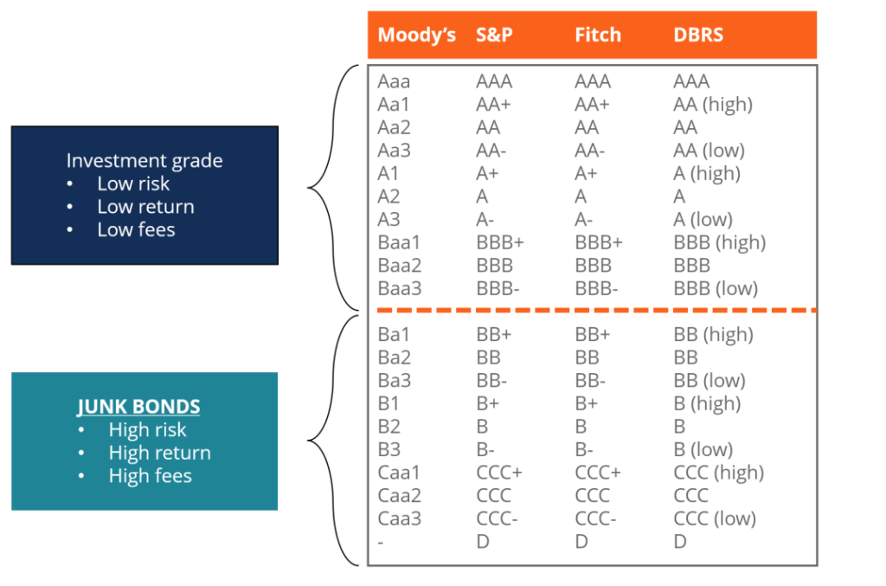

## Table of Contents

## What are junk bonds?

Junk bonds are a type of bond that carries a higher risk of default compared to other bonds. They are also known as high-yield bonds because they offer higher interest rates to investors to make up for the increased risk. Companies that issue junk bonds usually have lower credit ratings, which means they are considered less financially stable than companies with higher ratings.

Investors might choose to buy junk bonds because of the potential for higher returns. However, they need to be aware that there is a greater chance that the company issuing the bond might not be able to pay back the money they borrowed. This makes junk bonds a riskier investment, but they can be a part of a diversified investment portfolio for those willing to take on more risk.

## How are junk bonds different from investment-grade bonds?

Junk bonds and investment-grade bonds are different in how safe they are and how much money they can make for you. Investment-grade bonds are from companies that are seen as financially strong and less likely to have trouble paying back their loans. Because they are safer, they usually give you a lower interest rate. On the other hand, junk bonds come from companies that might not be as financially stable. This makes them riskier, but to make up for that risk, they offer higher interest rates.

Think of it like this: if you lend money to a friend who always pays you back on time, you might not ask for much extra money in return. That's like an investment-grade bond. But if you lend money to a friend who sometimes struggles to pay you back, you might ask for more money to make it worth the risk. That's like a junk bond. So, junk bonds can offer bigger rewards, but there's also a bigger chance you might not get your money back.

## What is the history of junk bonds?

The history of junk bonds really got going in the 1970s and 1980s. Before that, bonds were mostly seen as safe investments. But a man named Michael Milken changed that. He worked at a company called Drexel Burnham Lambert and he believed that high-risk bonds, which people called junk bonds, could make a lot of money. He was right, and soon, junk bonds became a big deal in the world of finance. Companies that couldn't get money from banks started to use junk bonds to borrow money.

In the 1980s, junk bonds helped fuel a lot of business takeovers and mergers. They were a key part of what people called "corporate raiders" taking over other companies. But then, in the late 1980s, things got messy. Drexel Burnham Lambert got into trouble, and Michael Milken ended up going to jail for breaking the law. This made people more careful about junk bonds. But even after all that, junk bonds didn't go away. They are still used today, and investors still see them as a way to make more money, even though they are riskier.

## Who are the typical issuers of junk bonds?

The typical issuers of junk bonds are companies that have a lower credit rating. These companies might be newer, smaller businesses that don't have a long track record of making money. Or they could be bigger companies that are going through tough times and are seen as riskier to lend money to. These companies need money to grow or to keep running, but banks and other traditional lenders might not want to give them loans because they seem too risky.

Sometimes, companies that want to buy other companies will use junk bonds to get the money they need. This is called a leveraged buyout. The company taking over another one will issue junk bonds to investors, promising to pay them back with interest. It's a way for these companies to raise a lot of money quickly, even if they have to pay more in interest because of the higher risk.

## What are the risks associated with investing in junk bonds?

Investing in junk bonds can be risky because the companies that issue them are seen as less likely to pay back the money they borrow. If a company runs into trouble and can't pay its debts, you might lose the money you invested. This is called default risk, and it's higher with junk bonds than with safer bonds. Also, if the economy takes a downturn, junk bond companies might struggle more than others, which can make your investment even riskier.

Another risk is that junk bonds can be harder to sell quickly if you need your money back fast. This is called [liquidity](/wiki/liquidity-risk-premium) risk. Because they are riskier, fewer people might want to buy them from you, which can make it tough to find a buyer when you need one. So, if you need to get your money out of a junk bond in a hurry, you might have to sell it for less than you paid for it.

## What are the potential returns of junk bonds compared to other investments?

Junk bonds can offer higher returns than other types of bonds because they are riskier. If a company that issues a junk bond can pay back the money they borrowed, you can earn more interest than you would from a safer bond. For example, if a safer bond gives you 3% interest each year, a junk bond might give you 6% or more. That extra interest is like a reward for taking on more risk.

But junk bonds are not as safe as other investments like government bonds or high-quality corporate bonds. Those safer investments usually give you less interest, but they are more likely to pay you back. So, if you choose junk bonds, you might make more money, but you also have a bigger chance of losing some or all of your investment if the company can't pay its debts. It's like choosing between a safe, slow ride and a faster, bumpier one that could end in a crash.

## How are junk bonds rated, and what do the ratings mean?

Junk bonds are rated by special companies called credit rating agencies. These agencies look at how likely a company is to pay back its debts. They give the company a letter grade, like a report card. If a bond gets a grade of BB+ or lower from agencies like Standard & Poor's, or Ba1 or lower from Moody's, it's called a junk bond. These ratings mean the bond is riskier because the company might have trouble paying back the money it borrowed.

The ratings help investors understand the risk they are taking. A bond with a high rating, like AAA, is seen as very safe because the company is strong and likely to pay back its debts. But a junk bond with a low rating, like B or CCC, means the company is not as strong and there's a bigger chance it might not pay back the money. So, when you see a bond's rating, it tells you how safe or risky your investment might be.

## What role do junk bonds play in a diversified investment portfolio?

Junk bonds can be a part of a diversified investment portfolio because they can offer higher returns than safer investments. When you have a mix of different types of investments, like stocks, bonds, and cash, adding some junk bonds can help you earn more money. They are riskier, but if the companies that issue them do well, you can get more interest than you would from safer bonds. This can help balance out the lower returns you might get from other parts of your portfolio.

But it's important to be careful with junk bonds because they are riskier. If too many of the companies that issue junk bonds can't pay back their debts, you could lose money. So, when you add junk bonds to your portfolio, you should only put in a small part of your money. This way, you can still enjoy the potential for higher returns without risking too much of your investment. It's all about finding the right balance to grow your money while keeping it safe.

## How can investors mitigate the risks of investing in junk bonds?

Investors can lower the risks of junk bonds by spreading their money around. Instead of putting all their money into one junk bond, they can buy many different junk bonds from different companies. This way, if one company can't pay back its debt, the investor won't lose all their money. It's like not putting all your eggs in one basket. By having a mix of junk bonds, the good ones can help balance out the bad ones.

Another way to reduce risk is to do a lot of research before buying junk bonds. Investors should look at the company's financial health, its plans for the future, and what's happening in the economy. Talking to a financial advisor can also help because they know a lot about these things. By understanding more about the companies issuing the bonds, investors can make smarter choices and pick the junk bonds that are less likely to run into trouble.

## What are some famous examples of junk bond defaults?

One famous example of a junk bond default happened with the company called RJR Nabisco in the late 1980s. RJR Nabisco used a lot of junk bonds to help pay for a big takeover. The company ended up with a lot of debt and had trouble paying it back. This made the junk bonds they issued worth less money, and some investors lost a lot. It was a big deal because it showed how risky junk bonds can be, especially when companies use them to buy other companies.

Another example is the energy company Enron. In the early 2000s, Enron went bankrupt, and it was one of the biggest corporate failures in history. Enron had issued a lot of junk bonds, and when the company failed, those bonds became almost worthless. A lot of people who invested in Enron's junk bonds lost their money. This case made people even more careful about investing in junk bonds because it showed how quickly things can go wrong.

## How have regulatory changes affected the junk bond market?

Regulatory changes have had a big impact on the junk bond market. After the big problems in the 1980s, like with Michael Milken and Drexel Burnham Lambert, the government made new rules to make sure things were safer. These rules made it harder for companies to issue junk bonds without telling investors about the risks. They also made it clearer how junk bonds were rated and sold. All these changes were meant to protect investors and make the junk bond market more honest.

Since then, the rules have kept changing to keep up with the market. For example, after the financial crisis in 2008, there were more rules about how much risk banks and other big investors could take with junk bonds. These rules made it harder for some investors to buy a lot of junk bonds, which changed how the market worked. But even with all these rules, junk bonds are still a big part of the investment world, and people keep finding ways to use them to make money.

## What advanced strategies can be used for trading junk bonds?

One advanced strategy for trading junk bonds is called active management. This means you keep a close eye on the junk bonds you own and the market around them. You look at things like the company's financial health, news that might affect the company, and what's happening with the economy. If you think a junk bond is going to do well, you might buy more of it. But if you think it's going to have trouble, you might sell it before it loses value. This way, you can try to make money by [picking](/wiki/asset-class-picking) the right junk bonds at the right time.

Another strategy is to use something called a bond ladder. This means you buy junk bonds that will pay you back at different times. For example, you might buy one junk bond that pays you back in one year, another in two years, and another in three years. By doing this, you spread out the risk. If one junk bond goes bad, you still have others that might do well. Plus, as each bond pays you back, you can use that money to buy new junk bonds, which helps you keep making money over time.

## References & Further Reading

[1]: Altman, E. I. (2012). ["The Anatomy of the High-Yield Bond Market."](https://papers.ssrn.com/sol3/papers.cfm?abstract_id=164501) Empire Financial Research.

[2]: Fabozzi, F. J., & Mann, S. V. (Editors). (2001). ["The Handbook of Fixed Income Securities."](https://www.amazon.com/Handbook-Fixed-Income-Securities-Ninth/dp/1260473899) McGraw Hill.

[3]: Lopez de Prado, M. (2018). ["Advances in Financial Machine Learning."](https://www.amazon.com/Advances-Financial-Machine-Learning-Marcos/dp/1119482089) Wiley.

[4]: Gil-Bazo, J., & Ruiz-Verdú, P. (2009). ["The relation between price dispersion and default risk: Evidence from the corporate bond market."](https://bulletin.bmeb-bi.org/cgi/viewcontent.cgi?article=2415&context=bmeb) The Review of Financial Studies.

[5]: Peters, E., & Kashyap, A. (2019). ["Algorithmic Trading in the U.S. Treasury Market: What Does Data Say?"](https://pmc.ncbi.nlm.nih.gov/articles/PMC10044834/) Bank of Canada Staff Working Paper.