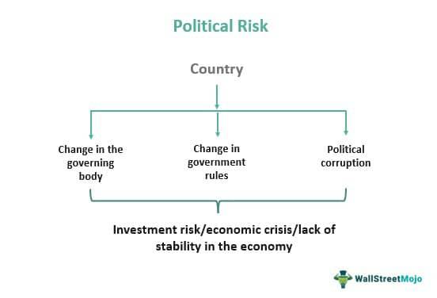

Algorithmic trading, commonly known as algo trading, utilizes computer algorithms to execute trading decisions with remarkable speed and precision. This method has revolutionized global financial markets by enabling trades to be conducted in milliseconds, far outpacing human capabilities. It allows traders to capture market opportunities as they arise, optimize trading costs, and minimize human emotional biases in decision-making.

Despite these advancements, algo trading is not devoid of challenges. A significant concern is legal jurisdiction risks, which are particularly salient in international algorithmic trading. These risks emerge from the need for traders and financial institutions to comply with diverse and ever-evolving legal frameworks across different countries. Changes in these regulations can affect market access, transaction costs, and legal liability, posing potential threats to trading operations.



This article will examine legal jurisdiction risks, focusing on their implications for algorithmic trading and how they can affect profitability and regulatory compliance. By understanding these risks, traders and institutions can better navigate the complex global market landscape. Addressing these challenges is vital for ensuring that algorithmic trading remains a viable and effective strategy on international platforms.

The objective is to provide actionable insights that promote regulatory compliance and effective risk management strategies in algorithmic trading. Recognizing jurisdictional risks helps market participants safeguard their operations and leverage the full potential of algorithmic technologies while adhering to global standards. Ultimately, the robustness against these risks not only protects the trading activities but also enhances market integrity and stability.

## Table of Contents

## Understanding Legal Jurisdiction Risk

Legal jurisdiction risk is a significant consideration for algorithmic traders who engage in international markets. This form of risk emanates from the possibility of unforeseen alterations in legal, regulatory, or political conditions within foreign jurisdictions that can substantially affect trading operations. For algorithmic traders, who often operate across multiple borders, navigating varying legal frameworks presents heightened challenges.

The necessity for compliance with different countries' legal stipulations means that even minor regulatory changes can have pronounced impacts. For instance, modifications in financial regulations may require traders to adjust their trading strategies or models promptly. Political instability, such as an unexpected election result or policy shift, can lead to rapid changes in market dynamics, affecting the stability and predictability required for algorithmic models. Economic instability can further exacerbate these conditions by introducing volatility, which may lead to market disruptions.

Algorithmic traders depend heavily on stable and predictable market conditions to implement strategies based on historical data and correlation patterns. When these conditions are disrupted due to jurisdictional risk factors—such as sudden changes in interest rates, tax laws, or trade agreements—the assumptions underlying their models may become invalid. Consequently, traders might need to revise their return expectations to account for the increased [volatility](/wiki/volatility-trading-strategies) prompted by these unforeseen events.

Addressing jurisdiction risk is crucial for maintaining both profitability and compliance in international trading activities. Traders can implement various strategies to mitigate these risks effectively. This includes continuously monitoring international regulatory updates and political environments to anticipate potential market disruptions. By staying informed, traders can recalibrate their models and strategies to adapt to new conditions, minimizing adverse impacts on their trading outcomes.

## Regulatory Frameworks Governing Algo Trading

Regulatory bodies across the globe, such as the U.S. Securities and Exchange Commission (SEC), the UK's Financial Conduct Authority (FCA), and the European Union's Markets in Financial Instruments Directive II (MiFID II) framework, play a pivotal role in setting standards for [algorithmic trading](/wiki/algorithmic-trading) compliance. These regulations are crucial as they underpin the transparency, risk management, and equitable market practices necessary to deter systemic failures.

In the United States, regulatory oversight is also provided by the Commodity Futures Trading Commission (CFTC) through initiatives like 'Regulation Automated Trading.' This regulation is particularly focused on managing the risks associated with high-frequency trading ([HFT](/wiki/high-frequency-trading-strategies)) and other automated trading systems. It encompasses numerous measures such as registration of algorithmic traders, implementing risk controls, and maintaining transparency to prevent market disruptions.

On the other side of the Atlantic, the European Union's MiFID II stands as a comprehensive regulatory framework that mandates extensive pre-trade and post-trade transparency. With the goal of boosting market efficiency and curbing trading risks, MiFID II obligates firms to provide detailed reports on trade execution and places stringent requirements on algorithmic trading strategies. This includes an assessment of algorithmic models to ensure that they do not contribute to market volatility or unfair trading advantages.

For algorithmic traders, understanding these regulatory landscapes is indispensable. It helps in avoiding regulatory sanctions, thereby maintaining the integrity and stability of trading operations. Compliance with international standards not only mitigates legal jurisdiction risks but also contributes to a robust and trustworthy internet-based trading environment. Hence, continuous education and adaptation to evolving regulatory frameworks are vital for traders seeking to capitalize on technological advancements while ensuring adherence to legal and ethical standards.

## Impact of Jurisdiction Risk on Algorithmic Models

Economic and political instabilities significantly impact the effectiveness of algorithmic models, as these models are largely dependent on market stability and historical data for predictive accuracy. In algorithmic trading, disruptions in foreign exchange rates or unexpected political events can alter the assumed correlations within markets, resulting in the degradation of model performance. For example, sudden fluctuations in exchange rates can disturb the price relationships that algorithms have been designed to exploit. Similarly, political events such as elections or policy changes can induce volatility, thereby affecting the market conditions that algorithms rely on for decision-making.

Algorithmic traders need to proactively integrate these potential disruptions into their strategies. This requires frequent monitoring and adjustment of algorithmic parameters to align with evolving market conditions. For instance, [machine learning](/wiki/machine-learning) models that can adapt in real-time are immensely beneficial in such dynamic environments. These models can be trained to recognize pattern shifts due to jurisdictional changes and re-calibrate their trading instructions accordingly. A simple machine learning approach might involve using [reinforcement learning](/wiki/reinforcement-learning) algorithms, where the model learns optimal trading strategies through trial and error, adjusting in response to market feedback.

Here’s an example of how a reinforcement learning model might be initialized in Python:

```python
import numpy as np

class TradingEnvironment:
    def __init__(self):
        self.state = self._get_initial_state()

    def _get_initial_state(self):
        # Define initial market conditions
        return np.random.rand(10)

    def step(self, action):
        # Simulate market response to action
        next_state = self.state + np.random.normal(0, 0.1, size=self.state.shape)
        reward = self._calculate_reward(next_state, action)
        return next_state, reward

    def _calculate_reward(self, state, action):
        # Reward function based on market outcomes
        return np.dot(state, action)
```

Furthermore, investors must employ diversification and hedging strategies to lessen the impact of jurisdictional risks. Diversification involves spreading trading activities across various regions to reduce dependence on any single country's market stability. By doing so, traders can buffer the effect of localized instabilities. Additionally, hedging strategies, such as using options and forward contracts, can provide a safety net against unfavorable currency movements, offering financial protection.

These adaptive and protective measures are crucial for maintaining robust trading operations despite jurisdictional risks. They enable traders to not only safeguard their portfolios but also leverage jurisdictional diversity as a strategic advantage in the competitive landscape of global algorithmic trading.

## Strategies for Mitigating Jurisdiction Risks in Algo Trading

Implementing effective strategies to mitigate jurisdiction risks in algorithmic trading is crucial for maintaining stability and ensuring regulatory compliance. One foundational approach is establishing robust risk management controls, which include pre-trade checks and post-trade surveillance. Pre-trade checks involve validating trading algorithms against regulatory requirements and market conditions before execution, ensuring they operate within the legal and operational boundaries of the jurisdiction. Post-trade surveillance entails reviewing executed trades for compliance and performance anomalies, allowing traders to address any discrepancies promptly.

Continuous monitoring of legal and regulatory updates is essential for traders to adapt their compliance measures rapidly. By staying informed about changes in regulatory frameworks, traders can implement necessary adjustments to their strategies and operations, minimizing legal exposures and ensuring adherence to current standards.

Diversifying trading activities across multiple jurisdictions is another effective strategy. By spreading operations across different markets, traders can reduce their dependency on a single market’s stability and regulatory environment. This geographical diversification dilutes the risk associated with any one country experiencing political or economic instability, providing a more balanced risk profile.

Hedging strategies are also vital in managing jurisdiction risks, particularly concerning currency fluctuations and cross-border transactions. Options and forward contracts are financial instruments that can be employed to hedge against adverse movements in currency exchange rates. For instance, if a trader anticipates potential volatility in a foreign currency, entering into a forward contract locks in an exchange rate for a future date, thereby providing financial stability and predictability.

Additionally, engaging with legal experts who specialize in international trading laws is crucial. These professionals offer valuable insights into the complexities of jurisdictional regulations and help traders proactively manage risks. By consulting with legal experts, traders can navigate diverse legal landscapes more effectively, ensuring that their operations remain compliant with local and international laws.

In conclusion, by implementing these strategies, algorithmic traders can effectively mitigate jurisdiction risks, ensuring their trading systems are robust and adaptable to the dynamic global market environment.

## Conclusion

Navigating the legal landscape of algorithmic trading involves understanding and managing the complexities of jurisdictional risks. These risks stem from the diverse and dynamic legal frameworks that govern trading activities across different jurisdictions. Traders and institutions must ensure compliance with global regulatory requirements. Adherence to these regulations not only safeguards trading operations but also prevents potential legal and financial penalties.

Effective risk control strategies are paramount. Implementing robust risk management measures, including pre-trade checks and real-time monitoring of trading activities, helps mitigate exposure to adverse legal changes. This proactive approach enables traders to swiftly adapt their strategies in response to regulatory updates and market volatility, reducing the risk of unexpected disruptions.

As the trading environment continues to evolve, staying informed and flexible is crucial for long-term success. Algo traders must remain vigilant, continuously evaluating and updating their strategies to align with shifting global market dynamics. This constant reassessment is essential to maintain the efficacy of their algorithmic models and ensure they are equipped to handle unforeseen challenges.

Ultimately, aligning with best practices in algorithmic trading not only mitigates jurisdictional risks but also leverages the full potential of this technology. By fostering a culture of compliance and innovation, traders can enhance their operational resilience and capitalize on the efficiencies offered by algorithmic trading. This strategic alignment ensures that traders remain competitive in the ever-changing landscape of global financial markets.

## References & Further Reading

[1]: Aldridge, I. (2013). ["High-Frequency Trading: A Practical Guide to Algorithmic Strategies and Trading Systems"](https://www.amazon.com/High-Frequency-Trading-Practical-Algorithmic-Strategies/dp/1118343506). Wiley.

[2]: Narang, R. K. (2013). ["Inside the Black Box: A Simple Guide to Quantitative and High Frequency Trading"](https://onlinelibrary.wiley.com/doi/book/10.1002/9781118662717). Wiley.

[3]: Kissell, R. (Ed.). (2013). ["The Science of Algorithmic Trading and Portfolio Management"](https://www.sciencedirect.com/book/9780124016897/the-science-of-algorithmic-trading-and-portfolio-management). Academic Press.

[4]: European Securities and Markets Authority. (2018). ["MiFID II: Key Topics"](https://www.globalrelay.com/resources/the-compliance-hub/rules-and-regulations/midif-ii-and-eu-financial-markets/). ESMA. 

[5]: Securities and Exchange Commission. ["Regulation of Exchanges and Alternative Trading Systems"](https://www.sec.gov/rules-regulations/1998/12/regulation-exchanges-alternative-trading-systems). SEC. 

[6]: Commodity Futures Trading Commission. ["Regulation Automated Trading"](https://www.cftc.gov/PressRoom/PressReleases/7283-15). CFTC.