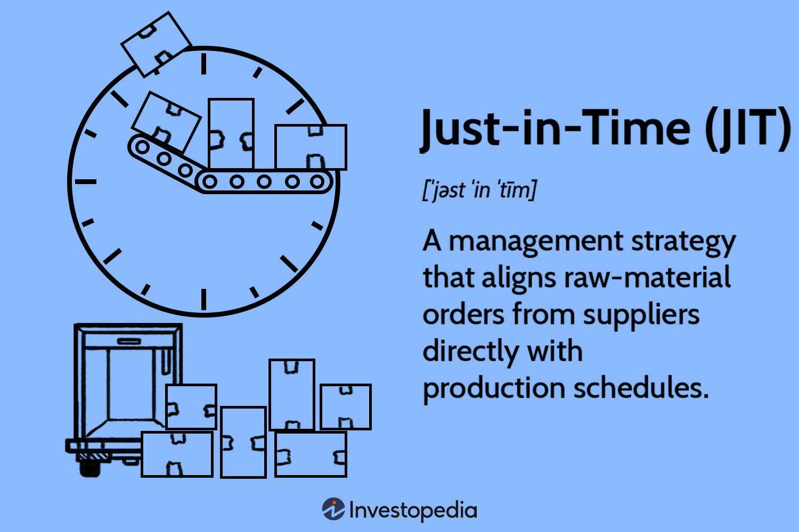

In the fast-paced world of modern manufacturing, strategies that enhance efficiency and reduce waste are in high demand. Just-in-Time (JIT) manufacturing offers a solution by aligning production schedules closely with customer demand, thereby optimizing inventory levels. This methodology focuses on producing goods precisely when they are needed and in the exact quantities required, which reduces excess stock and minimizes storage costs. At its core, JIT is about creating a responsive supply chain that can adapt to changes in customer orders rapidly, making it an attractive approach for businesses seeking to streamline operations and boost profitability.

JIT manufacturing is built on several key principles, including waste reduction, continuous improvement, and the close synchronization of production processes with market needs. By reducing the amount of work-in-progress inventory and finished goods on hand, companies can decrease holding costs and free up capital for other operations. This can lead to improved production efficiency and enhanced product quality, as resources are allocated more effectively and potential defects are identified and addressed promptly during smaller, more frequent production runs.



However, implementing JIT also poses certain challenges. The success of this methodology relies heavily on accurate demand forecasting and reliable supply chain coordination. Supply chain disruptions can pose significant risks, potentially impacting the timely delivery of materials required for production. As such, businesses must establish agile and collaborative relationships with suppliers to mitigate these risks and ensure the smooth execution of JIT.

Technological advancements play a crucial role in overcoming these challenges and achieving effective JIT implementation. Today's businesses have access to advanced tools such as cloud-based Enterprise Resource Planning (ERP) and Manufacturing Resource Planning (MRP) systems. These systems provide real-time data and analytics, facilitating improved decision-making and communication throughout the supply chain. By leveraging technology, companies can enhance their ability to predict demand accurately and respond swiftly to changes, gaining a competitive edge in the marketplace.

The principles and practices of JIT are applicable across various sectors, from automotive and electronics manufacturing to healthcare and retail. When executed strategically, JIT can lead to substantial operational improvements, enabling businesses to become more agile and responsive to customer needs. This article will further explore the intricacies of JIT, including its benefits, potential challenges, and how technology can support successful implementation, providing insights into how businesses can harness this strategy to achieve greater efficiency and profitability.

## Table of Contents

## What is Just-in-Time Manufacturing?

Just-in-Time (JIT) manufacturing is a production methodology that aims to produce goods precisely when they are needed and in the exact quantities required, thereby minimizing waste. This method streamlines production processes by synchronizing manufacturing operations with actual customer demand, eliminating excess inventory and reducing storage costs. By aligning production schedules closely with customer orders, JIT enhances efficiency across the supply chain.

JIT shares similarities with lean manufacturing in that both philosophies emphasize waste reduction and optimization of resources. However, while lean manufacturing focuses broadly on eliminating waste throughout all manufacturing processes, JIT specifically targets inventory waste by ensuring materials and components are delivered immediately before they are needed in the production process. This minimizes the cost and space associated with holding inventory and reduces potential losses due to excess or obsolete stock.

A critical requirement for successful JIT implementation is accurate demand forecasting. Precise predictions enable manufacturers to produce only the quantities required, thereby curtailing overproduction. Inaccurate forecasts, however, can lead to production shortfalls or excess inventory, resulting in potential disruptions throughout the supply chain.

Furthermore, reliable supply chain coordination is vital for JIT manufacturing. This coordination involves establishing robust relationships with suppliers to ensure timely and efficient delivery of high-quality materials. In a perfectly executed JIT system, the arrival of materials is precisely timed with the production process to maintain seamless operations without delays.

In conclusion, JIT manufacturing represents a strategic approach to production that prioritizes demand-pull principles over traditional, inventory-heavy methods. Through effective demand forecasting and meticulous supply chain management, JIT facilitates a more responsive and efficient manufacturing process suitable for today's competitive and fluctuating market demands.

## Advantages and Disadvantages of JIT

Just-in-Time (JIT) manufacturing offers a plethora of advantages that contribute to the enhanced competitiveness of businesses. By aligning production closely with actual customer demand, companies can significantly reduce inventory costs. This reduction is achieved by minimizing excess stock, which not only lowers storage costs but also decreases the risk of obsolescence. Furthermore, improved production efficiency is another key benefit of JIT, as it encourages a streamlined and leaner production process. This efficiency often leads to faster turnaround times and a more agile response to market fluctuations.

In addition to cost and efficiency improvements, JIT also enhances product quality. By focusing on smaller lot sizes produced according to actual demand, defects can be detected and rectified more swiftly. This approach fosters a culture of continuous quality improvement and can lead to higher customer satisfaction.

Despite these benefits, JIT poses certain challenges. One major risk is the potential for supply chain disruptions. With minimal inventory on hand, any delay in the supply chain can halt production, leading to potential losses and customer dissatisfaction. Thus, JIT demands a highly reliable and agile relationship with suppliers to ensure timely delivery of materials.

Moreover, the JIT model necessitates a delicate balance between minimizing inventory and fulfilling customer orders. Any misalignment in demand forecasting can result in either inventory shortages or overproduction, both of which are detrimental to business operations. Therefore, maintaining this balance is crucial for the success of JIT strategies.

Ultimately, while JIT manufacturing presents numerous opportunities for cost savings and efficiency gains, it requires meticulous planning and robust supply chain partnerships to mitigate its inherent risks.

## JIT Implementation Tips

Building strong supplier relationships is critical for the successful implementation of Just-in-Time (JIT) manufacturing, as these partnerships help mitigate potential disruptions in the supply chain. Effective collaboration with suppliers ensures timely delivery of materials, maintaining the seamless production flow essential for JIT. Establishing clear expectations, creating long-term agreements, and fostering transparency in communication can significantly strengthen these relationships, minimizing delays and optimizing resource allocation.

Standardizing procedures is another essential aspect of JIT implementation. By creating consistent and repeatable processes, companies can enhance efficiency, reduce variation, and improve quality control across production operations. Standardization also facilitates training and reduces errors, as employees follow clear guidelines applicable across various production scenarios. Streamlining internal communication further supports these processes by enabling quick decision-making and information-sharing among teams, which is vital for agile responses to demand fluctuations.

Technology plays a pivotal role in supporting JIT execution. Cloud-based Enterprise Resource Planning (ERP) and Material Requirements Planning (MRP) systems can significantly enhance operational efficiency by providing real-time data and analytics. These systems enable the integration of different business functions, allowing seamless communication and coordination of manufacturing, procurement, and distribution processes. For instance, real-time inventory management, facilitated by MRP systems, ensures that materials are available when needed and in the correct quantities, thereby reducing overstocking and understocking issues.

Here's an example of how technology, particularly ERP systems, can be implemented in Python to enhance JIT processes:

```python
import pandas as pd

# Example inventory data
inventory_data = {
    'Item': ['Component_A', 'Component_B', 'Component_C'],
    'Stock_Level': [150, 200, 80],
    'Reorder_Level': [100, 150, 50]
}

# Create DataFrame
inventory_df = pd.DataFrame(inventory_data)

def check_reorder(inventory_df):
    # Determine items below reorder level
    reorder_items = inventory_df[inventory_df['Stock_Level'] < inventory_df['Reorder_Level']]
    return reorder_items

reorder_items = check_reorder(inventory_df)
print("Items to Reorder:")
print(reorder_items)
```

In this example, a simple function checks inventory levels against predefined reorder levels, ensuring timely replenishment and preventing stockouts. Such automated processes allow companies to maintain lean inventories while still meeting production demands, a cornerstone of JIT manufacturing.

Investing in the right technological tools and building solid supplier relationships facilitates efficient JIT implementation. Achieving these operational efficiencies ultimately supports the broader goals of JIT: reducing waste, optimizing inventory, and aligning production schedules with actual customer demand.

## The Role of Technology in JIT

Incorporating advanced technologies is pivotal in the Just-in-Time (JIT) manufacturing process, which aims to optimize production efficiency and minimize waste by aligning closely with consumer demand. The integration of technologies such as Artificial Intelligence (AI), the Internet of Things (IoT), and real-time analytics can vastly improve demand forecasting and supply chain coordination, key elements in a successful JIT framework.

AI provides the capability to analyze vast amounts of data quickly and accurately to predict future demand patterns. By leveraging [machine learning](/wiki/machine-learning) algorithms, companies can refine their production schedules to better meet customer needs without overproducing. This predictive capability allows for dynamic adjustments, enhancing the flexibility and responsiveness of manufacturing operations.

The IoT further contributes by creating a network of interconnected devices that communicate and exchange data seamlessly. In a JIT environment, IoT devices can track inventory levels in real-time, monitor production equipment, and provide live updates on the status of deliveries. This connectivity ensures a continuous flow of information, reducing the risk of supply chain disruptions and maximizing the synchronization between production and demand.

Real-time analytics play an equally critical role by providing instantaneous insights into manufacturing processes. Through data visualization and analysis, companies can identify inefficiencies, bottleneck issues, and monitor the overall health of their operations. Decision-makers can use these insights to implement corrective measures promptly, thus maintaining the smooth functioning of JIT systems.

Moreover, deploying cloud-based Enterprise Resource Planning (ERP) and Material Requirements Planning (MRP) systems can transform the integration of various operational facets. These systems allow different departments within a company to access centralized data platforms, enhancing communication and coordination across the supply chain. Cloud-based solutions offer scalability, flexibility, and accessibility that are essential for adapting to the variable nature of JIT manufacturing demands.

Consider a Python example where a manufacturer uses real-time data to optimize production schedules. Here is how a basic demand forecasting model might be implemented using Python's machine learning library, scikit-learn:

```python
from sklearn.linear_model import LinearRegression
import numpy as np

# Sample historical data for training the model
demand_trend = np.array([[1, 350], [2, 420], [3, 480], [4, 500], [5, 560]])
X = demand_trend[:, 0].reshape(-1, 1)  # Time period
y = demand_trend[:, 1]  # Demand

# Train the model
model = LinearRegression()
model.fit(X, y)

# Predict future demand
future_period = np.array([[6], [7], [8]])  # Future time periods
predicted_demand = model.predict(future_period)

print(predicted_demand)
```

This basic linear regression model could be part of a broader AI application for real-time demand forecasting, enabling manufacturers to align their production schedules more effectively with predicted demand.

Investing in the right technological tools is not merely an option but a necessity for maintaining a competitive edge through JIT manufacturing. The appropriate use of technologies not only supports efficient execution of JIT principles but also arms companies with the agility needed to navigate the complexities of modern supply chains. This strategic technological integration ensures that JIT remains a viable and robust approach to contemporary manufacturing challenges.

## Conclusion

Just-in-Time (JIT) manufacturing presents a sophisticated approach to addressing modern production challenges by enhancing efficiency, reducing waste, and boosting profitability. This production methodology, which aligns production schedules with precise customer demand, minimizes inventory costs and optimizes resource allocation. Despite inherent risks such as supply chain vulnerabilities and the demand for rapid responsiveness, strategic implementation of JIT can lead to significant operational improvements.

To navigate these challenges effectively, companies can foster strong relationships with reliable suppliers, ensuring a dependable flow of materials and minimizing disruptions. Moreover, effective communication across all organizational levels is crucial to maintaining the delicate balance required by JIT systems. Enhanced internal coordination allows for swift responses to market changes, mitigating potential delays.

Robust technology plays a pivotal role in maximizing JIT's benefits. By integrating advanced tools such as AI-driven analytics and Internet of Things (IoT) devices, businesses can enhance demand forecasting accuracy and supply chain visibility. Cloud-based systems like ERP (Enterprise Resource Planning)and MRP (Material Requirements Planning) facilitate real-time data sharing and decision-making, empowering organizations to maintain a competitive edge.

In conclusion, companies that successfully implement JIT principles—supported by strong supplier networks, effective communication, and cutting-edge technology—can thrive in competitive markets. By addressing potential risks and optimizing internal processes, JIT offers a path to substantial efficiency gains and profitability enhancements.

## References & Further Reading

[1]: Womack, J.P., Jones, D.T., & Roos, D. (1990). ["The Machine That Changed the World: The Story of Lean Production."](https://books.google.com/books/about/The_Machine_That_Changed_the_World.html?id=9NHmNCmDUUoC) Simon & Schuster.

[2]: Ohno, T. (1988). ["Toyota Production System: Beyond Large-Scale Production."](https://www.taylorfrancis.com/books/mono/10.4324/9780429273018/toyota-production-system-taiichi-ohno) Productivity Press.

[3]: Schonberger, R.J. (1982). ["Japanese Manufacturing Techniques: Nine Hidden Lessons in Simplicity."](https://www.researchgate.net/publication/31663789_Japanese_Manufacturing_Techniques_Nine_Hidden_Lessons_in_Simplicity) Free Press.

[4]: Slack, N., Chambers, S., & Johnston, R. (2010). ["Operations Management."](https://books.google.com/books/about/Operations_Management.html?id=ZhLBcfUXaNwC) Pearson Education.

[5]: Shah, R., & Ward, P.T. (2003). ["Lean manufacturing: context, practice bundles, and performance."](https://www.sciencedirect.com/science/article/pii/S0272696302001080) Journal of Operations Management.