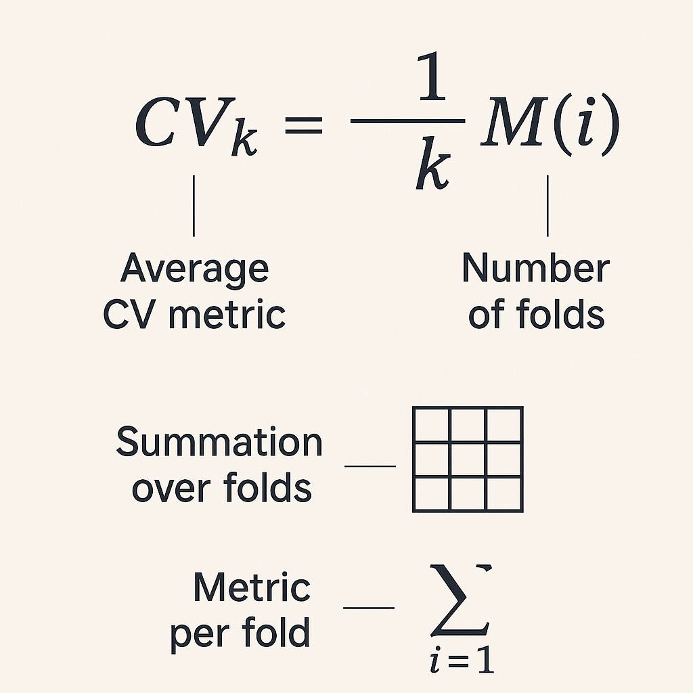
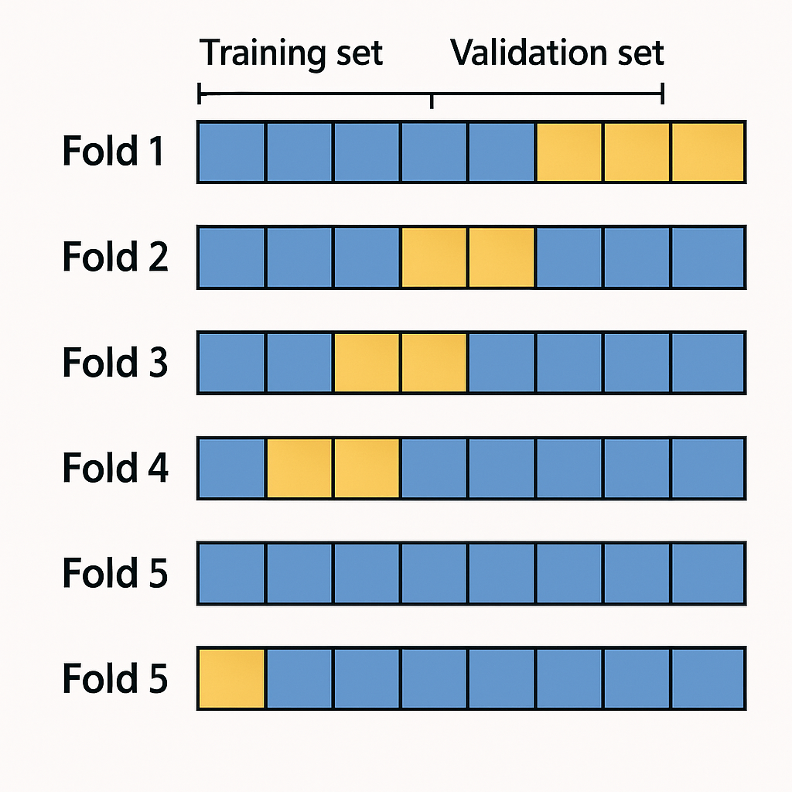
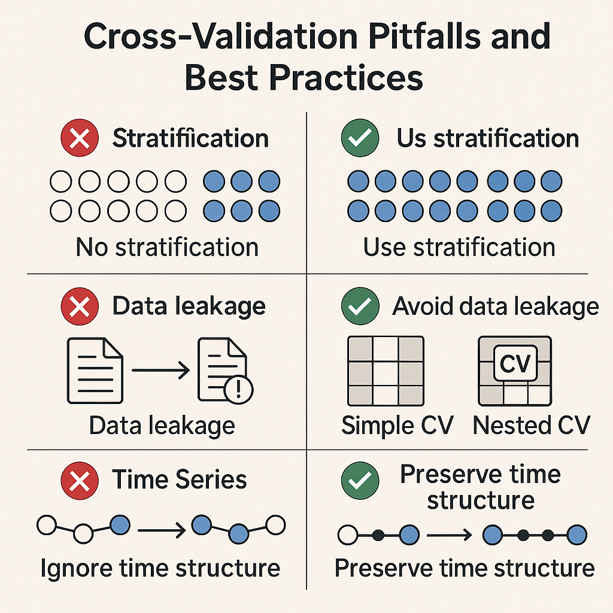

## Table of Contents


Cross-validation is a fundamental technique for **model validation** in machine learning and statistical modeling. Its primary goal is to assess how well a predictive model will generalize to independent datasets – in other words, to **estimate the model’s performance on unseen data**. Among various cross-validation methods, **k-fold cross-validation** is one of the most popular due to its balance between bias and variance in the validation process. Instead of a single train-test split (which could be sensitive to how the data is split), k-fold CV provides a more robust estimate by averaging performance over *k* different splits. This approach is widely used by machine learning practitioners and quantitative researchers alike, whether evaluating a classifier on an image dataset or backtesting a trading strategy on historical market data. Tools and platforms such as *Papers With Backtest* even provide rich datasets for model development and backtesting, underlining the importance of rigorous validation techniques like cross-validation in real-world projects.

In essence, k-fold cross-validation helps to address two key issues in model development: **overfitting** and **selection bias**. By training and testing the model on multiple splits of the data, we can detect if the model is overly tuned to particular data subsets and ensure the evaluation is not an artifact of a lucky (or unlucky) train-test split. The result is a more reliable measure of how the model might perform on new data. In the following sections, we will explain how k-fold CV works, provide a mathematical formulation, demonstrate practical Python examples, discuss its advantages and limitations, and explore variations and best practices for using cross-validation effectively.



## How Does K-Fold Cross-Validation Work?

**K-fold cross-validation** involves partitioning the dataset into *k* roughly equal-sized subsets called *folds*. The model training and validation process is then repeated *k* times (iterations), each time using a different fold as the **validation set** and the remaining *k-1* folds as the **training set**. This way, each data point ends up being used for validation exactly once and for training in the other *k-1* iterations. The procedure can be summarized in steps:

1. **Shuffle and Split** (if appropriate): Randomly shuffle the dataset (for i.i.d. data) and split it into *k* equal folds (subsets).

2. **Iterative Training/Validation**: For each *i* from 1 to *k*:

   * Take the *i*-th fold as the **validation set** (also called the *hold-out* or *out-of-sample* fold).
   * Take the remaining *k-1* folds as the **training set** and train the model on this training data.
   * Evaluate the trained model on the validation fold, recording the chosen performance metric (e.g., accuracy, MSE, etc.) for this fold.

3. **Aggregate Results**: After *k* iterations, compute the **average performance** across all *k* validation folds. This average is the overall cross-validation score, and it serves as an estimate of the model’s generalization performance. Optionally, one may compute the standard deviation of the fold scores to gauge the variability.

This iterative process ensures that **every observation is used for both training and validation** exactly once. By the end, we have *k* separate evaluation results (e.g., 5 accuracy scores in a 5-fold CV). These results are then averaged to produce a single performance estimate, often called the **cross-validated score (CVS)**. Mathematically, if we denote by \$M(i)\$ the performance metric (e.g. error or accuracy) obtained from the \$i\$-th fold’s validation, the **k-fold CV estimate** can be written as:

$\text{CV}_{k} = \frac{1}{k}\sum_{i=1}^{k} M(i).$

For example, if \$M(i)\$ is the error on fold \$i\$, this formula gives the cross-validation error. Conversely, if \$M(i)\$ is an accuracy or \$R^2\$ score, it gives the cross-validated score. In practice, one often uses **accuracy for classification**, **mean squared error (MSE)** or **mean absolute error (MAE) for regression**, or other domain-specific metrics as \$M(i)\$. The final CV estimate \$\text{CV}\_{k}\$ provides a more **generalized analysis of the model’s performance** by leveraging multiple train-test splits, mitigating the risk that you just got “lucky” or “unlucky” with a single arbitrary split.

### An Example Calculation

To make this concrete, imagine we have a dataset and we perform 5-fold cross-validation for a classification model. Suppose the accuracy on each fold’s validation data comes out as: 88%, 92%, 90%, 91%, and 89%. The overall 5-fold CV accuracy is the average:

$\text{CV}_{5} = \frac{88 + 92 + 90 + 91 + 89}{5} = 90\% \text{ (approximately)}.$

We would report \~90% as the model’s estimated accuracy on unseen data (often along with the range or standard deviation of these scores, to indicate variability). This is likely a more reliable estimate than, say, a single train-test split accuracy, especially if the dataset is not extremely large.

## Mathematical Formulation and Notation

Let’s formalize the process with notation. Assume our full dataset \$D\$ consists of \$n\$ samples \$D = {(x\_1, y\_1), (x\_2, y\_2), \dots, (x\_n, y\_n)}\$ (with features \$x\_i\$ and target \$y\_i\$). A k-fold split will partition \$D\$ into folds \$D\_1, D\_2, \dots, D\_k\$ of (approximately) equal size: \$D = D\_1 \cup D\_2 \cup \cdots \cup D\_k\$ and \$D\_i \cap D\_j = \emptyset\$ for \$i \neq j\$. For each fold \$j \in {1,\dots,k}\$, define:

* The training set for fold \$j\$: \$T\_j = D \setminus D\_j\$ (all data except the \$j\$-th fold). This has roughly \$\frac{k-1}{k}n\$ samples.

* The validation set for fold \$j\$: \$V\_j = D\_j\$ (the \$j\$-th fold itself), with roughly \$\frac{1}{k}n\$ samples.

Now, train your model (call it \$f\_j\$) on \$T\_j\$, and evaluate its performance on \$V\_j\$. Let \$\mathcal{L}(f, V)\$ denote a loss function or error measure for model \$f\$ evaluated on dataset \$V\$ (for example, misclassification rate or MSE), or alternatively let \$\mathcal{S}(f, V)\$ be a score function (like accuracy or \$R^2\$ where higher is better). For consistency, we’ll use a loss definition \$L\_j = \mathcal{L}(f\_j, V\_j)\$ for fold \$j\$ (lower is better). The **k-fold cross-validation error** is:

$\text{CV-error}_{k} = \frac{1}{k} \sum_{j=1}^k L_j,$

which matches the earlier description (if \$L\_j\$ were an error metric). If instead we are averaging a score (where higher is better), we can write the **cross-validated score** as:

$\text{CV-score}_{k} = \frac{1}{k} \sum_{j=1}^k \mathcal{S}(f_j, V_j).$

In many contexts, authors will use \$L\_j\$ to denote the *error* on fold \$j\$, so that a smaller CV-error is better. For instance, a textbook formula might say: *CV Error = \$\frac{1}{k}\sum\_{j=1}^k \text{err}\_j\$*, where \$\text{err}\_j\$ could be something like the misclassification rate on fold \$j\$. The key point is that **each fold’s contribution is equally weighted**, and the overall statistic is the simple average of the *k* results.

It’s worth noting that k-fold CV with \$k=n\$ (where \$n\$ is the number of samples) corresponds to the special case known as **Leave-One-Out Cross-Validation (LOOCV)**. In LOOCV, each “fold” is just a single sample: the model is trained on \$n-1\$ samples and tested on the one left-out sample, repeating this for each sample. LOOCV can be seen as an extreme form of cross-validation that minimizes data wastage but can be computationally expensive and sometimes has high variance in the estimate. In practice, common choices are \$k=5\$ or \$k=10\$ for k-fold CV, which tend to offer a good trade-off between computational efficiency and estimate stability.

## Practical Python Example using Scikit-Learn

To illustrate k-fold cross-validation in code, we’ll use **scikit-learn** (sklearn) – a popular ML library in Python – along with **pandas** for data handling. Scikit-learn provides convenient utilities for cross-validation. For example, the `cross_val_score` function automates the k-fold splitting, training, and scoring. Below is a simple example using the famous Iris dataset for classification:

```python
import numpy as np
import pandas as pd
from sklearn.datasets import load_iris
from sklearn.model_selection import cross_val_score, KFold
from sklearn.linear_model import LogisticRegression

# Load dataset (Iris flower data)
X, y = load_iris(return_X_y=True)
print("Dataset size:", X.shape, "Labels:", np.unique(y))

# Define a model (Logistic Regression classifier)
model = LogisticRegression(max_iter=1000)

# Perform 5-fold cross-validation and obtain accuracy for each fold
scores = cross_val_score(model, X, y, cv=5, scoring='accuracy')
print("Accuracy on each fold:", scores)
print("Mean cross-validated accuracy:", scores.mean())
```

In this code, `cross_val_score` splits `X` and `y` into 5 folds, trains the `LogisticRegression` model on 4 folds and evaluates on the remaining 1 fold, repeating this 5 times. The result `scores` is an array of 5 accuracy values (one for each fold). We then print the scores and their mean. A sample output might be:

```
Dataset size: (150, 4) Labels: [0 1 2]  
Accuracy on each fold: [0.967 0.900 0.933 0.933 0.967]  
Mean cross-validated accuracy: 0.940  
```

This indicates, for example, that the model achieved about 94.0% average accuracy with some variation across folds. Using `cross_val_score` is convenient because it handles the folds internally and by default will use **StratifiedKFold** for classification tasks (to preserve class balance in each fold).

We can also perform cross-validation manually using `KFold` or `StratifiedKFold` from sklearn. This gives more control or insight into the process:

```python
from sklearn.model_selection import StratifiedKFold

# Set up a stratified 5-fold split (maintains class proportion in each fold)
skf = StratifiedKFold(n_splits=5, shuffle=True, random_state=42)

fold = 1
for train_index, val_index in skf.split(X, y):
    X_train, X_val = X[train_index], X[val_index]
    y_train, y_val = y[train_index], y[val_index]
    model.fit(X_train, y_train)
    val_score = model.score(X_val, y_val)  # evaluate on validation fold
    print(f"Fold {fold} validation accuracy: {val_score:.3f}")
    fold += 1
```

Here we explicitly create 5 stratified folds and then loop through them, training and evaluating the model on each fold. The result should match the earlier approach. This manual method is useful if you need to, say, **capture the trained models or predictions from each fold**, or perform additional analysis per fold.

Finally, it’s important to note that cross-validation is typically used only on the **training dataset** during model development. After using CV to tune models or select the best approach, one would still do a final evaluation on a separate **hold-out test set** (or out-of-sample data) that was never used during cross-validation, to confirm the model’s performance.

## Advantages of K-Fold Cross-Validation

K-fold cross-validation offers several notable advantages over simpler train-test splits:

* **More Efficient Use of Data**: Unlike a single hold-out split that might use (for example) 80% of data for training and 20% for testing, k-fold CV uses *all* data for training *and* all data for validation, just in different iterations. Every sample is in a validation fold once. This means we aren’t “wasting” data – an important benefit when the dataset is small. In problems where data is limited, using 5-fold or 10-fold CV can give a better estimation of model performance than a one-time 80/20 split.

* **Reduced Variance in Performance Estimate**: Because the model is evaluated on multiple folds, the average performance is less sensitive to how the data is split. A single train-test split could by chance yield an unusually easy or hard test set, skewing the results. Cross-validation smooths out these idiosyncrasies by looking at *k* different splits and averaging. This often leads to a more reliable estimate of how the model will perform on new data in general.

* **Helps with Model Selection and Hyperparameter Tuning**: Cross-validation provides a framework to compare models or hyperparameters fairly. For example, if you are choosing between five different models, you can compute the k-fold CV score for each under identical data conditions (each model gets tested on the same folds). This helps in selecting the model that generalizes best, rather than one that might just have lucked out on a particular train-test split. Moreover, techniques like **grid search** or **randomized search** for hyperparameter tuning are commonly wrapped in cross-validation (`GridSearchCV` or `RandomizedSearchCV` in sklearn) to ensure that hyperparameters are chosen based on robust performance and not overfit to a single validation set.

* **Detecting Overfitting**: By training and testing on multiple segments of data, k-fold CV can reveal if a model is overfitting. For instance, if the model performs **very well on training folds but consistently poorly on validation folds**, that’s a red flag. While this can also be noticed with a single validation set, cross-validation gives multiple opportunities to observe the model’s behavior on unseen data. Consistently high training performance but low validation performance across folds is a strong indication of overfitting (or data leakage), prompting the practitioner to adjust the model complexity or features. In domains like algorithmic trading, this helps ensure a strategy isn’t just curve-fit to historical noise.

* **Works with Many Metrics and Models**: The CV procedure is model-agnostic. You can use it with any training algorithm (regression, classifiers, neural networks, etc.) and any evaluation metric. It’s a general methodology for evaluation. Many libraries (like sklearn) have built-in support that makes it easy to apply CV to different kinds of models uniformly.

In summary, k-fold CV gives a **more robust and data-efficient performance estimate** than a single split. These advantages make it an indispensable tool in a data scientist’s or quant researcher’s toolbox for building reliable models and avoiding self-deception about a model’s true performance.

## Limitations and Practical Considerations

Despite its strengths, k-fold cross-validation has several **limitations and challenges** to be mindful of:

* **Computational Cost**: Training and evaluating the model *k* times can be computationally expensive, especially if *k* is large or the model training is slow (e.g. training a deep neural network). For instance, 10-fold CV requires training the model 10 times. This is **k times more work** than a single train/test split. In practice, \$k=5\$ or \$k=10\$ are common defaults partly to limit this cost. If the dataset is very large or model training is very costly, practitioners might use lower \$k\$ or use other approaches (like a single hold-out or use cross-validation on a subsample) to trade off rigor vs. computation.

* **Choice of k**: The results of CV can depend on the choice of *k*. A smaller *k* (like 3-fold) means each validation set is larger (1/3 of data) which can give a higher-variance estimate (since fewer folds averaged), but lower computational cost. A larger *k* (like 10 or even \$n\$ for LOOCV) means each validation fold is smaller, potentially more variance in each fold’s result, but more folds to average out – often yielding a slightly lower bias estimate of performance but at the cost of more computation and possibly higher variance in the estimate for small \$n\$. In many cases, \$k=5\$ or \$10\$ has been empirically found to be a sweet spot, but this is not a hard rule. It’s wise to consider *k* as a hyperparameter itself; for critical applications, one might try multiple values of *k* to see if results are stable.

* **IID Assumption (Independently Identically Distributed Data)**: **Standard k-fold CV assumes that data points are independent of each other and identically distributed**. If this assumption is violated, a naive k-fold can lead to misleading results. A common scenario is **time-series data** (e.g. stock prices over time) where temporal order matters. Randomly shuffling and splitting such data could lead to **training on future data to predict the past** due to time leakage, which is invalid. Similarly, in datasets where there are groups or clusters of samples (e.g. multiple entries per user or samples coming from the same source), random k-fold can result in the same group appearing in both training and validation, causing leakage. In these cases, specialized approaches (see next section on variations) are needed. Always consider the nature of your data before applying plain k-fold CV.

* **Imbalanced Data**: If you have a classification task with imbalanced classes (say 95% of samples are class 0 and 5% class 1), then doing an unstratified k-fold split might by chance produce some folds that have very few positive class examples. This can lead to wildly varying performance across folds and an overall estimate that’s not representative. The remedy is to use **stratified k-fold**, which maintains class proportions in each fold. Scikit-learn does this automatically for classifiers when you use `cross_val_score` (it uses `StratifiedKFold` by default for classification tasks). But if implementing CV manually or for a custom scenario, you should explicitly stratify to handle imbalance.

* **Variance in Results**: Although averaging results across folds gives a more stable estimate than one split, the **CV estimate can still have variance**. Different random shuffles or different assignments of samples to folds can produce slightly different results. It’s not uncommon to repeat an entire k-fold CV process multiple times (with different random seeds for fold splitting) and average the averages, in order to get an even more stable measure. This is sometimes called **repeated cross-validation** (e.g., doing 5-fold CV 5 times, for effectively 25 folds averaged, though not all independent). Libraries provide classes like `RepeatedKFold` and `RepeatedStratifiedKFold` to facilitate this.

* **Not a Guarantee Against Overfitting**: Cross-validation is a method for evaluation and model selection; it does not **prevent** overfitting on its own. You can still overfit the model to the training data within each fold. CV helps detect overfitting by providing an honest assessment on unseen data (the validation folds), but it doesn’t magically fix overfitting. For example, if you do extremely extensive hyperparameter tuning, you might inadvertently overfit to the cross-validation procedure itself (selecting a model that just happened to do well on those particular folds). That’s why it’s important to combine CV with other regularization techniques and, when feasible, double-check performance on an independent test set.

In summary, while k-fold CV is powerful, one must use it **appropriately given the data characteristics**, and be mindful of its computational cost. The next section discusses variations designed to address some of these limitations.

## Variations and Extensions of Cross-Validation

Over time, several **variations of cross-validation** have been developed to handle specific scenarios and improve reliability. Here are some important ones, and when to use them:

* **Stratified K-Fold**: In stratified k-fold, each fold preserves the percentage of samples for each class (in classification tasks) as in the full dataset. This is crucial for imbalanced datasets to ensure the model gets a representative mix of classes in each training/validation split. Most classification CV routines use stratification by default. For example, if 10% of your data is class 1 and 90% class 0, each fold in a stratified 5-fold CV will have about 10% class 1 and 90% class 0, roughly. **Use stratified CV whenever class imbalance is a concern** to avoid overly optimistic or pessimistic folds.

* **Leave-One-Out CV (LOOCV)**: This is the extreme case where *k = n* (number of samples). Each fold is a single sample. LOOCV uses almost all data for training and one point for testing each time. It is unbiased in the sense that it doesn’t waste data, but it can have high variance and be very computationally intensive for large *n*. It’s sometimes used in academic settings when data is very scarce (so you want to train on as much as possible) or to derive theoretical properties. In practice, 5 or 10 folds often work just as well or better.

* **Group K-Fold**: In some datasets, you might have **groups** of samples that are related – for example, data from multiple measurements on the same subject, or multiple trades by the same strategy. In such cases, you want to avoid having data from the same group in both training and validation. **Group k-fold** ensures that the splits are made along group boundaries (e.g., entire groups are held out). A common use case is cross-validation in cross-user studies, where you might treat each user as a group and ensure the model is always tested on users it wasn’t trained on.

* **Time Series Split (Rolling/Walk-Forward CV)**: For **time-series data**, where temporal ordering matters (like financial data or any sequential data), standard k-fold (which randomly shuffles) is inappropriate. Instead, one uses *time-aware* CV methods. A simple approach is to use **forward chaining splits**, where we train on past data and test on future data. Scikit-learn’s `TimeSeriesSplit` implements a rolling mechanism: e.g., with 5 folds, it might use first 60% of data to predict the next 10%, then first 70% to predict the next 10%, and so on (each fold’s training set is an initial segment of the series, and the validation set is the subsequent chunk in time). This ensures the model is always validated on later data than it was trained on, mimicking real forecasting usage. More advanced **walk-forward analysis** involves re-training and testing in a moving window or expanding window fashion. In finance, researchers also apply techniques like **Purged K-Fold with embargo** (proposed by Marcos López de Prado) to remove any possibility of training data overlapping with test labels in time, and to account for overlapping signals. The general principle is: **never train on data from the future relative to the test set**. Use time-aware CV for forecasting models, otherwise you risk *data leakage* that can make results look too optimistic.

* **Nested Cross-Validation**: This is a technique to **avoid bias in model selection and hyperparameter tuning**. A common mistake is to perform cross-validation to choose the best hyperparameters or model, and then report the same cross-validation score as the model’s performance. This can be overly optimistic because the model (or hyperparameters) were chosen to specifically optimize that CV score – essentially, information from the validation folds leaked into the model selection. **Nested CV** addresses this by adding another outer loop of cross-validation. For example, in an outer 5-fold CV, in each outer fold you reserve some data for testing, and within the training portion of each outer fold, you run an inner cross-validation (say 3-fold) to tune hyperparameters. This way, hyperparameter tuning is done independently within each outer fold, and the outer fold’s test gives an unbiased evaluation for a model tuned on that particular training subset. In effect, the model selection is *nested* inside the evaluation. Nested CV is especially useful when the dataset is small and you need to both tune and evaluate reliably. Keep in mind nested CV multiplies computational cost (e.g., 5 outer \* 3 inner = 15 train/test cycles), but it greatly reduces the risk of overly optimistic results. Scikit-learn’s `GridSearchCV` and `RandomizedSearchCV` can be combined with cross\_val\_score or another CV loop to facilitate this process. As a rule of thumb: **if you perform extensive hyperparameter search, consider nested CV to validate the final selected model**.

* **Monte Carlo (Repeated Random) Cross-Validation**: Also known as repeated random sub-sampling validation. Instead of partitioning into fixed folds, you perform a number of *random train-test splits* and average the results. For example, 10 iterations where each iteration randomly selects 80% for training and 20% for testing (without regard to preserving disjoint sets between iterations). This doesn’t guarantee each sample is tested once (some might be tested multiple times, some not at all across iterations), but if you do enough repeats, it uses the data in expectation. Monte Carlo CV is less commonly used than k-fold, but can be useful if k-fold is too hard (e.g., no easy way to split into equal folds or you prefer multiple random experiments). It provides an estimate of performance and its variance, though results can be slightly biased because the training sets overlap. In practice, k-fold with shuffling is usually preferred, but you might encounter Monte Carlo CV in literature.



In practice, selecting the right variation is important. For most standard classification/regression on i.i.d. data, **stratified k-fold** is a robust choice. For non-i.i.d. scenarios, use the appropriate strategy (group or time-series splits). And for model selection, remember the possibility of nested CV if needed. By adapting the cross-validation technique to the nature of the data and the modeling question, you ensure the validation is meaningful and the insights you gain are reliable.

Below is a quick demonstration of how one might use **TimeSeriesSplit** in scikit-learn for a time-series dataset:

```python
from sklearn.model_selection import TimeSeriesSplit

# Simulate a time series of length 12 (e.g., monthly data for one year)
data = np.arange(12)  # just dummy data points labeled 0 through 11
time_series_cv = TimeSeriesSplit(n_splits=3)

for fold, (train_idx, test_idx) in enumerate(time_series_cv.split(data), 1):
    print(f"Fold {fold}: Train indices {train_idx}, Test indices {test_idx}")
```

This code will output something like:

```
Fold 1: Train indices [0 1 2] , Test indices [3 4]  
Fold 2: Train indices [0 1 2 3 4] , Test indices [5 6]  
Fold 3: Train indices [0 1 2 3 4 5 6] , Test indices [7 8]  
```

You can see how each fold takes a contiguous train set up to a point in time and uses the subsequent points as test. (The exact splits may differ based on how `n_splits` is defined relative to series length, but the pattern is train on \[0..i], test on \[i+1..j] moving forward.) This approach respects temporal order. In a real scenario, one would train a model on `data[train_idx]` and evaluate on `data[test_idx]` for each fold, then average results.

## Common Mistakes and Best Practices

When applying k-fold cross-validation (or any validation strategy), be aware of common pitfalls. Here are some **frequent mistakes** and corresponding **best practices** to ensure your model validation is sound:

* **Data Leakage in Preprocessing**: A very common mistake is performing preprocessing on the entire dataset *before* cross-validation. Examples include scaling features, encoding, feature selection, or PCA on the full dataset prior to splitting folds. This can leak information from the validation folds into training. **Best Practice**: Treat the cross-validation process as if each fold’s training set is isolated. Any preprocessing step that learns from data (computing means for scaling, finding important features, etc.) should be done **inside each training fold**, and then applied to that fold’s validation data. Scikit-learn pipelines can help automate this – you fit the pipeline on training data in each fold and evaluate on the fold’s test. Never fit transformers on the full data before CV splits.

* **Using CV for Model Selection without Nested Evaluation**: If you use k-fold CV to pick the best model or hyperparameters (e.g., the model with highest average accuracy), you might be inadvertently biasing your performance estimate. The model was chosen because it did well on those folds – so reporting the same CV score as its performance can be optimistic. **Best Practice**: After selecting a model via cross-validation, do a final evaluation on an independent test set (that was not used in any training or CV). If a separate test set is not available (common in competitions or certain research settings), consider using **nested cross-validation** to get an unbiased estimate of the chosen model’s performance. In nested CV, the outer loop simulates the “model selection + test” multiple times so you can average an unbiased test score. This ensures that the performance metric you report for the chosen model is not skewed by the fact that you picked that model because of its CV performance.

* **Ignoring Stratification or Group Structure**: Applying plain k-fold blindly on imbalanced classification data or data with groups can lead to the issues discussed earlier (e.g., folds with all negative examples, or leaking info between groups). **Mistake**: treating all data points as exchangeable when they are not. **Best Practice**: Use `StratifiedKFold` for classification to maintain class ratios. If samples are grouped (like multiple entries from the same user or patient), use `GroupKFold` or `GroupShuffleSplit` to keep groups intact. For time series, use `TimeSeriesSplit` or a custom rolling scheme instead of random shuffling. Always **respect the data dependencies** in your validation strategy.

* **Evaluating on the Wrong Data**: Sometimes users accidentally evaluate model performance on the training data instead of the validation fold (for instance, by printing the training score instead of validation score in each fold). This would make the model look much better than it actually is. Another mistake is to use the test set repeatedly during development (effectively turning it into a validation set). **Best Practice**: Double-check that your evaluation in each CV iteration is on data not seen by the model in training. Keep a final test set completely held out until you’ve locked in your model through cross-validation. It’s good practice to separate data early: if you have enough data, set aside a test split at the very start and never touch it until final evaluation, using cross-validation only on the remaining training portion.

* **Over-interpreting Small Differences**: If model A’s CV score is 0.840 and model B’s is 0.845, is B truly better? Maybe, maybe not – the difference might not be statistically significant. People sometimes rank models by CV score without considering uncertainty. **Best Practice**: Pay attention to the **variance or confidence intervals** of cross-validation results. You can use techniques like repeated CV or bootstrap to gauge uncertainty. If differences are within the margin of error, be cautious in choosing a “winner.” It might require more data or more robust evaluation to distinguish the models.

* **Choosing k After the Fact**: Occasionally, one might run both 5-fold and 10-fold CV and then cherry-pick the result that looks better for a given model. This is not a valid approach; it leaks evaluation bias (you are tuning on the evaluation method). **Best Practice**: Decide on your cross-validation strategy *ahead of time*, based on data size and practical considerations, not based on which makes your model look best. Consistency is key to fair model assessment.

By keeping these best practices in mind, you can avoid the common pitfalls that undermine model evaluation. Cross-validation is a powerful tool, but only when used correctly. Always remember the mantra: **the validation process should emulate the scenario of predicting on truly unseen data as much as possible**. Any information bleeding from validation into training can inflate performance metrics and lead to disappointing results in production or live scenarios.


K-fold cross-validation is an indispensable technique for estimating the performance of machine learning models and ensuring they generalize well to new data. It strikes an effective balance between using as much data as possible for training and still providing a rigorous test for model performance. In this article, we covered how k-fold CV works step by step, backed by mathematical formulation and practical code examples. We also discussed why it’s useful – from mitigating selection bias to making the most of limited datasets – and highlighted the nuances like stratification, time-series splits, and nested CV for hyperparameter tuning.

In practice, adopting cross-validation as part of your model development workflow leads to more reliable and **robust models**. Whether you’re a quantitative researcher optimizing a trading strategy or a data scientist building a predictive model, understanding and applying cross-validation correctly is crucial to avoid false confidence in your models. Use the variations of CV that best suit your data (stratified for classification, purged or walk-forward for financial time series, etc.), and follow best practices to dodge pitfalls like data leakage. When done right, k-fold cross-validation provides a strong foundation for model selection and evaluation, ultimately giving you greater confidence that your model will perform well when it really matters – on the **unseen data** for which it was built.


## References & Further Reading

[1]: ["Advances in Financial Machine Learning"](https://www.amazon.com/Advances-Financial-Machine-Learning-Marcos/dp/1119482089) by Marcos Lopez de Prado

[2]: ["Evidence-Based Technical Analysis: Applying the Scientific Method and Statistical Inference to Trading Signals"](https://www.amazon.com/Evidence-Based-Technical-Analysis-Scientific-Statistical/dp/0470008741) by David Aronson

[3]: ["Machine Learning for Algorithmic Trading"](https://github.com/stefan-jansen/machine-learning-for-trading) by Stefan Jansen

[4]: ["Quantitative Trading: How to Build Your Own Algorithmic Trading Business"](https://books.google.com/books/about/Quantitative_Trading.html?id=j70yEAAAQBAJ) by Ernest P. Chan

[5]: Bergstra, J., & Bengio, Y. (2012). ["Random Search for Hyper-Parameter Optimization."](https://dl.acm.org/doi/10.5555/2188385.2188395) Journal of Machine Learning Research, 13(Feb), 281-305.