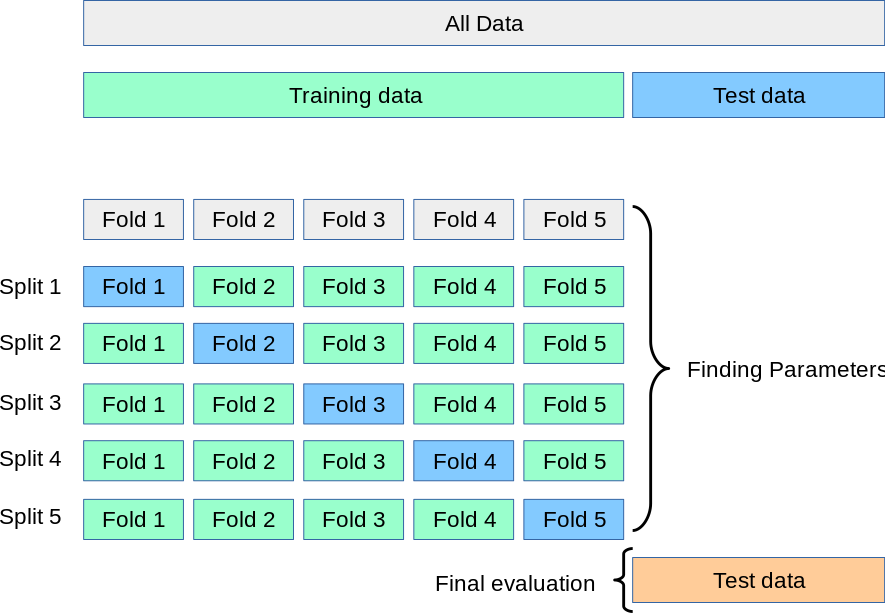

K-fold cross-validation is a fundamental technique in machine learning aimed at evaluating the effectiveness of predictive models. This method partitions data into 'k' subsets or 'folds', using one as a test set while the remaining serve as training sets, iterating over all folds to ensure each subset is used for both training and testing. Its primary benefit lies in its ability to enhance generalization and mitigate overfitting. Consequently, k-fold cross-validation is regarded as an essential tool for model validation across various domains, including its emerging utilization in algorithmic trading.

Algorithmic trading involves the use of automated, rule-driven trading strategies to execute orders at optimal prices, leveraging market inefficiencies. Given the inherent complexity of financial markets and the high stakes involved, it is crucial to validate trading models and strategies rigorously. Validating these models ensures that they can perform reliably on unseen data, minimizing the risks of monetary loss due to overfitting or flawed logic. Without adequate validation, models are susceptible to pitfalls such as hindsight bias—where a model performs well on historical data but poorly in real-time scenarios—and data snooping, which can occur if the model inadvertently incorporates information it should not have access to when making predictions.



Financial data presents unique challenges to the deployment of cross-validation techniques primarily due to its temporal dependencies and non-stationarity. Unlike static datasets, where data points are independent and identically distributed, financial datasets evolve over time, and data points are influenced by preceding events. This temporal nature introduces complexities, such as ensuring that past, present, and future data points are not improperly used in training and testing, respectively—a phenomenon known as data leakage. To address these issues, specific methodologies have been developed, including purging and embargoing. Purging involves removing certain data entries from the training set that overlap with the test set, while embargoing introduces a lag time between training and test datasets to prevent information leakage from imminent trades.

In this article, we will focus on elucidating these methodologies, emphasizing the intersection of traditional machine learning validation techniques with the peculiarities of financial datasets. We explore how tools like purging and embargoing are instrumental in adapting k-fold cross-validation for use in algorithmic trading, ensuring the development and validation of robust trading strategies. By grasping these concepts, practitioners are better equipped to develop models that not only perform well historically but also possess the robustness to thrive in dynamic financial environments.

## Table of Contents

## Understanding k-fold Cross-Validation

K-fold cross-validation is a resampling technique primarily used to evaluate and validate a model's performance by systematically splitting the available dataset into subsets or 'folds'. The process begins by dividing the dataset into 'k' equally sized folds. For each unique fold, the model is trained using the remaining 'k-1' folds and tested on the one fold left out. This method is repeated 'k' times, with each fold used exactly once as the test set, allowing every data point to be used for training and testing.

This technique holds several advantages over the traditional train-test split. Primarily, k-fold cross-validation ensures that every observation in the dataset has the chance of appearing in both the training and test sets, providing a more comprehensive assessment of the model's performance. It is particularly effective in mitigating overfitting, as models have less opportunity to learn the quirks of any specific train-test partition.

The mathematical robustness of k-fold cross-validation is highlighted by its ability to produce an estimate of a model's performance that is less sensitive to how the data is divided. Typically, the performance metric, such as accuracy or mean squared error, is averaged across the folds to provide an overall assessment. This averaging helps enhance the model's generalization by promoting a more stable and reliable measure of its capability on unseen data.

K-fold cross-validation is widely applicable across various fields, including finance and [machine learning](/wiki/machine-learning). In finance, for instance, it aids in developing trading algorithms by testing their validity and robustness across different data splits. This is especially crucial, given the temporal dependencies inherent in financial time series data. Similarly, in machine learning, this technique is fundamental in model validation processes, ensuring models do not merely memorize training data but instead learn to make valid predictions on new data.

In summary, k-fold cross-validation is an essential tool that balances the need for comprehensive model training and validation, playing a crucial role in enhancing generalization and mitigating the risk of overfitting.

## The Importance of Cross-Validation in Algo Trading

Validation plays a pivotal role in the development and deployment of [algorithmic trading](/wiki/algorithmic-trading) models, ensuring that these models can perform well on unseen data. In the context of algorithmic trading, models are exposed to dynamic and unpredictable financial markets. Without proper validation, models run the risk of being tailored to specific datasets, leading to overfitting. Overfitting occurs when a model learns the noise in the training data instead of the underlying data patterns, resulting in poor generalization to new data. Hindsight bias, or the tendency to believe one could have predicted an event after it has already occurred, can also skew results if not properly accounted for through rigorous validation.

A major challenge in financial modeling is data snooping, where repeated testing on the same dataset can inadvertently lead to the discovery of patterns that do not generalize to other datasets. Similarly, look-ahead bias, which occurs when future information is inadvertently incorporated into the model during training, can lead to misleadingly high performance metrics that are not achievable in real-time trading.

Cross-validation helps mitigate these issues by breaking the dataset into multiple subsets, allowing the model to be trained and tested on different data segments. This approach ensures that the model's performance is consistent across various data points, leading to the discovery of more robust trading strategies. By thoroughly evaluating models across different data splits, cross-validation provides insights into the model’s reliability and robustness. 

Despite its advantages, cross-validation in algo trading is not without pitfalls. Financial datasets often exhibit unique characteristics, such as non-stationarity and [volatility](/wiki/volatility-trading-strategies) clustering, which can challenge traditional cross-validation techniques. Additionally, when trading strategies based on insufficient validation are deployed, they may lead to erroneous trading decisions, resulting in financial loss.

In conclusion, cross-validation is essential for validating algorithmic trading models, ensuring they generalize well and are not overfit to historical data anomalies. Its judicious application helps uncover genuinely robust trading strategies while highlighting potential pitfalls and areas for improvement in model design and validation. Continued research and refinement in validation methods will further enhance the reliability of trading models in the financial markets.

## Challenges in Applying Cross-Validation to Financial Data

Financial time series data presents a unique set of challenges for applying traditional machine learning techniques, such as k-fold cross-validation, which are typically designed for independent and identically distributed (i.i.d.) data. The complexity arises primarily due to temporal dependencies and non-stationarity, both of which have significant implications for model validation and testing.

Temporal dependencies are a fundamental characteristic of financial data, where observations are not independent but are instead influenced by past values. This dependence can skew the results of cross-validation if future data points are inadvertently used to inform predictions about past data, leading to overfitting and creating the illusion of a model's performance being more robust than it actually is. Properly addressing this requires a careful restructuring of the data used in each fold of cross-validation.

Non-stationarity further complicates the validation process. Unlike a stationary dataset, which has consistent statistical properties over time, financial datasets are subject to structural breaks, regime shifts, and other changes that can significantly affect model performance. A model trained on data from one regime may not perform well when applied to data from another, reducing the effectiveness of traditional cross-validation techniques.

To mitigate these challenges, concepts like purging and embargoing are introduced to prevent data leakage. Purging aims to remove any samples from the training set that have temporal overlap with the test set, ensuring that no information from the test set influences the training phase. This is essential to maintain the integrity of out-of-sample evaluations. Embargoing complements purging by setting a buffer period around the test set, further isolating it from the training data and accounting for lingering temporal effects.

These adjustments enable more accurate application of cross-validation in financial contexts. By ensuring that predictions are genuinely out-of-sample, they help derive robust trading strategies that are less prone to overfitting and more likely to perform well in real-world scenarios.

A practical example of these challenges can be seen in the development of a [momentum](/wiki/momentum)-based trading strategy. Suppose a model is trained to predict future returns based on a set of lagged returns. Without purging and embargoing, the model might inadvertently use future price movements to inform past predictions, falsely inflating expected returns and leading to suboptimal trading decisions when deployed in a live market.

In summary, addressing the complexities of financial time series data through purging and embargoing enhances the viability of cross-validation for trading strategy development, ensuring that the models are tested in environments that accurately reflect real-world trading conditions. These adaptations are crucial for creating reliable models that withstand the dynamic nature of financial markets.

## Purging and Embargoing in Cross-Validation

Purging and embargoing are critical techniques used to mitigate data leakage in cross-validation, particularly in the context of financial data. These techniques address the risk of overfitting by ensuring that any information from the test data does not inadvertently influence the training models.

**Purging** involves the removal of data points that could lead to a look-ahead bias in cross-validation. Look-ahead bias occurs when information from future data inadvertently influences the prediction model, thus giving a misleadingly high performance. In k-fold cross-validation, purging ensures that any data points overlapping in series and sequential dependencies are excluded from the training set that precedes them in chronological order.

**Embargoing** is the process of restricting recent data from being included in the training set when constructing a particular test set. This technique is employed to prevent any temporal overlap where the outcomes of a later dataset could affect earlier predictions, avoiding any leakage between samples. Embargoing works by imposing a buffer period following the test set, disallowing any data from immediately following the period to be present in the training set.

**Example Scenario**: Consider a scenario where a trading strategy predicts stock prices based on historical closing prices. If one includes a sequence of data that is consecutive and without adjustment, information from future market volatilities might leak into the training model, leading to overly optimistic results. By purging data close to the target prediction date and applying an embargoing period to prevent subsequent data from being included, one mitigates this bias.

**Technical Implementation**: When implementing purging and embargoing in k-fold cross-validation, one typically identifies overlapping samples using a timestamp or event log, purges these entries, and applies an embargo to subsequent sample points. The embargoed period is typically set as a hyperparameter tuned to the specifics of the volatility or expected hold period of the trading strategy.

```python
import pandas as pd
from sklearn.model_selection import TimeSeriesSplit

def embargoed_train_test_split(data, test_size, embargo_size):
    n = len(data)
    test_indices = list(range(n - test_size, n))
    embargo_end = n - test_size - embargo_size
    train_indices = list(range(embargo_end))

    return data.iloc[train_indices], data.iloc[test_indices]

# Example Usage
data = pd.DataFrame({'price': [100, 102, 101, 105, 107, 110, 115, 120]})
train, test = embargoed_train_test_split(data, test_size=2, embargo_size=1) 
```

**Significance**: The use of purging and embargoing is vital for generating valid out-of-sample evaluations, which are crucial when predicting market behaviors. Without these techniques, a model might perform well on paper but fail in real-world applications due to the inadvertent inclusion of future information during training, a pitfall common in financial modeling.

**Illustrative Studies**: De Prado's work in quantitative finance emphasizes the importance of purging and embargoing as part of a robust validation strategy. His methodologies show how these techniques prevent the blending of training and testing data, thereby enhancing model reliability and performance authenticity. These strategies are now considered standard practice in the industry, ensuring that trading algorithms are subjected to rigorous testing procedures prior to deployment.

## Case Study: k-fold CV in a Trading Strategy

In this case study, we examine the application of k-fold cross-validation (CV) to evaluate a trading strategy that employs the Moving Average Convergence Divergence (MACD) indicator. This approach serves as a robust framework for validating predictive models used in algorithmic trading.

### Dataset and Market Indicators

The dataset consists of historical daily price data for the S&P 500 index, spanning a period from January 2010 to December 2020. Key market indicators include open, high, low, close prices, and trading [volume](/wiki/volume-trading-strategy). The primary indicator of interest is the MACD, a trend-following momentum indicator calculated using the difference between two exponential moving averages (EMAs) — typically the 12-day EMA and the 26-day EMA. A 9-day EMA of the MACD, known as the signal line, is used as a trigger for buy and sell signals.

### Computational Steps

#### Data Preprocessing

The preprocessing phase involves cleaning the dataset by removing missing values and handling outliers. We calculate the MACD and its signal line using the following Python code snippet:

```python
import pandas as pd

def calculate_macd(data, short_window=12, long_window=26, signal_window=9):
    data['EMA_short'] = data['Close'].ewm(span=short_window, adjust=False).mean()
    data['EMA_long'] = data['Close'].ewm(span=long_window, adjust=False).mean()
    data['MACD'] = data['EMA_short'] - data['EMA_long']
    data['Signal_Line'] = data['MACD'].ewm(span=signal_window, adjust=False).mean()
    return data

data = pd.read_csv('sp500.csv')  # Load data
data = calculate_macd(data)  # Apply MACD calculation
```

#### Model Training and Validation

The k-fold cross-validation method divides the data into `k` subsets (or folds). In this study, `k=5` is selected. Each fold serves consecutively as the test set while the remaining folds represent the training set. The trading strategy is simple: buy when the MACD crosses above the signal line and sell when it crosses below.

For each fold, a strategy is backtested to calculate performance metrics like return on investment (ROI) and Sharpe ratio, which inform the model's effectiveness.

### Results and Insights

The application of k-fold CV highlighted variations in strategy performance across different data subsets. The average ROI and Sharpe ratios were calculated for each fold, providing insights into the consistency and reliability of the MACD strategy. Results indicated significant performance variability, suggesting potential issues with data regime changes.

### Model Adjustments

Insights from the CV highlighted the need for model recalibration. Adjustments included fine-tuning the periods of the EMAs used in the MACD calculation. Cross-validation revealed that using a shorter signal window yielded marginally better results, underscoring the importance of parameter optimization in crafting robust trading strategies.

In conclusion, deploying k-fold CV in strategy evaluation has proven valuable, revealing areas for strategic refinement and helping to mitigate overfitting risks. These insights empower traders to harness predictive models that are both resilient and adaptive to market dynamism.

## Combinatorial Purged Cross-Validation

Combinatorial Purged Cross-Validation (CPCV) is an advanced cross-validation technique designed to address the unique challenges presented by financial data, particularly when developing trading strategies. Traditional k-fold cross-validation models may not effectively handle the overlapping and temporal dependencies inherent in financial datasets. CPCV mitigates these issues by generating multiple training and testing splits that incorporate purging and embargoing techniques, ensuring that the model evaluations are free from bias and data leakage.

**Generating Multiple Training/Test Splits**

CPCV differs from standard k-fold cross-validation by creating combinations of test sets in such a way that each combination maintains a purged and embargoed separation from training data. This ensures that information from the training set does not inadvertently inform the test set, which could happen in time-series data where future information might "leak" into past observations. CPCV systematically varies the subset of folds used for testing, increasing the number of evaluation scenarios and enhancing the robustness of the validation process.

**Reliability and Comprehensive Evaluations**

By adopting CPCV, traders and model developers gain more reliable insights into the performance of their strategies. The method yields a broad spectrum of testing scenarios that account for different market conditions and temporal sequences. This comprehensive approach allows for the identification of truly robust trading strategies that are less likely to overfit the historical data and are more adaptable to changing market conditions.

**Python Code Implementation**

Below is a basic example of implementing CPCV using Python. This illustrates how one might construct the combinatorial splits and incorporate purging and embargoing:

```python
from itertools import combinations
import numpy as np

def cpcv_splits(n_splits, n_samples, purge, embargo):
    indices = np.arange(n_samples)
    test_indices_list = list(combinations(indices, n_splits))

    for test_indices in test_indices_list:
        train_indices = np.setdiff1d(indices, test_indices)
        purged_train_indices = train_indices[train_indices <= (test_indices.min() - purge)]

        if embargo > 0:
            embargo_mask = ((purged_train_indices >= test_indices.max()) &
                            (purged_train_indices <= (test_indices.max() + embargo)))
            purged_train_indices = purged_train_indices[~embargo_mask]

        yield purged_train_indices, test_indices

# Example usage
n_samples = 100
n_splits = 5
purge = 2
embargo = 3

for train_idx, test_idx in cpcv_splits(n_splits, n_samples, purge, embargo):
    print("Train Indices:", train_idx)
    print("Test Indices:", test_idx)
```

**Computational Costs and Benefits**

While CPCV offers superior evaluation by reducing overfitting risks, it comes with increased computational costs. Each combination of splits must be independently processed, thus increasing the computational load compared to standard methods. However, these costs are often justified in the context of [deep learning](/wiki/deep-learning) models for trading, where the risk of overfitting to historical patterns is particularly high. Enhanced evaluations via CPCV enable the development of models that can generalize well to future, unseen data, thus potentially leading to more profitable trading strategies.

## Conclusion

K-fold cross-validation plays a crucial role in algorithmic trading by enabling the development of models that are both robust and generalizable. This method systematically partitions data into 'k' subsets or 'folds', allowing each subset to be used as a testing set while the remaining folds are used for training. This ensures that all data points are utilized for both training and validation, mitigating the risk of overfitting and providing a more reliable assessment of a model's performance. The principal advantage of k-fold cross-validation lies in its ability to improve the generalization of trading strategies, which is vital in the fast-paced and unpredictable environment of financial markets.

However, the application of k-fold cross-validation in algorithmic trading comes with certain challenges. Financial data often exhibit temporal dependencies and non-stationarity, making traditional k-fold techniques less suitable without modifications. Techniques such as purging and embargoing are indispensable to avoid data leakage, ensuring that the validation process remains unbiased.

Looking forward, the field of financial cross-validation is evolving with emerging methods like combinatorial purged cross-validation (CPCV). CPCV offers more flexible and detailed evaluations by generating multiple training and testing splits, thus providing a defense against overfitting that is particularly beneficial for complex models used in deep learning.

Continued education and refinement in cross-validation techniques are essential for traders and quantitative analysts seeking to maintain a competitive edge. Professionals and enthusiasts are encouraged to explore advanced courses and literature that delve into these evolving methodologies. Notable texts include "Advances in Financial Machine Learning" by Marcos López de Prado, which provides in-depth discussions and examples of applying sophisticated cross-validation techniques in finance. As the landscape of quantitative finance continues to develop, staying informed about these techniques will be key to designing effective and robust trading algorithms.

## References & Further Reading

[1]: ["Advances in Financial Machine Learning"](https://www.amazon.com/Advances-Financial-Machine-Learning-Marcos/dp/1119482089) by Marcos Lopez de Prado

[2]: ["Evidence-Based Technical Analysis: Applying the Scientific Method and Statistical Inference to Trading Signals"](https://www.amazon.com/Evidence-Based-Technical-Analysis-Scientific-Statistical/dp/0470008741) by David Aronson

[3]: ["Machine Learning for Algorithmic Trading"](https://github.com/stefan-jansen/machine-learning-for-trading) by Stefan Jansen

[4]: ["Quantitative Trading: How to Build Your Own Algorithmic Trading Business"](https://books.google.com/books/about/Quantitative_Trading.html?id=j70yEAAAQBAJ) by Ernest P. Chan

[5]: Bergstra, J., & Bengio, Y. (2012). ["Random Search for Hyper-Parameter Optimization."](https://dl.acm.org/doi/10.5555/2188385.2188395) Journal of Machine Learning Research, 13(Feb), 281-305.