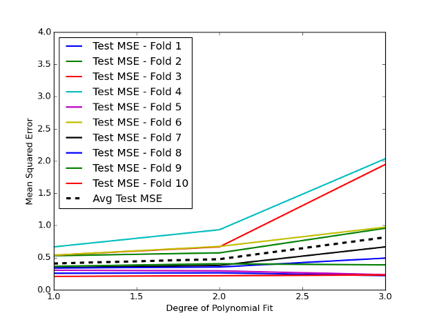

## Table of Contents

## What is K-fold cross-validation?

K-fold cross-validation is a way to test how well a machine learning model works. Imagine you have a big set of data. Instead of using all of it to train your model, you split it into K smaller parts, or "folds." You then train your model K times, each time using K-1 folds to train and the remaining fold to test. This helps you see how your model performs on different parts of the data, making sure it's not just good at predicting one specific part.

This method is really useful because it gives you a more reliable idea of how your model will perform on new, unseen data. By testing the model on different subsets of the data, you can be more confident that it will work well in the real world. It's like checking your model from different angles to make sure it's strong and accurate overall.

## Why is K-fold cross-validation important in machine learning?

K-fold cross-validation is important in machine learning because it helps us check how good our model is in a fair way. Instead of using all our data to train the model and then testing it on the same data, which can make the model look better than it really is, we split the data into different parts. By training the model on some parts and testing it on others, we get a better idea of how it will work on new data it hasn't seen before. This makes our model more reliable and trustworthy.

Another reason K-fold cross-validation is important is that it helps us use our data more effectively. Sometimes, we don't have a lot of data to work with, and using all of it for training might leave us with nothing to test the model. With K-fold cross-validation, we can use all our data for both training and testing, just in different combinations. This way, we make the most out of what we have, and we can be more confident that our model will work well in the real world.

## How does K-fold cross-validation work?

K-fold cross-validation works by splitting your data into K equal parts, called folds. Imagine you have a deck of cards and you want to play a game where you need to check if your strategy works well. You could split the deck into, say, 5 equal stacks. You play the game 5 times, each time using 4 stacks to learn your strategy and the last stack to test it. In [machine learning](/wiki/machine-learning), you do something similar: you train your model on K-1 folds and test it on the remaining fold. You repeat this process K times, using a different fold for testing each time.

This way, every piece of your data gets a chance to be used for both training and testing. It's like making sure every card in the deck gets a turn to be part of the learning and the testing. By doing this, you get a good overall picture of how well your model works. You can then average the results from all K tests to get a final score that shows how well your model might perform on new data it hasn't seen before. This helps you trust that your model is good and will work well in real situations.

## What is the difference between K-fold CV and simple train-test split?

K-fold cross-validation (CV) and simple train-test split are both ways to check how good a machine learning model is, but they do it differently. In a simple train-test split, you take your data and split it into two parts: one part for training the model and the other part for testing it. This is quick and easy, but it might not give you a full picture of how well your model works because it only tests on one specific part of the data.

On the other hand, K-fold CV splits your data into K equal parts, or folds. You then train your model K times, each time using K-1 folds for training and the remaining fold for testing. This means every piece of your data gets a chance to be used for both training and testing, which gives you a more complete and reliable idea of how your model performs. By averaging the results from all K tests, you get a better estimate of how your model will work on new data it hasn't seen before.

## How do you choose the value of K in K-fold CV?

Choosing the value of K in K-fold cross-validation is important because it affects how well you can trust your model's performance. A common choice for K is 5 or 10 because these numbers give a good balance between getting a reliable estimate of your model's performance and not taking too long to run the tests. If K is too small, like 2 or 3, your model might not get a fair test because it's trained on too much of the data at once. But if K is too big, like the same number as the total data points, it can take a long time to run and might not give you much more useful information than smaller values of K.

Another thing to think about when choosing K is the size of your dataset. If you have a small dataset, you might want to use a smaller K so that each fold is big enough to be a good test. But if you have a lot of data, you can use a larger K because even with more folds, each fold will still have enough data to be a good test. The key is to find a K that gives you a good, reliable estimate of your model's performance without making the testing process too slow or too complicated.

## What are the advantages of using K-fold CV?

K-fold cross-validation helps you trust your machine learning model more. It does this by testing your model on different parts of your data, so you see how it works overall, not just on one part. When you use K-fold CV, you split your data into K parts, or folds. You train your model on K-1 folds and test it on the remaining fold. You do this K times, so every piece of data gets a chance to be used for both training and testing. This way, you get a better idea of how your model will do with new data it hasn't seen before.

Another good thing about K-fold CV is that it helps you use all your data well. If you have a small amount of data, you can still get a good test of your model. Instead of using all your data for training and having nothing left to test, you can use all your data for both training and testing, just in different combinations. This makes your model more reliable because you're not leaving any data out. By averaging the results from all K tests, you get a solid estimate of how well your model will work in the real world.

## What are the potential drawbacks of K-fold CV?

K-fold cross-validation can take a long time to run, especially if you have a lot of data or a complex model. Since you're training and testing your model K times, it can be much slower than doing a simple train-test split. If you choose a big K, like 10 or more, it can take even longer because you're doing more rounds of training and testing. This can be a problem if you need quick results or if you're working with limited time or computing power.

Another problem with K-fold CV is that it might not work well if your data is not mixed up well. If some important patterns or groups in your data are only in one fold, your model might not learn about them properly. This can make your model's performance look worse than it really is. To avoid this, you need to make sure your data is shuffled well before you split it into folds. But even with good shuffling, there's still a chance that some important pieces of data end up in the same fold, which can affect how well your model seems to work.

## How can K-fold CV help in model selection and hyperparameter tuning?

K-fold cross-validation can help you pick the best model and find the right settings for it. When you have different models to choose from, like a decision tree or a [neural network](/wiki/neural-network), you can use K-fold CV to see how each one does on your data. By trying out each model with K-fold CV, you can compare their scores and pick the one that works the best overall. This way, you can be sure that you're choosing a model that will work well on new data it hasn't seen before.

K-fold CV is also great for tuning the settings of your model, which are called hyperparameters. These are things like the depth of a decision tree or the learning rate of a neural network. You can try different settings and use K-fold CV to see which ones make your model perform the best. By testing different settings with K-fold CV, you can find the best combination that makes your model as good as it can be. This helps you make your model work better and be more reliable when it's used in the real world.

## What is stratified K-fold CV and when should it be used?

Stratified K-fold CV is a special way of doing K-fold cross-validation that makes sure each fold has the same mix of different types of data as the whole dataset. Imagine you're sorting a bunch of different colored candies into bags. You want each bag to have the same mix of colors as the whole pile of candies. In machine learning, if your data has different groups or categories, like different types of animals, you want each fold to have the same mix of these groups. This helps make sure your model gets a fair test because it sees the same kinds of data in training and testing.

You should use stratified K-fold CV when your data has important groups or categories that you want to keep balanced in each fold. For example, if you're trying to predict whether emails are spam or not, you want each fold to have the same mix of spam and not-spam emails. This way, your model won't be trained on too many of one type and tested on too few of another. Stratified K-fold CV is especially useful when you have imbalanced data, where one group is much bigger than the others, because it helps make sure your model gets a good, fair test.

## How does K-fold CV address the problem of overfitting?

K-fold cross-validation helps stop overfitting by making sure the model is tested on different parts of the data. Overfitting happens when a model learns the training data too well, including any mistakes or random patterns, and then does badly on new data. With K-fold CV, you split your data into K parts, or folds. You train your model on K-1 folds and test it on the remaining fold. You do this K times, using a different fold for testing each time. This way, every piece of your data gets a chance to be used for both training and testing. By doing this, you see how well your model works on different parts of the data, not just one part, which helps you trust that it won't overfit.

Another way K-fold CV helps with overfitting is by giving you a better idea of how your model will do on new data. When you use all your data to train your model and then test it on the same data, it might look like it's doing great, but it could be overfitting. K-fold CV tests your model on different parts of the data, so you get a more honest look at how it will do with new data it hasn't seen before. This helps you make sure your model is good at finding real patterns in the data, not just memorizing the training data. By using K-fold CV, you can be more confident that your model will work well in the real world, without overfitting.

## Can you explain the concept of repeated K-fold CV?

Repeated K-fold cross-validation is a way to make K-fold CV even better. In regular K-fold CV, you split your data into K parts, or folds, and then train and test your model K times. Each time, you use K-1 folds to train your model and the last fold to test it. With repeated K-fold CV, you do this whole process more than once. For example, if you choose to repeat it 3 times, you'll do the K-fold CV process 3 times, each time with a different random split of the data. This helps you get an even more reliable idea of how well your model works because you're testing it on many different combinations of the data.

By repeating the K-fold CV process, you can be more sure that your model's performance is not just a lucky accident. Sometimes, the way you split your data can affect the results, and doing it just once might not give you the full picture. But if you repeat the process several times, you can average the results from all the repeats to get a very good estimate of how your model will do on new data. This makes your model more trustworthy because you're checking it from many different angles, making sure it's strong and accurate overall.

## What are some advanced techniques or variations of K-fold CV used in practice?

One advanced technique used in practice is stratified K-fold CV. This method is really helpful when your data has different groups or categories that you want to keep balanced in each fold. For example, if you're trying to predict if emails are spam or not, you want each fold to have the same mix of spam and not-spam emails. Stratified K-fold CV makes sure that happens, so your model gets a fair test. It's especially useful when you have imbalanced data, where one group is much bigger than the others, because it helps make sure your model sees the same kinds of data in training and testing.

Another advanced variation is repeated K-fold CV. With this technique, you do the K-fold CV process more than once, using different random splits of the data each time. For example, if you repeat it 3 times, you'll do the K-fold CV process 3 times, each time with a new split. This gives you an even more reliable idea of how well your model works because you're testing it on many different combinations of the data. By averaging the results from all the repeats, you get a very good estimate of how your model will do on new data, making it more trustworthy.

There's also a technique called time series cross-validation, which is used when you're working with data that changes over time, like stock prices or weather data. In regular K-fold CV, you might mix up the data before splitting it into folds, but that doesn't work well for time series data because the order of the data matters. With time series cross-validation, you split the data into folds in a way that keeps the time order. You train your model on earlier data and test it on later data, which helps you see how well your model will predict future events based on past data.

## References & Further Reading

[1]: ["Advances in Financial Machine Learning"](https://www.amazon.com/Advances-Financial-Machine-Learning-Marcos/dp/1119482089) by Marcos Lopez de Prado

[2]: ["Evidence-Based Technical Analysis: Applying the Scientific Method and Statistical Inference to Trading Signals"](https://www.amazon.com/Evidence-Based-Technical-Analysis-Scientific-Statistical/dp/0470008741) by David Aronson

[3]: ["Machine Learning for Algorithmic Trading"](https://github.com/stefan-jansen/machine-learning-for-trading) by Stefan Jansen

[4]: ["Quantitative Trading: How to Build Your Own Algorithmic Trading Business"](https://books.google.com/books/about/Quantitative_Trading.html?id=j70yEAAAQBAJ) by Ernest P. Chan

[5]: Bergstra, J., & Bengio, Y. (2012). ["Random Search for Hyper-Parameter Optimization."](https://dl.acm.org/doi/10.5555/2188385.2188395) Journal of Machine Learning Research, 13(Feb), 281-305.