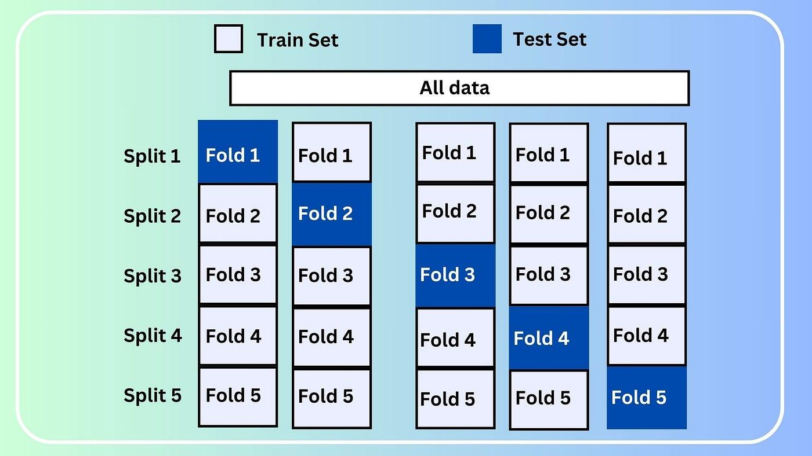

## Table of Contents

## What is K-Fold Cross Validation in machine learning?

K-Fold Cross Validation is a method used in machine learning to assess how well a model will perform on new, unseen data. It works by dividing the dataset into K equally sized parts, or "folds". The model is trained on K-1 of these folds and then tested on the remaining fold. This process is repeated K times, with each fold serving as the test set once. The results from these K iterations are then averaged to give an overall performance measure. This technique helps to ensure that the model's performance is not overly dependent on the particular way the data was split into training and testing sets.

The main advantage of K-Fold Cross Validation is that it provides a more robust estimate of the model's performance than a single train-test split. By using multiple train-test splits, it reduces the chance that the model's performance is biased due to an unlucky split of the data. A common choice for K is 5 or 10, but the exact number can be adjusted based on the size of the dataset and the computational resources available. For example, if you have a small dataset, you might choose a larger K to make the most of your data, while with a large dataset, a smaller K might be sufficient and faster to compute.

## Why is K-Fold Cross Validation used?

K-Fold Cross Validation is used in machine learning to get a better idea of how well a model will work on new data. It's like testing a student with different sets of questions to make sure they really know the material and not just memorizing answers. In K-Fold Cross Validation, we split the data into K parts. We train the model on K-1 parts and test it on the remaining part. We do this K times, so every part gets a chance to be the test set. This way, we can see how the model performs across different parts of the data, giving us a more reliable measure of its performance.

This method helps because it reduces the chance that our model's performance is just luck based on how we split the data. Imagine if we only used one split and got a great result, but it was just because the test set was easy. With K-Fold Cross Validation, we avoid this problem by using many different splits. A common choice for K is 5 or 10, but it can be adjusted based on how much data we have and how long we can wait for the computer to finish the calculations. By using this technique, we can be more confident that our model will work well on new data it hasn't seen before.

## How does K-Fold Cross Validation work?

K-Fold Cross Validation is a way to check how good a [machine learning](/wiki/machine-learning) model is. Imagine you have a big pile of data. You split this pile into K smaller piles. Then, you take K-1 of these piles and use them to teach the model. The last pile is used to test how well the model learned. You do this K times, each time using a different pile as the test set. At the end, you take the average of all these tests to see how well the model works overall. This helps make sure the model's performance isn't just lucky because of how the data was split.

A common choice for K is 5 or 10, but you can change it based on how much data you have and how long you're willing to wait for the computer to finish the calculations. If you have a small amount of data, you might want to use a larger K to make the most of your data. On the other hand, if you have a lot of data, a smaller K might be enough and faster to compute. By using K-Fold Cross Validation, you can be more sure that your model will work well on new data it hasn't seen before.

## What is the typical value of K used in K-Fold Cross Validation?

In K-Fold Cross Validation, the typical value of K that people use is either 5 or 10. This means you split your data into either 5 or 10 parts, and you use K-1 parts to train your model and the remaining part to test it. You do this K times, so every part gets a chance to be the test set. Using 5 or 10 folds is common because it gives a good balance between using enough data to train the model well and having enough different test sets to get a reliable measure of how the model performs.

The choice between 5 and 10 folds often depends on how much data you have and how long you can wait for the computer to finish the calculations. If you have a small amount of data, using 10 folds can help you make the most of it. On the other hand, if you have a lot of data, using 5 folds might be enough and faster to compute. By using these typical values of K, you can be more confident that your model will work well on new data it hasn't seen before.

## What are the advantages of using K-Fold Cross Validation?

K-Fold Cross Validation is a great way to check how well a machine learning model will work on new data. It does this by splitting the data into K parts, then using K-1 parts to train the model and the last part to test it. This process is repeated K times, so every part gets a chance to be the test set. By doing this, we can get a better idea of the model's performance because it's not just based on one way of splitting the data. This helps to make sure the model's performance isn't just lucky.

Another advantage is that K-Fold Cross Validation helps to use the data more efficiently, especially when there isn't a lot of data to work with. If you only use one split of the data, you might not be using all of it to train the model. But with K-Fold Cross Validation, you're using almost all of the data for training at some point. This can lead to a more reliable model because it's been trained on more data. Plus, choosing common values like K=5 or K=10 gives a good balance between training the model well and getting a reliable measure of its performance.

## What are the disadvantages of using K-Fold Cross Validation?

One disadvantage of using K-Fold Cross Validation is that it can be computationally expensive. When you use K-Fold Cross Validation, you have to train and test the model K times, which means it takes more time and computer power than just doing it once. If you have a lot of data or a complex model, this can really slow things down. For example, if you choose K=10, you're training and testing the model 10 times instead of just once, which can be a big difference in terms of how long you have to wait for results.

Another disadvantage is that K-Fold Cross Validation can be less effective if the data is not independent and identically distributed (i.i.d.). This means that if the data has some kind of pattern or order to it, splitting it into K parts might not give a good picture of how the model will perform on new data. For example, if you're working with time series data where the order of the data matters, using K-Fold Cross Validation might mix up the data in a way that doesn't make sense. In these cases, other methods like time series cross-validation might be better suited to the task.

## How does K-Fold Cross Validation help in reducing overfitting?

K-Fold Cross Validation helps in reducing overfitting by making sure the model is tested on different parts of the data. Overfitting happens when a model learns the training data too well, including its noise and errors, and then doesn't work well on new data. By using K-Fold Cross Validation, we split the data into K parts and train the model on K-1 parts, then test it on the remaining part. We do this K times, so every part gets a chance to be the test set. This way, the model is less likely to overfit because it's being tested on different data each time, helping it to generalize better to new, unseen data.

Another way K-Fold Cross Validation helps with overfitting is by using more of the data for training. When we use a single train-test split, we might not be using all of our data to train the model. But with K-Fold Cross Validation, almost all of the data is used for training at some point. This means the model gets to see more examples and learn from them, which can help it to avoid overfitting. By using this method, we can be more confident that our model will work well on new data it hasn't seen before.

## Can you explain the difference between K-Fold and stratified K-Fold Cross Validation?

K-Fold Cross Validation is a way to check how well a machine learning model works by splitting the data into K parts. You train the model on K-1 parts and test it on the remaining part. You do this K times, so every part gets a chance to be the test set. This helps to make sure the model's performance isn't just lucky because of how the data was split. But, K-Fold Cross Validation doesn't always keep the same mix of different types of data in each part. For example, if you're trying to predict if someone will buy a product and your data has more people who didn't buy than who did, some parts might have a lot more "didn't buy" examples than others.

Stratified K-Fold Cross Validation is a special kind of K-Fold Cross Validation that makes sure each part has the same mix of different types of data as the whole dataset. This is really helpful when you're working with data that has different groups or categories, like in the example of predicting if someone will buy a product. By keeping the same mix in each part, stratified K-Fold Cross Validation gives a more accurate picture of how well the model will work on new data. So, if your data has different groups that you want to keep balanced, stratified K-Fold Cross Validation is a better choice than regular K-Fold Cross Validation.

## How do you implement K-Fold Cross Validation in Python?

To implement K-Fold Cross Validation in Python, you can use the `KFold` class from the `sklearn.model_selection` module. First, you need to import the necessary libraries and create an instance of the `KFold` class, specifying the number of folds you want to use. For example, if you want to use 5-fold cross-validation, you would create a `KFold` object with `n_splits=5`. Then, you split your data into training and testing sets using the `split` method of the `KFold` object. This method returns the indices of the data that should be used for training and testing in each fold. You can then use these indices to create your training and testing sets for each iteration of the cross-validation process.

Here's a simple example of how to implement K-Fold Cross Validation in Python:

```python
from sklearn.model_selection import KFold
import numpy as np

# Sample data
X = np.array([[1, 2], [3, 4], [5, 6], [7, 8], [9, 10]])
y = np.array([0, 1, 0, 1, 0])

# Create KFold object
kf = KFold(n_splits=5, shuffle=True, random_state=42)

# Perform K-Fold Cross Validation
for train_index, test_index in kf.split(X):
    X_train, X_test = X[train_index], X[test_index]
    y_train, y_test = y[train_index], y[test_index]
    # Here you would train your model on X_train and y_train, then test it on X_test and y_test
    print("Train indices:", train_index, "Test indices:", test_index)
```

In this example, we use a simple dataset `X` and `y` to demonstrate how K-Fold Cross Validation works. The `KFold` object is created with `n_splits=5`, meaning we'll have 5 folds. The `shuffle=True` parameter ensures that the data is shuffled before splitting, and `random_state=42` sets a seed for reproducibility. The `split` method of the `KFold` object is used to generate the indices for the training and testing sets for each fold. You would then use these indices to split your data and train and test your model in each iteration of the cross-validation process.

## What are some common metrics used with K-Fold Cross Validation?

When using K-Fold Cross Validation, common metrics to measure how well a model is doing include accuracy, precision, recall, F1-score, and mean squared error. Accuracy is a simple measure of how often the model gets the right answer, calculated as the number of correct predictions divided by the total number of predictions. Precision and recall are used when you want to know how well the model is at identifying positive cases. Precision is the number of true positives divided by the total number of positive predictions, while recall is the number of true positives divided by the total number of actual positives. The F1-score is a way to combine precision and recall into one number, calculated as $$2 \times \frac{\text{precision} \times \text{recall}}{\text{precision} + \text{recall}}$$. For regression problems, mean squared error (MSE) is often used, which measures the average of the squares of the errors between predicted and actual values.

These metrics help you understand different aspects of your model's performance. For example, if you're trying to predict if someone will buy a product, accuracy might tell you how often you're right, but precision and recall can tell you how good you are at predicting buyers versus non-buyers. The F1-score is useful when you want a single number to show how well your model balances precision and recall. In cases where you're predicting a number, like house prices, mean squared error can tell you how far off your predictions are on average. By using these metrics with K-Fold Cross Validation, you get a more reliable picture of how your model will do on new data.

## How does the choice of K affect the bias-variance tradeoff in K-Fold Cross Validation?

The choice of K in K-Fold Cross Validation affects the bias-variance tradeoff in how the model is evaluated. When K is small, like K=2, you're using a lot of your data for training in each fold, which means the model can learn well from the data it sees. But, because you're only testing on a small part of the data, the estimate of how well the model will work on new data might be biased towards being too optimistic. This is because the model might not see enough different kinds of data in the test sets to really know how it will do on new data.

On the other hand, when K is large, like K=10 or even K equal to the number of data points (which is called leave-one-out cross-validation), you're using less data for training in each fold. This means the model might not learn as well from the training data, which can increase the variance of your estimate of how well the model will work on new data. But, because you're testing on more different parts of the data, the estimate of the model's performance is less biased and more likely to be a good prediction of how the model will do on new data. So, choosing a good K is about finding a balance between having a model that learns well from the data it sees (low bias) and getting a reliable estimate of how it will work on new data (low variance).

## In what scenarios might you choose a different cross-validation technique over K-Fold?

You might choose a different cross-validation technique over K-Fold when your data has a specific structure or order that needs to be respected. For example, if you're working with time series data, where the order of the data matters, K-Fold Cross Validation might mix up the data in a way that doesn't make sense. In this case, you'd use time series cross-validation, which splits the data in a way that respects the time order. This helps to make sure your model's performance is measured in a way that's relevant to how it will be used in the real world.

Another scenario where you might choose a different technique is when your data is imbalanced, meaning one category of data is much more common than others. K-Fold Cross Validation might not keep the same mix of categories in each fold, which can lead to biased results. In this case, you'd use stratified K-Fold Cross Validation, which makes sure each fold has the same mix of categories as the whole dataset. This helps to give a more accurate picture of how well your model will work on new data.

## References & Further Reading

[1]: Kohavi, R. (1995). ["A Study of Cross-Validation and Bootstrap for Accuracy Estimation and Model Selection."](https://dl.acm.org/doi/10.5555/1643031.1643047) In Proceedings of the 14th International Joint Conference on Artificial Intelligence - Volume 2 (IJCAI'95).

[2]: James, G., Witten, D., Hastie, T., & Tibshirani, R. (2013). ["An Introduction to Statistical Learning: with Applications in R."](https://link.springer.com/book/10.1007/978-1-0716-1418-1) Springer.

[3]: Friedman, J., Hastie, T., & Tibshirani, R. (2001). ["The Elements of Statistical Learning."](https://link.springer.com/book/10.1007/978-0-387-84858-7) Springer Series in Statistics.

[4]: Géron, A. (2019). ["Hands-On Machine Learning with Scikit-Learn, Keras, and TensorFlow."](https://books.google.com/books/about/Hands_On_Machine_Learning_with_Scikit_Le.html?id=HHetDwAAQBAJ) O’Reilly Media.

[5]: Pedregosa, F., Varoquaux, G., Gramfort, A., Michel, V., Thirion, B., Grisel, O., ... & Duchesnay, É. (2011). ["Scikit-learn: Machine Learning in Python."](https://dl.acm.org/doi/10.5555/1953048.2078195) Journal of Machine Learning Research, 12, 2825-2830.