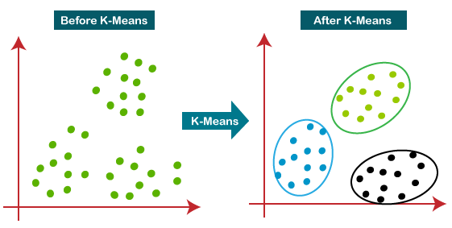

## Table of Contents

## What is K-Means clustering?

K-Means clustering is a type of unsupervised machine learning algorithm used to group similar data points into clusters. The main idea behind K-Means is to divide a set of data points into a predefined number of clusters, denoted as 'k'. The algorithm works by assigning each data point to the nearest cluster center, called a centroid, and then recalculating the centroid based on the mean of the points assigned to it. This process repeats until the centroids no longer move significantly, indicating that the clusters are stable.

The algorithm starts by randomly selecting 'k' initial centroids. Then, it assigns each data point to the closest centroid, forming initial clusters. Next, the centroids are recalculated as the mean of all points in each cluster. This step is repeated, with data points being reassigned to the nearest new centroid, and the centroids being recalculated again. This iterative process continues until the centroids stop moving or move very little, which means the clusters have converged. The final result is 'k' clusters, where the within-cluster variation is minimized.

K-Means is widely used because it is simple and efficient, but it has some limitations. It assumes that clusters are spherical and equally sized, which may not always be true in real-world data. Also, the initial choice of centroids can affect the final clustering, so it's common to run the algorithm multiple times with different starting points and choose the best result. Despite these limitations, K-Means remains a popular choice for many clustering tasks due to its simplicity and speed.

## How does the K-Means algorithm work?

K-Means clustering works by grouping similar data points into clusters. It starts by choosing a number, 'k', which is how many clusters you want. Then, it picks 'k' random points from your data to be the starting points, or centroids, of these clusters. Next, the algorithm looks at every data point and decides which centroid it is closest to. Each point is then assigned to the cluster of its nearest centroid. After all points are assigned, the algorithm recalculates the position of each centroid by finding the average (mean) of all the points in that cluster. This new position becomes the new centroid.

This process of assigning points to clusters and updating centroids repeats over and over. Each time, the centroids move a little bit, trying to get closer to the center of their clusters. The algorithm keeps going until the centroids stop moving much, or until they move very little. When this happens, the clusters are considered stable, and the algorithm stops. The final result is 'k' clusters, where the points in each cluster are more similar to each other than to points in other clusters.

K-Means is simple but has some challenges. It can be sensitive to the starting positions of the centroids, so it's common to run the algorithm several times with different starting points and pick the best result. Also, K-Means assumes that clusters are round and the same size, which might not always match real data. Despite these issues, K-Means is popular because it's fast and works well for many types of data.

## What are the main steps in the K-Means clustering process?

K-Means clustering starts by choosing a number, 'k', which is how many groups or clusters you want. Then, it picks 'k' random points from your data to be the starting points, or centroids, of these clusters. Next, the algorithm looks at every data point and decides which centroid it is closest to. Each point is then put into the cluster of its nearest centroid. After all points are assigned, the algorithm recalculates the position of each centroid by finding the average (mean) of all the points in that cluster. This new position becomes the new centroid.

This process of putting points into clusters and updating centroids keeps repeating. Each time, the centroids move a little bit, trying to get closer to the center of their clusters. The algorithm keeps going until the centroids stop moving much, or until they move very little. When this happens, the clusters are considered stable, and the algorithm stops. The final result is 'k' clusters, where the points in each cluster are more similar to each other than to points in other clusters.

K-Means can be sensitive to the starting positions of the centroids, so it's common to run the algorithm several times with different starting points and pick the best result. Also, K-Means assumes that clusters are round and the same size, which might not always match real data. Despite these issues, K-Means is popular because it's fast and works well for many types of data.

## What is the role of the 'K' in K-Means?

The 'K' in K-Means stands for the number of clusters you want to create. When you start the K-Means algorithm, you pick a number 'K', and the algorithm will try to group your data into exactly 'K' groups. This is important because choosing the right 'K' can make a big difference in how well the clustering works. If you pick a 'K' that's too small, you might miss important patterns in your data. If you pick a 'K' that's too big, you might end up with too many small groups that don't mean much.

To find the best 'K', people often use a method called the elbow method. You run the K-Means algorithm with different values of 'K' and look at how the total within-cluster variation changes. You plot these values and look for a point where the curve starts to flatten out, which looks like an elbow. This point is often a good choice for 'K' because it shows where adding more clusters doesn't improve the clustering much. For example, if you see that the within-cluster variation drops a lot when you go from 'K=2' to 'K=3', but not much when you go from 'K=3' to 'K=4', then 'K=3' might be a good choice.

## How do you choose the optimal number of clusters in K-Means?

Choosing the right number of clusters, or the optimal 'K', in K-Means clustering is important for getting good results. One common way to do this is by using the elbow method. You start by running the K-Means algorithm with different values of 'K', like 'K=2', 'K=3', 'K=4', and so on. For each 'K', you calculate the total within-cluster variation, which is a measure of how spread out the points are within each cluster. You then plot these values on a graph, with 'K' on the x-axis and the within-cluster variation on the y-axis.

When you look at this graph, you're trying to find a point where the curve starts to flatten out, which looks like an elbow. This point is often a good choice for 'K' because it shows where adding more clusters doesn't improve the clustering much. For example, if you see that the within-cluster variation drops a lot when you go from 'K=2' to 'K=3', but not much when you go from 'K=3' to 'K=4', then 'K=3' might be the best choice. This method helps you find a balance between having enough clusters to capture the patterns in your data and not having so many that the clusters become too small and less meaningful.

## What are the advantages of using K-Means clustering?

K-Means clustering is popular because it is simple and fast. It's easy to understand and doesn't need a lot of math to work. This makes it good for big datasets where you want to find patterns quickly. K-Means is also good at handling different types of data, like numbers or even text if you change it into numbers first. Because it's so fast, you can use it to try out different numbers of clusters and see what works best without waiting too long.

Another good thing about K-Means is that it gives you clear groups of data. Each point belongs to one cluster, which makes it easy to see and use the results. You can use these clusters to find trends or patterns in your data. For example, if you're looking at customer data, K-Means can help you see different types of customers. But, K-Means has some limits. It works best when clusters are round and the same size, which isn't always true. Also, the starting points can change the final clusters, so you might need to run it a few times to get the best results.

## What are the limitations and challenges of K-Means?

K-Means clustering has some limitations that can make it tricky to use. One big problem is that it assumes all clusters are round and the same size. But in real life, data might not fit into neat, round groups. This can lead to bad clustering if your data has different shapes or sizes of groups. Another challenge is that K-Means can be sensitive to where you start. The first guess for the centers of the clusters can change the final groups a lot. So, you might need to run the algorithm many times with different starting points to find the best groups.

Another issue with K-Means is that it can struggle with outliers, which are data points that are very different from the rest. These outliers can pull the centers of the clusters away from where they should be, messing up the groups. Also, K-Means needs you to pick the number of clusters, 'K', before you start. Picking the wrong 'K' can make the clustering not work well. You might miss important patterns if 'K' is too small, or end up with too many small groups if 'K' is too big. Finding the right 'K' can take some trial and error.

## How does K-Means handle outliers and noise in data?

K-Means clustering can have trouble with outliers and noise in data. Outliers are points that are very different from most of the data. When K-Means tries to group data, these outliers can pull the center of a cluster away from where it should be. This can make the clusters not as good as they could be. Noise, which is random changes in the data, can also mess up the clusters. If there's a lot of noise, the points might not group together well, making it hard for K-Means to find clear patterns.

To deal with outliers and noise, you might need to clean your data first. This means looking at your data and taking out or fixing the points that seem off. Another way is to use a different kind of clustering that can handle outliers better, like DBSCAN. But if you still want to use K-Means, running the algorithm many times with different starting points can help. This way, you might find a set of clusters that are less affected by the outliers and noise.

## Can K-Means be used for non-spherical clusters?

K-Means clustering works best when the groups in your data are round and the same size. If your data has groups that are not round or are different sizes, K-Means might not group them well. This is because K-Means tries to make clusters by finding the center of each group and putting points close to that center in the same group. If the groups are not round, the centers might not be in the right place, and the groups can end up being wrong.

To handle non-spherical clusters, you might need to use a different kind of clustering. For example, DBSCAN can find groups that are not round. Another way is to change your data before using K-Means. You can try to make your data look more round by changing it, like using a different way to measure how close points are to each other. But even with these changes, K-Means might still have trouble if the groups in your data are very different from round shapes.

## What are some common metrics used to evaluate K-Means clustering?

There are several common metrics used to evaluate how well K-Means clustering works. One of the most used is the within-cluster sum of squares (WCSS). This metric looks at how spread out the points are inside each cluster. A lower WCSS means the points in each cluster are closer together, which is good. You can find WCSS by adding up the squared distance from each point to the center of its cluster for all points in all clusters. The formula for WCSS is $$ \sum_{i=1}^{k} \sum_{x \in C_i} \|x - \mu_i\|^2 $$, where $$k$$ is the number of clusters, $$C_i$$ is the set of points in cluster $$i$$, $$x$$ is a point in the cluster, and $$\mu_i$$ is the center of cluster $$i$$.

Another metric is the silhouette score. This score helps you see if the points are in the right clusters. It looks at how close each point is to other points in its own cluster compared to points in other clusters. The silhouette score goes from -1 to 1. A score close to 1 means the point is well placed in its cluster, a score near 0 means it's on the edge between clusters, and a score near -1 means it might be in the wrong cluster. You want the average silhouette score for all points to be as high as possible.

The last common metric is the Davies-Bouldin index. This index measures how similar or different the clusters are to each other. It looks at how spread out the points are inside each cluster and how far apart the centers of different clusters are. A lower Davies-Bouldin index means the clusters are more separate and less spread out inside, which is good. The formula for the Davies-Bouldin index is $$ \frac{1}{k} \sum_{i=1}^{k} \max_{j \neq i} \left( \frac{s_i + s_j}{d_{ij}} \right) $$, where $$k$$ is the number of clusters, $$s_i$$ and $$s_j$$ are the average distance of points from the center of clusters $$i$$ and $$j$$, and $$d_{ij}$$ is the distance between the centers of clusters $$i$$ and $$j$$.

## How can K-Means be initialized to improve performance?

K-Means clustering can be tricky because where you start matters a lot. If you pick bad starting points, the clusters might not turn out well. One way to start better is to use the K-Means++ method. This method picks the first center randomly, then chooses the next centers in a smart way. It tries to spread out the centers so they are not too close to each other. This can help K-Means find better clusters faster.

Another way to start K-Means is to run it many times with different starting points. You can then pick the run that gives the best results, like the one with the lowest within-cluster sum of squares (WCSS). The formula for WCSS is $$ \sum_{i=1}^{k} \sum_{x \in C_i} \|x - \mu_i\|^2 $$, where $$k$$ is the number of clusters, $$C_i$$ is the set of points in cluster $$i$$, $$x$$ is a point in the cluster, and $$\mu_i$$ is the center of cluster $$i$$. By trying different starting points, you can make sure you find the best clusters for your data.

## What are some advanced variants or extensions of the K-Means algorithm?

One advanced variant of K-Means is K-Medoids. Instead of using the mean of the points in a cluster as the center, K-Medoids uses an actual data point as the center, called a medoid. This can be better for data with outliers because medoids are less affected by very different points. K-Medoids can be slower than K-Means because finding the best medoid takes more time, but it can give better results for some types of data.

Another extension is Fuzzy C-Means, which lets points belong to more than one cluster. In K-Means, each point is in one cluster only, but in Fuzzy C-Means, points can be partly in different clusters. This is useful when data points don't fit neatly into one group. Fuzzy C-Means uses a membership value to show how much each point belongs to each cluster. The formula for updating the membership value $$u_{ij}$$ for point $$x_i$$ in cluster $$j$$ is $$ u_{ij} = \frac{1}{\sum_{k=1}^{C} \left( \frac{d(x_i, c_j)}{d(x_i, c_k)} \right)^{\frac{2}{m-1}}} $$, where $$C$$ is the number of clusters, $$d(x_i, c_j)$$ is the distance between point $$x_i$$ and cluster center $$c_j$$, and $$m$$ is a fuzziness parameter.

A third variant is Mini-Batch K-Means, which is faster for big datasets. Instead of using all the data points to update the centers, Mini-Batch K-Means uses smaller groups of points, called mini-batches. This makes it quicker to run the algorithm, but the results might not be as good as using all the data. Mini-Batch K-Means is good when you need to find clusters fast and don't mind if the clusters are not perfect.