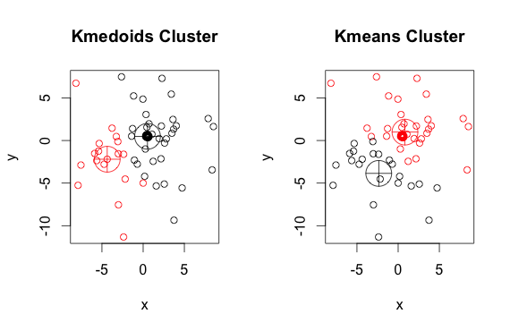

## Table of Contents

## What is K-Median clustering in machine learning?

K-Median clustering is a type of unsupervised machine learning algorithm used to group similar data points into clusters. It is similar to the more popular K-Means clustering, but instead of using the mean (average) of the data points in a cluster to determine the cluster center, K-Median uses the median. The median is the middle value in a sorted list of numbers, which makes K-Median more robust to outliers compared to K-Means. The goal of K-Median clustering is to minimize the sum of the distances from each data point to the median of its assigned cluster.

The algorithm works by first randomly assigning initial medians to represent the clusters. Then, it iteratively assigns each data point to the cluster whose median is closest to it, and recalculates the median of each cluster based on the new assignments. This process continues until the medians no longer change significantly, or a maximum number of iterations is reached. The final result is a set of clusters where the sum of the distances from each point to its cluster's median is minimized. K-Median clustering is particularly useful in scenarios where the data may contain outliers, as it is less sensitive to extreme values than K-Means.

## How does K-Median differ from K-Means clustering?

K-Median and K-Means clustering are both methods used to group data into clusters, but they use different ways to find the center of each cluster. K-Means uses the mean, or average, of the data points in a cluster to decide where the center should be. This means that if you have a cluster of numbers like 2, 3, 4, 5, and 100, the center would be pulled towards the 100 because the average would be high. On the other hand, K-Median uses the median, which is the middle number when you line up all the numbers in order. For the same set of numbers, the median would be 4, so the center would be more in the middle of the smaller numbers and not affected by the 100.

Because K-Median uses the median instead of the mean, it is better at handling data that has outliers, or numbers that are much bigger or smaller than the rest. Outliers can pull the mean far away from where most of the data is, but they don't affect the median as much. This makes K-Median a good choice when you want to group data and you know there might be some unusual numbers in your data set. Both methods aim to minimize the distance between the data points and the center of their cluster, but K-Median minimizes the sum of the distances to the median, while K-Means minimizes the sum of the squared distances to the mean.

## What are the main steps involved in the K-Median algorithm?

The K-Median algorithm starts by choosing K initial points from the data to act as the first medians of the clusters. These points can be picked randomly or using a smart method to spread them out. Then, the algorithm looks at every data point and assigns it to the cluster whose median is closest to it. After all the points are assigned, the algorithm figures out the new median for each cluster. The median is the middle number when you line up all the numbers in a cluster in order. If a cluster has an even number of points, you take the average of the two middle numbers.

Next, the algorithm keeps doing this process over and over: assigning points to the closest median and then finding new medians for each cluster. It keeps going until the medians don't change much anymore or until it has done this a certain number of times. The goal is to make the total distance from each point to its cluster's median as small as possible. This total distance is called the cost, and the formula for it is $$ \text{Cost} = \sum_{i=1}^{n} d(x_i, m_{c_i}) $$ where $$ x_i $$ is a data point, $$ m_{c_i} $$ is the median of the cluster that $$ x_i $$ is assigned to, and $$ d $$ is the distance between them. When the algorithm stops, you have your final clusters with their medians.

## Can you explain the objective function of K-Median clustering?

The objective function of K-Median clustering is what the algorithm tries to minimize. It's like a score that tells us how good our clusters are. The goal is to make this score as small as possible. The score is calculated by adding up the distances from each data point to the median of the cluster it belongs to. The formula for this is $$ \text{Cost} = \sum_{i=1}^{n} d(x_i, m_{c_i}) $$. Here, $$ x_i $$ is a data point, $$ m_{c_i} $$ is the median of the cluster that $$ x_i $$ is in, and $$ d $$ is the distance between them. The smaller this cost, the better the clusters are grouped.

K-Median clustering is different from K-Means because it uses the median instead of the mean. The median is the middle number when you line up all the numbers in a cluster. This makes K-Median less affected by outliers, which are numbers that are much bigger or smaller than the rest. By using the median, K-Median tries to make the total distance from each point to its cluster's median as small as possible. This helps in creating clusters that are more stable and less influenced by unusual data points.

## What types of data are best suited for K-Median clustering?

K-Median clustering works well with data that might have outliers. Outliers are numbers that are much bigger or smaller than the rest. Since K-Median uses the median instead of the mean, it is not pulled towards these unusual numbers. This makes it a good choice for datasets where you want to group similar data points but don't want the groups to be affected by a few extreme values. For example, if you're looking at house prices in a neighborhood, a few very expensive houses shouldn't change where the center of a cluster is.

Another type of data that K-Median clustering is suited for is data where the distance between points is important. The objective of K-Median is to minimize the total distance from each point to the median of its cluster, calculated as $$ \text{Cost} = \sum_{i=1}^{n} d(x_i, m_{c_i}) $$. This makes it useful for problems where you want to minimize travel distances or other kinds of distances. For instance, if you're trying to place warehouses to minimize the distance customers have to travel to reach them, K-Median can help find the best spots for the warehouses.

## How do you determine the optimal number of clusters (K) in K-Median?

Finding the right number of clusters, or K, in K-Median clustering can be tricky, but there are some ways to help you figure it out. One common method is the elbow method. You run the K-Median algorithm many times, each time with a different number of clusters. After each run, you calculate the total distance from each data point to its cluster's median, which is called the cost. The cost is given by the formula $$ \text{Cost} = \sum_{i=1}^{n} d(x_i, m_{c_i}) $$. You then plot these costs against the number of clusters. The "elbow" in the plot is where the cost starts to drop more slowly. This point is often a good choice for K because adding more clusters after this point doesn't reduce the cost much.

Another way to find the best K is by using the silhouette score. This score measures how similar a data point is to its own cluster compared to other clusters. You run K-Median with different values of K and calculate the silhouette score for each run. The silhouette score ranges from -1 to 1, where a high score means the clusters are well separated and the data points are well matched to their own clusters. You choose the K that gives you the highest average silhouette score. Both the elbow method and the silhouette score help you find a good number of clusters, but sometimes you might need to try a few different values of K to see which one works best for your specific data.

## What are the advantages of using K-Median over other clustering methods?

K-Median clustering has a big advantage because it's good at dealing with outliers. Outliers are numbers that are much bigger or smaller than the rest. When you use K-Median, it uses the median of the data points in a cluster instead of the mean. The median is the middle number when you line up all the numbers in order. This means that if there are a few very big or very small numbers, they won't pull the center of the cluster away from where most of the data is. This makes K-Median a better choice than K-Means, which uses the mean and can be affected a lot by outliers. The formula for the cost in K-Median is $$ \text{Cost} = \sum_{i=1}^{n} d(x_i, m_{c_i}) $$, where $$ x_i $$ is a data point, $$ m_{c_i} $$ is the median of the cluster, and $$ d $$ is the distance between them.

Another advantage of K-Median is that it's good for problems where you want to minimize distances. For example, if you're trying to place warehouses to make it easier for customers to reach them, K-Median can help find the best spots. The goal of K-Median is to make the total distance from each data point to the median of its cluster as small as possible. This is different from K-Means, which tries to minimize the sum of squared distances to the mean. Because K-Median focuses on minimizing the actual distance, it can be more useful in real-world situations where you care about how far things are from each other.

## What are the limitations or challenges faced when using K-Median clustering?

One challenge with K-Median clustering is that it can be hard to find the right number of clusters, or K. You might need to try different numbers of clusters to see which one works best for your data. One way to figure this out is by using the elbow method. You run the K-Median algorithm many times with different numbers of clusters and then plot the total distance from each data point to its cluster's median, which is called the cost. The cost is calculated using the formula $$ \text{Cost} = \sum_{i=1}^{n} d(x_i, m_{c_i}) $$. The "elbow" in the plot is where the cost starts to drop more slowly, and this can be a good choice for K. But, sometimes the elbow isn't clear, and you might need to use other methods like the silhouette score to help decide.

Another limitation of K-Median clustering is that it can be slow and take a lot of time to run, especially with big datasets. This is because the algorithm needs to find the median of each cluster many times until the medians don't change much anymore. Finding the median can be slower than finding the mean, which is what K-Means does. Also, K-Median can get stuck in a situation where it's not finding the best clusters because it starts with random initial medians. This means you might need to run the algorithm several times with different starting points to make sure you're getting the best clusters.

## How does the initialization of centroids affect the outcome of K-Median clustering?

The way you start K-Median clustering by choosing the first medians, or centroids, can really change how the clusters turn out. If you pick the starting medians randomly, you might end up with different clusters each time you run the algorithm. This is because the first medians decide which points get put into which clusters at the beginning. If the starting medians are not spread out well, the algorithm might not find the best way to group the data. To make sure you get good clusters, you might need to run the algorithm many times with different starting points and then pick the best result.

One way to help with this problem is to use a smart method to pick the starting medians. For example, you could use the k-means++ method, which tries to spread out the starting points more evenly. This can help the algorithm find better clusters faster. Even with a good way to start, you still need to be careful because the final clusters depend a lot on where you start. The goal of K-Median is to make the total distance from each point to its cluster's median as small as possible, which is calculated using the formula $$ \text{Cost} = \sum_{i=1}^{n} d(x_i, m_{c_i}) $$. So, starting with good medians can help you get a smaller cost and better clusters.

## Can you describe a real-world application where K-Median clustering is particularly effective?

K-Median clustering is particularly effective in the field of logistics and supply chain management, especially when deciding the optimal locations for facilities like warehouses or distribution centers. Imagine a company that needs to place warehouses to serve a large number of customers spread across a region. The goal is to minimize the total distance customers have to travel to reach a warehouse. K-Median clustering is ideal for this because it focuses on minimizing the actual distance from each customer to the nearest warehouse, which is calculated using the formula $$ \text{Cost} = \sum_{i=1}^{n} d(x_i, m_{c_i}) $$. By using the median instead of the mean, K-Median ensures that the placement of warehouses is not overly influenced by a few customers who live far away, making it a robust choice for real-world scenarios where outliers might exist.

In another real-world application, K-Median clustering can be used in the healthcare sector for optimizing the placement of medical facilities. For instance, a health organization might want to place clinics in a way that minimizes the travel time for patients. Using K-Median clustering, the organization can determine the best locations for clinics by considering the median travel distance for patients. This approach helps in ensuring that the majority of patients have access to healthcare without being skewed by a few individuals who might live at extreme distances. The robustness of K-Median to outliers makes it an excellent tool for such applications, where equitable access to services is a priority.

## How can outliers impact the results of K-Median clustering, and what can be done to mitigate this?

Outliers are numbers that are much bigger or smaller than the rest of the data. In K-Median clustering, outliers don't affect the results as much as they do in K-Means because K-Median uses the median instead of the mean. The median is the middle number when you line up all the numbers in a cluster. This means that if there are a few very big or very small numbers, they won't pull the center of the cluster away from where most of the data is. The formula for the cost in K-Median is $$ \text{Cost} = \sum_{i=1}^{n} d(x_i, m_{c_i}) $$, and this cost is minimized by focusing on the median, making the clustering more stable even with outliers.

Even though K-Median is good at handling outliers, you can still do things to make the results even better. One way is to check your data before you start clustering. You can look for outliers and decide if they should be part of your data or if they are mistakes. Another way is to use a method like k-medians++ to pick the starting points for the clusters. This method tries to spread out the starting points more evenly, which can help the algorithm find better clusters faster. By taking these steps, you can make sure that K-Median clustering works well even when there are outliers in your data.

## What advanced techniques can be used to improve the performance and accuracy of K-Median clustering?

One advanced technique to improve K-Median clustering is to use better ways to pick the starting points for the clusters. Instead of picking them randomly, you can use a method like k-medians++. This method tries to spread out the starting points more evenly across the data. By doing this, you help the algorithm find better clusters faster. Another way to improve K-Median clustering is to run the algorithm many times with different starting points and then pick the best result. This helps make sure you're not stuck with bad clusters just because of where you started. The goal of K-Median is to make the total distance from each point to its cluster's median as small as possible, calculated using the formula $$ \text{Cost} = \sum_{i=1}^{n} d(x_i, m_{c_i}) $$. By using these techniques, you can make the cost smaller and get more accurate clusters.

Another technique to improve the performance of K-Median clustering is to use parallel processing. This means you can run the algorithm on multiple computers at the same time, which can make it much faster, especially with big datasets. Finding the median can be slower than finding the mean, so using parallel processing can help speed things up. You can also use other clustering methods to help with K-Median. For example, you can use hierarchical clustering to first group similar data points and then use K-Median on these groups. This can help the algorithm find the right clusters more easily. By combining these advanced techniques, you can make K-Median clustering more accurate and faster, even when dealing with complex data.