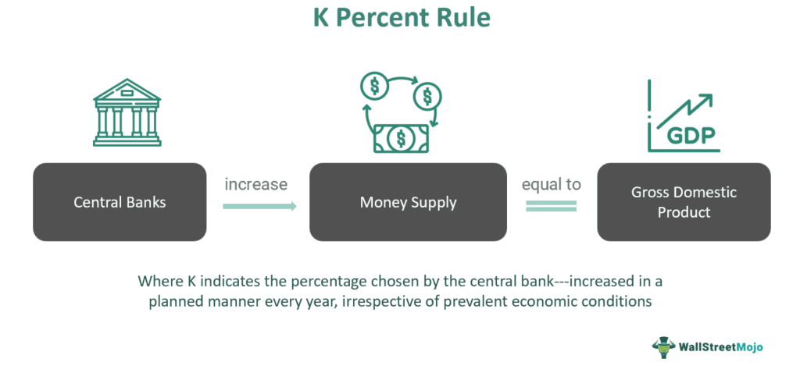

Economic and monetary policy are foundational elements of modern financial systems, with diverse theories and frameworks guiding their application. Among these, Milton Friedman's K-Percent Rule stands out as a significant theory with wide-ranging implications, extending from economic stability to modern algorithmic trading practices. This article investigates the K-Percent Rule's relevance within the larger context of monetary policy and its practical application in algorithmic trading.

Milton Friedman, a renowned economist, proposed the K-Percent Rule as a guideline for monetary policy, suggesting that the money supply should grow at a constant rate each year, aligning with the long-term growth rate of real GDP. This framework was devised to mitigate the risks of inflation and deflation, thereby fostering economic stability. The rule's emphasis on a consistent and predictable increase in the money supply represents a shift from discretionary policy-making towards a rules-based approach.



In the world of trading, particularly algorithmic trading, concepts from monetary policy theories like the K-Percent Rule are increasingly integrated to enhance trading strategies. Algorithmic trading leverages these economic principles to automate trading decisions using quantitative models that operate at high speed and volume. The K-Percent Rule can inform these models by setting criteria for trade execution, especially in momentum-based or mean reversion strategies. Such integration underscores the confluence of economic theory, policy, and technology, highlighting their roles in shaping modern financial markets.

Understanding how the K-Percent Rule intersects with both economic policy and trading strategies is essential for professionals navigating these fields. It also offers insights into future developments, where the balance between economic stability and adaptability within complex financial ecosystems might be further refined. By exploring these intersections, we gain a deeper appreciation of how theoretical principles can be practically applied in today's technology-driven financial landscape.

## Table of Contents

## Understanding Monetary Policy: An Overview

Monetary policy is a critical component of a nation's economic framework and involves the regulation of money supply to achieve macroeconomic goals such as controlling inflation, ensuring price stability, and fostering economic growth. The primary entities responsible for enacting monetary policy are central banks, with the Federal Reserve serving as the central bank of the United States. These institutions wield several tools to influence economic conditions.

One of the primary goals of monetary policy is to manage inflation. Inflation refers to the rate at which the general level of prices for goods and services rises, eroding purchasing power. Central banks strive to maintain a balance where inflation is low and stable, avoiding the extremes of hyperinflation or deflation. By doing so, they create a predictable economic environment that encourages investment and consumption.

Central banks utilize several tools to implement monetary policy, with open market operations being the most commonly used technique. This involves the buying and selling of government securities in the open market to regulate the money supply. When a central bank purchases securities, it injects money into the economy, potentially lowering interest rates and stimulating economic activity. Conversely, selling securities can remove money from circulation, potentially increasing rates and cooling off an overheated economy.

Another essential tool is the adjustment of the discount rate, which is the [interest rate](/wiki/interest-rate-trading-strategies) charged to commercial banks for short-term loans from the central bank. A lower discount rate can encourage banks to borrow more, increasing the money supply, while a higher rate can have the opposite effect. The reserve requirement is also a critical mechanism, dictating the minimum reserves a bank must hold, either in cash or deposits at the central bank. Altering reserve requirements can directly affect the amount of money banks can lend to consumers and businesses.

The debate over the effectiveness of monetary policy often centers on the choice between discretionary and rules-based approaches. A discretionary approach allows policymakers to react to changing economic conditions with flexibility, using their judgment to address unforeseen challenges. However, this can lead to uncertainty and potentially ill-timed interventions. In contrast, a rules-based approach, such as the Taylor Rule, advocates for strict adherence to predefined criteria, promoting consistency and predictability. Critics, however, argue that a rigid rules-based system may not adequately account for the nuances of complex economic environments.

In conclusion, understanding the intricacies of monetary policy is vital for comprehending how governments strive to achieve economic equilibrium. Whether through discretionary or rules-based means, the tools wielded by central banks significantly influence financial systems and, by extension, the broader economy.

## The K-Percent Rule: Concept and Implications

Milton Friedman's K-Percent Rule is a notable theory within economic and monetary policy, advocating for a constant annual growth rate for the money supply. This prescription is intended to synchronize money supply growth with the long-term real GDP growth rate, theoretically mitigating inflationary and deflationary pressures to foster economic stability. Mathematically, this can be expressed as:

$$
M(t) = M(0) \times (1 + k)^t
$$

where $M(t)$ is the money supply at time $t$, $M(0)$ is the initial money supply, and $k$ is the constant growth rate.

Friedman's approach is rooted in monetarism, emphasizing the importance of a stable monetary policy over discretionary measures, which are subject to the unpredictable influences of political and economic cycles. The rules-based nature of the K-Percent Rule offers a systematic method for managing the money supply, reducing the potential for human error or bias.

Despite its theoretical advantages, the K-Percent Rule has not been fully adopted by any central bank. The resistance to its implementation stems from its rigidity, which can be disadvantageous in responding to economic shocks or unforeseen changes in economic conditions. Central banks may find it impractical to adhere to a strict rule, given the dynamic and often volatile global economic environment.

Critics of the K-Percent Rule point to its underlying assumptions, such as a constant velocity of money and stable economic conditions, which may not hold true in all scenarios. The inability to adjust the money supply in response to abrupt changes in economic indicators poses a significant challenge to its practical application. As a result, the K-Percent Rule remains a theoretically appealing but practically challenging concept within monetary policy discourse.

## Algorithmic Trading: An Introduction

Algorithmic trading employs advanced computer programs to execute trades at rapid speeds and significant volumes, leveraging predefined criteria to make informed decisions. This method is increasingly prevalent in financial markets, where it relies on sophisticated quantitative models to enhance trading efficiency and maximize returns.

These algorithmic systems are capable of swiftly analyzing vast amounts of market data, identifying patterns, and executing trades faster than any human could manage. This speed is crucial for capitalizing on short-lived trading opportunities that are often missed with manual trading processes. Algorithms can incorporate a variety of strategies and rules, such as the K-Percent Rule, allowing for automated and rule-based decision-making processes. This integration enables the system to respond dynamically to market shifts, making adjustments in real-time.

The advantages of [algorithmic trading](/wiki/algorithmic-trading) are manifold. Primarily, it increases accuracy by executing trades with precision, minimizing human errors common in manual trading. The speed of execution not only allows for taking advantage of small price discrepancies but also enhances the [liquidity](/wiki/liquidity-risk-premium) of the markets by making transactions faster and more efficient. Moreover, algorithmic trading eliminates emotional biases that can impact trading decisions. Emotional factors such as fear and greed are removed from the equation, leading to more rational and objective decision-making processes.

The adoption of algorithmic trading is not limited to specific markets or instruments; it finds applications across various asset classes, including equities, foreign exchange, and commodities. This versatility is facilitated by the adaptability of the underlying algorithms, which can be adjusted to suit different trading environments and market conditions.

In summary, algorithmic trading represents a significant evolution in the financial markets, offering increased efficiency, accuracy, and objectivity. Its ability to integrate complex rules and models, such as the K-Percent Rule, marks a critical advancement in the automated trading domain, paving the way for more sophisticated and calculated trading strategies.

## The K-Percent Rule in Algorithmic Trading

The K-Percent Rule, a principle originally set forth by economist Milton Friedman, has found its niche within algorithmic trading, offering a systematic approach for executing trades. By applying this rule, traders establish trade execution triggers based on consistent percentage movements, allowing for the identification of [momentum](/wiki/momentum) shifts or opportunities for mean reversion. This adaptability makes the K-Percent Rule applicable to various asset classes, such as stocks, [forex](/wiki/forex-system), and commodities.

Algorithmic traders often use [backtesting](/wiki/backtesting) to determine an optimal 'K' value that aligns with the specific market conditions they are navigating. Backtesting involves running simulations of a trading strategy against historical data to evaluate its effectiveness. In practice, it might look like this in Python:

```python
import pandas as pd

def backtest_k_percent_rule(data, k_value):
    data['k_percent'] = data['Close'].pct_change() * 100  # Calculate percentage change
    buy_signals = data[data['k_percent'] > k_value]  # Identify buy signals
    sell_signals = data[data['k_percent'] < -k_value]  # Identify sell signals

    # Evaluate performance
    positions = pd.DataFrame(index=data.index)
    positions['Asset'] = data['Close']
    positions['Signal'] = 0
    positions.loc[buy_signals.index, 'Signal'] = 1
    positions.loc[sell_signals.index, 'Signal'] = -1
    positions['Returns'] = positions['Signal'].shift(1) * positions['Asset'].pct_change()
    cumulative_returns = (positions['Returns'] + 1).cumprod()

    return cumulative_returns

# Example usage with market data
# market_data = pd.read_csv('market_data.csv')   # Load your market data here
# k_value = 0.05  # For example, a 'K' value of 5%
# cumulative_returns = backtest_k_percent_rule(market_data, k_value)
```

Effective risk management is crucial when implementing the K-Percent Rule in algorithmic trading. This includes setting precise stop-loss and take-profit levels to shield against market [volatility](/wiki/volatility-trading-strategies). Stop-loss orders are designed to limit an investor's loss on a position in a security, while take-profit orders allow traders to lock in profits when a security reaches a desired price level. This ensures that despite the system's dependence on consistent percentage movements, there are adequate safeguards in place to manage the inherent risks associated with fluctuating market conditions.

Calculating and determining optimal 'K' values requires careful consideration of the underlying asset's volatility and average historical returns. Traders must remain vigilant, continuously updating their backtesting models and adjusting these parameters to reflect the changing market dynamics. This integration of the K-Percent Rule into algorithmic trading systems illustrates the crossover of economic principles into practical, technologically-driven financial strategies, maximizing the potential for consistent, data-driven decision-making outcomes.

## Challenges and Criticisms

Critics of the K-Percent Rule assert its rigidity poses significant challenges, especially in dynamic and unpredictable economic environments. One major criticism is its inability to adapt to unforeseen economic changes or shocks. The rule operates under the assumption of a constant velocity of money, which implies consistent spending and transaction habits across the economic landscape. However, this assumption does not hold true universally. Economic conditions are subject to fluctuations due to factors like geopolitical tensions, natural disasters, or pandemics, which can abruptly alter economic stability and transaction velocities.

Furthermore, algorithmic trading, despite its precision and efficiency, also faces vulnerabilities. One major concern is overfitting, where trading models are finely tuned to historical data but fail to perform effectively in live market conditions. Models that appear robust during backtesting can underperform when exposed to new or unforeseen market scenarios, leading to potential financial losses. This challenge necessitates the incorporation of robust validation techniques and stress testing to ensure model reliability beyond hypothetical scenarios.

Additionally, the reliance on lagging indicators in the application of the K-Percent Rule can pose problems. These indicators, which rely on past data, may result in delayed responses to market conditions, causing traders to miss out on advantageous opportunities or to execute trades suboptimally. To mitigate these issues, real-time monitoring becomes crucial. Traders and policymakers must continuously analyze and adjust their strategies to align with current economic conditions and market trends, ensuring that algorithmic systems remain adaptive and responsive.

In summary, while the K-Percent Rule and its integration into algorithmic trading offer structured approaches to policy and trading, their inherent limitations necessitate careful scrutiny and adaptive enhancements to maintain efficacy in the face of economic volatility and evolving market dynamics.

## Conclusion

The K-Percent Rule exemplifies a structured approach to monetary policy by advocating for a consistent growth rate in the money supply. This rules-based methodology is designed to minimize the economic uncertainties associated with discretionary policy decisions. Although the K-Percent Rule has not been implemented in its entirety by any central bank, its underlying principles continue to influence both economic policy formulation and trading strategies in the financial markets.

In the sphere of algorithmic trading, elements of the K-Percent Rule facilitate the automation and optimization of trading operations. By integrating a consistent percentage growth framework, algorithmic trading systems can perform high-frequency trades driven by data, thus reducing the cognitive and emotional biases of human traders. This underscores the beneficial confluence of economic theory and technological innovation in contemporary finance.

The intersection of monetary policy frameworks like the K-Percent Rule with trading strategies showcases the evolving relationship between academic economics and practical trading applications. Such integration harmonizes the goals of economic theories with the precision of algorithmic models, enhancing decision-making processes across financial systems.

Looking forward, ongoing research and development could potentially refine these methodologies, enabling a balance between stability and flexibility within the intricate dynamics of global finance. As financial ecosystems become increasingly complex, exploring improved iterations of the K-Percent Rule could foster greater resilience and adaptability, helping to mitigate both ordinary and extraordinary economic fluctuations.

## References & Further Reading

[1]: Friedman, M. (1968). ["The Role of Monetary Policy."](https://www.aeaweb.org/aer/top20/58.1.1-17.pdf) American Economic Review, 58(1), 1-17.

[2]: ["Monetary Theory and Policy"](http://students.aiu.edu/submissions/profiles/resources/onlineBook/N6v4L3_walsh.pdf) by Carl E. Walsh

[3]: Carver, R. (2012). ["Systematic Trading: A unique new method for designing trading and investing systems."](https://www.amazon.com/Systematic-Trading-designing-trading-investing/dp/0857194453) Harriman House.

[4]: ["Algorithmic Trading and DMA: An introduction to direct access trading strategies"](https://archive.org/details/algorithmictradi0000john) by Barry Johnson

[5]: Murphy, J. J. (1999). ["Technical Analysis of the Financial Markets: A Comprehensive Guide to Trading Methods and Applications."](https://archive.org/details/technicalanalysi0000murp) New York Institute of Finance.