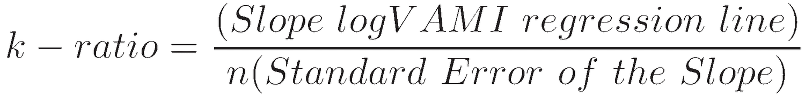

In the fast-paced world of financial markets, algorithmic trading has become a cornerstone, allowing for efficient and automated trade execution. By leveraging complex algorithms and advanced data analytics, traders can execute orders at speeds and frequencies beyond human capability. This evolution has necessitated the development of sophisticated tools to assess the efficacy of trading strategies. Understanding how to measure the performance of these trading strategies is crucial for achieving optimal returns and managing risk effectively.

Among the metrics used, the K-Ratio stands out as a unique tool providing insights into the consistency of returns. Traditional performance metrics, such as the Sharpe Ratio, often focus on risk-adjusted returns but may not adequately capture the consistency and reliability of those returns over time. The K-Ratio addresses this gap by assessing the growth and steadiness of investment performance, offering a nuanced view that complements other metrics.



This article explores the K-Ratio in the context of investment metrics and financial analysis for algorithmic trading. By examining how this tool evaluates the trajectory and variability of returns, traders and analysts can gain a clearer understanding of strategy performance, ultimately aiding in the creation of more robust and reliable trading systems.

## Table of Contents

## What is the K-Ratio?

The K-Ratio is a sophisticated performance metric designed to assess the growth and consistency of investment returns over time. Introduced by financial expert Lars Kestner, the K-Ratio utilizes linear regression techniques to closely analyze the trend and reliability of returns. It is fundamentally based on the Value-Added Monthly Index (VAMI), which tracks the hypothetical value of an initial $1,000 investment over time.

The core concept of the K-Ratio is centered on evaluating both the magnitude and the consistency of returns. This dual focus distinguishes it from more traditional metrics such as the Sharpe Ratio, which primarily accounts for return magnitude relative to risk. The calculation of the K-Ratio involves using logarithmic transformations of cumulative returns, enabling a linear representation of growth to be more effectively analyzed. By applying linear regression to this transformed data, the K-Ratio derives a statistical estimate of the return trend, where the slope indicates the average return.

Moreover, the K-Ratio assesses the reliability or consistency of these returns by taking into account the standard error of the regression line slope. This measure provides insights into the variability of returns, offering a comprehensive picture that integrates both performance and risk stability. Thus, the K-Ratio serves as a valuable tool for investors seeking strategies with not only high returns but also consistent performance over time, making it an essential metric in the evaluation and comparison of trading strategies in financial markets.

## How to Calculate the K-Ratio

Calculating the K-Ratio is centered on analyzing the Value-Added Monthly Index (VAMI) curve, which reflects the growth of a $1,000 initial investment over time. The calculation involves a few key steps:

1. **Data Preparation**: Begin by calculating the cumulative returns from the VAMI data. This involves transforming the VAMI values into a series of cumulative returns on an investment.

2. **Logarithmic Transformation**: Transform these cumulative returns using the natural logarithm. This step is crucial for ensuring that the data becomes linear, facilitating the application of linear regression analysis.

3. **Linear Regression**: Apply linear regression to the logarithmically transformed cumulative returns. In this context, the regression line models the underlying trend of the investment returns.

    - **Slope of the Regression Line**: The slope from this linear regression reflects the average growth rate of the investment returns over time.

    - **Standard Error**: The standard error of the regression model quantifies the variability or risk associated with the returns.

4. **K-Ratio Calculation**: The K-Ratio is determined by dividing the slope of the regression line by the standard error. This ratio highlights the trade-off between the consistency (or reliability) of investment returns and their magnitude:
$$
   K\text{-Ratio} = \frac{\text{slope of regression line}}{\text{standard error}}

$$

The K-Ratio therefore provides a nuanced measure, balancing both return magnitude and consistency, which can offer meaningful insights when comparing the performance and stability of various trading strategies. This approach helps in discerning strategies that not only provide good returns but also maintain those returns steadily over time, an essential consideration for investors seeking to optimize their portfolios.

## The Significance of the K-Ratio

The K-Ratio is a significant metric in financial analysis, specifically for [algorithmic trading](/wiki/algorithmic-trading), due to its ability to provide insights into the consistency of trading strategy returns. Unlike some traditional metrics that focus solely on the magnitude of returns, the K-Ratio considers both the consistency and growth of returns over time. This dual focus is valuable for investors and traders aiming to assess the reliability of a trading strategy.

A higher K-Ratio indicates not only strong performance but also low [volatility](/wiki/volatility-trading-strategies) in returns. This means that over time, the strategy has been able to produce consistent gains with minimal fluctuations. Such a characteristic is particularly appealing to investors who prioritize steady returns over potentially volatile, high-yield investments. For instance, if two strategies exhibit the same average return, the one with the higher K-Ratio typically has fewer and less extreme variations from the average, suggesting a smoother performance path.

Conversely, a low K-Ratio may reflect high variability in returns, signaling a potential risk for investors. Strategies exhibiting a low K-Ratio might experience significant peaks and troughs, implying that the returns are not only less consistent but could be unpredictable. This variability can necessitate a more cautious approach to investing, as the potential for unexpected losses may outweigh the benefits of occasional high returns. 

For algorithmic traders, analyzing the K-Ratio among multiple strategies assists in identifying those that align with specific risk tolerance and investment goals, balancing the desire for high returns with the need for consistent performance. Thus, the K-Ratio emerges as an instrumental tool in the comprehensive evaluation of trading strategies, helping to make informed decisions in the pursuit of optimal investment outcomes.

## How to Use the K-Ratio in Algo Trading

In algorithmic trading, the K-Ratio is a valuable metric for evaluating and comparing the performance of different trading strategies. It provides traders with insights into the consistency of returns over time, which is crucial for optimizing portfolio allocations.

The K-Ratio helps traders identify strategies that offer stable performance, reducing the likelihood of large fluctuations that could disrupt investment goals. For instance, a trading strategy with a high K-Ratio is likely to deliver steady returns with low volatility, making it an attractive option for risk-averse investors aiming for consistent growth.

To effectively incorporate the K-Ratio into algorithmic trading, traders typically use it alongside other performance metrics such as the Sharpe Ratio, Sortino Ratio, and maximum drawdown. By doing so, they achieve a comprehensive evaluation of a strategy's risk-return profile and enhance risk management practices. This holistic approach ensures that while the K-Ratio assesses the consistency of returns, other metrics provide insights into the overall risk and potential for extreme losses.

In practical terms, implementing the K-Ratio in a trading strategy can involve regular monitoring and analysis. Here is a simple Python snippet demonstrating how one might calculate the K-Ratio using historical returns data:

```python
import numpy as np
import pandas as pd
from sklearn.linear_model import LinearRegression

# Load historical returns data
returns_data = pd.read_csv('historical_returns.csv')

# Calculate the logarithmic cumulative returns
log_cumulative_returns = np.log1p(returns_data['returns']).cumsum()

# Reshape data for regression
x = np.arange(len(log_cumulative_returns)).reshape(-1, 1)
y = log_cumulative_returns.values.reshape(-1, 1)

# Perform linear regression
model = LinearRegression().fit(x, y)
slope = model.coef_[0][0]
standard_error = np.std(residuals=model.predict(x) - y)

# Calculate the K-Ratio
k_ratio = slope / standard_error

print(f"K-Ratio: {k_ratio}")
```

Using this Python code, traders can compute the K-Ratio from their historical returns data, allowing them to regularly assess the consistency of their strategies. This continuous evaluation helps in adjusting strategies to align with changing market conditions and maintaining optimal performance.

In essence, the K-Ratio, as a part of a broader analytical toolkit, aids in refining algorithmic trading strategies by emphasizing consistency and mitigating risks associated with variable return patterns.

## The History of the K-Ratio

The K-Ratio, introduced by Lars Kestner in 1996, emerged as a response to the limitations posed by traditional performance metrics such as the Sharpe Ratio and the Sortino Ratio. These earlier metrics primarily focused on risk-adjusted return but often fell short in adequately addressing the consistency and growth trajectory of an investment's performance over time. The K-Ratio was designed to fill this gap by not only assessing the magnitude of returns but also evaluating their reliability, making it a more holistic tool for financial analysis.

Since its inception, the K-Ratio has undergone several refinements to enhance its applicability across a range of market conditions. These modifications have often involved improvements in the mathematical techniques used to precisely quantify the consistency of returns. By utilizing linear regression on the logarithmic cumulative returns of an investment, the K-Ratio effectively measures the trend of performance over a specified period. The mathematical formula for calculating the K-Ratio is given by:

$$
K \text{-Ratio} = \frac{\text{slope of the regression line}}{\text{standard error of the regression}}
$$

Here, the slope of the regression line represents the average return rate, while the standard error indicates the volatility of these returns. This adaptation allows the K-Ratio to provide a balanced view of both return magnitude and stability.

The evolution of the K-Ratio over the years has solidified its role as a complementary tool in financial analysis. It addresses the gap left by other ratios which often focus solely on risk without adequately considering the regularity of returns. In algorithmic trading, where precision and steadiness of performance are paramount, the K-Ratio has proven to be particularly valuable. By offering insights into an investment’s return pattern, it aids investors and traders in making informed decisions that align with their risk tolerance and investment objectives.

Overall, the K-Ratio's development reflects the ongoing need in financial markets for robust metrics that account for both performance consistency and magnitude. Its advancement underscores its enduring relevance and utility in contemporary financial analysis.

## Conclusion

The K-Ratio proves to be an essential metric in modern financial analysis, particularly in algorithmic trading, due to its notable focus on both the magnitude and consistency of returns. By evaluating the proportion of return to risk, the K-Ratio provides a more nuanced picture of a trading strategy's performance, thus aiding investors and traders in making informed decisions. Its ability to offer insights into return consistency makes it an invaluable tool for those aiming to optimize trading strategies.

However, while the K-Ratio provides significant insights, it is not a standalone solution. It should be utilized alongside other performance indicators such as the Sharpe Ratio, Sortino Ratio, and maximum drawdown to ensure a comprehensive evaluation of trading strategies. This holistic approach facilitates a more thorough understanding of both potential risks and benefits, thereby enabling more effective portfolio management.

By leveraging the K-Ratio effectively, traders can refine their strategies and better align them with their investment goals. Whether the aim is to mitigate risk or enhance return consistency, the K-Ratio offers a robust framework for strategy assessment and optimization in the competitive arena of financial markets.

## FAQ

### How is the K-Ratio calculated?

The calculation of the K-Ratio involves running a linear regression on the logarithmic values of the cumulative returns of the Value-Added Monthly Index (VAMI) curve. The process starts by tracking the performance of an initial $1,000 investment over time, forming a VAMI curve. The key components in the K-Ratio calculation are:

1. **Logarithmic Transformation**: The cumulative returns are transformed using logarithms to linearize the exponential growth typically seen in investment returns.

2. **Linear Regression**: A linear regression model is fitted to these logarithmic values. The output of this regression provides two important metrics:
   - **Slope (β)**: Represents the average return per period.
   - **Standard Error (SE)**: Measures the dispersion or variability in these returns.

3. **K-Ratio Computation**: The K-Ratio is calculated by dividing the slope by the standard error of the regression:
$$
   \text{K-Ratio} = \frac{\beta}{SE}

$$

This ratio effectively balances the magnitude of returns with their consistency over time.

### What does the K-Ratio signify?

The K-Ratio is a powerful tool for evaluating the consistency and reliability of investment returns. A higher K-Ratio indicates a trend of steady growth with less volatility, making it appealing for investors who prioritize stable and consistent returns. On the contrary, a lower K-Ratio may suggest high variability and erratic performance, necessitating a more cautious approach. By focusing on both the magnitude and stability of returns, the K-Ratio provides a more nuanced view than traditional metrics like the Sharpe Ratio, which primarily considers return relative to risk.

### How can the K-Ratio be used effectively in financial analysis?

In financial analysis, the K-Ratio serves as an essential metric for assessing different investment strategies. To use it effectively:

- **Comparison of Strategies**: The K-Ratio can help compare the consistency of returns across multiple trading strategies, making it easier to identify those with superior performance.

- **Portfolio Optimization**: A higher K-Ratio strategy can be prioritized in portfolio allocation to enhance the overall stability and performance.

- **Risk Management**: Coupling the K-Ratio with other metrics such as the Sharpe Ratio and maximum drawdown can provide a comprehensive evaluation framework. This holistic approach supports identifying strategies that not only offer high returns but do so with minimal volatility.

By integrating the K-Ratio into broader performance assessment tools, investors can align their trading strategies more closely with predefined investment goals and risk tolerance levels.

## References & Further Reading

[1]: Kestner, L. N. (1996). "Getting a Handle on True Performance." Futures Magazine.

[2]: Alexander, C. (2001). ["Market Models: A Guide to Financial Data Analysis."](https://archive.org/details/marketmodelsguid0000alex) Wiley.

[3]: Tucker Balch, B., & Lopez de Prado, M. (2017). ["The Sharpe Ratio Efficient Frontier."](http://www.davidhbailey.com/dhbpapers/sharpe-frontier.pdf) Social Science Research Network.

[4]: Vidyamurthy, G. (2004). ["Pairs Trading: Quantitative Methods and Analysis."](https://www.semanticscholar.org/paper/Pairs-Trading%3A-Quantitative-Methods-and-Analysis-Vidyamurthy/8aeec49b176adc1c4b6ba6b7d7fc0b47ce07f73a) John Wiley & Sons.

[5]: Lopez de Prado, M. (2018). ["Advances in Financial Machine Learning."](https://www.amazon.com/Advances-Financial-Machine-Learning-Marcos/dp/1119482089) Wiley.