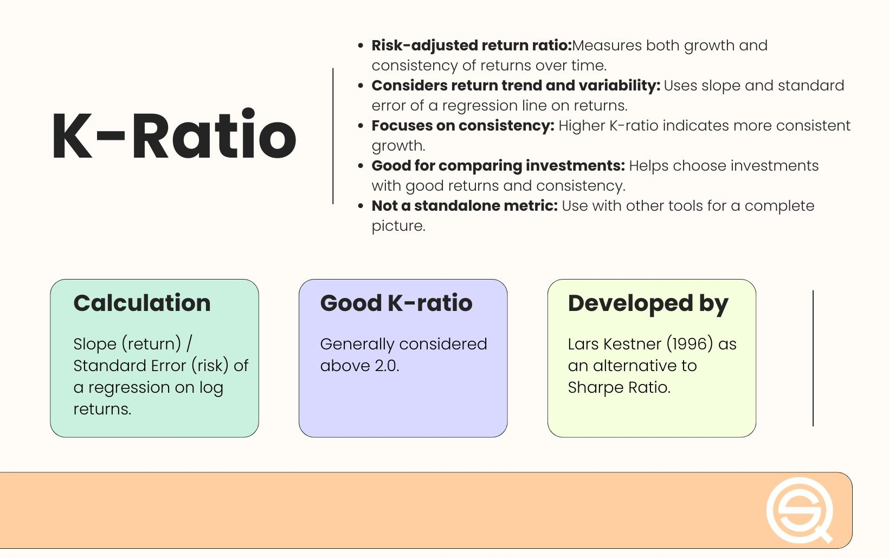

## Table of Contents

## What is the K-Ratio?

The K-Ratio is a way to measure how well an investment is doing compared to how risky it is. It's like a score that tells you if the extra risk you're taking with an investment is worth it because of the extra returns you might get. The K-Ratio is calculated by taking the difference between the return of the investment and the return of a risk-free investment, like a government bond, and then dividing that by the risk of the investment, which is usually measured by something called standard deviation.

This ratio is really helpful for people who want to see if their investments are doing better than just putting their money in safe places. If the K-Ratio is high, it means the investment is giving you good returns for the risk you're taking. If it's low, it might mean you're not getting enough reward for the risk. So, when choosing where to put your money, looking at the K-Ratio can help you decide if an investment is worth the risk.

## Why is the K-Ratio important in finance?

The K-Ratio is important in finance because it helps people understand if the risk they are taking with an investment is worth it. Imagine you're choosing between different places to put your money. Some places are safe but don't give you much money back, while others are riskier but could give you more. The K-Ratio acts like a guide, showing you if the extra risk is paying off by giving you more returns than you would get from a safe investment, like a government bond.

This ratio is especially useful for people who want to compare different investments. If one investment has a high K-Ratio, it means you're getting a good reward for the risk you're taking. On the other hand, if the K-Ratio is low, it might mean you're not getting enough extra money to make the risk worth it. By using the K-Ratio, investors can make smarter choices about where to put their money, balancing the potential rewards against the risks they're willing to take.

## How does the K-Ratio differ from other financial ratios?

The K-Ratio is different from other financial ratios because it focuses on the balance between risk and reward. For example, the Sharpe Ratio is similar because it also looks at how much extra return you get for the risk you take, but it measures risk a bit differently. The K-Ratio uses something called standard deviation to measure risk, while the Sharpe Ratio can use other methods. This makes the K-Ratio a specific tool for investors who want to understand if their investments are doing better than just putting money in safe places like government bonds.

Another ratio, the Sortino Ratio, is also about risk and reward but it only looks at the bad kind of risk, the risk of losing money. The K-Ratio, on the other hand, looks at all kinds of risk, both the good and the bad. This means the K-Ratio gives a broader picture of how an investment is doing. So, while other ratios like the Sharpe and Sortino Ratios are useful, the K-Ratio is unique because it helps investors see if the total risk they're taking is worth the extra returns they're getting.

## What is the formula for calculating the K-Ratio?

The K-Ratio is calculated using a simple formula that helps you see if the risk you're taking with an investment is worth it. To find the K-Ratio, you start by taking the return of your investment and subtracting the return of a risk-free investment, like a government bond. This gives you the extra return you're getting from your investment. Then, you divide this extra return by the standard deviation of your investment's returns. The standard deviation is a way to measure how much the returns of your investment go up and down, which tells you about the risk.

So, the formula for the K-Ratio is: (Return of Investment - Return of Risk-Free Investment) / Standard Deviation of Investment Returns. If the K-Ratio is high, it means you're getting a good reward for the risk you're taking. If it's low, it might mean the risk isn't worth it because you're not getting enough extra return. This simple formula helps investors make better choices about where to put their money by showing them if the risk is worth the reward.

## What are the components needed to compute the K-Ratio?

To compute the K-Ratio, you need to know three main things: the return of your investment, the return of a risk-free investment, and the standard deviation of your investment's returns. The return of your investment is how much money you make from it over a certain time. The return of a risk-free investment is usually the return you would get from something very safe, like a government bond. The standard deviation is a way to measure how much the returns of your investment go up and down, which tells you about the risk.

Once you have these three pieces of information, you can calculate the K-Ratio. You start by subtracting the return of the risk-free investment from the return of your investment. This shows you the extra return you're getting by choosing your investment instead of the safe option. Then, you divide this extra return by the standard deviation of your investment's returns. The result is the K-Ratio, which tells you if the risk you're taking is worth it because of the extra returns you're getting.

## Can you explain each term in the K-Ratio formula?

The K-Ratio formula has three main parts: the return of your investment, the return of a risk-free investment, and the standard deviation of your investment's returns. The return of your investment is how much money you make from it over a certain time. For example, if you put $100 into an investment and it grows to $110, your return is 10%. The return of a risk-free investment is what you would earn from something very safe, like a government bond. This is usually a smaller return because it's less risky, so it's a good way to compare how much more you're getting from your investment.

The last part of the formula is the standard deviation of your investment's returns. This tells you how much the returns of your investment go up and down, which is a way to measure risk. If the returns are all over the place, the standard deviation will be high, meaning it's riskier. If the returns are more steady, the standard deviation will be low, meaning it's less risky. To calculate the K-Ratio, you subtract the return of the risk-free investment from the return of your investment, and then you divide that by the standard deviation. This gives you a number that shows if the risk you're taking is worth it because of the extra returns you're getting.

## How do you interpret the results of the K-Ratio?

When you look at the K-Ratio, it tells you if the risk you're taking with an investment is worth it. If the K-Ratio is high, it means you're getting a good reward for the risk. For example, if your investment is giving you a lot more money than you would get from a safe place like a government bond, and the ups and downs of your investment's returns are not too crazy, then the K-Ratio will be high. This is a good sign because it means the extra risk is paying off.

On the other hand, if the K-Ratio is low, it might mean the risk isn't worth it. If your investment isn't giving you much more money than a safe investment, or if the returns are going up and down a lot, then the K-Ratio will be low. This tells you that you might not be getting enough extra reward to make the risk worthwhile. So, when choosing where to put your money, the K-Ratio helps you decide if an investment is a good choice based on the balance between risk and reward.

## What is considered a good K-Ratio value?

A good K-Ratio value is usually one that is higher than 1. This means that for the risk you're taking with your investment, you're getting more reward than you would from a safe investment like a government bond. If your K-Ratio is above 1, it's a sign that the extra risk is worth it because you're [earning](/wiki/earning-announcement) more money. For example, if your investment gives you a 10% return and a government bond gives you 2%, and the risk (measured by standard deviation) is 5%, your K-Ratio would be (10% - 2%) / 5% = 1.6, which is considered good.

However, what counts as a good K-Ratio can also depend on what you're comparing it to. If you're looking at a bunch of different investments, a higher K-Ratio compared to the others might mean that investment is the best choice. But even if a K-Ratio is above 1, it's still important to think about your own comfort with risk. Some people might be okay with a lower K-Ratio if they want to be safer with their money. So, while a K-Ratio above 1 is generally good, the best value for you depends on your own goals and how much risk you're willing to take.

## Can you provide a simple example of calculating the K-Ratio?

Let's say you have an investment that gives you a 12% return over a year. You also know that you could put your money in a safe place, like a government bond, and get a 3% return. The difference between these two returns is 12% - 3% = 9%. This 9% is the extra return you're getting by choosing your investment over the safe option.

Now, you need to know how risky your investment is. Let's say the standard deviation of your investment's returns is 6%. The standard deviation is a way to measure how much the returns go up and down, which tells you about the risk. To calculate the K-Ratio, you take the extra return (9%) and divide it by the standard deviation (6%). So, the K-Ratio is 9% / 6% = 1.5. This means you're getting a good reward for the risk you're taking, because a K-Ratio above 1 is considered good.

## How can the K-Ratio be used in investment decision-making?

The K-Ratio can help you make smart choices about where to put your money. It tells you if the risk you're taking with an investment is worth it because of the extra money you might get. If the K-Ratio is high, it means you're getting a good reward for the risk. For example, if you see one investment with a K-Ratio of 2 and another with a K-Ratio of 0.5, the first one might be a better choice because it's giving you more reward for the risk you're taking.

When you're deciding where to invest, looking at the K-Ratio can help you compare different options. If you have a few investments to choose from, the one with the highest K-Ratio might be the best one because it shows you're getting the most extra money for the risk. But remember, even if an investment has a good K-Ratio, you should also think about how much risk you're okay with. Some people might pick an investment with a lower K-Ratio if they want to be safer with their money. So, the K-Ratio is a useful tool, but it's just one part of making a good investment choice.

## What are the limitations of using the K-Ratio?

The K-Ratio is a helpful tool, but it has some limits. One big limit is that it only looks at how much the returns of an investment go up and down over time, which is called standard deviation. This might not tell the whole story about risk. For example, it doesn't look at other kinds of risk, like the chance that the company you invest in might go out of business or that the whole market might drop. So, the K-Ratio might make an investment look less risky than it really is.

Also, the K-Ratio uses the return of a risk-free investment, like a government bond, as a starting point. But the return on these safe investments can change over time, and what counts as "risk-free" might be different in different countries or at different times. This means the K-Ratio might not always be comparing apples to apples. Plus, the K-Ratio doesn't think about how long you plan to keep your money in the investment, which can also change how risky it is. So, while the K-Ratio can help you see if the risk of an investment is worth it, it's important to use it along with other ways to look at investments.

## Are there any advanced applications or modifications of the K-Ratio used in professional settings?

In professional settings, people sometimes use a modified version of the K-Ratio to get a better look at investments. They might change the way they measure risk to include more than just how much returns go up and down. For example, they might use something called downside deviation, which only looks at the bad kind of risk, the risk of losing money. This can give a more detailed picture of how risky an investment really is. They might also use different kinds of risk-free rates, like the return on short-term government bonds or even inflation rates, to make the K-Ratio more accurate for different situations.

Another advanced use of the K-Ratio in professional settings is to look at it over time, not just at one moment. This helps to see how the balance between risk and reward changes. Professionals might also combine the K-Ratio with other tools, like the Sharpe Ratio or the Sortino Ratio, to get a fuller understanding of an investment's performance. By using these advanced applications and modifications, they can make smarter decisions about where to put their money, knowing that they're looking at the risk and reward in a more complete way.

## How do you calculate the K-Ratio?

Calculating the K-Ratio is centered on analyzing the Value-Added Monthly Index (VAMI) curve, which reflects the growth of a $1,000 initial investment over time. The calculation involves a few key steps:

1. **Data Preparation**: Begin by calculating the cumulative returns from the VAMI data. This involves transforming the VAMI values into a series of cumulative returns on an investment.

2. **Logarithmic Transformation**: Transform these cumulative returns using the natural logarithm. This step is crucial for ensuring that the data becomes linear, facilitating the application of linear regression analysis.

3. **Linear Regression**: Apply linear regression to the logarithmically transformed cumulative returns. In this context, the regression line models the underlying trend of the investment returns.

    - **Slope of the Regression Line**: The slope from this linear regression reflects the average growth rate of the investment returns over time.

    - **Standard Error**: The standard error of the regression model quantifies the variability or risk associated with the returns.

4. **K-Ratio Calculation**: The K-Ratio is determined by dividing the slope of the regression line by the standard error. This ratio highlights the trade-off between the consistency (or reliability) of investment returns and their magnitude:
$$
   K\text{-Ratio} = \frac{\text{slope of regression line}}{\text{standard error}}

$$

The K-Ratio therefore provides a nuanced measure, balancing both return magnitude and consistency, which can offer meaningful insights when comparing the performance and stability of various trading strategies. This approach helps in discerning strategies that not only provide good returns but also maintain those returns steadily over time, an essential consideration for investors seeking to optimize their portfolios.

## What is the History of the K-Ratio?

The K-Ratio, introduced by Lars Kestner in 1996, emerged as a response to the limitations posed by traditional performance metrics such as the Sharpe Ratio and the Sortino Ratio. These earlier metrics primarily focused on risk-adjusted return but often fell short in adequately addressing the consistency and growth trajectory of an investment's performance over time. The K-Ratio was designed to fill this gap by not only assessing the magnitude of returns but also evaluating their reliability, making it a more holistic tool for financial analysis.

Since its inception, the K-Ratio has undergone several refinements to enhance its applicability across a range of market conditions. These modifications have often involved improvements in the mathematical techniques used to precisely quantify the consistency of returns. By utilizing linear regression on the logarithmic cumulative returns of an investment, the K-Ratio effectively measures the trend of performance over a specified period. The mathematical formula for calculating the K-Ratio is given by:

$$
K \text{-Ratio} = \frac{\text{slope of the regression line}}{\text{standard error of the regression}}
$$

Here, the slope of the regression line represents the average return rate, while the standard error indicates the [volatility](/wiki/volatility-trading-strategies) of these returns. This adaptation allows the K-Ratio to provide a balanced view of both return magnitude and stability.

The evolution of the K-Ratio over the years has solidified its role as a complementary tool in financial analysis. It addresses the gap left by other ratios which often focus solely on risk without adequately considering the regularity of returns. In [algorithmic trading](/wiki/algorithmic-trading), where precision and steadiness of performance are paramount, the K-Ratio has proven to be particularly valuable. By offering insights into an investment’s return pattern, it aids investors and traders in making informed decisions that align with their risk tolerance and investment objectives.

Overall, the K-Ratio's development reflects the ongoing need in financial markets for robust metrics that account for both performance consistency and magnitude. Its advancement underscores its enduring relevance and utility in contemporary financial analysis.

## What are the frequently asked questions?

### How is the K-Ratio calculated?

The calculation of the K-Ratio involves running a linear regression on the logarithmic values of the cumulative returns of the Value-Added Monthly Index (VAMI) curve. The process starts by tracking the performance of an initial $1,000 investment over time, forming a VAMI curve. The key components in the K-Ratio calculation are:

1. **Logarithmic Transformation**: The cumulative returns are transformed using logarithms to linearize the exponential growth typically seen in investment returns.

2. **Linear Regression**: A linear regression model is fitted to these logarithmic values. The output of this regression provides two important metrics:
   - **Slope (β)**: Represents the average return per period.
   - **Standard Error (SE)**: Measures the dispersion or variability in these returns.

3. **K-Ratio Computation**: The K-Ratio is calculated by dividing the slope by the standard error of the regression:
$$
   \text{K-Ratio} = \frac{\beta}{SE}

$$

This ratio effectively balances the magnitude of returns with their consistency over time.

### What does the K-Ratio signify?

The K-Ratio is a powerful tool for evaluating the consistency and reliability of investment returns. A higher K-Ratio indicates a trend of steady growth with less volatility, making it appealing for investors who prioritize stable and consistent returns. On the contrary, a lower K-Ratio may suggest high variability and erratic performance, necessitating a more cautious approach. By focusing on both the magnitude and stability of returns, the K-Ratio provides a more nuanced view than traditional metrics like the Sharpe Ratio, which primarily considers return relative to risk.

### How can the K-Ratio be used effectively in financial analysis?

In financial analysis, the K-Ratio serves as an essential metric for assessing different investment strategies. To use it effectively:

- **Comparison of Strategies**: The K-Ratio can help compare the consistency of returns across multiple trading strategies, making it easier to identify those with superior performance.

- **Portfolio Optimization**: A higher K-Ratio strategy can be prioritized in portfolio allocation to enhance the overall stability and performance.

- **Risk Management**: Coupling the K-Ratio with other metrics such as the Sharpe Ratio and maximum drawdown can provide a comprehensive evaluation framework. This holistic approach supports identifying strategies that not only offer high returns but do so with minimal volatility.

By integrating the K-Ratio into broader performance assessment tools, investors can align their trading strategies more closely with predefined investment goals and risk tolerance levels.

## References & Further Reading

[1]: Kestner, L. N. (1996). "Getting a Handle on True Performance." Futures Magazine.

[2]: Alexander, C. (2001). ["Market Models: A Guide to Financial Data Analysis."](https://archive.org/details/marketmodelsguid0000alex) Wiley.

[3]: Tucker Balch, B., & Lopez de Prado, M. (2017). ["The Sharpe Ratio Efficient Frontier."](http://www.davidhbailey.com/dhbpapers/sharpe-frontier.pdf) Social Science Research Network.

[4]: Vidyamurthy, G. (2004). ["Pairs Trading: Quantitative Methods and Analysis."](https://www.semanticscholar.org/paper/Pairs-Trading%3A-Quantitative-Methods-and-Analysis-Vidyamurthy/8aeec49b176adc1c4b6ba6b7d7fc0b47ce07f73a) John Wiley & Sons.

[5]: Lopez de Prado, M. (2018). ["Advances in Financial Machine Learning."](https://www.amazon.com/Advances-Financial-Machine-Learning-Marcos/dp/1119482089) Wiley.