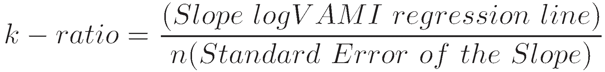

Algorithmic trading, commonly referred to as algo trading, involves the utilization of automated algorithms to execute trades, minimizing the need for human intervention. It has become a cornerstone of modern financial markets, allowing for fast-paced and efficient transactions based on predefined criteria. A critical aspect of algorithmic trading is evaluating the performance of these strategies to ensure they meet investment goals while managing risks effectively. Among the key performance metrics employed for this purpose is the K-ratio, introduced by Lars Kestner.

The K-ratio serves as a vital tool in measuring both the growth and the consistency of returns. By providing insights into risk versus return, it enables traders and investors to assess the effectiveness of their strategies in producing steady gains over time. Traditional performance metrics often focus solely on return, ignoring the variability and reliability of achieving those returns. The K-ratio, however, integrates both aspects, offering a more comprehensive analysis of financial performance.



This article will explore various aspects of the K-ratio, including its calculation, significance, and application within the context of algorithmic trading. Through understanding this metric, traders can obtain a clearer picture of risk-adjusted returns and leverage it as part of a broader strategy to enhance trading performance.

## Table of Contents

## What is the K-Ratio?

The K-ratio, introduced by Lars Kestner in 1996, serves as a robust statistical performance metric designed to evaluate the consistency and growth of investment returns. This metric offers a nuanced view beyond conventional measures by incorporating both the magnitude of returns and their consistency over time. It does so utilizing the value-added monthly index (VAMI), a method that tracks the compounded cumulative returns of an investment from a baseline of $1,000.

In evaluating an investment's performance, the K-ratio primarily focuses on the linear trend of returns. This is achieved by examining two key components: the slope of the return series and the standard error of the regression. The slope is critical as it represents the average return per period, highlighting the growth trajectory of the investment. Meanwhile, the standard error provides insights into the risk aspect, indicating the deviation of returns from the expected trend line. This dual consideration of return and risk positions the K-ratio as a comprehensive tool in performance assessment.

Widely adopted in the assessment of securities, portfolios, and fund managers, the K-ratio is instrumental in determining the steadiness of performance over time. By emphasizing consistency and growth of returns, the K-ratio assists investors and fund managers in identifying strategies that provide steady, reliable performance, distinguishing them from those that might offer high returns but with elevated volatility and risk.

## How to Calculate the K-Ratio

To calculate the K-ratio, the key step involves performing a linear regression on the logarithmic cumulative return of the Value-Added Monthly Index (VAMI) curve. The VAMI represents the hypothetical growth of a $1,000 investment over time, considering the compounded monthly returns. This provides a foundational dataset through which the K-ratio can be determined.

Firstly, construct a scatter plot where the x-axis represents the number of periods (commonly months in financial data) and the y-axis is the logarithm of the VAMI values, $\log[VAMI]$. This visual depiction helps in identifying the linear trend of the returns. The slope of this regression line provides an estimate of the average return per period. Thus, the main calculation focuses on finding this slope:

- **Slope ($m$)**: It can be calculated using linear regression techniques. In Python, this can be accomplished with the `statsmodels` or `scikit-learn` library:

```python
import numpy as np
import statsmodels.api as sm

# periods is a numpy array representing the number of periods, e.g., [1, 2, ..., n]
# log_vami is a numpy array representing the log of the VAMI values

# Adding a constant for intercept calculation
X = sm.add_constant(periods)
model = sm.OLS(log_vami, X).fit()
slope = model.params[1]
```

Subsequently, assess the standard error of the regression, which is an indicator of risk related to the variability of the returns:

- **Standard Error ($SE$)**: This can be extracted directly from the results of the regression model and signifies the standard deviation of the residuals (the differences between observed and predicted values).

Finally, compute the K-ratio using the formula:

$$
\text{K-ratio} = \frac{\text{Slope of logVAMI regression line}}{\text{Standard Regression Error}}
$$

A higher K-ratio value signifies not only a robust return but also a stable one, making it a crucial metric in evaluating algo trading strategies.

## The Significance of the K-Ratio

The K-ratio provides critical insights into both the return and consistency of a trading strategy, which are vital for investors when evaluating potential investments. The dual focus on these parameters ensures a more comprehensive understanding of performance, beyond what traditional metrics might offer.

An increase in the slope of the cumulative Profit and Loss (P&L) reflects a faster-growing return, which directly enhances the K-ratio. This improvement indicates a steady and reliable performance of the trading strategy over time. The consistency of growth, as captured by the slope, helps in assessing whether a strategy is likely to sustain its success in varying market conditions.

A higher K-ratio, generally considered to be above 2.0, signifies robust performance. Such a value not only points to positive returns but also underscores consistent performance over time. A high K-ratio is thus an attractive feature for investors, suggesting that a strategy or manager effectively balances risk and reward.

Conversely, outsized gains or losses may negatively impact the K-ratio due to the heightened inconsistency they introduce. These fluctuations can skew the evaluation of a strategy, making it appear less reliable. Thus, while large gains may be appealing, the associated [volatility](/wiki/volatility-trading-strategies) could diminish the perceived effectiveness of the strategy, as reflected in a lower K-ratio. 

Overall, the K-ratio is valuable in gauging the consistency of returns, highlighting strategies that maintain stable growth, and alerting investors to potential volatility that might compromise long-term gains.

## How to Use the K-Ratio in Algo Trading

The K-ratio, as a versatile metric, provides significant insights for traders aiming to enhance their [algorithmic trading](/wiki/algorithmic-trading) strategies. However, its value is maximized when combined with other performance metrics rather than used in isolation. This is due to its focus on both the return and the consistency of returns, making it a powerful tool for comparison and evaluation.

One of the essential applications of the K-ratio in algo trading is the assessment and comparison of cumulative returns across various assets, strategies, or fund managers. By evaluating the consistency of growth over time, traders can make more informed choices about where to allocate resources effectively. For instance, a strategy that boasts high returns but low consistency might warrant a closer examination or be complemented with other strategies to balance the portfolio.

Moreover, in the context of risk management, the K-ratio serves as an indicator of the steadiness of returns. Its ability to capture the consistency of performance aids in understanding the risk profile of a particular strategy or investment type. This insight is crucial for decision-making processes, particularly when selecting strategies that align with an investor's risk tolerance and financial goals.

Although primarily discussed in relation to equities, the application of the K-ratio is not confined to this asset class alone. It's equally applicable to derivatives, [forex](/wiki/forex-system), and other trading instruments. By providing a standardized measure of performance consistency across diverse instruments, the K-ratio helps traders analyze the efficacy of their strategies in various market conditions. This flexibility in application allows it to be an integral part of a comprehensive evaluation framework, encompassing multiple aspects of trading performance and risk. 

Ultimately, the K-ratio's utility in algo trading lies in its ability to both streamline the comparison of different investment entities and enhance risk management practices. Its integration with other key performance metrics provides a holistic approach to evaluating and optimizing trading strategies.

## The History of the K-Ratio

Lars Kestner introduced the K-ratio in 1996 in his book "Quantitative Trading Strategies" as an innovative measure for evaluating trading performance. It served as an alternative to traditional metrics like the Sharpe Ratio by emphasizing not only the magnitude of returns but also their consistency over time. Kestner's approach sought to address the limitations of existing measures, such as sensitivity to non-normal return distributions and a lack of focus on return consistency.

Over the years, the K-ratio has experienced refinements to enhance its applicability and accuracy. Key revisions occurred in 2003 and 2013, aimed at accommodating various return period observations and improving the robustness of the metric. These revisions introduced adjustments in the calculation process, considering the frequency of observations and periodic return adjustments. This refinement ensures that the K-ratio remains a reliable metric even when the data spans different time frames and trading conditions.

The calculation of the K-ratio involves conducting a linear regression on the logarithmic cumulative return of a Value Added Monthly Index (VAMI) curve. The result is a slope that signifies average return and a standard error indicating risk. The ratio of these two values provides a measure of the stability and growth of returns. The formula for the K-ratio is expressed as:

$$
K \text{-ratio} = \frac{\text{Slope of logVAMI regression line}}{\text{Standard Regression Error}}
$$

Kestner's innovation laid the groundwork for a comprehensive measurement tool that complements traditional risk-return analysis metrics by offering a more nuanced understanding of performance. By emphasizing both the growth and consistency of returns, the K-ratio provides valuable insights for traders and fund managers assessing the efficacy of their strategies or making comparative evaluations across different investments.

## Conclusion

The K-ratio remains a valuable metric in the portfolio of performance evaluation tools for algorithmic trading. Understanding its calculation and significance can empower traders to make more informed decisions, as it offers an insightful analysis of both the consistency and growth of returns. By accurately reflecting the steadiness of accumulated returns over time, the K-ratio assists traders in navigating the complexities of balancing risk and reward, thus fostering a proactive investment approach.

Despite its utility, the K-ratio should not be used in isolation. It is most effective when integrated with other performance indicators to build a comprehensive strategy evaluation framework. These additional metrics can include traditional measures like the Sharpe Ratio or the Sortino Ratio, which together provide a multifaceted view of risk-adjusted returns. Through this holistic assessment, traders can better manage risks and optimize the performance of their trading strategies, ensuring that their decisions align with their financial goals and risk tolerance levels.

## FAQ

### FAQ

**How is the K-ratio calculated?**

The K-ratio is calculated by performing a linear regression on the logarithmic cumulative returns of a Value-Added Monthly Index (VAMI) curve. The formula for the K-ratio is as follows:

$$
K\text{-ratio} = \frac{\text{Slope of logVAMI regression line}}{\text{Standard Regression Error}}
$$

This process involves plotting the natural logarithm of the VAMI values against time periods, then fitting a linear trend line to this data. The slope of the line represents the return per period, while the standard error quantifies the risk. This calculation captures not only the magnitude of returns but also their consistency over time.

**What does the K-ratio signify?**

The K-ratio provides an understanding of the stability and consistency of returns over time. It compares the slope of the return series with the standard error to offer insights into how steadily returns are being achieved. A higher K-ratio signifies more consistent returns relative to the risk, indicating a steady performance. This makes it a useful tool for assessing potential investments or trading strategies.

**How can the K-ratio be used?**

The K-ratio is a versatile metric for measuring and comparing the consistency of returns across different investment strategies or assets. It assists in assessing how consistently an investment or trading strategy generates returns, factoring in both the growth rate and associated risk. By evaluating these aspects, investors and traders can make informed decisions, identifying strategies and assets likely to offer steady performance. Additionally, the K-ratio is useful for risk management, as it highlights the consistency aspect crucial for decision-making in financial markets.

## References & Further Reading

[1]: Kestner, L. N. (1996). ["Quantitative Trading Strategies."](https://www.amazon.com/Quantitative-Trading-Strategies-Harnessing-McGraw-Hill/dp/0071412395) McGraw-Hill.

[2]: Lopez de Prado, M. (2018). ["Advances in Financial Machine Learning."](https://www.amazon.com/Advances-Financial-Machine-Learning-Marcos/dp/1119482089) Wiley.

[3]: Aronson, D. R. (2006). ["Evidence-Based Technical Analysis: Applying the Scientific Method and Statistical Inference to Trading Signals."](https://www.amazon.com/Evidence-Based-Technical-Analysis-Scientific-Statistical/dp/0470008741) Wiley.

[4]: Jansen, S. (2020). ["Machine Learning for Algorithmic Trading."](https://github.com/stefan-jansen/machine-learning-for-trading) Packt Publishing.

[5]: Chan, E. P. (2008). ["Quantitative Trading: How to Build Your Own Algorithmic Trading Business."](https://github.com/ftvision/quant_trading_echan_book) Wiley.