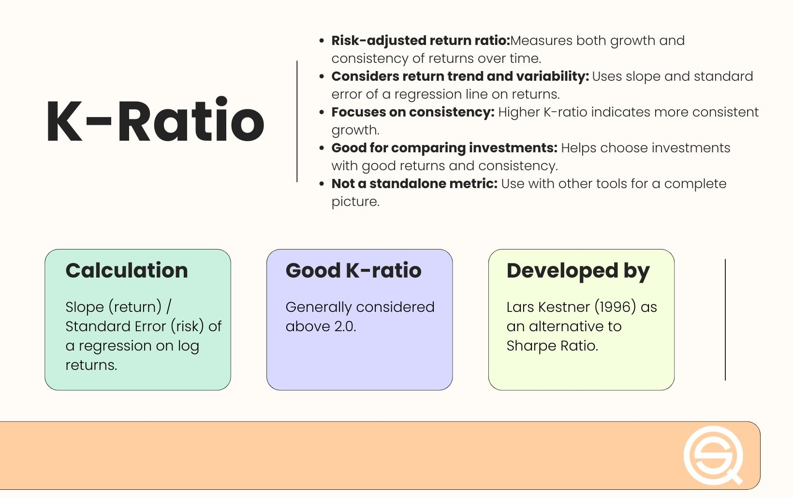

## Table of Contents

## What is the K-Ratio and why is it important?

The K-Ratio is a measure used in finance to compare the performance of an investment or a portfolio against a benchmark. It's like a score that tells you how well your investments are doing compared to a standard, like a stock market index. The K-Ratio is calculated by taking the difference between the return of the investment and the return of the benchmark, then dividing that by the standard deviation of the difference. This helps investors understand if their investment is beating the market and by how much, while also considering the risk involved.

The K-Ratio is important because it gives investors a clear picture of how their investments are performing relative to a benchmark, adjusted for risk. This is crucial for making smart investment decisions. If the K-Ratio is high, it means the investment is doing well compared to the benchmark and is doing so with less risk. On the other hand, a low or negative K-Ratio might suggest that the investment isn't performing as well as it should, or that it's too risky. By using the K-Ratio, investors can better assess whether their investment strategy is working and make adjustments if needed.

## How is the K-Ratio calculated?

The K-Ratio is calculated by first finding the difference between the return of your investment and the return of a benchmark, like a stock market index. This difference shows how much better or worse your investment did compared to the benchmark. For example, if your investment grew by 10% and the benchmark grew by 8%, the difference would be 2%.

Next, you divide this difference by the standard deviation of the differences between your investment's returns and the benchmark's returns over time. The standard deviation is a measure of how much these differences vary, which helps show the risk involved. So, if the difference was 2% and the standard deviation was 1%, the K-Ratio would be 2 divided by 1, which equals 2. A higher K-Ratio means your investment is doing better than the benchmark with less risk.

## What are the key components of the K-Ratio?

The K-Ratio has two main parts: the difference in returns and the standard deviation. The first part is the difference between how much your investment grows and how much a benchmark, like a stock market index, grows. If your investment does better than the benchmark, this difference will be positive. If it does worse, it will be negative. This tells you if your investment is beating the market.

The second part is the standard deviation of these differences over time. The standard deviation shows how much the differences between your investment's returns and the benchmark's returns change. A smaller standard deviation means the differences are more consistent, which usually means less risk. By dividing the difference in returns by the standard deviation, the K-Ratio gives you a score that shows how well your investment is doing compared to the benchmark, while also considering how risky it is.

## Can you provide a simple example of how to compute the K-Ratio?

Let's say you invested in a stock that grew by 12% over the last year. The benchmark you're comparing it to, like the S&P 500, grew by 10% in the same time. So, the difference in returns is 12% minus 10%, which is 2%. This means your stock did 2% better than the benchmark.

Now, you need to find the standard deviation of the differences between your stock's returns and the benchmark's returns over the last year. Let's say you calculated this and found the standard deviation to be 1.5%. To get the K-Ratio, you divide the difference in returns (2%) by the standard deviation (1.5%). So, the K-Ratio is 2% divided by 1.5%, which equals 1.33. This tells you that your stock did better than the benchmark, and it did so with a certain level of risk.

## How does the K-Ratio differ from other financial ratios like the Sharpe Ratio?

The K-Ratio and the Sharpe Ratio are both used to measure how well an investment is doing, but they do it in different ways. The K-Ratio compares your investment's return to a benchmark, like the S&P 500, and then divides that difference by the standard deviation of those differences. This tells you how much better your investment did than the benchmark, while also considering how risky it was. On the other hand, the Sharpe Ratio looks at the return of your investment above the risk-free rate, like what you'd get from a savings account, and divides that by the standard deviation of the investment's returns. This shows you how much extra return you're getting for the risk you're taking.

The main difference between the two is what they compare your investment to. The K-Ratio uses a benchmark, which is usually a stock market index, to see if your investment is beating the market. This is helpful if you want to know if your investment strategy is working better than just following the market. The Sharpe Ratio, however, compares your investment to a risk-free rate, which is useful if you want to know if the extra risk you're taking is worth it. Both ratios help you understand risk and return, but they give you different pieces of information to help you make better investment choices.

## What industries or investment types benefit most from using the K-Ratio?

The K-Ratio is especially helpful for investors in the stock market, like people who invest in individual stocks or mutual funds. It helps them see if their choices are doing better than the overall market, like the S&P 500. For example, if someone is trying to pick stocks that will beat the market, the K-Ratio can tell them if their picks are working well and how much risk they're taking. This is useful for anyone managing their own stock portfolio or working with a financial advisor to make investment decisions.

The K-Ratio can also be useful for investors in hedge funds or other alternative investments. These investments often aim to do better than the market, and the K-Ratio can show if they're meeting that goal. It's good for investors who want to see if the strategies used by [hedge fund](/wiki/hedge-fund-trading-strategies) managers are really adding value compared to just investing in the stock market. By using the K-Ratio, investors can make smarter choices about where to put their money and understand the risk they're taking.

## How can the K-Ratio be used to compare different investment opportunities?

The K-Ratio is a great tool for comparing different investment opportunities because it shows how well each one does compared to the market, while also considering risk. Let's say you're looking at two different stocks. By calculating the K-Ratio for each, you can see which one is doing better than the market and by how much. If one stock has a higher K-Ratio, it means that stock is beating the market more, and doing it with less risk. This helps you decide which stock might be a better choice for your investment goals.

Using the K-Ratio also helps you see if an investment is worth the risk. For example, if you're thinking about investing in a mutual fund or a hedge fund, you can use the K-Ratio to compare it to the market. If the K-Ratio is high, it means the fund is doing well compared to the market and is doing so safely. But if the K-Ratio is low or negative, it might mean the fund isn't doing as well as it should, or it's too risky. This way, you can make smarter choices about where to put your money, knowing how each investment stacks up against the market.

## What are the limitations and potential biases of the K-Ratio?

The K-Ratio has some limitations that you should know about. One big issue is that it relies on historical data, which means it looks at how an investment did in the past. Just because an investment did well before doesn't mean it will do well in the future. Also, the K-Ratio uses a benchmark, like the S&P 500, but [picking](/wiki/asset-class-picking) the right benchmark can be hard. If you pick the wrong one, the K-Ratio might not give you a good picture of how your investment is doing. Another problem is that the K-Ratio can be affected by the time period you look at. If you only look at a short time, the K-Ratio might not show the full story of how risky or rewarding an investment is.

There can also be biases in the K-Ratio. For example, if the market has been doing really well or really badly, it can make the K-Ratio look better or worse than it really is. This is called a market bias. Another bias can come from how you calculate the standard deviation. If you don't have enough data or if the data is not spread out evenly, the standard deviation might not be accurate, which can mess up the K-Ratio. So, while the K-Ratio can be a helpful tool, you need to be aware of these limitations and biases to use it the right way.

## How has the K-Ratio been historically used in financial analysis?

The K-Ratio has been used in financial analysis to help investors see how well their investments are doing compared to the stock market. It was created to give a clear picture of whether an investment is beating the market and how much risk is involved. By looking at the K-Ratio, investors can figure out if their stock picks, mutual funds, or other investments are doing better than just following the market. This helps them make smarter choices about where to put their money, especially if they want to beat the market's performance.

Historically, the K-Ratio has been useful for people managing their own stock portfolios or working with financial advisors. It's been a popular tool for those who invest in hedge funds too, as these funds often aim to do better than the market. By using the K-Ratio, investors can see if the strategies used by fund managers are really working and if the extra risk they're taking is worth it. Even though the K-Ratio has some limits, like relying on past data and being affected by the choice of benchmark, it has been a helpful way to compare different investment options and understand their performance over time.

## What advanced statistical techniques can enhance the accuracy of the K-Ratio?

To make the K-Ratio more accurate, you can use something called bootstrapping. This is a way to see how reliable the K-Ratio is by making lots of different versions of your data. Imagine you have a big jar of marbles and you want to know what colors are inside without looking. You could pull out a few marbles, put them back, and do this many times to get a good guess. Bootstrapping does the same thing with your investment data. It helps you see if the K-Ratio you calculated is a good one or if it might change a lot if you had different data. This can give you more confidence in your K-Ratio and help you understand how risky your investment really is.

Another technique that can help is using rolling windows. This means you look at the K-Ratio over different periods of time, like every three months or every year. By doing this, you can see how the K-Ratio changes and if it stays the same or goes up and down a lot. This can show you if the investment is doing well over time or if it's just a short-term thing. Using rolling windows can make the K-Ratio more useful because it gives you a fuller picture of how your investment is doing compared to the market. It helps you see trends and make better decisions about your investments.

## How do different market conditions affect the reliability of the K-Ratio?

Different market conditions can really change how reliable the K-Ratio is. When the market is going up a lot, like during a bull market, the K-Ratio might look really good for many investments. This is because a lot of stocks and funds do better than the market when it's doing well. But this can make the K-Ratio seem better than it really is. On the other hand, if the market is going down, like in a bear market, the K-Ratio might look worse for a lot of investments. This can make it hard to tell if an investment is really doing badly or if it's just because the whole market is down.

It's also important to think about how volatile the market is. If the market is jumping up and down a lot, the standard deviation part of the K-Ratio can get bigger. This can make the K-Ratio smaller, even if the investment is doing okay compared to the market. So, during times when the market is really unpredictable, the K-Ratio might not give you a clear picture of how your investment is doing. That's why it's good to look at the K-Ratio over different times and in different market conditions to get a better idea of how your investment is really doing.

## What are some case studies where the K-Ratio significantly impacted investment decisions?

In one case, a hedge fund manager used the K-Ratio to compare their fund's performance to the S&P 500. The K-Ratio showed that their fund was doing much better than the market, with a score of 1.8. This high K-Ratio helped the manager convince investors that their strategy was working well and was worth the risk. As a result, more people decided to invest in the fund, and it grew bigger. The K-Ratio helped show that the fund was not just beating the market but doing so safely, which made investors feel more confident.

In another case, an individual investor was trying to decide between two stocks. By calculating the K-Ratio for each stock, they found that one stock had a K-Ratio of 1.2, while the other had a K-Ratio of 0.5. The higher K-Ratio showed that the first stock was doing better than the market and with less risk. This helped the investor choose the stock with the higher K-Ratio, which ended up performing well over the next year. The K-Ratio gave the investor a clear way to compare the stocks and make a smart decision based on how they were doing compared to the market.

## How do you calculate the K-Ratio?

To calculate the K-ratio, the key step involves performing a linear regression on the logarithmic cumulative return of the Value-Added Monthly Index (VAMI) curve. The VAMI represents the hypothetical growth of a $1,000 investment over time, considering the compounded monthly returns. This provides a foundational dataset through which the K-ratio can be determined.

Firstly, construct a scatter plot where the x-axis represents the number of periods (commonly months in financial data) and the y-axis is the logarithm of the VAMI values, $\log[VAMI]$. This visual depiction helps in identifying the linear trend of the returns. The slope of this regression line provides an estimate of the average return per period. Thus, the main calculation focuses on finding this slope:

- **Slope ($m$)**: It can be calculated using linear regression techniques. In Python, this can be accomplished with the `statsmodels` or `scikit-learn` library:

```python
import numpy as np
import statsmodels.api as sm

# periods is a numpy array representing the number of periods, e.g., [1, 2, ..., n]
# log_vami is a numpy array representing the log of the VAMI values

# Adding a constant for intercept calculation
X = sm.add_constant(periods)
model = sm.OLS(log_vami, X).fit()
slope = model.params[1]
```

Subsequently, assess the standard error of the regression, which is an indicator of risk related to the variability of the returns:

- **Standard Error ($SE$)**: This can be extracted directly from the results of the regression model and signifies the standard deviation of the residuals (the differences between observed and predicted values).

Finally, compute the K-ratio using the formula:

$$
\text{K-ratio} = \frac{\text{Slope of logVAMI regression line}}{\text{Standard Regression Error}}
$$

A higher K-ratio value signifies not only a robust return but also a stable one, making it a crucial metric in evaluating algo trading strategies.

## What is the History of the K-Ratio?

Lars Kestner introduced the K-ratio in 1996 in his book "Quantitative Trading Strategies" as an innovative measure for evaluating trading performance. It served as an alternative to traditional metrics like the Sharpe Ratio by emphasizing not only the magnitude of returns but also their consistency over time. Kestner's approach sought to address the limitations of existing measures, such as sensitivity to non-normal return distributions and a lack of focus on return consistency.

Over the years, the K-ratio has experienced refinements to enhance its applicability and accuracy. Key revisions occurred in 2003 and 2013, aimed at accommodating various return period observations and improving the robustness of the metric. These revisions introduced adjustments in the calculation process, considering the frequency of observations and periodic return adjustments. This refinement ensures that the K-ratio remains a reliable metric even when the data spans different time frames and trading conditions.

The calculation of the K-ratio involves conducting a linear regression on the logarithmic cumulative return of a Value Added Monthly Index (VAMI) curve. The result is a slope that signifies average return and a standard error indicating risk. The ratio of these two values provides a measure of the stability and growth of returns. The formula for the K-ratio is expressed as:

$$
K \text{-ratio} = \frac{\text{Slope of logVAMI regression line}}{\text{Standard Regression Error}}
$$

Kestner's innovation laid the groundwork for a comprehensive measurement tool that complements traditional risk-return analysis metrics by offering a more nuanced understanding of performance. By emphasizing both the growth and consistency of returns, the K-ratio provides valuable insights for traders and fund managers assessing the efficacy of their strategies or making comparative evaluations across different investments.

## What are the Frequently Asked Questions?

### FAQ

**How is the K-ratio calculated?**

The K-ratio is calculated by performing a linear regression on the logarithmic cumulative returns of a Value-Added Monthly Index (VAMI) curve. The formula for the K-ratio is as follows:

$$
K\text{-ratio} = \frac{\text{Slope of logVAMI regression line}}{\text{Standard Regression Error}}
$$

This process involves plotting the natural logarithm of the VAMI values against time periods, then fitting a linear trend line to this data. The slope of the line represents the return per period, while the standard error quantifies the risk. This calculation captures not only the magnitude of returns but also their consistency over time.

**What does the K-ratio signify?**

The K-ratio provides an understanding of the stability and consistency of returns over time. It compares the slope of the return series with the standard error to offer insights into how steadily returns are being achieved. A higher K-ratio signifies more consistent returns relative to the risk, indicating a steady performance. This makes it a useful tool for assessing potential investments or trading strategies.

**How can the K-ratio be used?**

The K-ratio is a versatile metric for measuring and comparing the consistency of returns across different investment strategies or assets. It assists in assessing how consistently an investment or trading strategy generates returns, factoring in both the growth rate and associated risk. By evaluating these aspects, investors and traders can make informed decisions, identifying strategies and assets likely to offer steady performance. Additionally, the K-ratio is useful for risk management, as it highlights the consistency aspect crucial for decision-making in financial markets.

## References & Further Reading

[1]: Kestner, L. N. (1996). ["Quantitative Trading Strategies."](https://www.amazon.com/Quantitative-Trading-Strategies-Harnessing-McGraw-Hill/dp/0071412395) McGraw-Hill.

[2]: Lopez de Prado, M. (2018). ["Advances in Financial Machine Learning."](https://www.amazon.com/Advances-Financial-Machine-Learning-Marcos/dp/1119482089) Wiley.

[3]: Aronson, D. R. (2006). ["Evidence-Based Technical Analysis: Applying the Scientific Method and Statistical Inference to Trading Signals."](https://www.amazon.com/Evidence-Based-Technical-Analysis-Scientific-Statistical/dp/0470008741) Wiley.

[4]: Jansen, S. (2020). ["Machine Learning for Algorithmic Trading."](https://github.com/stefan-jansen/machine-learning-for-trading) Packt Publishing.

[5]: Chan, E. P. (2008). ["Quantitative Trading: How to Build Your Own Algorithmic Trading Business."](https://github.com/ftvision/quant_trading_echan_book) Wiley.