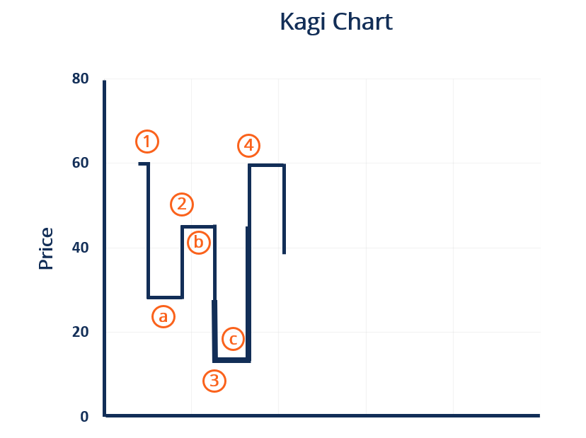

## Table of Contents

## What is a Kagi Chart?

A Kagi Chart is a type of chart used to show price movements in financial markets. It was first used in Japan and helps traders see trends more clearly. Unlike regular charts that use time, Kagi Charts focus on price changes. They use thick and thin lines to show whether the price is going up or down. A thick line means the price is going up, and a thin line means the price is going down.

When the price goes up enough, the Kagi Chart changes from a thin line to a thick line. If the price goes down enough, it changes from a thick line to a thin line. This helps traders see important changes in the market. The chart only changes direction when the price moves past the previous high or low point. This makes it easier to spot trends and reversals. Kagi Charts are useful for traders who want to focus on price movements rather than time.

## How does a Kagi Chart differ from traditional candlestick charts?

A Kagi Chart and a traditional candlestick chart are both used to track price movements in financial markets, but they show this information differently. A candlestick chart uses time as a main factor, with each candlestick representing a set time period, like a day or an hour. Each candlestick has a body and wicks that show the opening, closing, high, and low prices for that time period. On the other hand, a Kagi Chart does not use time at all. Instead, it focuses only on price changes, using thick and thin lines to show whether the price is going up or down.

The way a Kagi Chart works is quite different from a candlestick chart. In a Kagi Chart, the line changes from thick to thin or thin to thick based on how much the price has moved. If the price goes up enough, the line becomes thick, and if it goes down enough, the line becomes thin. The chart only changes direction when the price moves past the previous high or low point. This makes it easier to see trends and important price changes. In contrast, a candlestick chart shows all price movements within a set time frame, which can sometimes make it harder to spot the overall trend because there might be a lot of small ups and downs.

## What are the key components of a Kagi Chart?

A Kagi Chart has a few important parts that help you see how prices are moving. The main part is the line that goes up and down. This line changes from thick to thin or thin to thick depending on whether the price is going up or down. A thick line means the price is going up, and a thin line means the price is going down. The line only changes direction when the price moves past the highest or lowest point it reached before. This makes it easy to see the trend and important changes in the price.

Another key part of a Kagi Chart is the reversal amount. This is how much the price needs to change before the line switches from thick to thin or thin to thick. If the price goes up by the reversal amount, the line becomes thick. If it goes down by the reversal amount, the line becomes thin. This helps traders see when the price is really changing direction and not just moving a little bit. By focusing on these parts, a Kagi Chart can help you understand the market better.

## How is the thickness of the Kagi line determined?

The thickness of the Kagi line is determined by whether the price is going up or down. When the price goes up by a certain amount, called the reversal amount, the line becomes thick. This thick line shows that the price is increasing. On the other hand, when the price goes down by the reversal amount, the line becomes thin. This thin line shows that the price is decreasing.

Once the line is thick, it stays thick as long as the price keeps making new highs. If the price falls below the lowest point of the last thick line, the line will switch to thin. Similarly, once the line is thin, it stays thin as long as the price keeps making new lows. If the price rises above the highest point of the last thin line, the line will switch back to thick. This way, the thickness of the Kagi line helps traders see the trend and important changes in the price.

## What does a change in the direction of the Kagi line signify?

A change in the direction of the Kagi line means that the price has moved past an important point. When the line was going up and it starts to go down, it shows that the price has dropped below the lowest point it reached before. This tells traders that the price trend might be changing from going up to going down.

On the other hand, if the line was going down and it starts to go up, it means the price has gone above the highest point it reached before. This signals that the price trend might be changing from going down to going up. By watching these changes, traders can see when the market might be starting a new trend.

## How can Kagi Charts be used to identify trends?

Kagi Charts are great for finding trends in the market because they focus on price changes instead of time. When you look at a Kagi Chart, you can see if the price is going up or down by looking at the thickness of the line. A thick line means the price is going up, and a thin line means the price is going down. If the line stays thick for a long time, it shows a strong upward trend. If the line stays thin for a long time, it shows a strong downward trend.

Changes in the direction of the Kagi line are important too. When the line switches from thick to thin, it means the price has dropped below its last low point. This can tell you that the upward trend might be over, and a downward trend might be starting. On the other hand, when the line switches from thin to thick, it means the price has gone above its last high point. This can tell you that the downward trend might be over, and an upward trend might be starting. By watching these changes, you can spot when the market is starting a new trend.

## What are the advantages of using Kagi Charts for trading?

Kagi Charts are great for trading because they help you see the main trends in the market easily. They focus on price changes instead of time, which means you can spot when the price is really moving up or down. This makes it easier to see the big picture and not get confused by small ups and downs that happen all the time. When the line on a Kagi Chart changes from thick to thin or thin to thick, it tells you that the price has moved past an important point. This helps you know when the trend might be changing, so you can make better trading decisions.

Another advantage of Kagi Charts is that they can help you stay in trades longer. Because they show you the main trend without all the little changes, you can hold onto your trades and not get scared out by small price movements. This can lead to bigger profits if you follow the trend correctly. Also, Kagi Charts can help you see when the market might be getting ready to reverse direction. By watching the line change from thick to thin or thin to thick, you can get ready to change your trading strategy before the rest of the market does.

## Can Kagi Charts be used for all types of financial instruments?

Yes, Kagi Charts can be used for all types of financial instruments, like stocks, [forex](/wiki/forex-system), commodities, and cryptocurrencies. They work the same way no matter what you are trading. Kagi Charts help you see the main price trends without getting distracted by time. This makes them useful for traders who want to focus on how the price is moving, no matter what they are trading.

Because Kagi Charts are based on price changes and not time, they can be used for any market that has price data. Whether you are trading stocks, forex pairs, gold, or Bitcoin, a Kagi Chart will show you the important price movements and trends. This makes Kagi Charts a flexible tool for traders who deal with different kinds of financial instruments.

## How do you set up a Kagi Chart in a trading platform?

To set up a Kagi Chart in a trading platform, you need to find the chart settings or options in your trading software. Look for a section that lets you choose different types of charts, like candlestick or bar charts. Once you find it, select "Kagi Chart" from the list. You might need to click on a tab or menu labeled "Chart Type" or something similar. After choosing the Kagi Chart, you'll need to set the reversal amount. This is how much the price needs to change before the line on the chart switches from thick to thin or thin to thick. You can usually adjust this by entering a number or using a slider in the chart settings.

Once you've set the reversal amount, the Kagi Chart will start to show up on your screen. The line will be thick when the price is going up and thin when it's going down. You can watch the line change direction to see when the price moves past important points. Some trading platforms let you change other settings too, like the color of the lines or how the chart looks. Make sure to save your settings so the Kagi Chart stays the way you want it. This way, you can use the Kagi Chart to see the main trends in the market and make better trading decisions.

## What are common mistakes to avoid when interpreting Kagi Charts?

One common mistake when looking at Kagi Charts is focusing too much on small changes in the line. Kagi Charts are meant to show the big trends in the market, not every little up and down. If you pay too much attention to small changes, you might think the trend is changing when it's not. It's better to look at the overall direction of the line and see if it stays thick or thin for a long time. This will help you understand the main trend better.

Another mistake is not setting the right reversal amount. The reversal amount is how much the price needs to change before the line switches from thick to thin or thin to thick. If you set it too small, the chart will change direction a lot, and it might be hard to see the real trend. If you set it too big, the chart might not show important changes in the price. It's important to find a good balance so the Kagi Chart shows you the trends clearly without too many small changes.

## How can Kagi Charts be combined with other technical analysis tools?

Kagi Charts can be used with other technical analysis tools to help traders make better decisions. One way to do this is by using Kagi Charts with moving averages. A moving average is a line that shows the average price over a certain time. When you put a moving average on a Kagi Chart, you can see if the price is above or below the average. This can help you see if the trend is strong or if it might be changing. For example, if the Kagi line is thick and above the moving average, it shows a strong upward trend. If the line is thin and below the moving average, it shows a strong downward trend.

Another way to combine Kagi Charts with other tools is by using them with support and resistance levels. Support is a price level where the price often stops going down and starts going up. Resistance is a price level where the price often stops going up and starts going down. When you see the Kagi line hit these levels, it can tell you if the trend is likely to continue or if it might reverse. For example, if the Kagi line is thick and hits a resistance level, it might mean the upward trend is getting weak. If the line is thin and hits a support level, it might mean the downward trend is getting weak. By using Kagi Charts with these other tools, traders can get a better understanding of the market and make smarter trades.

## What advanced techniques can be applied to enhance the effectiveness of Kagi Charts?

One advanced technique to enhance the effectiveness of Kagi Charts is to use them with other types of charts, like candlestick or bar charts. You can put a Kagi Chart next to a candlestick chart on the same screen. This way, you can see both the big trends from the Kagi Chart and the small price movements from the candlestick chart. By comparing the two, you can get a better understanding of the market. For example, if the Kagi line is thick but the candlestick chart shows a lot of small ups and downs, it might mean the upward trend is not as strong as it looks.

Another technique is to use different reversal amounts on the same Kagi Chart. You can set up two or more Kagi Charts with different reversal amounts to see how the price changes at different levels. A smaller reversal amount will show more changes in the line, while a larger reversal amount will show fewer changes. By looking at these different charts together, you can see both the short-term and long-term trends. This can help you make better trading decisions by understanding how the price is moving at different levels.

## References & Further Reading

[1]: Nison, S. (1991). ["Japanese Candlestick Charting Techniques: A Contemporary Guide to the Ancient Investment Techniques of the Far East"](https://drive.google.com/file/d/0B_CADMk621uLNDEyZTEzZjYtMmZjOS00ZmUyLTlhYmYtN2E1YTViOWRiOTdi/view). New York Institute of Finance.

[2]: Murphy, J. J. (1999). ["Technical Analysis of the Financial Markets: A Comprehensive Guide to Trading Methods and Applications"](https://archive.org/details/technicalanalysi0000murp). New York Institute of Finance.

[3]: Pring, M. J. (2002). ["Technical Analysis Explained: The Successful Investor's Guide to Spotting Investment Trends and Turning Points"](https://www.amazon.com/Technical-Analysis-Explained-Fifth-Successful/dp/0071825177). McGraw-Hill Education.

[4]: Linton, O. B., Chen, W. R., & Squires, S. (2000). ["How to Analyze and Use Kagi Charts"](https://www.semanticscholar.org/paper/An-analysis-of-transformations-for-additive-Linton-Chen/26c58533b23feceec575679d0f0cee1cc30d9b20). CORE Discussion Papers.

[5]: Schwager, J. D. (1996). ["Getting Started in Technical Analysis"](https://www.amazon.com/Getting-Started-Technical-Analysis-Schwager/dp/0471295426). Wiley.

[6]: Elder, A. (1993). ["Trading for a Living: Psychology, Trading Tactics, Money Management"](https://www.amazon.com/Trading-Living-Psychology-Tactics-Management/dp/0471592242). Wiley.