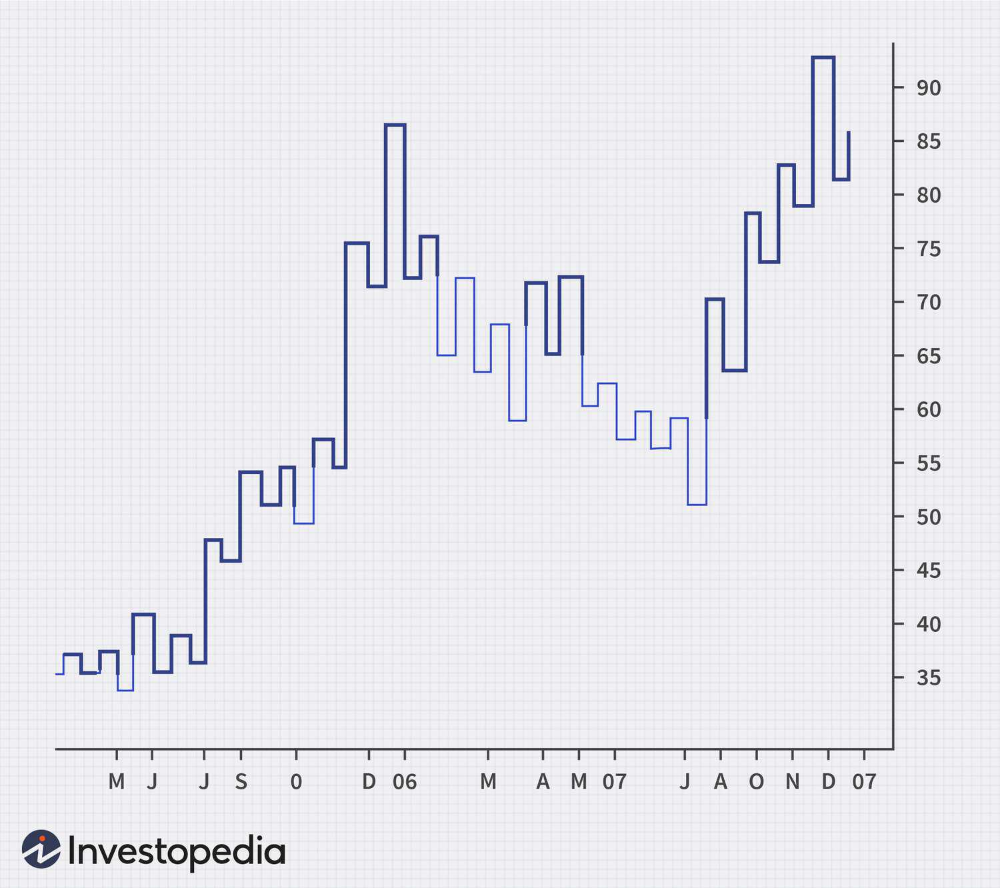

In the ever-evolving world of financial markets, traders constantly seek innovative methods to analyze price movements and make informed decisions. One of the less conventional but highly efficient tools is the Kagi chart, a unique charting method developed in Japan. This tool differentiates itself from traditional charts by focusing on significant price changes rather than time intervals, thus filtering out market noise and highlighting trends.

Kagi charts originated in the 1870s and employ a series of vertical lines to depict the supply and demand dynamics of financial assets. The key feature of Kagi charts is their ability to change direction based on substantial price reversals instead of adhering to predefined time intervals. This approach allows traders to identify significant trends and shifts in market sentiment more effectively. Thick lines on a Kagi chart indicate increased demand, while thin lines signify increased supply, providing a clear visual representation of the market's current state.



This article examines Kagi charts in detail, exploring their application in technical analysis and how they can be integrated with algorithmic trading strategies. By focusing on the essence of price movements and discarding irrelevant fluctuations, Kagi charts offer traders valuable insights into market trends. Through a comprehensive understanding of this charting method, traders can enhance their decision-making processes and potentially improve their trading outcomes.

## Table of Contents

## Understanding Kagi Charts

Kagi charts, originating in Japan during the 1870s, are a distinctive method to represent supply and demand dynamics in asset trading. Unlike traditional charting techniques, Kagi charts are not concerned with specific time intervals. Instead, they focus on significant price reversals, which are represented through a series of vertical lines. These changes provide a clearer view of market sentiment and trend directions.

The core principle of Kagi charts is based on the alteration of line thickness, which visually signifies changes in market supply and demand. When demand rises and leads the market to break a previous high, a thick line, often referred to as a "Yang" line, is drawn. Conversely, a "Yin" line, or thin line, emerges when there is an increase in supply, causing the price to fall below a previous low.

To construct a Kagi chart, one sets a predefined reversal amount, known as the "reversal" value, which determines when the chart should change direction. This reversal value is typically a percentage or a specific price value. The chart maintains its current thickness until the price reverses by this set amount beyond a recent extreme point, either high or low. At this juncture, the line direction changes, and the line thickness is updated based on whether a new high or low is surpassed.

Here is a simple conceptual example of how a Kagi chart can be constructed in Python:

```python
def construct_kagi_chart(stock_prices, reversal_value):
    kagi_chart = []
    direction = None
    last_price = stock_prices[0]
    line_thickness = 'thin'

    for price in stock_prices[1:]:
        if direction is None:
            direction = 'up' if price > last_price else 'down'
            line_thickness = 'thick' if direction == 'up' else 'thin'
            kagi_chart.append((price, line_thickness))
        elif direction == 'up' and price >= last_price + reversal_value:
            last_price = price
            line_thickness = 'thick'
            kagi_chart.append((price, line_thickness))
        elif direction == 'up' and price <= last_price - reversal_value:
            direction = 'down'
            last_price = price
            line_thickness = 'thin'
            kagi_chart.append((price, line_thickness))
        elif direction == 'down' and price <= last_price - reversal_value:
            last_price = price
            line_thickness = 'thin'
            kagi_chart.append((price, line_thickness))
        elif direction == 'down' and price >= last_price + reversal_value:
            direction = 'up'
            last_price = price
            line_thickness = 'thick'
            kagi_chart.append((price, line_thickness))

    return kagi_chart

# Example usage
stock_prices = [100, 105, 102, 110, 108, 115, 112]
reversal_value = 3
chart = construct_kagi_chart(stock_prices, reversal_value)
print(chart)
```

In this illustrative code, `construct_kagi_chart` traces the price movements of a given stock series. The `reversal_value` dictates the sensitivity of the chart to price changes, altering the line thickness and direction as the market dynamics fluctuate.

Kagi charts offer a strategic advantage by simplifying the visualization of key trends and filtering out minor price fluctuations, hence making them valuable for long-term traders interested in capturing significant market movements.

## How Kagi Charts Work

A Kagi chart is a powerful tool for emphasizing major price movements while filtering out minor price fluctuations, thereby providing a clear view of market trends. The primary mechanism that defines the structure of a Kagi chart is the reversal amount, which dictates when the direction of the chart changes.

### Reversal Amount

The reversal amount is a predefined price movement threshold that determines when a Kagi chart changes direction. Unlike traditional charts that update with each time interval, a Kagi chart will only reverse [course](/wiki/best-algorithmic-trading-courses) when the price moves by the specified reversal amount. For instance, if the reversal amount is set to 5%, the chart will only change direction after a 5% price movement from its peak or trough.

### Line Thickness

Kagi charts feature two distinct line thicknesses—thick and thin lines—to represent shifts in market supply and demand. A thick line, often called a "yang line," signifies increased demand and upward price movement, while a thin line, known as a "yin line," indicates increased supply and downward price movement. The transition between thick and thin lines is contingent upon key price levels being surpassed during reversals.

### Shoulders and Waists

In Kagi chart analysis, specific formations known as "shoulders" and "waists" are vital for technical interpretation and generating trade signals. These formations occur when a line reverses direction twice without surpassing the previous reversal point:

- **Shoulder:** Occurs during an upward trend when thick lines turn into thin lines without reaching the prior swing low point. This pattern suggests the potential exhaustion of buying momentum.
- **Waist:** Occurs during a downward trend when thin lines convert into thick lines without reaching the prior swing high. This pattern suggests the exhaustion of selling pressure.

### Example Calculation

To illustrate, consider a stock with a reversal amount set at $10:

- If the price rises from $100 to $110, the chart draws a vertical line upward.
- If the price then drops to $100, the angle remains unchanged until the price drops to $90—the reversal amount being $10.
- At $90, a reversal occurs, marking a transition from a thick to a thin line, indicating increased supply in this context.

### Python Example

Here is a simple Python script to determine when a Kagi chart reversal occurs:

```python
def kagi_chart_reversal(prices, reversal_amount):
    direction = None
    last_price = prices[0]
    kagi_lines = []

    for current_price in prices:
        if direction is None or direction == 'down' and current_price >= last_price + reversal_amount:
            direction = 'up'
            kagi_lines.append((current_price, 'thick'))
        elif direction == 'up' and current_price <= last_price - reversal_amount:
            direction = 'down'
            kagi_lines.append((current_price, 'thin'))

        last_price = current_price

    return kagi_lines

# Example usage
prices = [100, 105, 115, 108, 90, 95, 85]
reversal_amount = 10
kagi_chart = kagi_chart_reversal(prices, reversal_amount)
print(kagi_chart)
```

This code demonstrates how to identify when to draw thick and thin lines based on price changes that meet or exceed the reversal amount. Understanding these mechanics enhances the strategic use of Kagi charts for capturing and interpreting major market trends accurately.

## Kagi Chart vs. Other Charting Techniques

Kagi charts, Renko charts, and candlestick charts are all integral tools within the arsenal of technical analysts, yet each possesses unique attributes that cater to different aspects of market analysis. Kagi charts, rooted in price movement rather than time, stand out for their ability to filter out market noise by focusing on significant price changes. This approach contrasts with the structured time intervals typical of candlestick charts and the fixed price movements of Renko charts.

Kagi charts are characterized by lines that change direction and thickness to visually represent market sentiment. A reversal in a Kagi chart occurs when the price moves by a preset amount. This mechanism differs from Renko charts, which build blocks of a fixed price increment, ignoring time altogether. Both systems aim to highlight price trends but do so using different methods. Renko charts focus purely on price changes of specific magnitudes, offering a clear trend visualization that obscures the intraday noise. However, Kagi charts enhance this further by introducing line thickness, which indicates shifts between demand and supply, thus providing an additional layer of insight into market dynamics.

Candlestick charts offer a different perspective by incorporating open, high, low, and close prices within a predefined time period. This time-based structure can sometimes introduce noise, overshadowing underlying trends that Kagi and Renko charts might emphasize by discarding the less relevant price changes over time. Thus, Kagi charts might offer clearer insights in a trending market, whereas candlestick charts provide a richer, more nuanced view of market activity over specific time frames.

The choice between these charting techniques depends on specific trading strategies. For instance, traders seeking to capture sustained trends might find Kagi charts advantageous due to their emphasis on significant price movements and trend reversals. Conversely, Renko charts may appeal to those looking for a straightforward depiction of price trends without time-based noise. Candlestick charts might be preferred by traders who require detailed intra-period price information, which facilitates strategies hinged on precise entry and [exit](/wiki/exit-strategy) based on price action.

Here is a simple example in Python to illustrate how Kagi and Renko charts can be constructed:

```python
import pandas as pd
import matplotlib.pyplot as plt
from mplfinance.original_flavor import candlestick_ohlc
from mplfinance import renko
from random import randint

# Sample data
data = {'Date': pd.date_range(start='1/1/2020', periods=100),
        'Close': [randint(1, 100) for _ in range(100)]}
df = pd.DataFrame(data)
df['Open'] = df['Close'].shift(1)
df['High'] = df[['Open', 'Close']].max(axis=1)
df['Low'] = df[['Open', 'Close']].min(axis=1)
df.dropna(inplace=True)

# Plot Renko Chart using mplfinance
renko_data = renko(df, brick_size=2)
renko_data.plot(title='Renko Chart')

# Plot Kagi Chart using mplfinance
# (mplfinance doesn't have kagi chart equivalent, illustrating basics only)
fig, ax = plt.subplots()
ax.plot(df.index, df['Close'])
ax.set_title('Kagi Chart Representation')
plt.show()
```

In conclusion, Kagi charts provide a distinctive approach by emphasizing significant price movements and changing line thickness to denote varying market pressures. This feature makes them particularly beneficial for traders focused on long-term trend identification, assigning less importance to periodic price fluctuations. Comparing the defining traits of Kagi, Renko, and candlestick charts helps traders select the most compatible charting method for their analytical needs and trading philosophies.

## Applications in Algorithmic Trading

Algorithmic trading, which automates trade execution based on predefined strategies, significantly benefits from the integration of Kagi charts. These charts are adept at filtering out market noise and emphasizing major price movements, making them particularly useful in constructing [algorithmic trading](/wiki/algorithmic-trading) systems that focus on trend analysis and signal generation.

Kagi charts can be effectively utilized for various algorithmic trading tasks. One primary application is in trend identification, where the unique structure of Kagi charts—changing direction only upon a significant price movement—allows traders to pinpoint genuine market trends without the clutter of minor price fluctuations. This is crucial for developing strategies that aim to capitalize on sustained price movements rather than transient noise.

In algorithmic trading platforms like TradingView and MetaTrader, Kagi charts are incorporated to enhance trend analysis capabilities. These platforms provide robust environments for traders to develop, back-test, and deploy automated trading strategies using Kagi charts. For instance, TradingView offers extensive charting features and scripting capabilities through Pine Script, enabling traders to create custom indicators that leverage Kagi chart patterns. A trader might write a script to identify specific patterns such as shoulders and waists, which signal potential price reversals or continuations.

Here is a simple example of how one might use Python to implement a basic Kagi chart-based algorithm in an algorithmic trading system:

```python
import numpy as np
import pandas as pd

def generate_kagi_chart(prices, reversal_amount):
    kagi_chart = []  # List to store kagi chart data
    current_value = prices[0]
    line_thickness = 'thin'

    for price in prices:
        if line_thickness == 'thin' and price >= current_value + reversal_amount:
            line_thickness = 'thick'
            kagi_chart.append(('up', price))
            current_value = price
        elif line_thickness == 'thick' and price <= current_value - reversal_amount:
            line_thickness = 'thin'
            kagi_chart.append(('down', price))
            current_value = price
        elif (line_thickness == 'thin' and price > current_value) or (line_thickness == 'thick' and price < current_value):
            current_value = price

    return pd.DataFrame(kagi_chart, columns=['Direction', 'Price'])

# Example usage
prices = [102, 105, 100, 98, 104, 107, 95, 99, 108]
reversal_amount = 3
kagi_df = generate_kagi_chart(prices, reversal_amount)
print(kagi_df)
```

In this example, the function `generate_kagi_chart` takes a series of prices and a reversal amount, constructing a basic Kagi chart that traders can extend or modify to fit more complex strategies in a trading system.

MetaTrader, with its MetaQuotes Language (MQL), provides another set of tools for traders to integrate Kagi charts into their algorithmic systems. By harnessing the charting capabilities of MetaTrader, traders can generate alerts based on Kagi chart signals and automatically execute trades once specific conditions are met.

Overall, the capacity of Kagi charts to focus on significant price changes makes them an invaluable resource in algorithmic trading, where the emphasis is on precision and reduced uncertainty. Platforms like TradingView and MetaTrader facilitate this by offering the necessary tools and frameworks for developers and traders to incorporate Kagi charts seamlessly into their automated trading strategies.

## Advantages and Disadvantages

Kagi charts present a number of advantages for traders, particularly in their ability to provide clear trend visibility and reduce market noise. This feature is especially beneficial for those focused on identifying and capitalizing on long-term trends. Unlike conventional price charts, Kagi charts disregard the element of time, choosing instead to pivot on significant price movements, thereby filtering out smaller price fluctuations that may obscure the overall market trend. This allows traders to make more informed decisions by concentrating on genuine shifts in market sentiment.

One of the key strengths of Kagi charts is their straightforward visual representation of supply and demand dynamics. Thick lines indicate increased demand, while thin lines denote increased supply. This visual cue simplifies the analysis of market conditions, enabling traders to quickly assess the balance of power between buyers and sellers. Moreover, Kagi charts do not require constant manual adjustment thanks to their self-adjusting nature, which represents a significant time-saving feature for manual traders.

However, the use of Kagi charts is not without challenges. Their unique approach to representing price movements means there is a steeper learning curve associated with understanding and interpreting them. Traders accustomed to traditional time-based charts may find it difficult to adapt to the distinct methodology of Kagi charts. Furthermore, the charts may require customization to align with different asset classes or specific trading strategies, as the predefined reversal amount must be carefully chosen to ensure that significant price changes are accurately tracked without being overwhelmed by minor fluctuations.

In trading systems, Kagi charts necessitate careful integration due to their reliance on price reversals to depict market conditions. The reversal amount, a critical parameter, requires adjustment based on market [volatility](/wiki/volatility-trading-strategies) and the individual asset being traded. This customization process can be intricate, demanding a solid grasp of both the asset in question and the trading environment. For algorithmic trading, integrating Kagi charts might also require additional computational resources and coding expertise to ensure accurate implementation and signal generation.

In summary, while Kagi charts offer substantial benefits in trend analysis and noise reduction, these advantages come with associated complexities. Their effectiveness largely depends on the user's ability to understand and adapt the charts to specific trading contexts, making proficiency in their use a valuable asset for traders aiming to improve their analysis and decision-making capabilities.

## Conclusion

Kagi charts are a compelling instrument in technical analysis, offering a unique approach to visualizing price trends that can enhance trading strategies. Unlike traditional charts that focus on time intervals, Kagi charts emphasize significant price movements, which helps traders filter out market noise and concentrate on the underlying trends. This capability is especially beneficial in algorithmic trading, where automated systems can be optimized to recognize these price movement patterns and make more informed trading decisions.

The complexity of Kagi charts lies in their methodology of depicting price changes through variable line thickness and direction rather than relying on time-based intervals. This method allows traders to focus on trend reversals, which can be pivotal for identifying trading opportunities. By capturing essential price shifts, Kagi charts enable traders to develop strategies that might be less influenced by short-term fluctuations and more aligned with long-term market dynamics.

For traders who can master the intricacies of Kagi charts, the potential benefits include improved trend insights and a more robust framework for predictive modeling in trading systems. The ability to discern clear trends and turning points can provide a critical edge in the financial markets. 

Furthermore, platforms like TradingView and MetaTrader have integrated Kagi charts into their interfaces, facilitating their adoption in algorithmic trading strategies. These platforms allow traders to set predefined reversal amounts, tailoring Kagi chart configurations to complement specific assets and trading styles. 

In conclusion, for those willing to invest the time and effort into understanding Kagi charts, these tools offer a strategic advantage, providing a clearer perspective on market trends and enhancing the potential for successful trading outcomes.

## References & Further Reading

[1]: Nison, S. (1991). ["Japanese Candlestick Charting Techniques: A Contemporary Guide to the Ancient Investment Techniques of the Far East"](https://drive.google.com/file/d/0B_CADMk621uLNDEyZTEzZjYtMmZjOS00ZmUyLTlhYmYtN2E1YTViOWRiOTdi/view). New York Institute of Finance.

[2]: Murphy, J. J. (1999). ["Technical Analysis of the Financial Markets: A Comprehensive Guide to Trading Methods and Applications"](https://archive.org/details/technicalanalysi0000murp). New York Institute of Finance.

[3]: Pring, M. J. (2002). ["Technical Analysis Explained: The Successful Investor's Guide to Spotting Investment Trends and Turning Points"](https://www.amazon.com/Technical-Analysis-Explained-Fifth-Successful/dp/0071825177). McGraw-Hill Education.

[4]: Linton, O. B., Chen, W. R., & Squires, S. (2000). ["How to Analyze and Use Kagi Charts"](https://www.semanticscholar.org/paper/An-analysis-of-transformations-for-additive-Linton-Chen/26c58533b23feceec575679d0f0cee1cc30d9b20). CORE Discussion Papers.

[5]: Schwager, J. D. (1996). ["Getting Started in Technical Analysis"](https://www.amazon.com/Getting-Started-Technical-Analysis-Schwager/dp/0471295426). Wiley.

[6]: Elder, A. (1993). ["Trading for a Living: Psychology, Trading Tactics, Money Management"](https://www.amazon.com/Trading-Living-Psychology-Tactics-Management/dp/0471592242). Wiley.