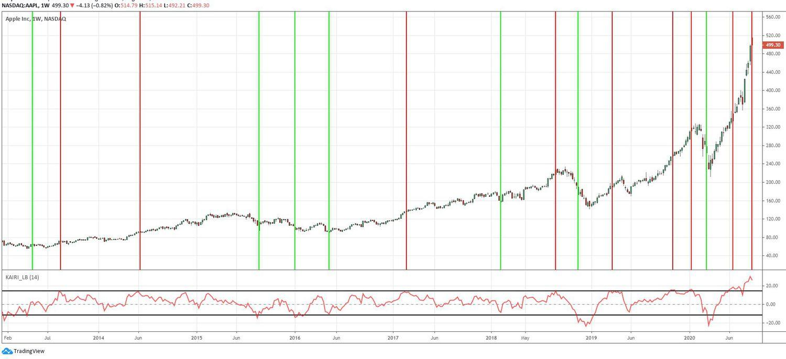

The Kairi Relative Index (KRI) serves as an essential tool in the field of technical analysis, offering traders a method to evaluate potential buying and selling opportunities within the market. By providing a quantitative measure of asset price deviation from its simple moving average (SMA), the KRI aids in identifying overbought or oversold conditions, a crucial aspect for making informed trading decisions.

For those engaged in algorithmic trading, a clear understanding of how the KRI functions can be particularly advantageous. It allows traders to programmatically incorporate the index into their trading algorithms, thereby automating the decision-making process. The precision offered by algorithmic strategies can lead to more consistent trading outcomes and enhance the potential for profit.



This article intends to offer a comprehensive overview of the KRI, detailing its calculation and its practical applications within trading algorithms. Additionally, a comparison of the KRI with other prevalent trading indicators, such as the Moving Average Convergence Divergence (MACD), will shed light on its unique features and benefits.

However, no trading tool is without limitations. The KRI, while informative, should not be relied upon in isolation. The article will discuss the constraints associated with using KRI as a standalone indicator and suggest best practices for its effective integration into a broader trading strategy. By addressing these aspects, readers can gain a well-rounded understanding of the KRI and its role in enhancing trading performance.

## Table of Contents

## What is the Kairi Relative Index (KRI)?

The Kairi Relative Index (KRI) is a technical analysis tool that quantifies the percentage deviation of an asset's current price from its simple moving average (SMA). This metric aids traders in identifying periods of overbought and oversold conditions, which can signal potential buy or sell opportunities. The KRI is calculated using the formula:

$$
\text{KRI} = \left(\frac{\text{Current Price} - \text{SMA}}{\text{SMA}}\right) \times 100
$$

Traders often interpret a positive KRI as an indication that the asset's price is above its average, suggesting an overbought condition that may precede a price correction. Conversely, a negative KRI implies that the asset is trading below its average, potentially signaling an oversold condition that might lead to a price increase.

Historically, the KRI was a popular tool among traders during the mid-20th century. However, with advancements in technical analysis, more sophisticated indicators, such as the Relative Strength Index (RSI), have become prevalent, offering enhanced precision and reliability in interpreting market dynamics. Despite this, the KRI remains a valuable component of a trader’s toolkit, particularly when used in conjunction with other indicators to corroborate market signals.

## Calculating the Kairi Relative Index

To calculate the Kairi Relative Index (KRI), one must utilize the formula:

$$
\text{KRI} = \left( \frac{\text{Close Price} - \text{SMA}}{\text{SMA}} \right) \times 100
$$

### Step-by-Step Calculation:

1. **Determine the Simple Moving Average (SMA)**:
   - First, select a time period for the SMA, typically ranging from 10 to 20 days. The choice of period can influence the sensitivity of the KRI to price changes. 
   - The SMA is calculated by adding the closing prices of the asset over the chosen time frame and then dividing by the number of days in that period.

   \[ \text{SMA} = \frac{\sum \text{Close Price over N days}}{N}
$$

   For example, if calculating a 10-day SMA, sum the closing prices from the past 10 days and divide by 10.

2. **Subtract the SMA from the Current Closing Price**:
   - Identify the current closing price of the asset and subtract the SMA value from this price. This step indicates how far the asset's current price deviates from its average.

   \[ \text{Deviation} = \text{Close Price} - \text{SMA}
$$

3. **Divide the Result by the SMA**:
   - Divide the deviation obtained in the previous step by the SMA. This division helps in normalizing the deviation relative to the average price of the asset.

   \[ \text{Normalized Deviation} = \frac{\text{Deviation}}{\text{SMA}}
$$

4. **Multiply by 100 to Obtain the KRI Value**:
   - Finally, multiply the normalized deviation result by 100 to express the Kri as a percentage. This percentage reflects the relative difference between the current price and the SMA.

   \[ \text{KRI} = \text{Normalized Deviation} \times 100
$$

The calculation process is continuous, as it involves regularly updating the SMA and current closing price to reflect changes in market conditions. This ensures that the KRI remains a timely indicator of price movements. Here is a simple Python script that illustrates how to calculate the KRI:

```python
def calculate_kri(close_prices, period=10):
    if len(close_prices) < period:
        raise ValueError("Not enough data points to calculate SMA")

    sma = sum(close_prices[-period:]) / period
    close_price = close_prices[-1]
    kri = ((close_price - sma) / sma) * 100

    return kri

# Example usage
close_prices = [100, 102, 104, 106, 108, 110, 112, 113, 115, 117]  # last 10 days prices
print("KRI:", calculate_kri(close_prices))
```

This example assumes you provide a list of closing prices for the relevant period, from which it calculates the KRI for the most recent day. Such a method allows traders to dynamically monitor KRI values as new data becomes available.

## Interpreting the KRI in Trading

The Kairi Relative Index (KRI) is instrumental in depicting extreme price movements in relation to an asset's average price, offering pivotal buy or sell signals. High KRI values, when significantly positive, suggest that the asset might be experiencing an overbought condition. In these scenarios, traders typically interpret this as a cue to consider selling, believing that the price has risen excessively above its average, potentially foreshadowing a price correction. Conversely, low negative values indicate oversold conditions. This signals a possible buying opportunity as it implies that the asset is trading below its average price, suggesting potential for a price rebound.

Crucially, these extreme readings can fluctuate based on the [volatility](/wiki/volatility-trading-strategies) of the asset in question. For instance, an asset with high volatility might produce more pronounced KRI signals compared to a stable asset. Therefore, interpreting these values necessitates an understanding of the specific market conditions and the inherent volatility of the asset. 

To enhance the reliability of KRI signals, they are often validated through supplementary analysis. This might include the integration of other technical indicators or a more thorough analysis of price movements and market trends. By doing so, traders can mitigate the risk of acting on false signals and enhance their decision-making process. Employing the KRI in conjunction with additional trading tools and strategies supports more informed and robust trading outcomes.

## Example of KRI in Algorithmic Trading

Implementing the Kairi Relative Index (KRI) in trading algorithms offers a systematic approach to decision-making, facilitating the automation of buy and sell signals based on predefined thresholds. An effective example within stock trading involves setting a KRI threshold to activate buy signals when the index falls to -10%, indicating a potential oversold condition. Conversely, reaching a KRI of +10% could trigger a sell signal, suggesting the asset is overbought. This method allows traders to respond to market conditions consistently without emotional interference.

In the domain of [forex](/wiki/forex-system) trading, the KRI can be particularly useful for analyzing currency pairs like EUR/USD. By monitoring the KRI, traders can identify optimal entry and [exit](/wiki/exit-strategy) points, capitalizing on movements from extreme KRI values that may indicate overbought or oversold conditions in the currency markets. The dynamic nature of forex trading makes the KRI a valuable tool for real-time decision-making.

Risk management is pivotal when utilizing KRI in algorithmic strategies. Incorporating rules to manage risk helps minimize the impact of false signals, which are inevitable due to the KRI's reliance on historical data. Techniques such as stop-loss orders, position sizing, and diversification are commonly integrated into the algorithm to safeguard against unfavorable market conditions.

Backtesting is an essential process in validating the effectiveness of KRI-based strategies. By applying the KRI algorithm to historical data, traders can assess the strategy's performance over time. This retrospective analysis allows for adjustments to the algorithm, enhancing its robustness and ensuring it is capable of achieving desired outcomes in various market environments. The use of [backtesting](/wiki/backtesting) instills confidence in traders, validating the practical viability of KRI strategies before they are applied live in the market.

Python, being a popular language for [algorithmic trading](/wiki/algorithmic-trading), offers various libraries such as pandas and numpy to facilitate the calculation and integration of the KRI in trading models. Below is a basic example of how one might implement a simple KRI trading strategy in Python:

```python
import pandas as pd

def calculate_kri(data, period=14):
    data['SMA'] = data['Close'].rolling(window=period).mean()
    data['KRI'] = ((data['Close'] - data['SMA']) / data['SMA']) * 100
    return data

def apply_kri_strategy(data, buy_threshold=-10, sell_threshold=10):
    buy_signals = (data['KRI'] <= buy_threshold)
    sell_signals = (data['KRI'] >= sell_threshold)
    data['Signal'] = 0
    data.loc[buy_signals, 'Signal'] = 1
    data.loc[sell_signals, 'Signal'] = -1
    return data

# Example usage
# data is assumed to be a DataFrame with a 'Close' column
data = pd.read_csv('historical_data.csv')
data = calculate_kri(data, period=20)
strategy_data = apply_kri_strategy(data)

print(strategy_data[['Close', 'KRI', 'Signal']])
```

This code calculates the KRI for a given dataset and applies a basic trading strategy based on KRI thresholds, allowing traders to automate their entry and exit signals effectively.

## Comparing KRI to MACD

Both the Kairi Relative Index (KRI) and the Moving Average Convergence Divergence (MACD) serve as technical indicators used by traders to analyze price movements. However, they have distinctive focuses and applications in trading strategies.

KRI is centered around the disparity between an asset’s price and its simple moving average (SMA). It quantifies the percentage deviation of the current price from its SMA, which is calculated using the formula:

$$
\text{KRI} = \left( \frac{\text{Close Price} - \text{SMA}}{\text{SMA}} \right) \times 100
$$

This measure is particularly useful for identifying price extremes, helping traders to spot potential overbought or oversold conditions.

On the other hand, MACD evaluates the relationship between two exponential moving averages (EMAs) of an asset’s price. It typically uses the 12-day and 26-day EMAs to generate MACD values, defined as:

$$
\text{MACD} = \text{EMA}_{12} - \text{EMA}_{26}
$$

Additionally, a 9-day EMA of the MACD line, known as the signal line, is often employed to produce buy and sell signals.

Traders utilize MACD primarily to gauge [momentum](/wiki/momentum) and strength of a trend, with its ability to visualize convergence and divergence offering insights into market momentum shifts.

While KRI excels in identifying price extremes, MACD's strength lies in signaling momentum and verifying the directionality of market trends. By integrating both KRI and MACD into their analysis, traders are equipped with a more nuanced understanding of market conditions, enabling them to craft more robust trading strategies.

## Limitations of the Kairi Relative Index

The Kairi Relative Index (KRI) is a valuable tool for identifying overbought and oversold market conditions; however, it does possess several limitations. To begin with, the KRI is a lagging indicator, meaning it relies heavily on historical price data to generate its readings. As a result, the indicator may not react quickly to sudden market changes, potentially leading to delayed trading signals.

One significant [factor](/wiki/factor-investing) affecting KRI's performance is the choice of period for the simple moving average (SMA). The effectiveness of the KRI can vary considerably depending on the selected SMA period. Shorter periods may lead to more responsive but potentially less reliable signals due to increased sensitivity to minor price fluctuations. Conversely, longer periods may smooth out price movements, potentially reducing the indicator's ability to capture recent price trends.

Moreover, extreme market volatility is another critical factor that can lead to false signals when utilizing the KRI. During highly volatile conditions, even trivial price changes can cause substantial deviations from the SMA, resulting in misleading KRI values. This can result in erroneous overbought or oversold conditions, prompting premature entry or exit from trades.

Given these limitations, traders should avoid relying solely on the KRI for trading decisions. It is more effective when used in conjunction with other technical indicators or analytical methods, providing a more comprehensive evaluation of market conditions. Combining KRI with additional analysis helps mitigate the risk of false signals and enhances decision-making confidence.

For optimal results, confirmation from other analytical techniques or price action analysis should be sought before executing trades based on KRI signals. This multi-layered approach aids in verifying the legitimacy of KRI-driven signals, reducing the chance of erroneous trades and improving overall trading outcomes.

## Conclusion

The Kairi Relative Index (KRI) serves as a straightforward yet effective tool in identifying overbought and oversold market conditions, making it a user-friendly addition to any trader's toolkit. By quantifying the divergence of an asset's current price from its simple moving average, the KRI provides traders with valuable insights that can inform buying and selling decisions. Despite its straightforward nature, the KRI's true value is best realized when used in conjunction with other technical indicators. This complementary approach allows traders to compensate for the indicator’s inherent lagging nature, thus enhancing the robustness of their trading strategies.

Algorithmic traders, in particular, can harness the KRI’s signals to automate decision-making processes, tailoring trading algorithms to respond to specific KRI thresholds for buying and selling. For instance, traders might automate transactions to occur once the KRI hits certain pre-defined levels, thereby streamlining operations and potentially increasing efficiency. By systematically integrating the KRI within a comprehensive trading strategy, traders can improve risk management practices. This approach not only helps in mitigating false signals often generated during periods of extreme market volatility but also supports more disciplined and data-driven trading decisions.

In summary, while the KRI should not be solely relied upon to make trading decisions, it can significantly enhance a trading strategy when utilized judiciously alongside other indicators. Its simplicity belies its potential; when applied thoughtfully, KRI can contribute to better-managed trades and improved trading outcomes.

## References & Further Reading

[1]: ["Technical Analysis: The Complete Resource for Financial Market Technicians"](https://books.google.com/books/about/Technical_Analysis.html?id=62-9CgAAQBAJ) by Charles D. Kirkpatrick and Julie R. Dahlquist

[2]: ["Evidence-Based Technical Analysis: Applying the Scientific Method and Statistical Inference to Trading Signals"](https://www.amazon.com/Evidence-Based-Technical-Analysis-Scientific-Statistical/dp/0470008741) by David Aronson

[3]: ["Technical Analysis Explained: The Successful Investor's Guide to Spotting Investment Trends and Turning Points"](https://www.amazon.com/Technical-Analysis-Explained-Fifth-Successful/dp/0071825177) by Martin J. Pring

[4]: ["Advances in Financial Machine Learning"](https://www.amazon.com/Advances-Financial-Machine-Learning-Marcos/dp/1119482089) by Marcos Lopez de Prado

[5]: Forbes. (2019). ["Algorithmic Trading: The Play At Home Version."](https://www.wsj.com/articles/an-algo-and-a-dream-for-day-traders-1439160100)