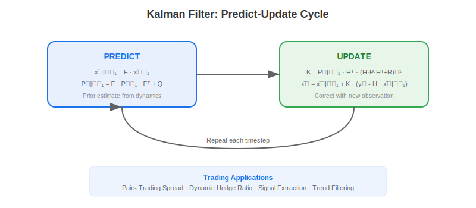
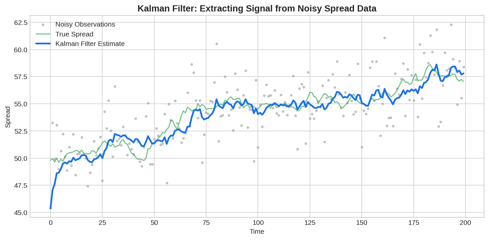

The **Kalman filter** is a recursive algorithm that estimates the hidden state of a dynamic system from noisy observations. In trading, it extracts clean signals from noisy price data — estimating the true spread in a pairs trade, dynamically computing hedge ratios, filtering trend signals, and tracking time-varying parameters. The filter operates in a continuous predict-update cycle: it predicts the next state using a dynamics model, then corrects the prediction when new market data arrives, optimally weighting the prediction and observation based on their relative uncertainties.

## The Kalman Filter Equations

The filter operates on a linear state-space model:

**State equation** (dynamics):
$$x_t = F \cdot x_{t-1} + w_t, \quad w_t \sim \mathcal{N}(0, Q)$$

**Observation equation** (measurement):
$$y_t = H \cdot x_t + v_t, \quad v_t \sim \mathcal{N}(0, R)$$

where $x_t$ is the hidden state (e.g., true spread), $y_t$ is the noisy observation (e.g., observed price ratio), $F$ is the state transition matrix, $H$ is the observation matrix, $Q$ is process noise covariance, and $R$ is measurement noise covariance.



## Python Implementation: Kalman Filter for Pairs Trading

```python
import numpy as np

class KalmanPairsFilter:
    """
    Kalman filter for dynamic hedge ratio estimation in pairs trading.
    State: [intercept, hedge_ratio]
    """
    def __init__(self, delta=1e-4, R=1e-3):
        self.delta = delta
        self.R = R  # Observation noise
        self.x = np.zeros(2)  # State: [alpha, beta]
        self.P = np.eye(2)  # State covariance
        self.Q = delta * np.eye(2)  # Process noise
    
    def update(self, y, x_obs):
        """
        y: dependent asset price
        x_obs: independent asset price
        Returns: hedge_ratio, spread, spread_std
        """
        H = np.array([1.0, x_obs])
        
        # Predict
        x_prior = self.x
        P_prior = self.P + self.Q
        
        # Update
        y_hat = H @ x_prior
        spread = y - y_hat
        S = H @ P_prior @ H + self.R
        K = P_prior @ H / S
        
        self.x = x_prior + K * spread
        self.P = P_prior - np.outer(K, H) @ P_prior
        
        return self.x[1], spread, np.sqrt(S)

# Example: pairs trading with dynamic hedge ratio
np.random.seed(42)
T = 500
beta_true = 1.5 + 0.3 * np.sin(np.arange(T) / 50)  # Time-varying
x_price = 100 + np.cumsum(np.random.normal(0, 0.5, T))
y_price = beta_true * x_price + 20 + np.random.normal(0, 2, T)

kf = KalmanPairsFilter()
hedges, spreads, stds = [], [], []
for t in range(T):
    h, s, std = kf.update(y_price[t], x_price[t])
    hedges.append(h)
    spreads.append(s)
    stds.append(std)

spreads = np.array(spreads)
stds = np.array(stds)

# Trading signal: z-score of spread
z_score = spreads / stds
positions = np.where(z_score > 1.5, -1, np.where(z_score < -1.5, 1, 0))
returns = positions[:-1] * np.diff(spreads)
print(f"Strategy PnL: {returns.sum():.2f}")
print(f"Final hedge ratio: {hedges[-1]:.3f}")
```



## Trading Applications

**Dynamic pairs trading**: The Kalman filter estimates the time-varying hedge ratio between two cointegrated assets, adapting as the relationship evolves. This avoids the stale estimates from rolling OLS regression. **Trend extraction**: Use the Kalman filter as a superior moving average that adapts its smoothing based on signal-to-noise ratio. **Online beta estimation**: Track the time-varying beta of a stock relative to the market in real time. **Signal combination**: Fuse multiple noisy alpha signals into a single clean composite signal using the Kalman framework.

The Kalman filter connects naturally to the [Ornstein-Uhlenbeck process](https://paperswithbacktest.com/wiki/ornstein-uhlenbeck-ou-process) framework for mean-reverting spread modeling.

## Limitations and Risks

The standard Kalman filter assumes linear dynamics and Gaussian noise. Financial data often violates both assumptions. The Extended Kalman Filter (EKF) and Unscented Kalman Filter (UKF) handle non-linearities. Parameter tuning ($Q$ and $R$) significantly affects performance and requires careful calibration.

## Conclusion

The Kalman filter is one of the most versatile tools in quantitative trading, providing optimal signal extraction from noisy market data. Its recursive nature makes it ideal for real-time applications, and its state-space formulation naturally accommodates the time-varying parameters that characterize financial markets.

---

**Explore further on PapersWithBacktest:**
- Browse [backtested pairs trading strategies](https://paperswithbacktest.com/strategies) with Python code and performance metrics
- Access [clean historical market data](https://paperswithbacktest.com/datasets) for equities, crypto, and futures
- Take the [algo trading course](https://paperswithbacktest.com/course) — 60+ video lessons and notebooks
- Related wiki pages: [Ornstein-Uhlenbeck Process](https://paperswithbacktest.com/wiki/ornstein-uhlenbeck-ou-process) · [Spread Trading Strategy](https://paperswithbacktest.com/wiki/spread-trading-strategy) · [Moving Average Trading Strategies](https://paperswithbacktest.com/wiki/moving-average-trading-strategies)
