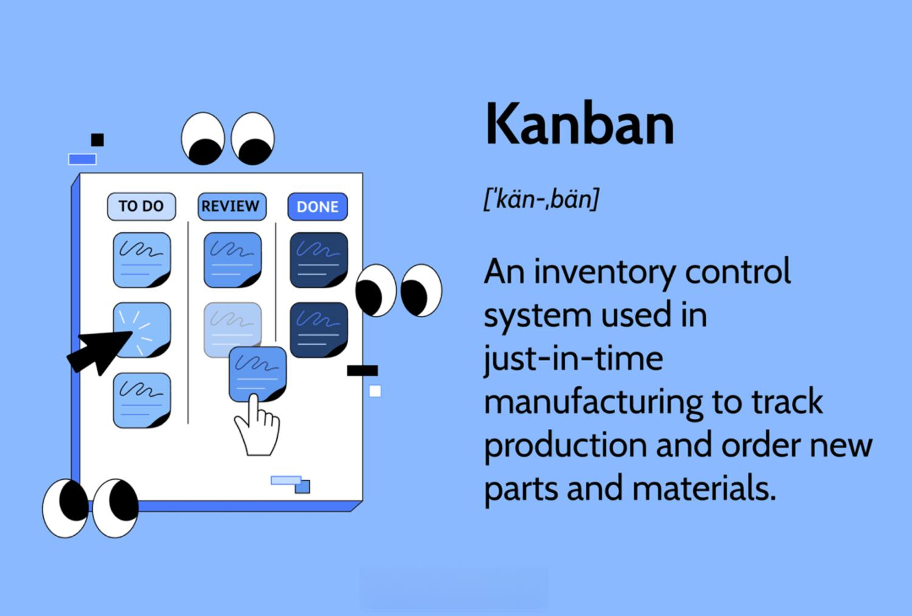

## Table of Contents

## What is a Kanban system?

A Kanban system is a way to manage work and improve how things get done. It started in Japan in factories, but now many places use it, like offices and software teams. The main idea is to use a board with cards and columns to show what needs to be done, what is being worked on, and what is finished. Each card represents a task, and as people work on tasks, they move the cards across the board.

The Kanban system helps teams see their work clearly and limits the number of tasks they work on at once. This helps them focus and finish tasks faster. It also makes it easier to spot problems and fix them quickly. By using a Kanban board, teams can work together better and make sure nothing gets forgotten or delayed.

## What are the origins of the Kanban system?

The Kanban system started in Japan after World War II. It was created by Taiichi Ohno, who worked at Toyota. He wanted to make the car factory work better and make more cars without wasting time or materials. He got the idea from how supermarkets worked. In supermarkets, when something is bought, it is quickly replaced from the back. Ohno thought factories could work the same way, with parts being replaced just when they are needed.

So, he made the Kanban system. "Kanban" means "signboard" or "billboard" in Japanese. In the factory, workers used cards to show when they needed more parts. When a part was used, a card was sent back to the place where parts were made, telling them to make more. This helped keep the right amount of parts ready without making too many. This way of working helped Toyota make cars more efficiently and became very popular in many other places and industries.

## What are the key principles of the Kanban system?

The Kanban system is based on a few important ideas. One is to make work visible. This means using a board to show what needs to be done, what is being worked on, and what is finished. By seeing all the tasks, teams can understand their work better and know what to focus on next. Another key idea is to limit work in progress. This means not starting too many tasks at once. By limiting how many tasks are being worked on, teams can finish things faster and avoid getting overwhelmed.

Another principle of Kanban is to manage the flow of work. This means looking at how tasks move through the system and finding ways to make things smoother. If there are bottlenecks or delays, teams can work to fix them. Kanban also encourages continuous improvement. Teams should always be looking for ways to do things better, whether by changing how they work or by making small changes to their processes. By following these principles, teams can work more efficiently and deliver better results.

## How does a Kanban board work?

A Kanban board is a tool that helps teams keep track of their work. It is like a big chart with columns and cards. Each column on the board shows a different stage of work, like "To Do," "In Progress," and "Done." Each card on the board represents a task that needs to be done. When someone starts working on a task, they move its card from the "To Do" column to the "In Progress" column. When the task is finished, the card moves to the "Done" column. This way, everyone can see what is happening with all the tasks at a glance.

The Kanban board also helps teams limit how many tasks they work on at the same time. This is important because if too many tasks are started, it can be hard to finish any of them quickly. By setting a limit on how many cards can be in the "In Progress" column, teams can focus better and get things done faster. If all the spots in the "In Progress" column are full, no new tasks can be started until some are finished and moved to the "Done" column. This keeps the work flowing smoothly and helps teams spot any problems or delays early on.

## What are the basic elements of a Kanban board?

A Kanban board has three main parts: columns, cards, and limits. Columns show the different stages of work, like "To Do," "In Progress," and "Done." Cards represent the tasks that need to be done. Each card has information about the task, like what it is and who is working on it. Limits are numbers that show how many tasks can be in each column at the same time. This helps keep the work flowing smoothly.

When someone starts working on a task, they move its card from the "To Do" column to the "In Progress" column. When the task is finished, the card moves to the "Done" column. This way, everyone can see what is happening with all the tasks at a glance. The limits on the columns make sure that not too many tasks are being worked on at once. This helps the team focus and finish tasks faster. By using a Kanban board, teams can see their work clearly and work together better.

## How can Kanban improve workflow efficiency?

Kanban can make work go smoother by showing all the tasks on a board. This way, everyone can see what needs to be done, what is being worked on, and what is finished. When people can see all the tasks, they know what to focus on next. This helps them work together better and make sure nothing gets forgotten or delayed. By using a board, teams can also spot problems quickly. If a task is stuck in one stage for too long, they can see it and fix it.

Another way Kanban helps is by limiting how many tasks people work on at the same time. If too many tasks are started, it can be hard to finish any of them quickly. By setting a limit on how many tasks can be in the "In Progress" column, teams can focus better and get things done faster. This also helps keep the work flowing smoothly. When a task is finished, the next one can start right away. This way, teams can work more efficiently and deliver better results.

## What is the difference between Kanban and other project management methodologies like Scrum?

Kanban and Scrum are both ways to manage projects, but they work differently. Kanban is more flexible. It uses a board to show tasks and lets teams start working on them anytime. There are no set times for planning or meetings. Teams can add new tasks whenever they want and work on them at their own pace. The main focus of Kanban is to keep the work flowing smoothly and to limit how many tasks are being worked on at once.

Scrum, on the other hand, has more rules. It breaks work into short periods called "sprints," which usually last two to four weeks. At the start of each sprint, the team plans what they will work on. During the sprint, they have daily meetings to talk about their progress. At the end, they review what they did and plan for the next sprint. Scrum is good for projects where the work needs to be done in a certain order and where regular check-ins help keep the team on track.

Both methods help teams work better, but they fit different needs. Kanban is great for teams that need to be able to change plans quickly and want a simple way to manage their work. Scrum is better for teams that like a more structured approach and need regular meetings to stay organized.

## How can Kanban be implemented in a software development environment?

Kanban can be used in software development to make the work easier to manage. Teams can use a Kanban board to show all the tasks that need to be done, like writing code, testing it, and fixing bugs. Each task is written on a card and moved across the board as it gets done. This helps everyone see what is happening with the project. The board can have columns like "To Do," "In Progress," and "Done." By limiting how many tasks are being worked on at once, the team can focus better and finish things faster. If a task is stuck, it's easy to see and fix the problem.

In a software development environment, Kanban also helps with teamwork. Developers, testers, and other team members can see the whole project on the board. This makes it easier for them to work together and help each other out. For example, if a developer finishes a task, they can quickly start on the next one or help someone else. Kanban also lets the team add new tasks anytime, which is good for projects that change a lot. By using Kanban, software teams can work more smoothly and deliver better software.

## What are common challenges when adopting Kanban, and how can they be overcome?

When teams start using Kanban, they might face some common challenges. One big challenge is changing how people work. Some team members might be used to old ways of doing things and might not want to change. This can make it hard to get everyone on board with Kanban. Another challenge is setting the right limits for work in progress. If the limits are too high, the team might start too many tasks and not finish them quickly. If the limits are too low, the team might not have enough to do. It can take time to find the right balance.

To overcome these challenges, teams need to talk openly about the changes. It's important to explain why Kanban is being used and how it can help. Team members should be encouraged to share their thoughts and concerns. This can help everyone feel more comfortable with the new way of working. For setting the right limits, teams can start with a guess and then adjust as they go. They should keep an eye on how the work is flowing and change the limits if needed. By being patient and working together, teams can get past the challenges and make Kanban work well for them.

## How can metrics and analytics be used to optimize a Kanban system?

Metrics and analytics can help make a Kanban system better by showing how work is going. Teams can use numbers like lead time, which is how long it takes to finish a task from start to finish, and cycle time, which is how long it takes to do the actual work on a task. By looking at these numbers, teams can see if they are getting faster at finishing tasks. They can also use a metric called throughput, which shows how many tasks are completed in a certain time. If throughput goes up, it means the team is doing more work. By keeping an eye on these metrics, teams can find ways to make their work smoother and quicker.

Another way metrics and analytics help is by showing where problems are happening. For example, if a lot of tasks are stuck in one column on the Kanban board, it might mean there is a bottleneck. Teams can use a metric called work in progress (WIP) to see if too many tasks are being worked on at once. If the WIP is too high, it can slow everything down. By looking at these numbers, teams can figure out what is causing the problems and fix them. Over time, using metrics and analytics can help teams make their Kanban system work better and get more done.

## What advanced techniques can be used to enhance a Kanban system?

One advanced technique to enhance a Kanban system is called "Swim Lanes." Swim lanes are like extra rows on the Kanban board that help organize tasks by different categories or teams. For example, a software development team might use swim lanes to separate tasks for different parts of the project, like coding, testing, and design. This makes it easier to see how work is going in each area and helps the team focus on what needs to be done next. By using swim lanes, teams can manage complex projects better and make sure everyone knows what they are responsible for.

Another technique is "Classes of Service." This means sorting tasks into different groups based on how important or urgent they are. For example, some tasks might be marked as "Expedite" if they need to be done very quickly, while others might be "Standard" if they can wait a bit longer. By using classes of service, teams can make sure they are working on the most important tasks first. This helps them use their time better and meet deadlines. It also makes it clear to everyone on the team which tasks need special attention, so they can plan their work more effectively.

## How can Kanban be scaled for use in large organizations?

Kanban can be scaled for use in large organizations by creating multiple Kanban boards for different teams or departments. Each team can have its own board to manage their tasks, but these boards can be linked together to show how work moves from one team to another. For example, a product development team might have a board for designing a product, and then pass the work to a manufacturing team with its own board. By connecting these boards, everyone in the organization can see how the whole project is progressing and where any problems might be happening. This helps big companies keep track of all their work and make sure nothing gets lost or delayed.

Another way to scale Kanban in large organizations is by using a higher-level board to oversee all the smaller boards. This top-level board can show the overall progress of big projects and help leaders see where they need to focus their attention. It can also help with planning and making sure different teams are working together well. By using both individual team boards and a master board, large organizations can use Kanban to manage complex projects and keep everyone on the same page. This way, they can work more efficiently and deliver better results, even with many teams and lots of tasks.

## References & Further Reading

[1]: Taiichi Ohno. ["Toyota Production System: Beyond Large-Scale Production."](https://www.taylorfrancis.com/books/mono/10.4324/9780429273018/toyota-production-system-taiichi-ohno) Productivity Press, 1988.

[2]: David J. Anderson. ["Kanban: Successful Evolutionary Change for Your Technology Business."](https://books.google.com/books/about/Kanban.html?id=RJ0VUkfUWZkC) Blue Hole Press, 2010.

[3]: Jeffrey K. Liker. ["The Toyota Way: 14 Management Principles from the World's Greatest Manufacturer."](https://www.mhebooklibrary.com/doi/book/10.1036/9781260468526) McGraw-Hill, 2004.

[4]: Eric Ries. ["The Lean Startup: How Today's Entrepreneurs Use Continuous Innovation to Create Radically Successful Businesses."](https://www.amazon.com/Lean-Startup-Entrepreneurs-Continuous-Innovation/dp/0307887898) Crown Business, 2011.

[5]: Daniel T. Jones and James P. Womack. ["Lean Thinking: Banish Waste and Create Wealth in Your Corporation."](https://www.amazon.com/Lean-Thinking-Corporation-Revised-Updated/dp/0743249275) Free Press, 2003.