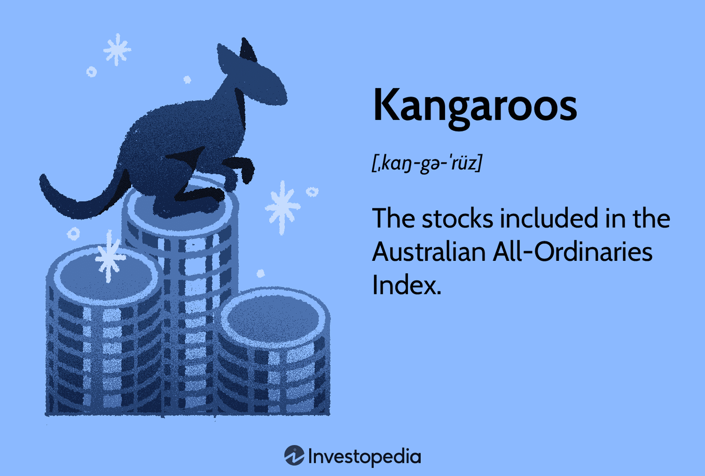

Foreign debt and Australian bonds, particularly Kangaroo bonds, have become increasingly significant in global financial markets due to their unique characteristics and rising demand. These bonds, issued by non-Australian entities in the Australian dollar-market, have garnered attention for their role in diversifying investment portfolios and providing competitive yields. As the global financial landscape evolves, understanding the nuances of Kangaroo bonds is essential for investors, policymakers, and financial professionals striving to optimize their strategies and enhance market engagement.

One key aspect driving the prominence of Kangaroo bonds is their ability to attract international issuers seeking to tap into Australia's stable economic environment and diversified investor base. This appeal is further amplified by the global reach of algorithmic trading, which is reshaping how bonds are traded. Algorithmic trading, characterized by the use of complex algorithms and high-speed computational techniques, has revolutionized the bond market by increasing trading efficiency, reducing transaction costs, and enhancing liquidity. These technological advancements are particularly relevant for Kangaroo bonds, as they enable more streamlined and transparent transactions, benefitting both issuers and investors.

For investors, understanding the fundamentals and recent trends of Kangaroo bonds offers insights into potential investment opportunities and risks in the Australian debt market. Kangaroo bonds also serve as an important tool for mitigating foreign debt, as they allow issuers to diversify their funding sources and reduce dependency on their domestic markets. This diversification can lead to more stable financial strategies and reduced exposure to local economic fluctuations.

In the broader context of the bond market, the role of algorithmic trading cannot be understated. It influences not only the speed and efficiency of transactions but also the pricing strategies and market dynamics, which are critical for professionals engaged in trading and financial analysis. The integration of these advanced trading techniques into the market underscores the need for continuous adaptation and innovation in financial practices.

This article will explore the significance of these bonds, provide an overview of the Australian debt market, and analyze the impact of algorithmic trading on bond transactions, offering valuable insights for stakeholders across the financial sector. Understanding these complex interactions will empower investors, policymakers, and financial professionals to navigate the intricacies of global financial markets with greater proficiency and strategic foresight.

## Table of Contents

## Understanding Foreign Debt and Australian Bonds

Foreign debt, often referred to as external debt, represents the amount of money that a country owes to external creditors. These creditors can include international financial institutions, foreign governments, and private sector lenders. Foreign debt plays a pivotal role in the economic health of a nation, enabling it to bridge the gap between domestic savings and investment needs. By providing access to international capital, foreign debt can bolster infrastructure development, stimulate economic growth, and facilitate the implementation of national projects. However, it also carries significant implications, as excessive foreign debt can lead to financial distress, resulting in higher interest rates, currency devaluation, and even sovereign defaults.

Australian bonds, a key component of the nation's financial ecosystem, are debt securities issued by the government, corporations, and other entities within Australia. These bonds comprise both domestic and foreign-issued varieties, with Kangaroo bonds being a prominent example of the latter. Kangaroo bonds are Australian dollar-denominated bonds issued by foreign entities within the Australian market. They enable foreign issuers to tap into Australia's robust financial infrastructure and investor base.

Within the Australian financial system, bonds serve critical roles such as funding public expenditures, corporate expansions, and infrastructure projects. They provide a reliable mechanism for entities to raise capital and for investors to access a diversified range of fixed-income products. The Australian bond market is characterized by its transparency, efficiency, and well-established regulatory frameworks, which enhance investor confidence and market stability.

Foreign issuance in local markets like Australia offers numerous benefits, including portfolio diversification, access to foreign capital, and the potential for higher yields. For foreign issuers, Kangaroo bonds allow the penetration of the Australian market without currency conversion risks, broadening their investor base and improving financial stability. However, challenges accompany these benefits. Currency risk remains a primary concern, as fluctuations in the Australian dollar's value can affect returns. Regulatory compliance and understanding local market dynamics also pose challenges for foreign entities entering the Australian bond market.

In conclusion, both foreign debt and Australian bonds, including Kangaroo bonds, play significant roles in shaping financial markets and economies. While they offer various advantages, such as diversification and capital access, they also pose potential risks that must be carefully managed by issuers and investors. Understanding these dynamics is crucial for anyone engaged in the global financial landscape.

## What Are Kangaroo Bonds?

Kangaroo bonds are debt securities issued in the Australian market by foreign entities. These bonds are issued in Australian dollars (AUD) and are subject to Australian regulatory conditions. Kangaroo bonds, akin to Yankee bonds in the U.S. and Samurai bonds in Japan, provide foreign issuers an opportunity to access the Australian financial market, thereby exposing themselves to a diverse pool of Australian investors. 

These bonds play a significant role in the Australian financial ecosystem by diversifying investment opportunities and enhancing market [liquidity](/wiki/liquidity-risk-premium). They allow international companies and governmental agencies to raise capital in Australian dollars without incurring exchange rate risks. From the perspective of the Australian market, Kangaroo bonds contribute to the deepening and broadening of the domestic bond market. 

The key characteristics of Kangaroo bonds include their denomination in AUD, adherence to Australian securities regulations, and their issuance by foreign entities. One major benefit for issuers is the ability to tap into the robust demand from Australian institutional investors, who are often seeking to diversify their portfolios with foreign bond issuances. Investors benefit from access to global credits while staying within their domestic currency, thus minimizing foreign exchange risk.

Several factors drive the popularity of Kangaroo bonds among foreign issuers. The Australian bond market is known for its stable economic conditions and favorable regulatory environment, which attract foreign issuers. Additionally, the relatively high yield environment in Australia compared to other developed markets makes it appealing for investors looking for higher returns, further fuelling demand for Kangaroo bonds.

Recent successful issuances exemplify the robust demand for these bonds. For instance, in early 2023, the Asian Development Bank issued AUD 500 million in Kangaroo bonds, attracting strong interest from both domestic and international investors. Similarly, in 2022, Apple Inc. issued AUD 1.2 billion, marking one of the largest Kangaroo bond issuances. These successful issuances underscore the viability and attractiveness of the Kangaroo bond market as a crucial element of the global debt landscape.

## The Role of Algorithmic Trading in the Bond Market

Algorithmic trading has revolutionized financial markets by employing computer programs to execute trades based on pre-defined criteria. It significantly impacts the bond market, where the complexities of pricing and execution are notably pronounced. The advent of [algorithmic trading](/wiki/algorithmic-trading) has improved efficiency in trading processes, reduced transaction costs, and increased market liquidity, making it a core component of modern financial ecosystems.

In the bond market, notably with instruments like Kangaroo bonds, which are Australian dollar-denominated bonds issued by non-Australian entities within Australia, algorithmic trading plays a crucial role. The integration of algorithmic strategies facilitates the seamless handling of trades, accommodating the intricate execution requirements of Kangaroo bonds. These bonds, attracting global investments, necessitate swift trading strategies that algorithms provide.

The benefits of algorithmic trading are manifold. First, it markedly enhances efficiency by automating repetitive tasks and streamlining the trading workflow. This reduces the potential for human error and enables the processing of vast quantities of trades that would otherwise be unmanageable manually. Second, transaction costs are diminished due to increased competition among traders and reduced market impact costs. Algorithms can gauge market conditions and execute trades at optimal times, minimizing costs and maximizing returns.

Moreover, algorithmic trading amplifies market liquidity by enabling higher trading volumes and more frequent transactions. It facilitates quick market entry and [exit](/wiki/exit-strategy), allowing traders to capitalize on price variances swiftly. This increased liquidity is particularly beneficial for Kangaroo bonds, as it assures investors of the ability to enter and exit positions with ease, thus enhancing their appeal.

Algorithmic trading influences bond pricing, speed, and strategies. Pricing becomes more precise, with algorithms analyzing a multitude of data points to determine fair values. The speed of execution is unparalleled, with transactions occurring in microseconds, allowing traders to exploit minute market movements. Strategically, algorithms provide diverse approaches, including [arbitrage](/wiki/arbitrage), statistical trading, and sentiment analysis. They can react to market conditions faster than human traders, using historical data and real-time information to predict market behavior.

In conclusion, algorithmic trading serves as a transformative force in the bond market, bringing unprecedented efficiency, reduced costs, and enhanced liquidity. Its application is invaluable in trading Kangaroo bonds, allowing investors and issuers alike to benefit from a more dynamic and responsive market environment. The continued evolution of algorithmic strategies promises further innovations, potentially reshaping how bonds are traded and valued globally.

## Key Players and Market Dynamics

The Australian debt market features a diverse set of participants, including issuers, investors, and intermediaries. Issuers primarily consist of governmental bodies, financial institutions, and large corporations seeking to raise capital. Investors typically include institutional bodies such as pension funds, mutual funds, insurance companies, and some private entities seeking robust investment opportunities. Intermediaries, such as investment banks and brokerage firms, facilitate the transactions between issuers and investors, playing a crucial role in providing liquidity and transparency in the market.

Regulatory and policy frameworks significantly influence the dynamics of the Australian debt market. The Australian Prudential Regulation Authority (APRA) and the Australian Securities and Investments Commission (ASIC) are pivotal regulatory bodies that oversee the market operations, ensuring stability and protecting investor interests. Policy adjustments, particularly those related to interest rates set by the Reserve Bank of Australia (RBA), directly affect bond prices and yields. Regulations can also impact the issuance and attractiveness of Kangaroo bonds—foreign bonds issued in Australia with Australian dollar denomination—by dictating the conditions under which these bonds can be issued.

Global economic factors also play a critical role in the demand and supply dynamics of Kangaroo bonds. Factors such as global interest rates, economic growth patterns, inflation expectations, and geopolitical events can influence foreign issuers' decisions to enter the Australian bond market. For instance, a low-interest-rate environment globally might prompt more foreign entities to issue Kangaroo bonds as they seek higher yields offered in the Australian market. Conversely, economic instability or currency fluctuations can discourage foreign issuers due to the risk of increased borrowing costs.

Algorithmic trading strategies have considerably impacted market dynamics. Major market players, including prominent investment banks and hedge funds, employ sophisticated algorithms to optimize bond trading strategies. These algorithms use complex mathematical models and statistical tools to analyze market data, forecast price movements, and execute trades with minimal human intervention. Algorithmic trading enhances efficiency by facilitating rapid trade execution, increasing market liquidity, and reducing transaction costs. For example, firms might use [machine learning](/wiki/machine-learning) algorithms to predict price trends or detect arbitrage opportunities in the bond market.

A case study illustrating the influence of algorithmic trading involves a leading investment bank deploying machine learning models to manage its Kangaroo bond portfolio. By analyzing historical data, market sentiment, and macroeconomic indicators, the bank's algorithms can adjust trading strategies in real-time, optimizing for maximum returns while mitigating risk. This strategic use of technology showcases how algorithmic trading reshapes the competitive landscape, providing firms with a quantitative edge in decision-making processes.

In conclusion, the Australian debt market, particularly the segment involving Kangaroo bonds, sees significant participation from varied stakeholders. Regulatory frameworks, global influences, and technological innovations like algorithmic trading collectively shape its market dynamics. As these elements continue to evolve, the roles of key players and the overall market landscape will undoubtedly develop further.

## Comparing Kangaroo Bonds with Other Debt Instruments

Kangaroo bonds, unique financial instruments within the Australian debt market, bear several distinguishing features when compared to other debt instruments both domestically and globally. These bonds are issued by non-Australian entities in Australian dollars (AUD) within the Australian market, providing a particular set of characteristics and benefits.

**Unique Features and Competitive Advantages**

Kangaroo bonds stand out due to their issuance by foreign entities in the local currency, offering international issuers access to the Australian dollar market without the need to establish a domestic entity. This feature provides issuers with the advantage of funding diversification, allowing them to tap into the investor base within Australia, which may have different liquidity dynamics and [interest rate](/wiki/interest-rate-trading-strategies) environments compared to their home markets.

For investors, Kangaroo bonds offer exposure to international credit without leaving the AUD space, providing an avenue for diversification within a fixed income portfolio. This can be particularly appealing to investors seeking credit exposure alongside the relative stability of the AUD, which is often seen as a proxy for the economic performance of Australia and its associated commodities markets.

**Currency Exposure, Yield Potential, and Diversification Benefits**

Currency exposure is a critical aspect when comparing Kangaroo bonds to other debt instruments. Since these bonds are denominated in Australian dollars, they offer a hedge against currency exchange fluctuations for those whose liabilities or transaction exposures are in AUD. This is particularly advantageous for foreign issuers looking to match their currency positions without engaging in expensive hedging strategies in the foreign exchange market.

The yield potential of Kangaroo bonds generally aligns with the broader Australian bond market, influenced by the Reserve Bank of Australia's interest rate policies, local inflationary pressures, and global economic conditions. However, they might offer higher yields than sovereign or similar domestic credit-rated bonds due to the credit profile and associated risks of the foreign issuer, which can be appealing to yield-seeking investors.

In terms of diversification, Kangaroo bonds enrich a portfolio by adding geographical and credit diversity, which is valuable in mitigating risk. For instance, an investor predominantly holding U.S. or European debt could use Kangaroo bonds to vary their geopolitical exposure, potentially stabilizing returns through different credit cycles or regional economic turbulences.

In conclusion, while Kangaroo bonds share common ground with other Australian debt instruments in terms of market influence and regulatory framework, their distinct characteristics—particularly their foreign issuer backdrop and local currency denomination—afford them strategic advantages. These advantages lie in currency exposure management, attractive yields, and enhanced diversification potential, positioning Kangaroo bonds as a viable alternative for both issuers and investors within the global fixed income market.

## Recent Trends and Developments

In recent years, the Kangaroo bond market has experienced significant changes in issuance volumes and the types of issuers. As global economic conditions shift, the demand for these bonds among international investors has grown, evidenced by a steady increase in issuance volumes. According to recent data, the total issuance of Kangaroo bonds has reached record levels, driven primarily by favorable interest rate conditions and Australia's robust credit rating. The market has notably attracted a diverse range of issuers, including multinational corporations, financial institutions, and, increasingly, sovereign entities seeking to tap into Australia's stable financial environment.

Macroeconomic factors have played a substantial role in shaping the Kangaroo bond market. Fluctuations in the global economic landscape, such as interest rate cuts by central banks of major economies, have bolstered the appeal of Australian-denominated debt. Furthermore, Australia's economic stability and relatively high yields compared to other developed markets have made Kangaroo bonds an attractive option for yield-seeking investors. The impact of currency exchange rates, particularly the value of the Australian dollar relative to other currencies, also influences investor decisions and the overall demand for these bonds.

Technological advancements have been pivotal in reshaping the Australian debt market. The integration of automated systems and advanced data analytics has streamlined processes involved in bond issuance and trading. Technologies such as blockchain and distributed ledger technology (DLT) are being explored to enhance transparency and efficiency in the settlement and clearing of bond transactions. These innovations are expected to reduce costs and improve timing, while also minimizing the risk of errors and fraud within the market.

The role of sustainable and green Kangaroo bonds is becoming increasingly prominent. With the rise of environmental, social, and governance ([ESG](/wiki/esg-investing)) criteria among investors, issuers are focusing more on sustainability-linked bonds. These instruments are designed to finance projects with positive environmental impacts, such as renewable energy initiatives and sustainable infrastructure developments. The demand for green bonds reflects a broader trend among global investors prioritizing ESG factors in their investment portfolios, thus contributing to the growth and diversification of the Kangaroo bond market.

In summary, the Kangaroo bond market is evolving with expanding issuance volumes and issuer diversity. Influential macroeconomic factors, coupled with technological advancements, are redefining market dynamics. At the same time, the incorporation of green and sustainable bonds aligns with shifting investor preferences toward ESG considerations, signaling a potential area of significant future growth.

## Conclusion and Future Outlook

Kangaroo bonds have emerged as an increasingly essential component of the global financial ecosystem, offering foreign issuers a platform to access the robust Australian debt market. These bonds have played a pivotal role in enhancing market depth and liquidity, attracting a diverse range of international issuers and investors. As highlighted, Kangaroo bonds not only provide a mechanism for investment diversification but also contribute to the strengthening of economic ties between Australia and the global financial community.

Algorithmic trading has revolutionized the way Kangaroo bonds, and broader bond markets, operate by bringing unprecedented efficiency and precision to trading processes. The use of algorithmic strategies in bond trading has led to a reduction in transaction costs, increased market liquidity, and improved pricing accuracy. As a transformative force, algorithmic trading has enabled market participants to execute trades at superior speeds and with enhanced strategic capabilities, reshaping the way investors engage with bonds.

Looking to the future, the Australian debt market is poised to witness continued growth and innovation. The increasing popularity of sustainable and green bonds, including Kangaroo bonds, reflects a broader trend toward environmentally conscious investment practices. This shift is likely to drive further issuance activity and innovation in bond structures, creating new opportunities for investors and issuers alike.

Moreover, macroeconomic factors, such as interest rate dynamics and geopolitical developments, will continue to impact the demand and supply of Kangaroo bonds. With the ongoing evolution of financial technologies, the landscape of bond trading is expected to become even more dynamic and sophisticated, allowing for further integration of advanced data analytics and machine learning models.

In conclusion, Kangaroo bonds serve as a vital instrument for mitigating foreign debt challenges by offering an attractive platform for global issuers to diversify funding sources. Their continued significance is reinforced by algorithmic trading advances and a responsive Australian debt market that embraces sustainable financial practices. As the global financial landscape evolves, Kangaroo bonds are set to maintain their relevance as both a strategic investment tool and a conduit for strengthening international financial connections.

## References & Further Reading

[1]: ["Australian Debt Securities and Corporate Bonds."](https://business.nab.com.au/wp-content/uploads/2013/10/australian-debt-securities-october-2013.pdf) Reserve Bank of Australia, December 2020.

[2]: ["Algorithmic Trading and Information"](https://faculty.haas.berkeley.edu/hender/ATInformation.pdf) by Lakshmi Ratan, World Scientific.

[3]: ["Kangaroo Bonds: The Market and the Players."](https://www.financestrategists.com/wealth-management/bonds/kangaroo-bond/) Reserve Bank of Australia Bulletin, March 2008.

[4]: ["The Evolution of Algorithmic Trading."](https://midscapital.medium.com/evolution-of-algorithmic-trading-past-present-and-future-trends-46fd9680b0da) International Organization of Securities Commissions, March 2011.

[5]: ["Advances in Quantitative Analysis of Finance and Accounting"](https://worldscientific.com/series/aqafa) by Cheng F. Lee, World Scientific.