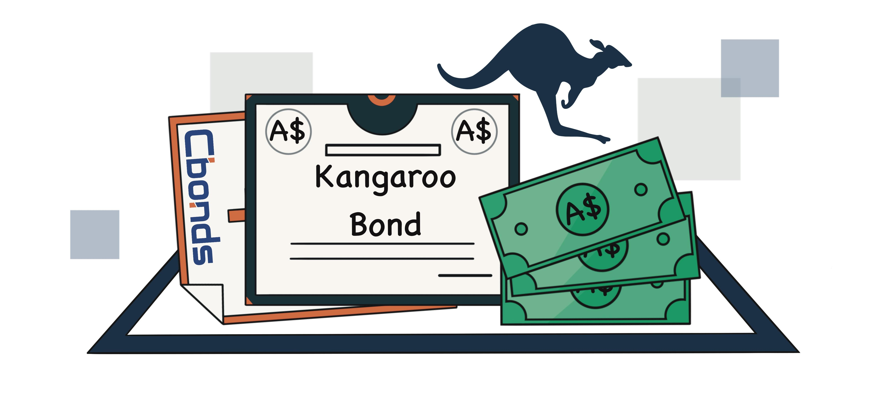

## Table of Contents

## What are Kangaroo Bonds?

Kangaroo Bonds are bonds that are issued in the Australian market by foreign companies or governments. They are denominated in Australian dollars, which means the money paid back to investors is in Australian currency. This allows foreign issuers to tap into the Australian investment market and raise funds there.

These bonds are popular because they give investors in Australia a chance to invest in foreign entities without worrying about currency exchange risks. Since the bonds are in Australian dollars, investors do not have to convert their money into another currency. This makes Kangaroo Bonds an attractive option for both the issuers looking to raise funds and the investors looking for new investment opportunities.

## Why are they called Kangaroo Bonds?

Kangaroo Bonds got their name because they are linked to Australia, and the kangaroo is a famous animal from Australia. When people hear "Kangaroo Bonds," they think of Australia right away. It's a simple way to remember that these bonds are sold in the Australian market but issued by companies or governments from other countries.

The name helps everyone understand quickly what these bonds are about. Just like how a kangaroo is unique to Australia, Kangaroo Bonds are unique because they are in Australian dollars but come from foreign places. This makes them special and easy to recognize in the world of finance.

## Who can issue Kangaroo Bonds?

Kangaroo Bonds can be issued by foreign companies or governments. This means that if a company or a country from outside Australia wants to borrow money, they can do so by issuing these bonds in the Australian market. They need to follow the rules set by the Australian Securities and Exchange Commission to make sure everything is done correctly.

These bonds are a way for foreign issuers to get money from Australian investors. Because the bonds are in Australian dollars, it's easier for Australians to invest without worrying about changing their money into another currency. This makes Kangaroo Bonds a good choice for both the people issuing the bonds and the people buying them.

## What are the benefits of issuing Kangaroo Bonds?

Issuing Kangaroo Bonds can help foreign companies or governments raise money from Australian investors. When they issue these bonds, they can get funds in Australian dollars, which is great if they need money in that currency. It also helps them reach new investors in Australia who might be interested in their bonds. This can make their borrowing cheaper because they can tap into a bigger pool of money.

Another benefit is that Kangaroo Bonds can help issuers spread out where they get their money from. Instead of just borrowing in their home country or in other big markets, they can also borrow in Australia. This can make their financial situation more stable because they are not relying on just one place for funds. Plus, using Australian dollars can be a good way to manage currency risks if they have other business or investments in Australia.

## How do Kangaroo Bonds differ from other types of bonds?

Kangaroo Bonds are different from other types of bonds because they are issued in the Australian market by foreign companies or governments, but they are paid back in Australian dollars. This is special because it means Australian investors can buy these bonds without worrying about changing their money into another currency. Other bonds, like Yankee Bonds issued in the U.S. or Samurai Bonds issued in Japan, are also issued by foreign entities but are in U.S. dollars or Japanese yen respectively.

Another way Kangaroo Bonds differ is that they allow foreign issuers to reach Australian investors specifically. This can be a good way for these issuers to get money from a new group of people. Other bonds might be aimed at investors in different countries, depending on where they are issued. So, Kangaroo Bonds are unique because they connect foreign issuers with the Australian market in a way that's easy for both sides.

## What are the typical terms and conditions of Kangaroo Bonds?

Kangaroo Bonds usually have terms and conditions that are similar to other bonds. They have a set time when they will be paid back, called the maturity date. This can be a few years or even longer. The bonds also have a fixed [interest rate](/wiki/interest-rate-trading-strategies), which is the money the issuer pays to the investors for borrowing. This rate stays the same until the bond matures. Sometimes, the bonds might be able to be sold before they mature, but this depends on the rules set by the issuer.

The money from Kangaroo Bonds is paid back in Australian dollars. This means the issuer needs to make sure they have enough Australian dollars to pay back the investors when the bond matures. The bonds are also regulated by the Australian Securities and Exchange Commission, so they have to follow certain rules to make sure everything is fair and clear for the investors. This includes giving out information about the bond and the issuer's financial situation.

## What is the process for issuing Kangaroo Bonds in Australia?

To issue Kangaroo Bonds in Australia, a foreign company or government first needs to find a bank or financial institution to help them. This bank will work with the issuer to figure out how much money they want to borrow, what interest rate they will offer, and how long the bond will last. They also need to follow the rules set by the Australian Securities and Exchange Commission. This means they have to give clear information about the bond and their financial situation to potential investors.

Once everything is ready, the issuer and the bank will start selling the bonds to investors in Australia. They will use different ways to reach investors, like working with other banks or using online platforms. When investors buy the bonds, they are lending money to the issuer in Australian dollars. The issuer then has to pay back this money, plus interest, when the bond matures. This whole process helps the issuer get money from Australian investors and gives those investors a chance to earn money from foreign companies or governments.

## How are Kangaroo Bonds rated and what does the rating signify?

Kangaroo Bonds are rated by credit rating agencies like Standard & Poor's, Moody's, and Fitch. These agencies look at the financial health of the company or government issuing the bond. They check things like how much money the issuer has, how well they pay their debts, and if they can keep paying interest on the bond. After looking at all this, the agencies give the bond a rating. This rating can be high, like AAA, which means the bond is very safe, or it can be low, like C, which means the bond is riskier.

The rating tells investors how safe their money is. A high rating means the bond is less likely to have problems, so investors feel more secure. A low rating means there's a bigger chance the issuer might not be able to pay back the money, so it's riskier for investors. This rating helps investors decide if they want to buy the bond. It's like a report card that shows how trustworthy the bond is.

## What has been the historical performance of Kangaroo Bonds?

Kangaroo Bonds have done well over time. They have been popular because they let foreign companies and governments borrow money in Australian dollars. This has been good for both the people who issue the bonds and the people who buy them. Australian investors like Kangaroo Bonds because they don't have to worry about changing their money into another currency. This makes the bonds a safe and easy choice. Over the years, many Kangaroo Bonds have been paid back on time, which has made investors trust them more.

The interest rates on Kangaroo Bonds have also been good. They have given investors a steady return on their money. When the world economy is doing well, more Kangaroo Bonds are issued, and they usually have lower interest rates. But when things are not so good, the rates can go up because investors want more money for taking on more risk. Overall, Kangaroo Bonds have been a solid choice for investors looking to put their money into something reliable and in Australian dollars.

## What are the risks associated with investing in Kangaroo Bonds?

Investing in Kangaroo Bonds has some risks that investors should know about. One big risk is the credit risk. This means the company or government that issued the bond might not be able to pay back the money when the bond matures. If they have money problems, investors could lose some or all of their money. Another risk is the interest rate risk. If interest rates go up after you buy the bond, the value of your bond can go down. This happens because new bonds will have higher interest rates, making older bonds less attractive.

There's also the risk that comes from changes in the Australian dollar. Even though Kangaroo Bonds are in Australian dollars, if the value of the Australian dollar goes down compared to other currencies, it can affect how much money investors get back when they convert it to their home currency. Lastly, there's the risk that the bond might not be easy to sell before it matures. If you need to sell your bond early, you might not find someone to buy it, or you might have to sell it for less than you paid. These risks are important to think about before investing in Kangaroo Bonds.

## How do regulatory environments affect Kangaroo Bonds?

The rules in Australia can change how Kangaroo Bonds work. The Australian Securities and Exchange Commission (ASIC) makes sure that everything about Kangaroo Bonds is clear and fair. This means that the people who issue the bonds have to tell investors a lot about their financial health and the bond itself. If the rules change, it might be harder or easier for foreign companies or governments to issue these bonds. For example, if the rules get stricter, fewer Kangaroo Bonds might be issued because it's harder to meet all the new requirements.

Changes in regulations can also affect how safe investors feel about Kangaroo Bonds. If the rules are strong and well-enforced, investors might trust the bonds more because they know everything is being watched closely. But if the rules are not as strict, investors might worry more about whether the issuer can pay back the money. This can make the interest rates on the bonds go up because investors want more money for taking on more risk. So, the rules play a big part in how Kangaroo Bonds are issued and how well they do in the market.

## What are some notable examples of Kangaroo Bond issuances?

One famous example of Kangaroo Bonds was when the World Bank issued them in 2007. The World Bank wanted to borrow money in Australian dollars, so they sold these bonds to Australian investors. This was a big deal because it showed that even big organizations like the World Bank saw value in using the Australian market to get money. It also helped make Kangaroo Bonds more well-known and trusted by investors.

Another example is when Apple issued Kangaroo Bonds in 2015. Apple needed money in Australian dollars, so they decided to sell these bonds in Australia. This was a smart move because it let Apple get money from Australian investors without having to worry about changing currencies. It also showed that big companies from other countries were interested in the Australian market, which made more people pay attention to Kangaroo Bonds.

## References & Further Reading

[1]: ["Australian Debt Securities and Corporate Bonds."](https://business.nab.com.au/wp-content/uploads/2013/10/australian-debt-securities-october-2013.pdf) Reserve Bank of Australia, December 2020.

[2]: ["Algorithmic Trading and Information"](https://faculty.haas.berkeley.edu/hender/ATInformation.pdf) by Lakshmi Ratan, World Scientific.

[3]: ["Kangaroo Bonds: The Market and the Players."](https://www.financestrategists.com/wealth-management/bonds/kangaroo-bond/) Reserve Bank of Australia Bulletin, March 2008.

[4]: ["The Evolution of Algorithmic Trading."](https://midscapital.medium.com/evolution-of-algorithmic-trading-past-present-and-future-trends-46fd9680b0da) International Organization of Securities Commissions, March 2011.

[5]: ["Advances in Quantitative Analysis of Finance and Accounting"](https://worldscientific.com/series/aqafa) by Cheng F. Lee, World Scientific.