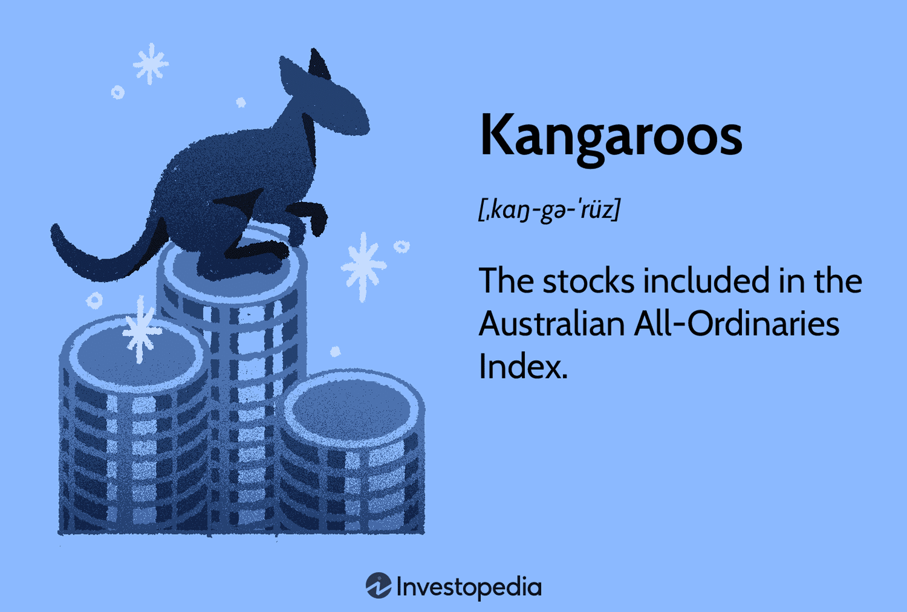

## Table of Contents

## What are kangaroos in the context of the bond market?

In the bond market, kangaroos are not the hopping animals from Australia. Instead, they are a type of bond. Specifically, kangaroo bonds are bonds issued in the Australian market by foreign entities, but they are denominated in Australian dollars. This means that a company or government from another country can borrow money from Australian investors, and they will pay back the loan in Australian dollars.

Kangaroo bonds are important because they allow foreign issuers to tap into the Australian market, which can be beneficial for both the issuers and the investors. For the issuers, it's a way to diversify their funding sources and potentially get better borrowing terms. For Australian investors, kangaroo bonds offer a chance to invest in foreign entities without the risk of currency fluctuations, since the bonds are in Australian dollars. This can make their investment portfolios more diverse and potentially more profitable.

## How do kangaroo bonds differ from other types of bonds?

Kangaroo bonds are special because they are issued in Australia by companies or governments from other countries, but the money is paid back in Australian dollars. This is different from regular bonds, which can be issued by local companies or governments and might be paid back in different currencies. Kangaroo bonds help foreign companies borrow money from Australians, and Australians can invest in foreign companies without worrying about changes in currency values.

Another difference is that kangaroo bonds are a way for foreign issuers to reach the Australian market, which can be good for both the companies issuing the bonds and the people buying them. For the companies, it's a chance to get money from a new place and maybe get better loan terms. For Australian investors, kangaroo bonds add variety to their investments, making their money potentially safer and more profitable. This is different from other bonds, which might not offer the same benefits of currency stability and market diversity.

## Why might an investor be interested in kangaroo bonds?

An investor might be interested in kangaroo bonds because they offer a way to invest in foreign companies without the worry of currency changes. Since kangaroo bonds are paid back in Australian dollars, an Australian investor doesn't have to think about how the value of other currencies might go up or down. This makes the investment safer and easier to understand.

Also, kangaroo bonds can help an investor spread out their money across different kinds of investments. By buying kangaroo bonds, an investor can put their money into foreign companies, which can make their overall investment plan stronger and possibly more profitable. This is a good way to mix things up and not put all their eggs in one basket.

## What are the typical issuers of kangaroo bonds?

The typical issuers of kangaroo bonds are foreign companies and governments. These are organizations from outside Australia who want to borrow money from Australian investors. They come from different countries and industries, like banks, big companies, and even some governments that need money for projects or to manage their finances.

These issuers choose to issue kangaroo bonds because they want to tap into the Australian market. This can help them get money from a new place, which can be useful for their business or country. By issuing bonds in Australian dollars, they can reach Australian investors who might be interested in putting their money into something different from what's available in their own country.

## How does the Australian bond market influence kangaroo bonds?

The Australian bond market plays a big role in how kangaroo bonds work. Since kangaroo bonds are issued in Australia by foreign companies or governments, they need to follow the rules and conditions of the Australian market. This means that the interest rates and how much people want to invest in bonds in Australia can affect how much it costs for these foreign issuers to borrow money. If the Australian market is doing well and lots of people want to buy bonds, then kangaroo bonds might be cheaper for the issuers because more people are interested.

Also, the Australian bond market helps decide how popular kangaroo bonds are. If Australian investors are looking for different kinds of investments, they might be more interested in kangaroo bonds. This can make it easier for foreign issuers to sell their bonds in Australia. On the other hand, if the Australian market is not doing well, or if there are other good investment choices, then kangaroo bonds might not be as popular. So, the health and interest of the Australian bond market can really change how much kangaroo bonds are used and how they perform.

## What are the risks associated with investing in kangaroo bonds?

Investing in kangaroo bonds can have some risks. One big risk is that the foreign company or government that issued the bond might not be able to pay back the money they borrowed. This is called default risk. If they can't pay, the investor might lose their money. Another risk is that the value of the bond might go down if interest rates in Australia change. If rates go up, the value of the bond could drop, which means the investor might not be able to sell it for as much as they paid.

There's also the risk that comes from the foreign company or government's home country. Things like economic problems, political changes, or other issues in their country can affect their ability to pay back the bond. This is called country risk. Even though kangaroo bonds are in Australian dollars, these foreign risks can still affect the investment. So, it's important for investors to think about these risks before putting their money into kangaroo bonds.

## How do kangaroo bonds contribute to the diversification of an investment portfolio?

Kangaroo bonds help investors spread their money across different kinds of investments. When you invest in kangaroo bonds, you're putting your money into foreign companies or governments, but you're getting paid back in Australian dollars. This means you can add international investments to your portfolio without worrying about changes in currency values, which can make your investments safer and less risky.

Adding kangaroo bonds to your portfolio can also make it stronger. By including bonds from different countries and industries, you're not putting all your eggs in one basket. If one part of your investments doesn't do well, the other parts might still be okay. This can help protect your money and possibly make it grow over time.

## What are the regulatory considerations for issuing kangaroo bonds?

Issuing kangaroo bonds means following the rules of the Australian Securities and Investments Commission (ASIC). Foreign companies or governments need to make sure they meet these rules before they can sell their bonds in Australia. They have to give clear information about the bond, like how much it costs, how long it lasts, and the risks involved. This helps Australian investors understand what they're buying.

There are also rules about how the money from the bonds can be used. The issuers need to follow Australian laws about how they handle the money they borrow. This includes making sure they can pay back the bond when it's due. If they don't follow these rules, they could get in trouble with ASIC, which could stop them from issuing more bonds in Australia.

## How do changes in interest rates affect kangaroo bonds?

Changes in interest rates can have a big effect on kangaroo bonds. When interest rates in Australia go up, the value of existing kangaroo bonds usually goes down. This happens because new bonds that are issued after the [interest rate](/wiki/interest-rate-trading-strategies) goes up will offer higher interest payments. So, people might not want to buy the older bonds with lower interest rates as much, which makes their price drop. If an investor wants to sell their kangaroo bond before it's due, they might get less money back than they paid for it.

On the other hand, if interest rates go down, the value of kangaroo bonds can go up. When rates drop, the older bonds with higher interest rates become more attractive because they pay more than new bonds. This can make their price go up. Investors might be happy to hold onto their kangaroo bonds or even buy more of them because they're getting a better deal. So, keeping an eye on interest rate changes is important for anyone investing in kangaroo bonds.

## What role do kangaroo bonds play in the global bond market?

Kangaroo bonds are a special part of the global bond market. They are bonds that foreign companies or governments issue in Australia, but they pay back the money in Australian dollars. This means that people from other countries can borrow money from Australians. It's a way for these foreign groups to get money from a different place and maybe get better deals on their loans. Kangaroo bonds help connect the Australian market with the rest of the world, making it easier for money to move around globally.

These bonds also help spread out the risk for investors. When Australians buy kangaroo bonds, they're investing in foreign companies or governments, but without worrying about changes in currency values. This makes their investments safer and can help them earn more money. Kangaroo bonds make the global bond market more diverse and give investors more choices. They show how different countries' markets can work together to help each other grow.

## How can investors assess the performance of kangaroo bonds compared to other bonds?

Investors can assess the performance of kangaroo bonds by comparing their returns to other bonds, like Australian government bonds or corporate bonds from other countries. They should look at the interest rates the bonds offer and how much the bond's price changes over time. If a kangaroo bond offers a higher interest rate than similar Australian bonds, it might be a good deal. But investors also need to think about the risks, like the chance that the foreign company might not pay back the money.

Another way to assess kangaroo bonds is by looking at how they fit into an investment plan. Investors can see if adding kangaroo bonds to their portfolio makes it more diverse and possibly less risky. They can compare how kangaroo bonds have done over time with other kinds of bonds to see if they help their money grow more steadily. By doing this, investors can decide if kangaroo bonds are a good choice for them compared to other bonds.

## What are the future trends and potential developments in the kangaroo bond market?

The kangaroo bond market might see more foreign companies and governments wanting to borrow money from Australia in the future. This could happen because more people around the world are looking for different places to get money. If the Australian economy keeps doing well, more foreign groups might think kangaroo bonds are a good choice. Also, if rules in Australia stay clear and easy to follow, it might make more people want to issue kangaroo bonds.

Another thing that could happen is that technology might change how kangaroo bonds work. With new ways to buy and sell bonds online, it could become easier for more people to invest in kangaroo bonds. This could make the market bigger and more interesting for both the people issuing the bonds and the people buying them. If interest rates in Australia change a lot, it could also affect how popular kangaroo bonds are, so keeping an eye on these changes will be important for the future of the market.

## References & Further Reading

[1]: ["The Kangaroo Bond Market: A Brief Profile"](https://www.investopedia.com/terms/k/kangaroo_bond.asp) Reserve Bank of Australia Bulletin, December 2011.

[2]: ["Fixed Income Securities: Tools for Today's Markets"](https://www.amazon.com/Fixed-Income-Securities-Markets-Finance/dp/1119835550) by Bruce Tuckman and Angel Serrat

[3]: ["Algorithmic and High-Frequency Trading"](https://www.amazon.com/Algorithmic-High-Frequency-Trading-Mathematics-Finance/dp/1107091144) by Álvaro Cartea, Sebastian Jaimungal, and José Penalva

[4]: ["Quantitative Finance for Physicists: An Introduction"](https://www.sciencedirect.com/book/9780120884643/quantitative-finance-for-physicists) by Anatoly B. Schmidt

[5]: ["Advances in Quantitative Asset Management"](https://link.springer.com/book/10.1007/978-1-4615-4389-3) Edited by Christian Dunis, Peter W. Middleton, Andreas Karathanasopolous, and Lennard L. Kalman