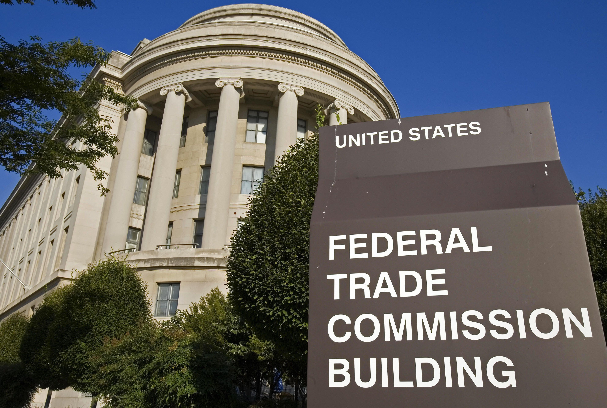

## Table of Contents

## What is the Kansas City Board of Trade (KCBT)?

The Kansas City Board of Trade (KCBT) is a commodity futures and options exchange located in Kansas City, Missouri. It was established in 1856 and is one of the oldest exchanges in the United States. The KCBT is well-known for trading hard red winter wheat, which is a type of wheat grown in the Great Plains region. This exchange helps farmers, traders, and other businesses manage the risks associated with wheat prices by allowing them to buy and sell wheat futures and options.

In addition to wheat, the KCBT also offers futures and options contracts on other agricultural products like soybeans and mini-sized corn. The exchange plays a crucial role in the agricultural industry by providing a platform for price discovery and risk management. This means that it helps set prices for crops and allows people to protect themselves against price changes. In 2012, the KCBT merged with the CME Group, a larger company that operates other major exchanges, but it continues to operate under its own name and focus on its traditional markets.

## When was the Kansas City Board of Trade founded?

The Kansas City Board of Trade was founded in 1856. It is one of the oldest exchanges in the United States. The exchange is located in Kansas City, Missouri.

The KCBT is famous for trading hard red winter wheat, which is a type of wheat grown in the Great Plains. It helps farmers and businesses manage the risks of wheat prices by letting them buy and sell wheat futures and options. In 2012, the KCBT merged with the CME Group, but it still operates under its own name and focuses on its traditional markets.

## What are the primary commodities traded at the KCBT?

The Kansas City Board of Trade, or KCBT, mainly trades hard red winter wheat. This type of wheat is grown in the Great Plains and is important for many people in the farming and food industries. The KCBT helps farmers and businesses by letting them buy and sell wheat futures and options. This means they can protect themselves from big changes in wheat prices.

Besides wheat, the KCBT also trades other farm products like soybeans and mini-sized corn. These are important for farmers and businesses too because they can use the exchange to figure out prices and manage risks. The KCBT has been doing this since it started in 1856, making it one of the oldest exchanges in the United States. Even though it merged with the CME Group in 2012, it still keeps its name and focuses on these key farm products.

## How has the KCBT evolved since its inception?

Since it started in 1856, the Kansas City Board of Trade (KCBT) has changed a lot. At first, it was all about helping farmers and businesses trade hard red winter wheat, which is grown in the Great Plains. Over time, the KCBT added more things to trade, like soybeans and mini-sized corn. This helped more people in the farming world use the exchange to figure out prices and protect themselves from big price changes.

In 2012, the KCBT joined with the CME Group, which is a bigger company that runs other big exchanges. Even after joining, the KCBT kept its name and still focused on its main products, especially wheat. This merger helped the KCBT use new technology and reach more people around the world. Today, the KCBT is still important for the farming industry, helping set prices and manage risks for farmers and businesses.

## What role does the KCBT play in the agricultural industry?

The Kansas City Board of Trade, or KCBT, is really important for farmers and businesses in the farming world. It helps them by letting them trade hard red winter wheat, which is grown in the Great Plains. The KCBT lets farmers and businesses buy and sell wheat futures and options. This means they can protect themselves from big changes in wheat prices. It's like having a safety net for their money.

Besides wheat, the KCBT also trades other farm products like soybeans and mini-sized corn. This helps more people in the farming world use the exchange to figure out prices and manage risks. The KCBT has been doing this since it started in 1856, making it one of the oldest exchanges in the United States. Even though it joined with the CME Group in 2012, it still keeps its name and focuses on helping farmers and businesses in the farming industry.

## What are the main functions and operations of the KCBT?

The Kansas City Board of Trade, or KCBT, helps farmers and businesses in the farming world by letting them trade hard red winter wheat. This wheat is grown in the Great Plains. The KCBT lets them buy and sell wheat futures and options. This means they can protect themselves from big changes in wheat prices. It's like having a safety net for their money. Farmers and businesses can use the KCBT to make sure they don't lose too much money if wheat prices go up or down a lot.

Besides wheat, the KCBT also trades other farm products like soybeans and mini-sized corn. This helps more people in the farming world use the exchange to figure out prices and manage risks. The KCBT has been doing this since it started in 1856, making it one of the oldest exchanges in the United States. Even though it joined with the CME Group in 2012, it still keeps its name and focuses on helping farmers and businesses in the farming industry.

## How does the KCBT contribute to the economy of Kansas City and the surrounding region?

The Kansas City Board of Trade, or KCBT, helps the economy of Kansas City and the surrounding area a lot. It does this by giving farmers and businesses a place to trade hard red winter wheat, which is grown in the Great Plains. This helps set prices for wheat and lets farmers and businesses protect themselves from big changes in wheat prices. When people can trade wheat futures and options at the KCBT, it makes the farming industry more stable. This stability is good for the economy because it helps farmers plan better and businesses make more money.

The KCBT also trades other farm products like soybeans and mini-sized corn. This brings more people to the area to trade, which creates jobs and helps businesses grow. Even though the KCBT joined with the CME Group in 2012, it still keeps its name and focuses on its main products. This keeps the KCBT important for the local economy. The exchange helps make Kansas City a big center for farming and trading, which brings money and growth to the area.

## What are some significant historical events that impacted the KCBT?

The Kansas City Board of Trade, or KCBT, has had a few big events that changed it over time. One important event was in 1856 when the KCBT first started. It was all about helping farmers and businesses trade hard red winter wheat, which is grown in the Great Plains. This was a big deal because it gave people a way to protect themselves from big changes in wheat prices. The KCBT became really important for the farming world and helped make Kansas City a big center for trading.

Another big event happened in 2012 when the KCBT joined with the CME Group. The CME Group is a bigger company that runs other big exchanges. Even after joining, the KCBT kept its name and still focused on its main products, especially wheat. This merger helped the KCBT use new technology and reach more people around the world. It made the KCBT even more important for the farming industry and the economy of Kansas City and the surrounding area.

## How have technological advancements influenced the operations at the KCBT?

Technological advancements have changed the way the Kansas City Board of Trade, or KCBT, works a lot. Before, people had to be in Kansas City to trade hard red winter wheat and other farm products. But now, thanks to computers and the internet, people can trade from anywhere in the world. This means more people can use the KCBT to buy and sell wheat futures and options. It makes the KCBT more useful for farmers and businesses because they can trade whenever they need to, not just when they can get to Kansas City.

The merger with the CME Group in 2012 also brought new technology to the KCBT. The CME Group has a lot of experience with new trading systems and tools. This helped the KCBT use better technology to make trading faster and easier. Now, the KCBT can handle more trades and reach more people. This is good for the farming industry because it helps set prices and manage risks better. It also helps the economy of Kansas City and the surrounding area by bringing more business and jobs.

## What regulatory bodies oversee the activities of the KCBT?

The Kansas City Board of Trade, or KCBT, is watched over by a few different groups to make sure it follows the rules. The main group is the Commodity Futures Trading Commission, or CFTC. The CFTC is a part of the U.S. government that looks after trading in things like wheat, soybeans, and corn. They make sure that the KCBT and other exchanges are fair and honest. This helps protect farmers and businesses who use the KCBT to trade.

Another group that keeps an eye on the KCBT is the National Futures Association, or NFA. The NFA is a group that makes sure people and companies who trade futures and options follow the rules. They check that everyone is doing things the right way and not cheating. Both the CFTC and the NFA work together to make sure the KCBT is a safe and fair place for everyone to trade.

## How does the KCBT compare to other commodity exchanges like the Chicago Board of Trade?

The Kansas City Board of Trade, or KCBT, and the Chicago Board of Trade, or CBOT, are both important places where people trade farm products. The KCBT is famous for trading hard red winter wheat, which is grown in the Great Plains. It helps farmers and businesses by letting them buy and sell wheat futures and options. This means they can protect themselves from big changes in wheat prices. The KCBT also trades other farm products like soybeans and mini-sized corn. It's been around since 1856 and joined with the CME Group in 2012, but it still keeps its name and focuses on its main products.

The Chicago Board of Trade, or CBOT, is also a big place for trading farm products, but it's different from the KCBT in some ways. The CBOT trades a lot of different things, like corn, soybeans, and soft red winter wheat. It's been around since 1848 and is part of the CME Group too. The CBOT is known for being one of the biggest and oldest exchanges in the world. Both the KCBT and CBOT help farmers and businesses manage risks, but they focus on different types of wheat and other products. This makes them both important in their own ways for the farming world.

## What future trends or developments might affect the operations and significance of the KCBT?

The Kansas City Board of Trade, or KCBT, might see big changes because of new technology. More and more, people are using computers and the internet to trade. This means the KCBT needs to keep up with these changes to stay useful for farmers and businesses. They might need to use new tools and systems to make trading faster and easier. This could help the KCBT reach more people around the world and handle more trades. If the KCBT can do this well, it will stay important for the farming world and help the economy of Kansas City and the surrounding area.

Another thing that could affect the KCBT is changes in the farming world. Climate change and new ways of farming might change what kinds of crops people grow and how much they grow. This could mean the KCBT needs to start trading new kinds of farm products or change how it trades the ones it already has. The KCBT might also need to work more with other exchanges and groups to help farmers and businesses manage new risks. If the KCBT can adapt to these changes, it will keep helping the farming industry and stay a big part of the economy in Kansas City and the Great Plains.

## References & Further Reading

[1]: ["The CME Group and its Integration with KCBT"](https://www.cmegroup.com/tools-information/lookups/advisories/clearing/files/Chadv13-027.pdf). CME Group.

[2]: ["History of the Kansas City Board of Trade"](https://pendergastkc.org/articles/kansas-city-board-trade). Kansas City Board of Trade Archive.

[3]: Irwin, S. H., & Good, D. L. (2001). ["The Role of the KCBT in Wheat Price Discovery."](https://webdoc.agsci.colostate.edu/koontz/arec412/Resources/MORR_09-02.pdf) Iowa Ag Review, Iowa State University.

[4]: Tomek, W. G., & Peterson, H. H. (2001). ["Risk Management in Commodities Markets: Cross Hedging."](https://onlinelibrary.wiley.com/doi/abs/10.1002/fut.2004) Review of Agricultural Economics.

[5]: Geman, H. (2005). ["Commodities and Commodity Derivatives: Modelling and Pricing for Agriculturals, Metals and Energy."](https://download.e-bookshelf.de/download/0000/5675/90/L-G-0000567590-0015270354.pdf) John Wiley & Sons.

[6]: Lyons, K. (2013). ["How The CME Group Became The World’s Largest Futures Exchange."](https://www.cmegroup.com/company/history/timeline-of-achievements.html). Forbes.