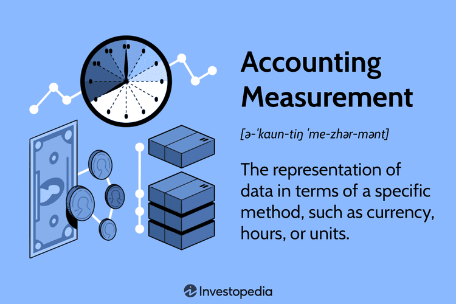

Algorithmic trading represents a synergy of quantitative analysis and technology, where complex statistical models guide the execution of trades, aiming for both speed and precision. It encompasses a broad spectrum of techniques, from high-frequency trading to arbitrage and market making. The objective is to identify patterns or signals that can lead to profitable trades, minimizing human intervention.

An essential component of evaluating and refining trading strategies is the use of robust statistical metrics. Among these, the Kappa statistic stands out for its role in assessing reliability, originally designed for measuring inter-rater agreement. Kappa quantifies the degree of agreement between different raters, accounting for agreements occurring by chance. This capability makes it invaluable in contexts requiring consistency and reliability in decision-making processes.



This article discusses the application of the Kappa statistic within algorithmic trading, emphasizing its importance in verifying the reliability of trading strategies that rely on subjective or complex decision-making processes. The metric helps ensure that performance metrics and trading signals are not only consistent across different market situations but are also not attributable to random chance. Understanding Kappa's role sheds light on its potential to enhance the effectiveness of algorithmic trading strategies.

## Table of Contents

## Understanding Kappa Statistic

Kappa is a statistical measure devised to evaluate the degree of agreement between two or more raters when making categorical assessments. Introduced by Jacob Cohen in 1960, its primary function is to account for the agreement that could occur by chance alone. This is what makes the Kappa statistic a more reliable measure than simple percentage agreement, which does not consider random agreement. The statistic is versatile and applicable when categories being rated are mutually exclusive and exhaustive.

The calculated value of Kappa can range from -1 to +1, where a value of +1 signifies perfect agreement between the raters, a value of 0 indicates agreement no better than chance, and a value of -1 implies perfect disagreement. These values provide a definitive metric for assessing the reliability of raters, especially in instances where human judgment is involved, such as medical diagnosis, quality control, and sentiment analysis.

The formula for calculating Kappa is given by:

$$
\kappa = \frac{P_o - P_e}{1 - P_e}
$$

where $P_o$ is the observed proportionate agreement among raters, and $P_e$ is the expected proportionate agreement by chance. This formula fundamentally assesses the extent to which the observed agreement exceeds chance expectations. High Kappa values indicate strong consensus beyond chance, suggesting that the agreement observed is significantly reliable.

Kappa's robust approach to measuring agreement makes it a preferred method in various research fields. It is particularly useful in situations where the outcome of a decision-making process is influenced by subjective judgment, providing insights into the consistency and reliability of these decisions.

## Significance of Kappa in Algo Trading

Kappa provides a valuable tool for verifying the reliability of trading strategies that incorporate elements of subjective decision-making. In [algorithmic trading](/wiki/algorithmic-trading), where decisions need to adapt dynamically to varying market conditions, the consistency of an algorithm's performance is crucial for sustained success. Kappa can be employed to evaluate how consistently an algorithm executes trades across different market environments, thus serving as a measure of reliability.

Algorithmic traders often design strategies that predict market movements using a vast array of indicators and signals. These signals can sometimes be subjective, relying on historical patterns or trends that may not always repeat. By utilizing the Kappa statistic, traders can quantify the extent to which their algorithms make consistent and reliable predictions rather than fortunate or random decisions.

The Kappa statistic effectively distinguishes between genuine patterns and coincidental occurrences. For example, if a trading strategy shows high profitability during a specific market condition but fails during others, the Kappa value can help assess this inconsistency. A high Kappa value would suggest that the algorithm's decision-making process remains robust across differing market conditions, indicating that the success of trades is not merely due to chance.

Consider a scenario where multiple trading algorithms are tested across diverse market conditions—bull, bear, and sideways markets. Traders can utilize the Kappa statistic to assess which algorithms maintain predictive reliability throughout. A balanced assessment ensures that strategies are adaptable and capable of performing under various conditions, reducing the likelihood of losses during market volatilities.

By applying Kappa, traders effectively make data-driven improvements to their algorithms by identifying patterns that consistently result in profitable trades. This robust evaluation metric aids in refining algorithms and ensuring that the strategies employed are not only theoretically sound but practically applicable in real-world trading situations. Thus, incorporating the Kappa statistic into algorithmic trading models aids in separating successful strategies from those that perform well by mere coincidence, providing a pathway toward more reliable and consistent trading systems.

## How Kappa is Calculated

The calculation of the Kappa statistic involves determining how much the observed agreement between raters exceeds what would be expected by chance alone. The formula for Kappa is given by:

$$
\text{Kappa} = \frac{P_o - P_e}{1 - P_e}
$$

where $P_o$ represents the observed agreement, and $P_e$ denotes the agreement expected by chance. 

To compute $P_o$, you assess the proportion of times the raters agree. For instance, if two raters examine 100 items and agree on 80, then $P_o = 0.80$ or 80%.

The expected agreement $P_e$ is determined by the probabilities of each rater randomly choosing each category. For example, if rater A selects category 1 with a probability of 0.6 and rater B does so with a probability of 0.5, the probability that both raters randomly agree on category 1 is $0.6 \times 0.5 = 0.3$.

Calculating $P_e$ generally requires knowing the distribution of ratings across categories. In a simple binary classification scenario, if both raters classify 60% of items as positive, then $P_e = 0.36$ for the positive category. Summing these probabilities across all categories gives the total expected agreement.

The Kappa value quantifies the proportion of agreement beyond chance, where a value near +1 signifies high agreement, 0 indicates agreement equivalent to chance, and negative values suggest disagreement.

In Python, the Kappa statistic can be computed using the `cohen_kappa_score` function from the `sklearn` library, as shown:

```python
from sklearn.metrics import cohen_kappa_score

# Example rating data
rater1 = [1, 0, 1, 1, 0]
rater2 = [1, 0, 1, 0, 0]

# Calculate Kappa
kappa = cohen_kappa_score(rater1, rater2)
print(f'Kappa: {kappa}')
```

This code snippet calculates the Kappa statistic for two raters' classification data, quantifying the level of agreement beyond chance.

## Applications of Kappa in Algorithmic Strategies

Traders employ the Kappa statistic to rigorously evaluate the impact of different trading signals, striving for consistent strategy performance in the volatile arena of algorithmic trading. This statistical measure assists in determining whether the signals generated by trading algorithms align significantly better than would be expected by random chance. This alignment is crucial, as it ensures that trading strategies are not only effective over isolated instances but also demonstrate robustness and reliability over extended periods and varied market conditions.

By leveraging Kappa, traders can refine their algorithms by pinpointing profitable trading patterns that consistently resonate with successful outcomes. This process involves systematically evaluating the signals using Kappa to separate noise from meaningful patterns. Consequently, traders can incrementally improve their strategies by discarding unprofitable or unreliable signals and focusing on those that exhibit high agreement and predictive power.

Additionally, Kappa is instrumental in analyzing the robustness of strategies when tested across diverse datasets. By comparing the agreement levels across different datasets, traders can ascertain the stability and adaptability of a given strategy. A high Kappa value across multiple datasets indicates that the strategy maintains its predictive ability despite variations in market data. This adaptability is critical for ensuring that strategies remain effective even as market dynamics shift.

The following Python snippet illustrates how Kappa might be integrated into evaluating trading signal reliability:

```python
from sklearn.metrics import cohen_kappa_score

def evaluate_signals(signals, benchmark):
    """
    Evaluate trading signals against a benchmark using the Kappa statistic.

    :param signals: List of signals generated by the trading algorithm.
    :param benchmark: List of benchmark signals for comparison.
    :return: Kappa statistic indicating the level of agreement.
    """
    return cohen_kappa_score(signals, benchmark)

# Example usage
algorithm_signals = [1, 0, 1, 1, 0]  # 1 for buy, 0 for sell
benchmark_signals = [1, 0, 0, 1, 1]

kappa_value = evaluate_signals(algorithm_signals, benchmark_signals)
print(f"Kappa Statistic: {kappa_value}")
```

This code evaluates the agreement between trading signals generated by an algorithm and a predefined benchmark. By calculating the Kappa statistic, traders can quantify the consistency of their trading decisions, supporting a more data-driven approach to refining algorithmic strategies.

## Limitations and Challenges

Kappa statistic, while a valuable tool for assessing agreement and reliability, is subject to several limitations and challenges when applied in algorithmic trading. One of the foundational assumptions of Kappa is that the raters, or decision-making entities, are independent. However, this assumption may not hold true in real-world trading environments. In such cases, algorithmic decisions are often influenced by overlapping data sources and correlated market conditions. This interdependence can lead to inflated Kappa values, potentially misleading traders about the true reliability of their strategies.

Another significant challenge is determining acceptable Kappa thresholds for trading practices. Low Kappa values suggest significant disagreement beyond chance, yet the implications of such findings can vary across different trading contexts. Establishing a universally applicable Kappa threshold is difficult because trading strategies and market dynamics differ widely. Therefore, traders must consider context-specific factors when interpreting Kappa values to ensure accurate strategy assessment.

Practical implementation of Kappa in algorithmic trading necessitates substantial data and computational resources. Evaluating the reliability of trading algorithms requires extensive datasets to capture a comprehensive range of market conditions and potential decision outcomes. Furthermore, the computational demands for calculating Kappa, especially in high-frequency trading environments, can be considerable. Traders often need to optimize their algorithms to efficiently process and analyze data in real-time to leverage the Kappa statistic effectively.

Overall, while Kappa offers valuable insights into strategy reliability, its application in algorithmic trading requires careful consideration of dependencies, context-specific interpretation, and significant data processing capabilities.

## Conclusion

The integration of the Kappa statistic in algorithmic trading strategies plays a pivotal role in enhancing the reliability and consistency of decision-making processes. By offering a quantifiable measure of agreement that accounts for chance, Kappa ensures that trading strategies are assessed with greater precision. This precision is vital in distinguishing genuine trading signals from random occurrences, thereby supporting traders in making more informed decisions.

As the trading landscape evolves, leveraging advanced statistical measures like Kappa becomes increasingly essential for gaining competitive advantages. The complexity of financial markets requires tools that can adapt to fluctuating conditions and provide robust evaluations of trading performance. Kappa offers a means to achieve this, ensuring algorithms are not only effective but also consistently reliable across a variety of market states.

Traders must continuously adapt and refine their approaches to use Kappa effectively in dynamic market environments. This involves not only understanding the statistical underpinnings of Kappa but also integrating it into trading algorithms in a way that complements their existing strategies. By doing so, traders can enhance the robustness of their decision-making frameworks, ultimately leading to improved performance outcomes in an ever-changing market.

The progressive adoption of such statistical measures demonstrates a commitment to rigor and precision, allowing for better detection of profitable patterns and minimizing the influence of random fluctuations. To fully harness the benefits of Kappa, traders should maintain flexibility and openness to iterative development, ensuring their strategies remain at the forefront of innovation and efficacy.

## References & Further Reading

[1]: Cohen, J. (1960). ["A Coefficient of Agreement for Nominal Scales."](https://psycnet.apa.org/record/1960-06759-001) Educational and Psychological Measurement, 20(1), 37-46.

[2]: López de Prado, M. (2018). ["Advances in Financial Machine Learning."](https://www.amazon.com/Advances-Financial-Machine-Learning-Marcos/dp/1119482089) John Wiley & Sons.

[3]: Aronson, D. R. (2007). ["Evidence-Based Technical Analysis: Applying the Scientific Method and Statistical Inference to Trading Signals."](https://onlinelibrary.wiley.com/doi/book/10.1002/9781118268315) John Wiley & Sons.

[4]: Jansen, S. (2020). ["Machine Learning for Algorithmic Trading."](https://github.com/stefan-jansen/machine-learning-for-trading) Packt Publishing.

[5]: Chan, E. P. (2008). ["Quantitative Trading: How to Build Your Own Algorithmic Trading Business."](https://github.com/ftvision/quant_trading_echan_book) John Wiley & Sons.