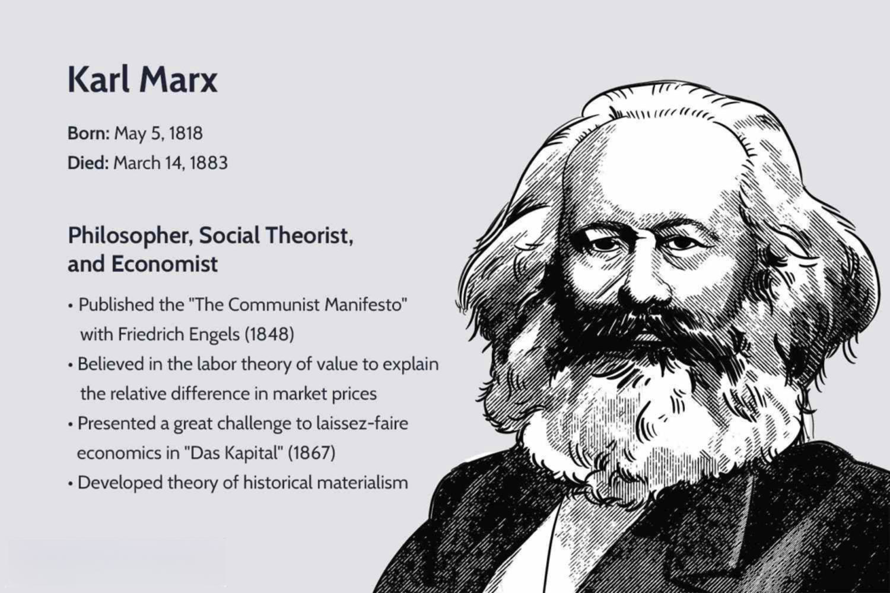

## Table of Contents

## Who was Karl Marx and what was his background?

Karl Marx was a famous thinker and writer who lived from 1818 to 1883. He was born in Germany and spent much of his life studying and writing about how society works, especially about how people earn money and live. Marx came from a middle-class family. His father was a lawyer, and Marx went to good schools. He studied law, history, and philosophy at the University of Bonn and later at the University of Berlin.

Marx's ideas were very important and changed the world. He worked with another thinker named Friedrich Engels, and together they wrote many books. Their most famous book is called "The Communist Manifesto." In this book, they explained their ideas about how workers should control the factories and share the wealth more fairly. Marx also wrote a big book called "Das Kapital," which is about how the economy works. His ideas led to the creation of communism, a way of organizing society that many countries tried to follow.

## What are the most famous books written by Karl Marx?

Karl Marx wrote many books, but two of his most famous ones are "The Communist Manifesto" and "Das Kapital." "The Communist Manifesto" was written in 1848 with Friedrich Engels. It's a short book that explains their ideas about communism. They wanted workers to control the factories and share the wealth more fairly. This book became very important and influenced many people and countries.

The other famous book is "Das Kapital." Marx started writing it in the 1860s, and the first [volume](/wiki/volume-trading-strategy) was published in 1867. This book is much longer and harder to read than "The Communist Manifesto." It's about how the economy works and how capitalists, or the people who own businesses, make money from workers. Marx spent a lot of time studying and writing this book, but he only finished the first volume. Other people finished the rest of the book after he died.

These two [books](/wiki/algo-trading-books) are very important because they explain Marx's ideas about how society and the economy should work. Many people around the world have read them and been influenced by them.

## What is the basic premise of Marxism?

Marxism is a way of thinking about the world that Karl Marx and Friedrich Engels came up with. The basic idea is that history is all about how people struggle over money and power. Marx believed that society is divided into two big groups: the people who own things like factories and businesses, called the bourgeoisie, and the people who work for them, called the proletariat. The bourgeoisie makes money by paying the workers less than what their work is worth. This creates a big problem because the workers are not treated fairly.

Marx thought that this unfairness would lead to a big change. He believed that one day, the workers would get so upset that they would rise up and take control of the factories and businesses. Then, instead of a few people owning everything, everyone would share the wealth more equally. This new way of organizing society is called communism. Marx and Engels wrote about these ideas in "The Communist Manifesto" and "Das Kapital," hoping that their ideas would help make the world a fairer place for everyone.

## How did Karl Marx's theories influence the labor movement?

Karl Marx's theories had a big impact on the labor movement. He believed that workers were treated unfairly and that they should fight for better conditions and more money. Marx's ideas encouraged workers to come together and form unions. These unions helped workers to have more power when they talked to their bosses. They could go on strike and stop working until their bosses agreed to pay them more or treat them better. Many workers around the world used Marx's ideas to make their lives better.

Marx's ideas also helped workers think about bigger changes. He said that one day, workers could take over the factories and run them themselves. This idea inspired many people to work for a world where everyone shares the wealth more equally. In some countries, workers even tried to create a new kind of society based on Marx's ideas. Even though not all of these attempts worked out, Marx's thinking still influences the labor movement today. People continue to use his ideas to fight for fair treatment and better lives for workers everywhere.

## What is the concept of historical materialism according to Marx?

Historical materialism is a big idea from Karl Marx about how history works. He thought that the way people make and use things, like food, clothes, and tools, is the most important thing in history. Marx called this the "base" of society. The base includes things like farming, factories, and machines. He believed that the base shapes everything else in society, including the laws, the government, and even the way people think and feel. According to Marx, when the base changes, like when new machines are invented, the rest of society has to change too.

Marx also thought that the base causes big fights between different groups of people. In his time, he saw a big fight between the people who owned the factories and the people who worked in them. He called the owners the bourgeoisie and the workers the proletariat. Marx believed that these fights over who gets to control the base push history forward. He thought that one day, the workers would win this fight and create a new kind of society where everyone shares the wealth more equally. This idea is called communism. So, historical materialism is about how the way we make things shapes history and leads to big changes in society.

## Can you explain the theory of surplus value as described by Marx?

Karl Marx's theory of surplus value is about how bosses make money from workers. He said that workers create value when they work. For example, if a worker makes a toy, the toy has value because the worker put time and effort into making it. But the boss pays the worker less than the value of the toy. The difference between what the worker gets paid and the value of what they make is called surplus value. The boss keeps this extra value as profit. Marx thought this was unfair because the boss is getting rich from the worker's hard work.

Marx believed that this system of taking surplus value is the main problem in capitalism. He called it exploitation because the workers are not getting paid what their work is really worth. This is why Marx thought workers should rise up and take control of the factories. If they did this, they could keep the surplus value for themselves and share it more fairly. Marx's idea about surplus value helped explain why he thought capitalism was unfair and why he wanted to change it to a system where everyone could benefit more equally.

## How did Marx's ideas contribute to the development of communism?

Karl Marx's ideas were really important for the development of communism. He and his friend Friedrich Engels wrote a book called "The Communist Manifesto" that explained their big ideas. They said that society is split into two groups: the people who own things, like factories, and the people who work in them. Marx thought this was unfair because the owners, called the bourgeoisie, got rich by paying the workers, called the proletariat, less than what their work was worth. He believed that one day, the workers would get so upset that they would rise up and take control of everything. This new way of organizing society, where everyone shares the wealth more equally, is what Marx called communism.

Marx's ideas helped many people around the world understand why they were unhappy with their lives and what they could do about it. His big book, "Das Kapital," explained how the economy works and why the rich keep getting richer while the poor stay poor. This made people think that they needed to change the system. In some countries, like Russia and China, people used Marx's ideas to start revolutions and try to build communist societies. Even though these attempts didn't always work out the way Marx hoped, his ideas still influence people today who want to make the world a fairer place for everyone.

## What was Marx's view on capitalism and its inherent contradictions?

Karl Marx thought that capitalism was a system where people who own businesses, called capitalists, make money by paying workers less than what their work is worth. He called this extra money that the capitalists keep "surplus value." Marx believed that this was unfair because the workers were not getting paid what they deserved. He saw capitalism as a system that made the rich richer and the poor poorer. Marx thought that this unfairness would cause big problems and fights between the rich and the poor.

Marx also believed that capitalism had big problems inside it, which he called contradictions. One big contradiction was that capitalists always want to make more money, so they try to pay workers less and make them work harder. But if workers don't have enough money to buy things, then businesses can't sell their products. This can lead to a crisis where the economy stops working well. Marx thought that these contradictions would make capitalism fall apart and that workers would then take over and create a new, fairer system called communism.

## How have Marx's economic theories been critiqued by modern economists?

Modern economists have critiqued Karl Marx's economic theories in several ways. One big criticism is about his idea of surplus value. Many economists say that Marx's view of how value is created is too simple. They argue that value comes from more than just the work that people do. Things like technology, how well businesses are run, and what people want also matter. These economists think that Marx didn't understand how complex the economy really is. They also say that his idea that workers are always paid less than what their work is worth doesn't always hold true in the real world.

Another critique is about Marx's prediction that capitalism would fail because of its own problems. Many modern economists point out that capitalism has changed a lot since Marx's time. They say that things like better laws, unions, and government help have made capitalism more fair and stable. These changes have helped to fix some of the problems Marx talked about. Also, many countries that tried to follow Marx's ideas and become communist didn't do well. This has made some economists think that Marx's ideas about how to fix the economy might not work in practice.

## What role did Marx's theories play in the Russian Revolution of 1917?

Karl Marx's theories were very important in the Russian Revolution of 1917. People in Russia, especially workers and soldiers, were unhappy with the way things were. They were influenced by Marx's ideas about how workers should take control and share the wealth more fairly. Leaders like Vladimir Lenin used Marx's ideas to start a revolution. They wanted to overthrow the old government and create a new society based on communism, where everyone would be equal.

The revolution happened in two parts. First, in February 1917, people got rid of the Tsar, the king of Russia. Then, in October, Lenin and his followers, called the Bolsheviks, took over. They used Marx's ideas to explain why they needed to change everything. They said that workers and peasants should run the country, not rich people. Marx's theories helped them believe that a better world was possible if they worked together to make it happen.

## How have Marx's ideas been adapted or reinterpreted in contemporary political movements?

Marx's ideas are still important today and have been used by many different groups. Some people who want to change the world and make it fairer use Marx's ideas about how workers should have more power and share the wealth. These groups often focus on fighting against big businesses and rich people who they think control too much. They might organize protests or strikes to push for better pay and working conditions. In some places, like Latin America, leaders have used Marx's ideas to try to help poor people and make society more equal.

Other groups have taken parts of Marx's ideas and mixed them with new ways of thinking. For example, some people who care about the environment use Marx's ideas to talk about how capitalism hurts the planet. They say that businesses that want to make more money don't care about nature. These groups want to change the economy so that it is kinder to the earth. Also, some thinkers today use Marx's ideas to talk about other kinds of unfairness, like racism and sexism. They believe that these problems are connected to how money and power work in society, and they want to fix them by changing the system.

## What is the global impact of Marx's work on social sciences and philosophy?

Karl Marx's work has had a huge impact on social sciences and philosophy all over the world. His ideas about how society works and how people should live have influenced many different fields, like economics, sociology, and political science. Marx's big idea of historical materialism, which says that how people make and use things shapes history, has changed how people study societies. This idea has made social scientists think more about how the economy affects everything else in life, like laws, government, and even the way people think.

Marx's theories have also been very important in philosophy. His idea that history is all about fights over money and power has made people think differently about how societies change. Philosophers have used Marx's ideas to talk about big questions, like what makes a society fair and how people can live together in a better way. Even though not everyone agrees with Marx, his work has started many important conversations and debates. Many thinkers today still use Marx's ideas to understand and try to fix problems in the world.

## References & Further Reading

[1]: Marx, K. (1867). ["Capital: Critique of Political Economy, Volume 1"](https://www.marxists.org/archive/marx/works/download/pdf/Capital-Volume-I.pdf) Swan Sonnenschein, Lowrey, & Co.

[2]: Lopez de Prado, M. (2018). ["Advances in Financial Machine Learning"](https://books.google.com/books/about/Advances_in_Financial_Machine_Learning.html?id=oU9KDwAAQBAJ) Wiley.

[3]: Aronson, D. (2006). ["Evidence-Based Technical Analysis: Applying the Scientific Method and Statistical Inference to Trading Signals"](https://www.amazon.com/Evidence-Based-Technical-Analysis-Scientific-Statistical/dp/0470008741) Wiley.

[4]: Jansen, S. (2020). ["Machine Learning for Algorithmic Trading"](https://github.com/stefan-jansen/machine-learning-for-trading) Packt Publishing.

[5]: Chan, E. P. (2009). ["Quantitative Trading: How to Build Your Own Algorithmic Trading Business"](https://github.com/ftvision/quant_trading_echan_book) Wiley.

[6]: Marx, K. (1844). ["Economic and Philosophic Manuscripts of 1844"](https://www.marxists.org/archive/marx/works/download/pdf/Economic-Philosophic-Manuscripts-1844.pdf) Marxists Internet Archive.