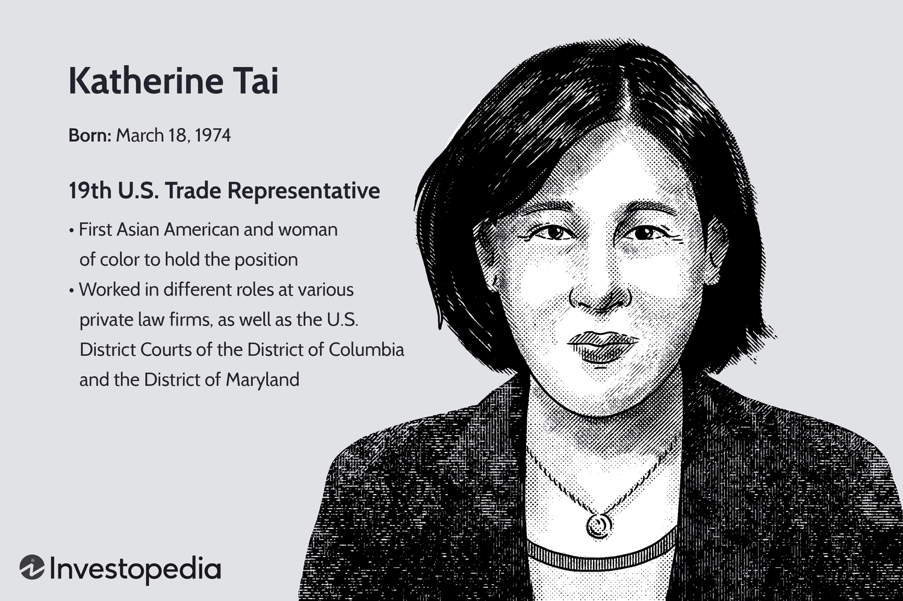

Katherine Tai serves as a significant force in international trade, having been appointed as the 19th U.S. Trade Representative. Her professional journey is characterized by noteworthy achievements in crafting trade policy and engaging in economic diplomacy. Throughout her career, Tai has navigated complex international relations, leveraging her expertise to shape policies that influence global trade practices. This article provides a comprehensive overview of her educational background, detailing her formative years and academic accomplishments, along with her subsequent professional career. Furthermore, it examines her impact on algorithmic trading, a sector increasingly influenced by the paradigm shifts in trade regulations and market dynamics instigated by her policies. 

## Table of Contents



## Early Life and Education

Katherine Chi Tai, known for her illustrious career in international trade, was born on March 8, 1974, in Connecticut. Her educational journey laid a solid foundation for her future accomplishments. She attended Yale University, where she graduated with a Bachelor's degree in 1996. During her time at Yale, Tai likely engaged in a diverse curriculum that honed her critical thinking and analytical skills, attributes essential for her later work in trade policy and law.

Following her undergraduate studies, Tai pursued a legal education at Harvard University, one of the most prestigious law schools in the United States. She earned her Juris Doctor degree from Harvard in 2001. At Harvard, Tai would have immersed herself in rigorous legal training, preparing her for the complexities of international law and trade negotiations. Her education at these Ivy League institutions provided her with the intellectual and practical tools necessary to navigate and influence the multifaceted world of international trade and economic diplomacy.

## Professional Career

Katherine Tai's professional journey began after she completed her Juris Doctor degree at Harvard University in 2001. Initially, she gained valuable legal experience by clerking for various U.S. District Courts, an opportunity that allowed her to understand the intricacies of judicial proceedings and the application of law in federal courts. This foundation proved beneficial as she transitioned into private practice, working with several law firms where she broadened her expertise in legal and regulatory matters.

In 2007, Tai embarked on a significant career shift by joining the Office of the United States Trade Representative (USTR) as associate general counsel. In this capacity, she was tasked with providing legal advice on trade agreements, negotiations, and enforcement. Her role involved scrutinizing the legal frameworks governing international trade, ensuring compliance with U.S. trade laws, and representing American interests in various trade forums.

Her expertise and dedication to trade policy led to her appointment as the Chief Counsel for China Trade Enforcement in 2011. In this role, Tai managed complex trade disputes between the United States and China, addressing issues related to intellectual property rights and unfair trade practices. Her work focused on enforcing existing trade agreements and advocating for fair competition, which often involved coordinating with international trade organizations and negotiating with foreign governments. Tai's leadership in this position significantly influenced the U.S.'s trade stance with China, contributing to the resolution of several high-profile trade disputes.

Tai's career trajectory highlights a progression through increasing levels of responsibility and specialization in trade law and policy, culminating in her significant contributions to U.S.-China trade relations. Her background and experience have shaped her approach to trade enforcement, emphasizing legal rigor and negotiation skills to safeguard U.S. economic interests.

## Role as U.S. Trade Representative

Appointed by President Joe Biden, Katherine Tai assumed the role of U.S. Trade Representative in 2021, marking her as the first Asian-American and the first woman of color to hold this position. Her responsibilities encompass the development and implementation of U.S. international trade policy, where she is charged with representing American interests in trade negotiations globally. In this capacity, Tai operates as the principal advisor to the President on international trade issues and acts as the pivotal spokesperson on these matters.

Her tenure as U.S. Trade Representative is characterized by a focus on building and enforcing resilient trade policies that address modern economic challenges. This involves not only securing beneficial trade agreements but also ensuring enforcement of these agreements to uphold American economic interests. One of her significant tasks includes managing the intricate trade relations with China, a major trading partner, which has implications for global economic stability and growth.

Tai's role demands a keen understanding of complex international economic environments to negotiate trade deals that bolster the U.S. economy. This includes modernizing trade agreements to reflect current technological advancements and addressing the needs of a diverse range of stakeholders, from small businesses to multinational corporations. Her strategy often involves a balanced approach, fostering open markets while ensuring fair competition and worker protection.

Additionally, Tai is tasked with coordinating with other U.S. governmental agencies and international bodies to shape policies that align with broader economic objectives, such as sustainability and ethical labor standards. A crucial aspect of her role involves the ongoing evaluation and re-negotiation of existing trade agreements to better serve American interests in an ever-evolving global market.

Under Tai's leadership, the Office of the U.S. Trade Representative (USTR) is pivotal in crafting policies that not only aim to stimulate economic growth but also project American values and standards on the international stage. Her work continues to play a critical role in defining the future of U.S. engagement with the global economy.

## Influence on Algorithmic Trading

Algorithmic trading involves using computer algorithms to conduct financial transactions automatically, based on pre-set parameters such as timing, price, or [volume](/wiki/volume-trading-strategy). This form of trading thrives on the precision and speed that algorithms can offer, making it crucially dependent on stable and predictable market conditions. Katherine Tai's role as the U.S. Trade Representative introduces a layer of complexity to [algorithmic trading](/wiki/algorithmic-trading), particularly through her influence on trade policies and tariffs.

Tai's trade policies can significantly impact the dynamics of algorithmic trading by altering market conditions and regulatory environments. Trade agreements, tariffs, and disputes are pivotal elements that affect market stability, influencing [liquidity](/wiki/liquidity-risk-premium), [volatility](/wiki/volatility-trading-strategies), and transaction costs. For instance, a sudden increase in tariffs on goods from China could disrupt supply chains, impacting stock prices and commodities linked to those goods. This disruption can lead to increased volatility in financial markets, which algorithmic systems must [factor](/wiki/factor-investing) into their transaction strategies to mitigate risks and optimize performance.

Key decisions made by Tai, such as the imposition of trade tariffs, particularly in relation to China, hold far-reaching consequences for global markets. When tariffs are raised, the cost of imported goods increases, which can affect the profitability and valuation of companies dependent on those goods. For algorithmic trading, this means algorithms need to quickly integrate new pricing data and adjust their trading strategies to maintain profitability. For example, a Python-based trading algorithm might need real-time data inputs to adapt its buy or sell decisions:

```python
import pandas as pd
import numpy as np
from datetime import datetime

# Example of a simplified algorithmic trading strategy
def trading_strategy(current_price, trade_tariff_factor):
    # Adjust strategy based on trade tariff implications
    adjusted_price = current_price * trade_tariff_factor
    if adjusted_price > current_price:
        return "Sell"
    else:
        return "Buy"

# Simulate a scenario
current_price = 100  # Example current price
trade_tariff_factor = 1.05  # Example increase due to tariffs
decision = trading_strategy(current_price, trade_tariff_factor)
print("Trading Decision:", decision)
```

This level of flexibility and adaptability is crucial as Tai's negotiation strategies and policy implementations evolve. Since markets are highly sensitive to geopolitical shifts and policy announcements, algorithmic trading systems must be capable of rapid response to safeguard against potential financial losses or capitalize on emergent opportunities.

In summary, Katherine Tai’s decisions as the U.S. Trade Representative substantially influence algorithmic trading by modifying the market conditions necessary for its effective operation. Her stance on international trade, especially with respect to tariffs and agreements with major economies like China, can reshape financial landscapes, compelling algorithmic trading models to adjust swiftly and accurately to new economic realities.

## Conclusion

Katherine Tai's career demonstrates a harmonious blend of education, diplomacy, and strategic leadership. As the U.S. Trade Representative, her decisions wield substantial influence not only on traditional trade policies but also on emerging financial technologies, including algorithmic trading. Her ability to balance nuanced international trade relations with technological advancements signifies a pivotal role in the evolving landscape of global commerce. By actively engaging in critical negotiations and policy-making, Tai shapes economic strategies that impact global supply chains, market access, and trade regulations. Her focus on fair trade practices and sustainable economic growth reflects her commitment to fostering a balanced and equitable global trading system. As she navigates the complexities of international relations, her leadership continues to be instrumental in defining the future trajectories of global trade and economic diplomacy.

## References & Further Reading

[1]: ["Advances in Financial Machine Learning"](https://www.amazon.com/Advances-Financial-Machine-Learning-Marcos/dp/1119482089) by Marcos Lopez de Prado

[2]: ["Machine Learning for Algorithmic Trading"](https://github.com/stefan-jansen/machine-learning-for-trading) by Stefan Jansen

[3]: ["Quantitative Trading: How to Build Your Own Algorithmic Trading Business"](https://www.amazon.com/Quantitative-Trading-Build-Algorithmic-Business/dp/1119800064) by Ernest P. Chan

[4]: Graham, E. M., & Krugman, P. R. (1993). ["The Surge in Foreign Direct Investment in the 1980s."](https://www.nber.org/system/files/chapters/c6532/c6532.pdf) In D. B. Audretsch & M. P. Feldman (Eds.), The Global Economy.

[5]: Goodman, Matthew P. (2021). ["Resetting U.S.-China Trade Relations."](https://www.cfr.org/expert/matthew-p-goodman) Center for Strategic and International Studies.