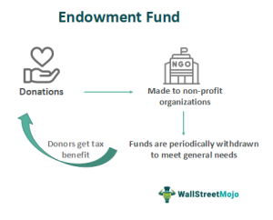

Kazakhstan's economic management landscape is being increasingly defined by innovative financial strategies, prominently featuring the Kazakhstan National Fund and the expansion of algorithmic trading. These instruments are pivotal in maintaining economic stability, particularly in the face of the country's fluctuating commodity prices, which are primarily driven by its extensive reliance on natural resources like oil, gas, and minerals. The Kazakhstan National Fund acts as a buffer, mitigating the adverse impacts of volatile market conditions by accumulating surplus revenues from taxes related to the oil and gas sector. This financial cushion is crucial in smoothing government expenditure and maintaining fiscal discipline during periods of economic uncertainty.

Meanwhile, algorithmic trading is emerging as a significant component of Kazakhstan's financial strategy, notably through initiatives like the SBI Adamant Fund. This approach utilizes complex algorithms to manage portfolio risks effectively, incorporating diverse asset classes such as the S&P 500 Index, gold, and US Treasury bonds. The employment of algorithmic strategies in trading not only aims at enhancing returns but also seeks to minimize potential losses during periods of market volatility, thereby contributing to the broader stability of Kazakhstan's financial systems.



The intersection of such diversification in economic strategies presents both opportunities and challenges for Kazakhstan's future economic landscape. While the strategic use of the National Fund and algorithmic trading offers a pathway to economic stabilization and growth, it also necessitates robust management and governance frameworks. Effective oversight will ensure that these financial instruments are leveraged to their fullest potential, providing long-term benefits and reducing economic vulnerabilities. As Kazakhstan continues to navigate its economic journey, the balance between innovation and regulation will be crucial in shaping a sustainable economic future.

## Table of Contents

## Understanding the Kazakhstan National Fund

The Kazakhstan National Fund, established in 2000, serves as the country’s sovereign wealth fund, playing a crucial role in stabilizing the nation's economy. This fund is operated by the National Bank of the Republic of Kazakhstan and is strategically designed to mitigate the adverse effects of volatile commodity prices, particularly those of oil, gas, and minerals. The primary purpose of the fund is to act as a financial buffer against the unpredictability of global markets, thereby supporting Kazakhstan's economic stability.

A significant feature of the Kazakhstan National Fund is its reliance on surplus revenues derived from taxes on oil and gas development. Given Kazakhstan’s substantial natural resources, revenues from this sector can be substantial, but also highly variable due to fluctuating global prices. As a stabilization fund, the National Fund ensures that the government can maintain consistent fiscal policy and social spending even during periods of low commodity prices.

The fund operates on the principle of saving during times of high commodity prices and providing support when prices fall. This functionality helps smooth out economic cycles and reduce the exposure of Kazakhstan's economy to external shocks. The National Fund's management involves careful strategic planning to maintain the balance between saving for future generations and addressing present economic challenges.

Operating as a long-term investment vehicle, the Kazakhstan National Fund helps ensure that the benefits from Kazakhstan’s natural resources can contribute to the nation’s prosperity over time. This involves prudent management of the assets, investing in a diversified portfolio, and adhering to robust governance practices to ensure that the fund fulfills its mandate effectively.

## Algorithmic Trading and Its Role in Economic Management

Algorithmic trading in Kazakhstan has recently garnered attention, significantly propelled by the establishment of the SBI Adamant Fund managed by SkyBridge Invest. This fund is a noteworthy development as it utilizes algorithmic strategies aimed at enhancing portfolio risk management. The core of these strategies involves diversification across various asset classes, notably including the S&P500 Index, Gold, and US Treasury bonds.

The primary objective of [algorithmic trading](/wiki/algorithmic-trading) is to optimize trading efficiency by automating decisions and minimizing human intervention. Algorithms can quickly analyze large datasets and execute trades at high speed and frequency, a capability instrumental in capitalizing on fleeting market opportunities and mitigating risks during periods of [volatility](/wiki/volatility-trading-strategies).

The integration of algorithmic trading into Kazakhstan's economic management framework is strategically significant. It offers dual benefits: the potential for substantial returns and the ability to minimize losses during market fluctuations. Implementing algorithmic strategies allows investors and fund managers to attain a balanced and diversified investment portfolio, which is crucial for navigating the uncertainties of financial markets.

Furthermore, algorithmic trading systems are designed to respond promptly to changes in market conditions. They employ techniques like statistical [arbitrage](/wiki/arbitrage), [momentum](/wiki/momentum) trading, and mean reversion among others, to make informed trading decisions. An example of a simple moving average crossover trading strategy in Python might look like this:

```python
import pandas as pd
import numpy as np

# Load market data (e.g., S&P 500 index prices)
data = pd.read_csv('sp500_data.csv')
data['SMA_50'] = data['Close'].rolling(window=50).mean()
data['SMA_200'] = data['Close'].rolling(window=200).mean()

# Generate buy/sell signals
data['Signal'] = np.where(data['SMA_50'] > data['SMA_200'], 1, 0)
data['Position'] = data['Signal'].diff()

# Display trading positions
print(data[['Date', 'Position']].dropna())
```

By employing such strategies, the algorithmic trading systems can operate continuously, leveraging small price discrepancies and executing trades in fractions of a second. This capacity for rapid response is particularly advantageous in volatile markets, where swift execution can make a significant difference.

Overall, while algorithmic trading presents a promising opportunity for economic optimization in Kazakhstan, it necessitates precise calibration and oversight. Ensuring robust risk management and compliance with regulatory frameworks will be essential to harness its full potential while safeguarding against systemic risks associated with high-frequency trading activities.

## Implications and Challenges of Fund Transfers

Kazakhstan's reliance on the National Fund to support its budget and finance social expenditures has become a significant point of discussion among economists and policymakers. The National Fund was envisioned as a mechanism to stabilize the country's economy, primarily from fluctuations in global oil prices. However, the increasing use of the Fund to cover budgetary shortfalls has raised concerns over the sustainability of such practices.

Critics argue that the heavy dependence on the National Fund for funding government deficits and social spending can lead to economic instability. This dependency underlines a lack of diversification in revenue sources, which poses a risk should the Fund's assets dwindle significantly due to persistent withdrawals. The frequent transfer of funds to cover immediate budgetary needs could impair the Fund's ability to serve its primary purpose of cushioning the economy against external shocks.

Governance and transparency issues concerning fund transfers further amplify these challenges. There are concerns about the opaque nature of some transactions and the lack of stringent oversight mechanisms. Legal disputes related to the Fund have occasionally surfaced, revealing gaps in the regulatory framework governing these financial flows. Such issues might erode public trust in how the Fund is managed and used.

Experts advise tightening the rules surrounding fund withdrawals to safeguard the National Fund's integrity. Such measures may include implementing stricter fiscal policies to minimize the reliance on the Fund for recurrent expenditure. This could entail placing caps on annual withdrawals or establishing more rigorous criteria for justifying withdrawals.

Furthermore, enhancing transparency in fund management is critical. This could involve regular audits by independent bodies and publishing detailed reports on fund inflows, outflows, and investment performance. By fostering an environment of openness and accountability, Kazakhstan can address governance concerns and ensure that the National Fund remains a robust tool for economic stability.

In summary, while the National Fund has been pivotal in maintaining economic equilibrium, its current use for budgetary support raises sustainability concerns. By instituting stricter withdrawal regulations and enhancing management transparency, Kazakhstan could better safeguard its economic future.

## Government Strategies for Sustainable Economic Management

The government of Kazakhstan has implemented several strategies to ensure sustainable economic management, focusing on reducing the strain on the National Fund and promoting diversified economic growth. A key component of these strategies is the limitation of withdrawals from the National Fund. By consolidating budget expenditures, the government aims to maintain the fund’s primary purpose of stabilizing the economy against price fluctuations in oil, gas, and minerals, its primary sources of revenue.

One notable approach is the introduction of fiscal rules designed to control the extent of fund transfers. These rules are established to prevent excessive withdrawals that could jeopardize the fund’s long-term stability and capacity as a financial buffer. Through these regulations, the government intends to safeguard the economic future of the nation by ensuring that the fund is used judiciously and only when absolutely necessary.

In tandem with these fiscal restrictions, Kazakhstan has introduced new tax codes intended to streamline tax administration and increase governmental revenue streams. Enhanced tax administration is expected to improve compliance and efficiency, thereby reducing the reliance on the National Fund for budgetary support. By optimizing tax collection mechanisms, the government seeks to develop a more self-sustaining fiscal policy.

Efforts to diversify the economy form another critical pillar of Kazakhstan’s sustainable economic strategy. The government's objective is to diminish the nation’s heavy dependence on oil revenues by promoting investment in other sectors such as agriculture, manufacturing, and services. Diversification is vital not only for broadening the economic base but also for generating stable revenue streams that can mitigate the impacts of volatile oil markets.

The combination of these strategies reflects a comprehensive approach to fostering a resilient economy. By limiting National Fund withdrawals, enforcing fiscal rules, optimizing tax systems, and pursuing economic diversification, Kazakhstan aims to achieve a balanced financial environment that can support long-term growth and stability.

## Conclusion

The Kazakhstan National Fund and the rise of algorithmic trading stand as critical components of the nation's economic strategy. The National Fund, established in 2000, acts as a financial buffer against the volatile nature of global commodity prices, particularly those related to oil and gas. Its role in stabilizing the economy underscores the importance of rigorous governance and transparency in fund management. Similarly, algorithmic trading, such as the strategies employed by the SBI Adamant Fund, offers a modern approach to portfolio risk management and market stability.

Despite their potential benefits, both the National Fund and algorithmic trading require meticulous oversight to ensure they fulfill their roles effectively. Challenges such as excessive reliance on the National Fund for budgetary needs highlight the necessity for stringent regulations and fiscal discipline. Without careful management, the benefits offered by these financial instruments could be undermined by poor governance or mismanagement.

Looking forward, Kazakhstan's economic resilience will heavily depend on its ability to implement effective governance and policy frameworks. Diversifying the economy away from its current dependence on oil revenues is pivotal. Ensuring robust financial regulations and enhancing transparency in fund management will also be key to maximizing the long-term benefits of these financial strategies. By addressing these challenges, Kazakhstan can solidify its economic foundation and ensure sustainable growth in the face of global economic uncertainties.

## References & Further Reading

[1]: Calderón, C., Duncan, R., & Schmidt-Hebbel, K. (2004). ["The Role of Sovereign Wealth Funds in Promoting Savings and Investment in Resource-Dependent Countries."](https://ideas.repec.org/top/old/2411/top.person.anbcites.html) World Economic Forum.

[2]: Aizhan Yessengeldin, Tolesh Yessengeldin, & Kuanyshbek Madenov. (2020). ["The Role of Algorithmic Trading in the Financial Market of Kazakhstan."](https://www.ccsenet.org/journal/index.php/ijef/article/view/74079) International Journal of Economics and Finance, 12(5), 1-10.

[3]: Lopez de Prado, M. (2018). ["Advances in Financial Machine Learning"](https://www.amazon.com/Advances-Financial-Machine-Learning-Marcos/dp/1119482089). Wiley.

[4]: National Bank of the Republic of Kazakhstan. ["About the National Fund of the Republic of Kazakhstan."](https://nationalbank.kz/en)

[5]: Vivian, A., & Zheng, W. (2020). ["Algorithmic Trading: A Summary of the Literature."](https://tennistonic.com/head-to-head-compare/Vivian-Yang-Vs-Amanda-Anisimova/) Decisions in Economics and Finance, 43, 747–775.