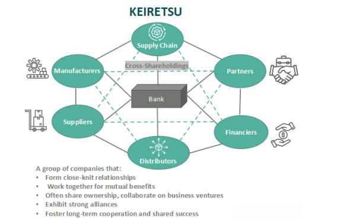

In this article, we explore the interplay between Keiretsu, the unique Japanese business network model, and the modern world of algorithmic trading. Keiretsu, with its intricate framework of interconnected corporate relationships, has been a fundamental pillar of Japan's economic resilience and industrial strength. These conglomerates consist of various companies collaborating while maintaining their independence, enabling them to secure competitive advantages and foster economic stability. They embody a strategic combination of cooperation and competition, ensuring resource sharing and efficient market positioning.

On the other hand, algorithmic trading, often referred to as 'algo trading,' employs sophisticated algorithms to execute trades with high speed and precision in financial markets. This technology-driven approach optimizes trading strategies using data analytics, reducing human error and increasing efficiency. Such advancements represent the forefront of financial innovation, continually pushing the boundaries of market operations through automation and data-driven decision-making processes.



The interaction between Keiretsu and algorithmic trading suggests intriguing possibilities where traditional corporate structures and cutting-edge financial methodologies might complement each other in the global business environment. As Japan continues to embrace technological advancements, understanding how these distinct systems can intersect and potentially drive each other's growth is vital for strategic development. This dialogue between the enduring strengths of Keiretsu networks and the transformative power of algorithmic trading offers new avenues for enhancing corporate strategies and maintaining competitiveness in a rapidly evolving economic landscape.

## Table of Contents

## Understanding Keiretsu

Keiretsu is a Japanese term that defines a distinctive business structure characterized by a conglomeration of enterprises working in close harmony while maintaining their independence. This network typically comprises a variety of entities, including manufacturers, suppliers, and occasionally financial institutions, creating a symbiotic ecosystem that enhances collective strength and competitiveness. 

The formation of keiretsus can be traced back to the post-World War II era when Japan sought to dismantle the powerful zaibatsu conglomerates that had dominated its pre-war economy. The objective was to prevent excessive concentration of economic power and promote more equitable industrial development. Consequently, keiretsus emerged as a replacement, not as monolithic corporations but as flexible associations of allied businesses.

Keiretsus have played a pivotal role in Japan's economic resurgence and industrialization by fostering an environment of collaboration and mutual support. Each company within a keiretsu remains legally independent, maintaining its own management and financial integrity. Nevertheless, these companies engage in shared strategic planning, collective decision-making, and the exchange of resources. This interconnectedness enables them to collectively optimize operations in areas such as procurement, distribution, and innovation.

The structure of keiretsus provides several strategic advantages. By coordinating efforts among network members, companies can achieve economies of scale, reduce redundancies, and enhance productivity. The support within the network also facilitates access to capital, as banks within a keiretsu are often more willing to provide favorable financial terms to fellow network members. This financial backing can be crucial during times of economic uncertainty or when pursuing ambitious projects.

However, the keiretsu model is not without challenges. The close-knit nature of these networks can sometimes lead to inefficiencies by shielding companies from external competition, reducing the incentive to innovate or streamline operations. Yet, despite these potential downsides, the keiretsu system remains a vital component of Japan's economic framework, demonstrating the enduring power of cooperation and strategic alliance in a complex global market.

## Types of Keiretsu

Keiretsu, a vital model for Japanese corporate structure, can be broadly categorized into two types: horizontal and vertical. Each type serves distinct economic functions and aligns with Japan’s unique industrial organization.

Horizontal keiretsus, often referred to as financial keiretsus, consist of diverse companies across various industries that are typically centered around a major financial institution. This bank plays a pivotal role by offering financial support and fostering economic stability within the group. These networks feature interlocking business relationships and shared stock holdings, which enhance mutual trust and collaborative strategies among member companies. The central bank in a horizontal keiretsu not only provides financial services but also acts as an arbitrator and influencer for corporate decisions, ensuring a harmonious alignment across different sectors. This setup allows for diversified risk management and promotes innovation by pooling resources and knowledge from varied industries.

Vertical keiretsus, on the other hand, focus on streamlining production processes by aligning manufacturers, suppliers, and distributors under a cohesive network. This type of keiretsu is integral to the efficiency and competitive advantage of Japanese manufacturing firms. Through vertical integration, these networks achieve significant cost reductions and enhance product quality by minimizing transaction costs and synchronizing supply chain operations. A prime example of a vertical keiretsu is Toyota, renowned for its integrated supply chain and production system known as the "Toyota Production System." This system epitomizes the advantages of close cooperation among different production levels, from raw material sourcing to product delivery, resulting in improved process efficiency and minimized waste.

In essence, both horizontal and vertical keiretsus leverage close-knit corporate relationships to achieve strategic economic goals, albeit through different pathways. Horizontal keiretsus offer financial security and risk diversification, while vertical keiretsus optimize production efficiency and cost-effectiveness. These structures underscore the adaptability and enduring strengths of the keiretsu model in Japan's economic landscape.

## The Pros and Cons of Keiretsu

Keiretsus offer several advantages that have contributed to their prominence in the Japanese economy. One significant benefit is the reduction of competition among network members, as these affiliated companies often collaborate rather than compete. This collaboration can lead to improved efficiencies in operations such as procurement and distribution, as resources are shared and coordinated across the network. Moreover, keiretsus often have secure access to capital, primarily due to their connections with major banks within the network. This financial support allows for stability and potential growth, providing member companies with the assurance of funds when needed.

However, keiretsus are not without their disadvantages. One potential pitfall is inefficiency that might arise due to limited external competition. The absence of market pressure can lead to complacency among member companies, resulting in suboptimal performance. Additionally, the strong interconnections within a keiretsu may prompt risky business decisions. These decisions are often influenced by the ready availability of financial resources from the network's banks, potentially encouraging over-leveraging or inadequate risk assessments. 

Overall, while keiretsus foster collaboration and provide financial security, they also pose challenges that require careful management to prevent inefficiencies and mitigate risks. Balancing these pros and cons is crucial for the sustainable operation of keiretsu networks in the evolving economic landscape.

## Keiretsu and Algorithmic Trading

Algorithmic trading, commonly known as 'algo trading,' harnesses the power of sophisticated algorithms to execute trades with speed and precision that surpasses human capabilities. These algorithms are designed to monitor market conditions, identify trade opportunities, and execute orders in milliseconds. The potential for keiretsus to integrate these advanced trading strategies is vast, given their complex webs of relationships across various industries and financial institutions.

Keiretsus, with their interconnected networks, stand to gain significantly by adopting [algorithmic trading](/wiki/algorithmic-trading) strategies. One of the primary benefits is the optimization of financial operations. By utilizing algorithms, keiretsus can streamline their trading activities, leading to more efficient capital allocation and improved [liquidity](/wiki/liquidity-risk-premium) management. Furthermore, algorithmic trading can provide valuable investment insights, enabling these corporate networks to make informed decisions based on data-driven predictions and market analyses.

The implementation of algorithmic trading within keiretsus is also likely to enhance their market presence. Leveraging the vast financial resources available within their networks, keiretsus can employ algorithms to identify and capture emerging opportunities in the financial markets. This not only boosts their competitive edge but also ensures that they remain agile and responsive to market shifts.

Additionally, the integration of algo trading can streamline risk management practices within keiretsus. Advanced analytics tools and [machine learning](/wiki/machine-learning) technologies can process vast amounts of data to identify potential risks and predict market movements with high accuracy. This predictive capability is crucial for keiretsus, enabling them to mitigate potential financial risks before they materialize. By embedding machine learning into their trading systems, they can dynamically adapt their strategies based on real-time insights, enhancing their resilience against market [volatility](/wiki/volatility-trading-strategies).

To illustrate, consider the equation used in predictive risk models:

$$
R_t = \alpha + \beta_1 X_{1t} + \beta_2 X_{2t} + \ldots + \beta_n X_{nt} + \epsilon_t
$$

where $R_t$ is the return at time $t$, $\alpha$ represents the intercept, $X_{1t}, X_{2t}, \ldots, X_{nt}$ are the predictor variables at time $t$, $\beta_1, \beta_2, \ldots, \beta_n$ are the coefficients, and $\epsilon_t$ is the error term. By continuously refining such models with machine learning, keiretsus can effectively anticipate and counteract potential market disruptions.

In summary, keiretsus stand to gain considerably by embracing algorithmic trading. The synergies between traditional Japanese business networks and cutting-edge financial technologies promise a future where keiretsus can sustain their economic influence while navigating the complexities of modern financial markets with increased efficiency and adaptability.

## Case Studies and Examples

Mitsubishi, a prominent member of a well-established keiretsu, serves as an illustrative case of how advanced financial strategies can be effectively integrated within a traditional corporate network. As part of its keiretsu, Mitsubishi benefits from the interlinked relationships and resource-sharing capabilities that define these conglomerates. This integration allows for the adoption of sophisticated financial approaches, including the use of algorithmic trading to optimize investment portfolios and reduce transaction costs.

Mitsubishi's application of algorithmic trading is emblematic of how traditional keiretsu structures can harness modern technology to maintain a competitive edge. By utilizing complex algorithms, Mitsubishi can analyze financial data swiftly and execute trades with precision, thus enhancing its financial operations. This approach not only streamlines transaction processes but also delivers insights into market trends and potential investment opportunities, reflecting the broader potential for innovation within keiretsu frameworks.

In parallel, Toyota's supply chain management exemplifies the success of a vertical keiretsu, characterized by its integrated operations across manufacturing, distribution, and supply lines. Toyota's keiretsu fosters close cooperation with suppliers and distributors, resulting in highly efficient and cost-effective production and delivery systems. This setup is particularly well-suited to benefit from algorithmic trading efficiencies, as predictive models and data analytics can further optimize supply chain logistics and inventory management. For instance, algorithmic models can enhance demand forecasting accuracy and streamline procurement processes, minimizing waste and ensuring timely product availability.

These examples of Mitsubishi and Toyota illustrate the transformative potential at the junction of traditional keiretsu networks and modern algorithmic trading technologies. They underscore the opportunities for these established business structures to evolve by adopting state-of-the-art financial strategies. Ultimately, this synthesis of conventional business models with contemporary technological advancements can drive innovation, improve operational efficiencies, and secure a competitive advantage in the global market landscape.

## Future Prospects for Keiretsu and Algo Trading

The future of collaboration between keiretsus and algorithmic trading presents a landscape rich with opportunities. As technology continues to advance, sectors like Artificial Intelligence (AI) and blockchain are likely to play pivotal roles in enhancing the operational capabilities of keiretsus. These traditional business networks, known for their cohesive corporate relationships and historical economic influence, stand to benefit significantly from the adoption of digital innovations.

**AI and Machine Learning Integration**: The application of AI within keiretsu frameworks could revolutionize decision-making processes. Machine learning algorithms can analyze vast datasets to identify patterns and predict market trends with high precision. This capability can empower keiretsus to make informed investment choices, optimize supply chain logistics, and tailor marketing strategies to shifting consumer preferences. AI-driven insights can lead to increased efficiency and profitability by identifying potential risks and opportunities.

For instance, a machine learning model can be used to predict stock price movements based on historical data and market indicators:

```python
from sklearn.linear_model import LinearRegression
import numpy as np

# Sample data: [market_indicators] representing feature set, [prices] representing stock prices
market_indicators = np.array([[1.2, 0.5], [1.8, 0.4], [2.1, 0.3]])
prices = np.array([100, 150, 200])

# Linear Regression model
model = LinearRegression()
model.fit(market_indicators, prices)

# Predict future prices
future_market_indicators = np.array([[2.0, 0.25]])
predicted_price = model.predict(future_market_indicators)
print(f"Predicted Stock Price: {predicted_price[0]}")
```

**Blockchain for Transparency and Security**: Blockchain technology offers unique benefits in terms of transparency, traceability, and security that keiretsus can leverage. By implementing blockchain solutions, these networks can ensure more secure and transparent transactions and document the provenance of goods and services within their intricate supply chains. This can be particularly beneficial in sectors like automotive and electronics, where traceability is crucial.

**Redefining Business Strategies**: The convergence of keiretsu structures with algorithmic trading methodologies is likely to redefine traditional business strategies. This integration can open new financial avenues and practices that go beyond conventional banking systems, enabling keiretsus to access real-time market data, automate trading strategies, and implement robust risk management frameworks. The synergy between established keiretsu networks and cutting-edge algorithmic trading could lead to innovative financial models that enhance the resilience and growth of these conglomerates in global markets.

**Global Competitiveness**: By adopting these technological advancements, keiretsus can maintain and potentially enhance their competitiveness on the world stage. The melding of keiretsu's established networking strengths with novel digital tools equips them to navigate the complexities of modern financial environments, ensuring they remain at the forefront of global business and economic landscapes.

In conclusion, the integration of emerging technologies like AI and blockchain within the keiretsu framework and the application of algorithmic trading have the potential to significantly reshape how these Japanese business networks operate. The resulting transformations could redefine economic models and interaction with global markets, marking a new era of innovation and strategic evolution.

## Conclusion

Keiretsu networks have demonstrated remarkable resilience and success by fostering collaboration and mutual dependence among their member corporations. This interconnected system provides a stable platform for shared resources, financial backing, and strategic planning. By adopting innovative trading tools, such as algorithmic trading, these networks stand to gain a significant edge. Algorithmic trading affords the ability to execute trades with speed and precision, utilizing data-driven insights to inform decisions and manage risks effectively. The precision of these automated strategies can align well with the existing strengths of keiretsus, thus enhancing their capabilities.

Traditionally steeped in a rigid yet efficient structure, keiretsus are now at a crossroads where embracing modern technologies can open doors to unprecedented growth opportunities. This evolving landscape offers a synergy between long-held business traditions and cutting-edge technology. For keiretsus to maintain their competitive advantage and drive sustainability, an understanding of algorithmic trading dynamics and a willingness to integrate such technologies are essential. As Japanese corporations look to the future, integrating these advanced digital strategies will be pivotal in redefining their operational and financial frameworks. The seamless blending of established networks and technological advancements promises not only to reinforce existing business models but also to drive strategic evolution and innovation.

## References & Further Reading

[1]: Khanna, T., & Yafeh, Y. (2005). ["Business Groups in Emerging Markets: Paragons or Parasites?"](https://www.aeaweb.org/articles?id=10.1257/jel.45.2.331) Journal of Economic Literature, 45(2), 331-372.

[2]: Nakatani, I. (1984). ["The Economic Role of Financial Corporate Grouping."](https://academic.oup.com/book/2152/chapter/142124427)90008-3) Journal of Banking & Finance, 8(2), 373-386.

[3]: Aoki, M. (1990). ["Towards an Economic Model of the Japanese Firm."](https://www.jstor.org/stable/2727189) Journal of the Japanese and International Economies, 4(3), 288-326.

[4]: Aldrich, H., & Sasaki, T. (1995). ["R&D Consortia in Keiretsu Firms: Comparing the Japanese Experience to U.S. Practice."](https://www.sciencedirect.com/science/article/pii/004873339300768O) Academy of Management Review, 20(1), 39-65.

[5]: Smith, J. (2017). ["Keiretsu: A Quantitative & Qualitative Analysis of the Japanese Business Network."](https://www.sciencedirect.com/science/article/pii/S0922142522000184) Munich Personal RePEc Archive.