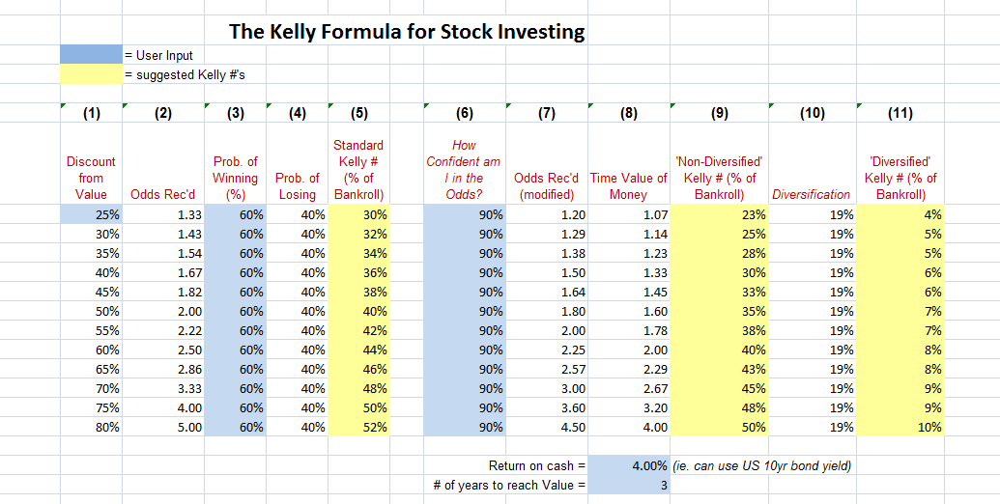

Asset allocation and money management are essential components of an effective trading strategy, more so in the context of algorithmic trading where decisions are made based on quantitative data and mathematical models. Effective management of these elements can significantly impact the efficiency and profitability of trading systems. The Kelly Criterion is a mathematical formula that provides a structured approach to these challenges by optimizing the allocation of assets and effectively managing risk. 

Originally developed by John Kelly in 1956, the Kelly Criterion was formulated to address telecommunication signal issues. It was later recognized for its broader applicability in financial markets, offering a quantitative method to calculate the ideal size of a bet or investment in order to maximize wealth accumulation over time. This ensures that traders and investors can achieve long-term growth while keeping potential risks in check.



In the setting of algorithmic trading, where speed and precision are critical, the Kelly Criterion offers an objective framework that can be embedded within algorithmic systems. By using the formula to guide decisions on trade sizes and risk diversification, traders can systematically enhance their strategies. This article explores how the Kelly Criterion can be leveraged in such trading environments to balance the objectives of maximizing returns and minimizing risks effectively.

## Table of Contents

## Understanding the Kelly Criterion

The Kelly Criterion was developed by John L. Kelly Jr. in 1956 while working at Bell Labs. The initial purpose of the formula was to tackle issues related to long-distance telephone signals. Kelly deduced that certain statistical methods could optimize the decision-making process in scenarios involving uncertainty, such as gambling and financial investments.

The primary aim of the Kelly Criterion is to determine the optimal size of a series of bets or investments to maximize wealth over time. This is achieved by balancing the trade-off between risk and reward, optimizing the growth rate of capital through systematic asset allocation. The formula focuses on two key components: the probability of winning (W) and the win/loss ratio (R). By utilizing these factors, the Kelly Criterion calculates the proportion of capital to be allocated to each investment, defined as the Kelly percentage (K%).

The application of the Kelly Criterion extends beyond gambling to the world of finance and investment. Noteworthy investors such as Warren Buffett and Charlie Munger have recognized its utility in portfolio diversification and asset allocation. This is because the Kelly Criterion can help quantify the balance between risk and return, guiding the proportion of capital to allocate toward various assets based on their expected outcomes.

In finance, the formula assists investors in maximizing their long-term capital growth by investing in a calculated manner, taking into consideration both statistical probabilities and the risk-reward ratio. It promotes a disciplined approach to portfolio management, ensuring that positions are neither too aggressive nor too conservative, aligning investments with rational, probabilistic insights.

## The Basic Formula and Components

The Kelly Criterion is a formula that aids in determining the optimal size of a position to maximize the growth of capital while managing risk. Its calculation is based on two critical components: the win probability (W) and the win/loss ratio (R).

The Kelly percentage (K%) is derived from the formula:  
$$
K\% = W - \left(\frac{1-W}{R}\right)
$$

- **Win Probability (W)**: This represents the likelihood of achieving a favorable outcome in a given trade or series of trades. It is usually estimated based on historical data, reflecting the trader's success rate.

- **Win/Loss Ratio (R)**: This ratio measures the potential gain versus the potential loss of a trade. It is calculated by dividing the average winnings by the average losses. A higher win/loss ratio indicates a more favorable trading scenario.

The calculated Kelly percentage (K%) suggests the proportion of capital to be allocated to a specific trade. For example, if K% is 0.05, it implies that 5% of the total available capital should be invested in that particular opportunity. This allocation strategy aims to optimize portfolio growth and diversification, balancing risk and reward effectively.

By using this approach, traders can develop a more strategic asset allocation plan that accounts for both their historical performance and the inherent risks of each position. However, it is important to note that the precision of this method is heavily reliant on accurate estimations of win probabilities and win/loss ratios. Consequently, traders must ensure these inputs are derived from high-quality data to make the Kelly Criterion a valuable part of their trading toolkit.

## Implementing the Kelly Criterion in Algorithmic Trading

Implementing the Kelly Criterion in [algorithmic trading](/wiki/algorithmic-trading) involves a systematic approach to calculating the optimal allocation of capital across various positions, based on historical trading performance. The process begins with determining two essential metrics: the historical winning probability (W) and the win/loss ratio (R). These metrics are crucial inputs for the Kelly formula:

$$
K\% = W - \left(\frac{1-W}{R}\right)
$$

1. **Calculate Historical Winning Probability and Win/Loss Ratio:**
   - **Winning Probability (W):** This is the ratio of successful trades to the total number of trades. It is calculated as:
$$
     W = \frac{\text{Number of Winning Trades}}{\text{Total Number of Trades}}

$$
   - **Win/Loss Ratio (R):** This is calculated by dividing the average gain of winning trades by the average loss of losing trades. The formula is:
$$
     R = \frac{\text{Average Winning Trade}}{\text{Average Losing Trade}}

$$

2. **Applying the Kelly Formula:**
   - Utilize the calculated values of W and R in the Kelly formula to compute the Kelly percentage (K%). This percentage represents the proportion of the portfolio that should be allocated to a single trade to optimize growth:
$$
     K\% = W - \left(\frac{1-W}{R}\right)

$$
   - For a clear understanding of implementation in algorithmic strategies, consider Python for calculations. This simple script computes the Kelly percentage:

   ```python
   def calculate_kelly_percent(winning_trades, total_trades, avg_win, avg_loss):
       W = winning_trades / total_trades
       R = avg_win / avg_loss
       kelly_percent = W - ((1 - W) / R)
       return kelly_percent

   # Example Use:
   winning_trades = 60
   total_trades = 100
   avg_win = 1000
   avg_loss = 750

   kelly_percent = calculate_kelly_percent(winning_trades, total_trades, avg_win, avg_loss)
   print(f"Optimal Allocation: {kelly_percent * 100:.2f}%")
   ```

3. **Portfolio Rebalancing:**
   - Algorithmic traders should rebalance their portfolios regularly to maintain optimal allocation as recommended by the Kelly Criterion. Since market conditions and trading performance metrics evolve over time, the historical inputs may change, necessitating adjustments in capital allocation to align with updated probabilities and ratios.
   - Dynamic rebalancing helps in adhering to the calculated optimal allocation and mitigating potential risks while maximizing the portfolio's growth potential.

Effective implementation of the Kelly Criterion in algorithmic trading requires meticulous calculation of winning probabilities and ratios, vigilant monitoring, and timely rebalancing of the trading portfolio to accommodate changing inputs and market dynamics. Consistent application of this strategy aims to maximize long-term growth while managing associated risks.

## Interpreting and Applying Kelly Criterion Results

After determining the Kelly percentage (K%) through the Kelly Criterion formula, it is essential to appropriately apply this allocation to individual positions in your trading portfolio. The Kelly percentage represents the optimal fraction of total capital that should be risked on a single trade to maximize expected logarithmic utility, thereby achieving long-term capital growth.

However, prudent application of the Kelly Criterion advises against over-allocating capital to any single investment. A recommended approach is to limit any individual asset's allocation to no more than 25% of the total portfolio. This conservative measure helps mitigate risk exposure and avoid significant losses that could arise from unforeseen market fluctuations or inaccurate model assessments.

Accurate inputs of winning probability (W) and the win/loss ratio (R) are paramount when employing the Kelly Criterion. Historical trade data should be meticulously analyzed to derive these metrics, and the formula \[ K\% = W - \frac{(1-W)}{R} \] should be applied appropriately. The integrity and accuracy of these inputs directly impact the reliability of the Kelly percentage and, consequently, the efficacy of the asset allocation strategy.

For practical application, consider implementing a programmatic solution to calculate and update the Kelly percentage regularly. Below is a simple Python function to compute the Kelly percentage given the win probability and win/loss ratio:

```python
def calculate_kelly_fraction(win_probability, win_loss_ratio):
    return win_probability - ((1 - win_probability) / win_loss_ratio)

# Example usage
W = 0.6  # Winning probability
R = 2    # Win/Loss ratio
kelly_fraction = calculate_kelly_fraction(W, R)
print(f"Kelly Percentage: {kelly_fraction:.2%}")
```

In real-world scenarios, consistent application and re-evaluation of the Kelly Criterion are necessary to account for changing market conditions and updated performance metrics. The method's effectiveness also depends on maintaining discipline and adhering to the calculated allocation, without succumbing to emotional biases or impulsive decisions.

In summary, applying the Kelly Criterion requires methodical preparation, disciplined execution, and periodic reassessment to ensure your portfolio is optimized for growth while effectively managing risks.

## Advantages and Limitations

The Kelly Criterion is renowned for its mathematical rigor, serving as a robust tool for growth optimization and risk management through strategic asset allocation. Its formula determines the proportion of capital to invest in a given opportunity, theoretically maximizing the logarithm of wealth, thus emphasizing compounding returns over time. This can result in higher long-term portfolio growth compared to conventional strategies that may not consider the dynamic nature of market variables.

One clear advantage of the Kelly Criterion is its foundation on probability and expected value, which creates a systematic method for decision-making in investments. By quantifying risk and reward, it encourages investors to focus on opportunities where the odds are favorable, thereby aligning investment practices with statistically grounded principles.

However, the effectiveness of the Kelly Criterion hinges on the accuracy and consistency of input values, such as the win probability and the win/loss ratio. Erroneous or inconsistent inputs can lead to suboptimal allocations, potentially jeopardizing financial targets. This reliance on precise data can be a challenge, especially in volatile markets where probabilities and ratios may fluctuate unpredictably.

Additionally, the application of the Kelly Criterion can lead to excessively aggressive positions, especially for investors with low win probabilities or volatile win/loss ratios. Such aggressiveness may increase exposure to risk, particularly in the short term, which can be unsettling for risk-averse investors. Consequently, practitioners often adopt a 'half-Kelly' method, which involves using only half of the recommended Kelly allocation to dampen [volatility](/wiki/volatility-trading-strategies) and reduce potential drawdowns. This trade-off strikes a balance between risk and return, offering a more conservative approach to capital allocation while still leveraging the strengths of the Kelly Criterion's systematized framework.

## Conclusion

The Kelly Criterion is a powerful tool for asset allocation and money management in algorithmic trading. By methodically leveraging the probabilities and returns of trades, this formula aids in identifying the optimal portion of capital to allocate to different trading positions, ultimately maximizing the growth potential of a portfolio. Implementing the Kelly Criterion allows traders to balance the pursuit of return with necessary risk mitigation measures.

When applied with precision, the Kelly Criterion enhances returns by providing a systematic framework for risk management. Nevertheless, it is crucial to adapt the strategy to accommodate individual risk tolerance levels. This adjustment ensures that while the potential for high returns is maintained, the risk exposure remains within acceptable boundaries. As a recommendation, many traders opt for a "half-Kelly" approach to moderate the initial aggressive allocations suggested by the full criterion, thereby reducing short-term volatility risks.

The effectiveness of the Kelly Criterion is contingent upon the accuracy of input values, notably the win probability and win/loss ratio, which must be derived from reliable historical trading data. Consistently accurate application can lead to significant portfolio growth over time. However, the inherent sensitivity to input variables underlines the necessity for constant validation and recalibration of these parameters.

Ultimately, the Kelly Criterion should be viewed as one component of a broader strategy encompassing robust risk management and portfolio diversification. While it offers a mathematically grounded method for optimizing asset allocation, it should be integrated with other risk management techniques to create a comprehensive trading strategy. As traders employ this formula, they are encouraged to combine it with diversification strategies and continuous risk assessment to safeguard their portfolios against unforeseen market anomalies.

## References & Further Reading

[1]: Kelly, J. L. (1956). ["A New Interpretation of Information Rate."](https://www.princeton.edu/~wbialek/rome/refs/kelly_56.pdf) The Bell System Technical Journal.

[2]: Thorp, E. O. (2008). ["The Kelly Criterion in Blackjack, Sports Betting, and the Stock Market."](http://www.eecs.harvard.edu/cs286r/courses/fall12/papers/Thorpe_KellyCriterion2007.pdf) Handbook of Asset and Liability Management.

[3]: Poundstone, W. (2010). ["Fortune's Formula: The Untold Story of the Scientific Betting System That Beat the Casinos and Wall Street."](https://financialfreedomisajourney.com/wp-content/uploads/2024/09/The-Untold-Story-of-the-Scientific-Betting-System-That-Beat-the-Casinos-and-Wall-Street-William-Poundstone.pdf) Hill and Wang.

[4]: MacLean, L. C., Thorp, E. O., & Ziemba, W. T. (2011). ["The Kelly Capital Growth Investment Criterion: Theory and Practice."](https://www.amazon.com/KELLY-CAPITAL-GROWTH-INVESTMENT-CRITERION/dp/9814383139) World Scientific Publishing Company.

[5]: Cover, T. M. (1991). ["Universal Portfolios."](https://onlinelibrary.wiley.com/doi/abs/10.1111/j.1467-9965.1991.tb00002.x) Mathematical Finance.

[6]: Rotando, L. M., & Thorp, E. O. (1992). ["The 'Kelly Criterion' and the Stock Market."](http://www.edwardothorp.com/wp-content/uploads/2016/11/TheKellyCriterionAndTheStockMarket.pdf) The American Mathematical Monthly.