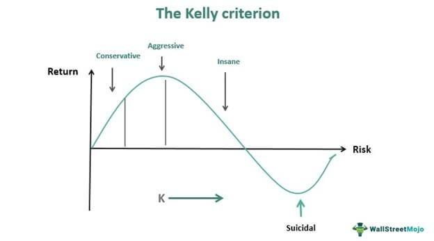

## Table of Contents

## What is the Kelly Criterion and why is it important in trading?

The Kelly Criterion is a formula used to figure out how much money you should bet or invest to get the best growth over time while also managing risk. It was first used for gambling but is now popular in trading and investing. The formula looks at how likely you are to win and how much you could win or lose. It then tells you what part of your money you should use for each bet or trade. If you follow the Kelly Criterion, you can grow your money faster than if you bet too much or too little.

The Kelly Criterion is important in trading because it helps you make smarter decisions about how much to risk. If you bet too much, you could lose a lot of money quickly. If you bet too little, you might not make as much money as you could. The Kelly Criterion finds a balance that can help you grow your money safely over time. Many traders use it to decide how much to invest in each trade, which can lead to better results and less risk of big losses.

## How does the Kelly Criterion help in managing risk?

The Kelly Criterion helps manage risk by telling you how much of your money to use for each bet or trade. It looks at how likely you are to win and how much you could win or lose. By using this information, the Kelly Criterion gives you a number that says what part of your money you should bet. This way, you don't bet too much and risk losing a lot, or bet too little and miss out on making more money.

Using the Kelly Criterion can make your trading safer because it helps you avoid big losses. If you follow what the Kelly Criterion says, you can grow your money over time without taking too many risks. It's like having a guide that keeps you from betting too much on one trade, which can protect your money and help you do better in the long run.

## What is the basic formula for the Kelly Criterion?

The basic formula for the Kelly Criterion is pretty simple. It's written as: Kelly % = (W - (1-W)/R). Here, "W" stands for the probability of winning, and "R" is the ratio of the average win to the average loss. So, if you think you have a 60% chance of winning and your wins are twice as big as your losses, you can plug those numbers into the formula to find out how much of your money you should bet.

Using this formula helps you figure out the best amount to bet so you can grow your money over time without taking too much risk. If the Kelly % comes out as a negative number, it means you shouldn't bet at all because the odds are against you. But if it's a positive number, that's the part of your money you should use for the bet. It's a smart way to decide how much to risk on each trade or bet.

## Can you explain the terms used in the Kelly Criterion formula?

The Kelly Criterion formula uses two main terms: "W" and "R". "W" stands for the probability of winning. This is how likely you think it is that you will win your bet or trade. For example, if you think there's a 70% chance you'll win, then W would be 0.70. It's important to have a good guess about this because it affects how much you should bet.

"R" is the ratio of the average win to the average loss. This tells you how much you could win compared to how much you could lose. If your wins are usually twice as big as your losses, then R would be 2. This number helps the formula figure out if betting more or less is a good idea. Together, W and R help you find the best amount to bet so you can grow your money safely.

## How do you calculate the expected win rate and win/loss ratio for trading?

To calculate the expected win rate in trading, you need to look at your past trades. Count how many times you won out of all the trades you made. For example, if you made 100 trades and won 60 of them, your win rate is 60%. It's a good idea to keep track of your trades over a long time to get a more accurate number. This way, you can see how often you win and use that information to help you decide how much to bet using the Kelly Criterion.

To find the win/loss ratio, you need to compare the average amount you win to the average amount you lose. First, add up all the money you made from your winning trades and divide it by the number of wins to get the average win. Then, add up all the money you lost from your losing trades and divide it by the number of losses to get the average loss. Finally, divide the average win by the average loss. For example, if your average win is $200 and your average loss is $100, your win/loss ratio is 2. This ratio helps you understand how much you could win compared to how much you could lose, which is important for using the Kelly Criterion to manage your bets.

## What are the benefits of using the Kelly Criterion in trading?

Using the Kelly Criterion in trading can help you make better decisions about how much money to bet. It tells you the right amount to use for each trade based on how likely you are to win and how much you could win or lose. This can help you grow your money faster over time. If you bet too much, you might lose a lot quickly, but the Kelly Criterion helps you avoid that by showing you a safer amount to bet.

Another benefit is that the Kelly Criterion helps you manage risk. By following its advice, you can avoid betting too much on one trade, which can protect your money. This way, even if you have a few losing trades, you won't lose everything. Over time, this careful approach can lead to better results and less chance of big losses.

## What are the potential drawbacks or limitations of the Kelly Criterion?

One big problem with the Kelly Criterion is that it can be hard to guess the right numbers to use in the formula. You need to know how likely you are to win and how much you could win or lose. But in trading, these numbers can change a lot and are hard to predict. If you use the wrong numbers, the Kelly Criterion might tell you to bet too much or too little, which can mess up your trading.

Another issue is that the Kelly Criterion can be too risky for some people. It often suggests betting a big part of your money, which can feel scary. If you follow it exactly, you might have big ups and downs in your trading account. Many traders choose to use a smaller bet size, like half of what the Kelly Criterion says, to feel safer. This way, they can still grow their money but with less risk of losing a lot quickly.

## How can the Kelly Criterion be adjusted for more conservative trading strategies?

To make the Kelly Criterion work for more conservative trading, you can use a smaller bet size than what the formula tells you. Instead of betting the full amount suggested by the Kelly Criterion, many traders choose to bet only half or even a quarter of that amount. This way, they can still use the Kelly Criterion to help them decide how much to bet, but they won't risk as much money on each trade. By betting less, they can protect their money better and feel more comfortable with their trading.

Using a smaller bet size can help you avoid big losses while still growing your money over time. It's like playing it safe but still using a smart plan. If you use a smaller part of the Kelly Criterion's suggestion, you might not make money as fast, but you'll have a smoother ride in your trading journey. This way, you can keep trading for a long time without worrying about losing everything on one bad trade.

## Can you provide an example of applying the Kelly Criterion to a real trading scenario?

Let's say you're a trader who's been keeping track of your trades. Over the past year, you've made 100 trades and won 60 of them. So, your win rate, or "W," is 60%, which means W = 0.60. You also noticed that when you win, you usually make $200, but when you lose, you usually lose $100. This means your average win is $200 and your average loss is $100. So, your win/loss ratio, or "R," is 200/100 = 2.

Now, you want to use the Kelly Criterion to decide how much of your money to bet on your next trade. The formula for the Kelly Criterion is Kelly % = (W - (1-W)/R). Plugging in your numbers, you get Kelly % = (0.60 - (1-0.60)/2) = (0.60 - 0.40/2) = (0.60 - 0.20) = 0.40. This means the Kelly Criterion suggests you should bet 40% of your money on this trade. But because you want to be more conservative, you decide to bet only half of that, which is 20%. So, if you have $10,000 in your trading account, you would bet $2,000 on your next trade. This way, you're using the Kelly Criterion to help you decide how much to bet, but you're also being careful to avoid big risks.

## How does the Kelly Criterion compare to other money management strategies in trading?

The Kelly Criterion is different from other money management strategies because it tells you exactly how much to bet based on math. It uses your chance of winning and how much you could win or lose to give you a number. This number helps you bet the right amount to grow your money the fastest while keeping risk under control. Other strategies, like fixed fractional betting or the 2% rule, don't use math in the same way. Fixed fractional betting says to bet a certain part of your money on each trade, no matter what. The 2% rule says to never risk more than 2% of your money on one trade. These methods are simpler but don't change based on how likely you are to win or how much you could win or lose.

Using the Kelly Criterion can help you make more money over time if you guess the right numbers. But it can be hard to know those numbers for sure, and it might tell you to bet a lot, which can feel scary. That's why some traders use a smaller bet size, like half of what the Kelly Criterion says. Other methods like fixed fractional betting and the 2% rule are easier to follow and can feel safer because they don't change much. They might not help you grow your money as fast, but they can help you avoid big losses. So, the Kelly Criterion is good if you want to use math to decide how much to bet, but simpler methods can be better if you want to feel safer and keep things easy.

## What are some advanced modifications or variations of the Kelly Criterion used by expert traders?

Expert traders sometimes use a modified version of the Kelly Criterion called the fractional Kelly strategy. Instead of betting the full amount suggested by the Kelly Criterion, they bet a smaller part of it, like half or a quarter. This way, they can still use the math to help them decide how much to bet, but they won't risk as much money on each trade. It's a good way to be careful while still trying to grow their money over time. By betting less than what the Kelly Criterion says, they can avoid big ups and downs in their trading account and feel more comfortable with their trading.

Another variation that some expert traders use is the Kelly Criterion with a risk-free asset. They might put some of their money in a safe place, like a savings account, and only use the rest for trading. Then, they use the Kelly Criterion to decide how much of the trading money to bet. This way, they can still use the Kelly Criterion to help them grow their money, but they also have some money that's safe and not at risk. It's like having the best of both worlds: using math to make smart bets and keeping some money safe just in case.

## How can traders integrate the Kelly Criterion into their overall trading system and risk management plan?

Traders can integrate the Kelly Criterion into their overall trading system by using it to decide how much to bet on each trade. First, they need to keep track of their past trades to figure out their win rate and win/loss ratio. With these numbers, they can use the Kelly Criterion formula to find out the best amount to bet. But since the Kelly Criterion can sometimes suggest betting a lot of money, many traders choose to bet only half or a quarter of what it says. This way, they can still use the math to help them make smart bets, but they won't risk as much money on each trade. By doing this, they can grow their money over time while also being careful and avoiding big losses.

In their risk management plan, traders can use the Kelly Criterion to help them stay safe. They might decide to put some of their money in a savings account or another safe place, and only use the rest for trading. Then, they can use the Kelly Criterion to decide how much of their trading money to bet. This way, they can still use the Kelly Criterion to help them make smart bets, but they also have some money that's safe and not at risk. By combining the Kelly Criterion with other risk management rules, like never betting more than a certain amount on one trade, traders can make a plan that helps them grow their money while also keeping it safe.

## What are some practical examples and illustrations?

A hypothetical example of the Kelly Criterion applied in [algorithmic trading](/wiki/algorithmic-trading) can provide clarity on its practical use. Consider a scenario where a trader is analyzing a stock with predicted price movements. If historical data suggests that the stock price has a 60% probability (p = 0.6) of increasing and a 40% probability (q = 0.4) of decreasing, and the odds (b) are calculated at 1.5, the Kelly Criterion can be applied to determine the ideal fraction of capital for investment.

Using the formula f* = (bp - q) / b, we find:

$$
f* = \frac{(1.5 \times 0.6) - 0.4}{1.5} = \frac{0.9 - 0.4}{1.5} = \frac{0.5}{1.5} \approx 0.33
$$

Thus, approximately 33% of the available capital should be allocated to this trade to maximize the expected logarithmic growth.

Behavioral experiments indicate that traders who apply the Kelly Criterion often outperform others. This performance is attributed to disciplined risk management—traders avoid the temptations of over-betting or under-betting by adhering to calculated strategies.

Simulations using Python can visually illustrate the impact of different betting scenarios on capital growth over time. Consider the following simplified Python simulation that showcases capital growth for full, fractional, and zero betting:

```python
import matplotlib.pyplot as plt
import numpy as np

# Initial conditions
capital = 1000
prob_win = 0.6
odds = 1.5
bets = np.arange(0, 1.1, 0.1)
num_rounds = 100
num_trials = 1000

# Store results
final_capital = np.zeros_like(bets)

# Simulation
for i, fraction in enumerate(bets):
    trial_capital = np.zeros(num_trials)
    for trial in range(num_trials):
        cap = capital
        for _ in range(num_rounds):
            if np.random.rand() < prob_win:
                cap += cap * fraction * (odds - 1)
            else:
                cap -= cap * fraction
        trial_capital[trial] = cap
    final_capital[i] = np.mean(trial_capital)

# Visualization
plt.plot(bets, final_capital, marker='o')
plt.title('Average Final Capital over Different Betting Fractions')
plt.xlabel('Betting Fraction')
plt.ylabel('Final Capital')
plt.grid(True)
plt.show()
```

This Python code simulates 100 trials of 100 rounds, with varying betting fractions. The graph reveals how different betting strategies influence long-term capital growth. By focusing on the outcome of different betting fractions, traders can visually observe how optimal use of the Kelly Criterion leads to superior growth compared to conservative or speculative betting strategies. The insights gained from these simulations underscore the importance of disciplined risk management facilitated by the Kelly Criterion in achieving long-term growth in algorithmic trading.

## References & Further Reading

Kelly, J. L. (1956). A New Interpretation of Information Rate. Bell System Technical Journal. This foundational paper by John L. Kelly Jr. introduces the mathematical framework now known as the Kelly Criterion. The article describes how the criterion is used for information theory and communication systems to optimize the growth of capital by determining the optimal bet size when the probability and odds are known.

MacLean, L. C., Thorp, E. O., & Ziemba, W. T. (2011). The Kelly Capital Growth Investment Criterion: Theory and Practice. This comprehensive book explores the theoretical foundations of the Kelly Criterion and its applications in investment and gambling. It covers a range of topics, from mathematical insights to practical implementation strategies, providing readers with a thorough understanding of the methodology behind optimal capital growth strategies.

Vince, R. (1992). The Mathematics of Money Management: Risk Analysis Techniques for Traders. This work delves into various risk management strategies employed by traders, focusing on quantitative and mathematical approaches. It discusses the application of the Kelly Criterion in money management, offering insights into how traders can effectively balance risk and return to enhance the performance of their investments.

Thorp, E. O. (1969). Optimal Gambling Systems for Favorable Games. Review of the International Statistical Institute. In this paper, Edward O. Thorp examines the implementation of optimal betting strategies in gambling scenarios where the player has a favorable edge. It further validates the utilization of the Kelly Criterion by illustrating how it can provide gamblers with a mathematical means to maximize bankroll growth over time while minimizing the risks of bankroll depletion.

